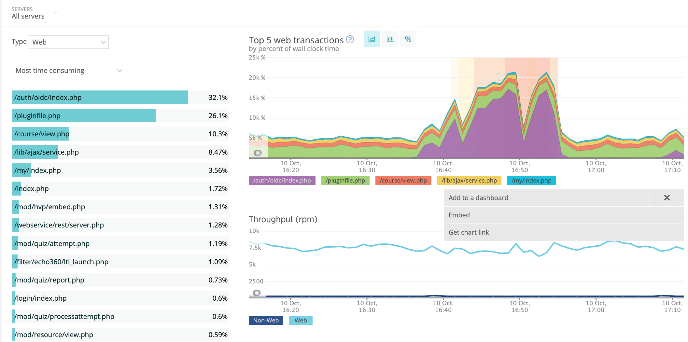

# 10-10-22 - SRE

Oct 10, 2022 4:43pm
3 days ago

UPDATE mdl\_auth\_oidc\_token SET sid = ? WHERE userid = ?

MySQL mdl\_auth\_oidc\_token update
50,001 ms

Oct 10, 2022 4:43pm
3 days ago

DELETE FROM mdl\_auth\_oidc\_token WHERE oidcusername = ?

MySQL mdl\_auth\_oidc\_token delete
50,226 ms

Oct 10, 2022 4:42pm
3 days ago

UPDATE mdl\_auth\_oidc\_token SET authcode = ?,to...ry = ?,refreshtoken = ?,idtoken = ? WHERE id=?

MySQL mdl\_auth\_oidc\_token update
50,001 ms

Oct 10, 2022 4:41pm
3 days ago

DELETE FROM mdl\_auth\_oidc\_token WHERE oidcusername = ?

MySQL mdl\_auth\_oidc\_token delete
99,699 ms

Oct 10, 2022 4:41pm
3 days ago

UPDATE mdl\_auth\_oidc\_token SET sid = ? WHERE userid = ?

MySQL mdl\_auth\_oidc\_token update
50,003 ms

Oct 10, 2022 4:41pm
3 days ago

UPDATE mdl\_auth\_oidc\_token SET authcode = ?,to...ry = ?,refreshtoken = ?,idtoken = ? WHERE id=?

MySQL mdl\_auth\_oidc\_token update
49,503 ms

Oct 10, 2022 4:41pm
3 days ago

UPDATE mdl\_auth\_oidc\_token SET sid = ? WHERE userid = ?

MySQL mdl\_auth\_oidc\_token update
50,001 ms

Oct 10, 2022 4:41pm
3 days ago

UPDATE mdl\_auth\_oidc\_token SET authcode = ?,to...ry = ?,refreshtoken = ?,idtoken = ? WHERE id=?

MySQL mdl\_auth\_oidc\_token update
47,633 ms

Oct 10, 2022 4:41pm
3 days ago

DELETE FROM mdl\_auth\_oidc\_token WHERE oidcusername = ?

MySQL mdl\_auth\_oidc\_token delete
95,582 ms

Oct 10, 2022 4:40pm
3 days ago

UPDATE mdl\_auth\_oidc\_token SET sid = ? WHERE userid = ?

MySQL mdl\_auth\_oidc\_token update
50,009 ms

Oct 10, 2022 4:40pm
3 days ago

UPDATE mdl\_auth\_oidc\_token SET authcode = ?,to...ry = ?,refreshtoken = ?,idtoken = ? WHERE id=?

MySQL mdl\_auth\_oidc\_token update
48,739 ms

Oct 10, 2022 4:40pm
3 days ago

UPDATE mdl\_auth\_oidc\_token SET authcode = ?,to...ry = ?,refreshtoken = ?,idtoken = ? WHERE id=?

MySQL mdl\_auth\_oidc\_token update
39,079 ms

Oct 10, 2022 4:40pm
3 days ago

DELETE FROM mdl\_auth\_oidc\_token WHERE oidcusername = ?

MySQL mdl\_auth\_oidc\_token delete
50,221 ms

Oct 10, 2022 4:40pm
3 days ago

DELETE FROM mdl\_auth\_oidc\_token WHERE oidcusername = ?

MySQL mdl\_auth\_oidc\_token delete
50,001 ms

Oct 10, 2022 4:39pm
3 days ago

UPDATE mdl\_auth\_oidc\_token SET authcode = ?,to...ry = ?,refreshtoken = ?,idtoken = ? WHERE id=?

MySQL mdl\_auth\_oidc\_token update
49,509 ms

Oct 10, 2022 4:38pm
3 days ago

UPDATE mdl\_auth\_oidc\_token SET authcode = ?,to...ry = ?,refreshtoken = ?,idtoken = ? WHERE id=?

MySQL mdl\_auth\_oidc\_token update
49,740 ms

Oct 10, 2022 4:38pm
3 days ago

DELETE FROM mdl\_auth\_oidc\_token WHERE oidcusername = ?

MySQL mdl\_auth\_oidc\_token delete
50,219 ms

Oct 10, 2022 4:38pm
3 days ago

UPDATE mdl\_auth\_oidc\_token SET authcode = ?,to...ry = ?,refreshtoken = ?,idtoken = ? WHERE id=?

MySQL mdl\_auth\_oidc\_token update
43,221 ms

Oct 10, 2022 4:37pm
3 days ago

DELETE FROM mdl\_auth\_oidc\_token WHERE oidcusername = ?

MySQL mdl\_auth\_oidc\_token delete
50,495 ms

Oct 10, 2022 4:37pm
3 days ago

UPDATE mdl\_auth\_oidc\_token SET authcode = ?,to...ry = ?,refreshtoken = ?,idtoken = ? WHERE id=?

MySQL mdl\_auth\_oidc\_token update
49,956 ms

Oct 10, 2022 4:37pm
3 days ago

UPDATE mdl\_auth\_oidc\_token SET authcode = ?,to...ry = ?,refreshtoken = ?,idtoken = ? WHERE id=?

MySQL mdl\_auth\_oidc\_token update
48,818 ms

Oct 10, 2022 4:32pm
3 days ago

DELETE FROM mdl\_course\_format\_options WHERE sectionid = ?

MySQL mdl\_course\_format\_options delete
19,655 ms

Oct 10, 2022 4:19pm
3 days ago

SELECT CONCAT([m.id](http://m.id), ?, m.useridfrom, ?, mcm.userid) AS uniqueid, [m.id](http://m.id), m.useridfrom, mcm.userid as useridto, m.subject, m.fullmessage, m.fullmessagehtml, m.fullmessageformat, m.smallmessage, m.conversationid, m.timecreated, ? as isread, [u.id](http://u.id) AS userfrom\_id, u.picture AS userfrom\_picture, u.firstname AS userfrom\_firstname, u.lastname AS userfrom\_lastname, u.firstnamephonetic AS userfrom\_firstnamephonetic, u.lastnamephonetic AS userfrom\_lastnamephonetic, u.middlename AS userfrom\_middlename, u.alternatename AS userfrom\_alternatename, u.imagealt AS userfrom\_imagealt, u.email AS userfrom\_email, u.lastaccess AS userfrom\_lastaccess, [mub.id](http://mub.id) as userfrom\_blocked, u?.id AS userto\_id, u?.picture AS userto\_picture, u?.firstname AS userto\_firstname, u?.lastname AS userto\_lastname, u?.firstnamephonetic AS userto\_firstnamephonetic, u?.lastnamephonetic AS userto\_lastnamephonetic, u?.middlename AS userto\_middlename, u?.alternatename AS userto\_alternatename, u?.imagealt AS userto\_imagealt, u?.email AS userto\_email, u?.lastaccess AS userto\_lastaccess, mub?.id as userto\_blocked FROM mdl\_messages m INNER JOIN mdl\_user u ON [u.id](http://u.id) = m.useridfrom INNER JOIN mdl\_message\_conversations mc ON [mc.id](http://mc.id) = m.conversationid INNER JOIN mdl\_message\_conversation\_members mcm ON mcm.conversationid = m.conversationid INNER JOIN mdl\_user u? ON u?.id = mcm.userid LEFT JOIN mdl\_message\_users\_blocked mub ON (mub.blockeduserid = [u.id](http://u.id) AND mub.userid = ?) LEFT JOIN mdl\_message\_users\_blocked mub? ON (mub?.blockeduserid = u?.id AND mub?.userid = ?) LEFT JOIN mdl\_message\_user\_actions mua ON (mua.messageid = [m.id](http://m.id) AND mua.userid = ? AND mua.action = ?) WHERE (m.useridfrom = ? OR mcm.userid = ?) AND (m.useridfrom != mcm.userid OR mc.type = ?) AND u.deleted = ? AND u?.deleted = ? AND [mua.id](http://mua.id) is NULL AND LOWER(smallmessage) LIKE LOWER(?)... ON (mub?.blockeduserid = u?.id AND mub?.userid = ?) LEFT JOIN mdl\_message\_user\_actions mua ON (mua.messageid = [m.id](http://m.id) AND mua.userid = ? AND mua.action = ?) WHERE (m.useridfrom = ? OR mcm.userid = ?) AND (m.useridfrom != mcm.userid OR mc.type = ?) AND u.deleted = ? AND u?.deleted = ? AND [mua.id](http://mua.id) is NULL AND LOWER(smallmessage) LIKE LOWER(?) COLLATE utf?mb?\_bin ESCAPE ? ORDER BY timecreated DESC LIMIT ?, ?

MySQL mdl\_messages select
15,598 ms

Oct 10, 2022 4:16pm
3 days ago

SELECT CONCAT([m.id](http://m.id), ?, m.useridfrom, ?, mcm.userid) AS uniqueid, [m.id](http://m.id), m.useridfrom, mcm.userid as useridto, m.subject, m.fullmessage, m.fullmessagehtml, m.fullmessageformat, m.smallmessage, m.conversationid, m.timecreated, ? as isread, [u.id](http://u.id) AS userfrom\_id, u.picture AS userfrom\_picture, u.firstname AS userfrom\_firstname, u.lastname AS userfrom\_lastname, u.firstnamephonetic AS userfrom\_firstnamephonetic, u.lastnamephonetic AS userfrom\_lastnamephonetic, u.middlename AS userfrom\_middlename, u.alternatename AS userfrom\_alternatename, u.imagealt AS userfrom\_imagealt, u.email AS userfrom\_email, u.lastaccess AS userfrom\_lastaccess, [mub.id](http://mub.id) as userfrom\_blocked, u?.id AS userto\_id, u?.picture AS userto\_picture, u?.firstname AS userto\_firstname, u?.lastname AS userto\_lastname, u?.firstnamephonetic AS userto\_firstnamephonetic, u?.lastnamephonetic AS userto\_lastnamephonetic, u?.middlename AS userto\_middlename, u?.alternatename AS userto\_alternatename, u?.imagealt AS userto\_imagealt, u?.email AS userto\_email, u?.lastaccess AS userto\_lastaccess, mub?.id as userto\_blocked FROM mdl\_messages m INNER JOIN mdl\_user u ON [u.id](http://u.id) = m.useridfrom INNER JOIN mdl\_message\_conversations mc ON [mc.id](http://mc.id) = m.conversationid INNER JOIN mdl\_message\_conversation\_members mcm ON mcm.conversationid = m.conversationid INNER JOIN mdl\_user u? ON u?.id = mcm.userid LEFT JOIN mdl\_message\_users\_blocked mub ON (mub.blockeduserid = [u.id](http://u.id) AND mub.userid = ?) LEFT JOIN mdl\_message\_users\_blocked mub? ON (mub?.blockeduserid = u?.id AND mub?.userid = ?) LEFT JOIN mdl\_message\_user\_actions mua ON (mua.messageid = [m.id](http://m.id) AND mua.userid = ? AND mua.action = ?) WHERE (m.useridfrom = ? OR mcm.userid = ?) AND (m.useridfrom != mcm.userid OR mc.type = ?) AND u.deleted = ? AND u?.deleted = ? AND [mua.id](http://mua.id) is NULL AND LOWER(smallmessage) LIKE LOWER(?)... ON (mub?.blockeduserid = u?.id AND mub?.userid = ?) LEFT JOIN mdl\_message\_user\_actions mua ON (mua.messageid = [m.id](http://m.id) AND mua.userid = ? AND mua.action = ?) WHERE (m.useridfrom = ? OR mcm.userid = ?) AND (m.useridfrom != mcm.userid OR mc.type = ?) AND u.deleted = ? AND u?.deleted = ? AND [mua.id](http://mua.id) is NULL AND LOWER(smallmessage) LIKE LOWER(?) COLLATE utf?mb?\_bin ESCAPE ? ORDER BY timecreated DESC LIMIT ?, ?

MySQL mdl\_messages select
16,041 ms

## Attachments:

 [image2022-10-13\_10-42-5.png](attachments/227181851/227181872.png) (image/png)

