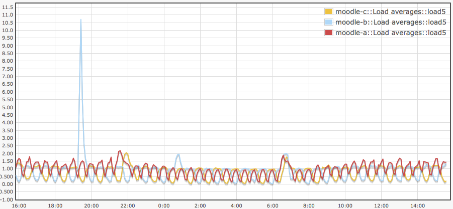

# 12 May 2011 liaison meeting

To kick things off, this agenda is designed on the Moodle Development Plan. all other business can go in too but this at least starts us off with noting how far through we are with developments between ATS and LTSS.

## [Moodle](Moodle)

##### Issues

-   After this meeting, Pete will be at work for approximately 48 days, barring the lurg etc.

<!-- -->

-   1.9.12 - installed on Moodle-pp and an initial test plan is here - <https://wiki.ucl.ac.uk/display/ISMoodle/Moodle+v1.9.12+upgrade> - update - nothing here is 'critical' (but claim performance fixes etc)

 1.9.12 test by LTSS and amend the wiki page above. Upgrade in May - Thu 26th? Tuesday 31st?

-   turnitin - what are we doing?
     compile a list of issues and requests for nlearning and send them over within the next week.

FYI - This is Moodle B yesterday - [see attached s/sheet](attachments/17765600/18023318.ods). 0 - basically Turnitin needs fixing and will slow things down - but Moodle seems to be coping.

## Moodle development priorities

<table style="width:100%;">
<colgroup>
<col width="14%" />
<col width="14%" />
<col width="14%" />
<col width="14%" />
<col width="14%" />
<col width="14%" />
<col width="14%" />
</colgroup>
<tbody>
<tr class="odd">
<td>
<strong>Development</strong>
</td>
<td>
<strong>Review/finish date</strong>
</td>
<td>
<strong>Est. days</strong>
</td>
<td>
<strong>Priority (Low/Med/High)</strong> 

</td>
<td>
<strong>Rank</strong> 

</td>
<td>
<strong>Lead person</strong>
</td>
<td>
<strong>Status</strong>  / <strong>notes</strong> 

</td>
</tr>
<tr class="even">
<td>
Unicode compliance 

</td>
<td>
<em>Jul</em> 

</td>
<td>
4 

</td>
<td>
high 

</td>
<td>
1 

</td>
<td>
 
</td>
<td>
things like sitsfilter and any other scripts that create users in Moodle 

</td>
</tr>
<tr class="odd">
<td>
1.9.12 upgrade 

</td>
<td>
<em>Jul</em> 

</td>
<td>
.5 

</td>
<td>
high 

</td>
<td>
2 

</td>
<td>
 
</td>
<td>
 
</td>
</tr>
<tr class="even">
<td>
Database work 

</td>
<td>
<em>Jul</em> 

</td>
<td>
4 

</td>
<td>
high 

</td>
<td>
 
</td>
<td>
Pete/Vivek 

</td>
<td>
innodb and bigints - both needed for Moodle 2 

</td>
</tr>
<tr class="odd">
<td>
Moodle and Portico integration
</td>
<td>
<em>Jul-11</em>
</td>
<td>
10 

</td>
<td>
high!
</td>
<td>
1 

</td>
<td>
 
</td>
<td>
Pete installing on Moodle pp for testing 

</td>
</tr>
<tr class="even">
<td>
Moodle 2 
</td>
<td>
<em>Apr-12</em>
</td>
<td>
4 

</td>
<td>
low (for pete) 

</td>
<td>
 
</td>
<td>
 
</td>
<td>
 

</td>
</tr>
<tr class="odd">
<td>
Hosting review/changes &amp; virtualisation
</td>
<td>
<em>on-going</em>
</td>
<td>
10 

</td>
<td>
high
</td>
<td>
 
</td>
<td>
 
</td>
<td>
awaiting hardware 

</td>
</tr>
<tr class="even">
<td>
Housekeeping
</td>
<td>
<em>on-demand</em>
</td>
<td>
1 

</td>
<td>
medium/low 

</td>
<td>
 
</td>
<td>
 
</td>
<td>
 
</td>
</tr>
<tr class="odd">
<td>
Archive
</td>
<td>
<em>on-going</em>
</td>
<td>
3 

</td>
<td>
high 

</td>
<td>
 
</td>
<td>
 
</td>
<td>
we need the hardware asap 

</td>
</tr>
<tr class="even">
<td>
Single Sign On (Shibboleth)
</td>
<td>
<em>Apr-11</em>
</td>
<td>
4
</td>
<td>
medium 

</td>
<td>
 
</td>
<td>
 
</td>
<td>
started this 

</td>
</tr>
<tr class="odd">
<td>
Bulk enrolment module (plug-in)
</td>
<td>
<em>May-11</em>
</td>
<td>
? 

</td>
<td>
on hold 

</td>
<td>
 
</td>
<td>
 
</td>
<td>
do we need be concerned about unicode?  

</td>
</tr>
<tr class="even">
<td>
CampusM (mobile Moodle on UCL Go!)
</td>
<td>
<em>Aug-11</em>
</td>
<td>
1 

</td>
<td>
low 

</td>
<td>
 
</td>
<td>
 
</td>
<td>
Shibboleth may complicate this - not sure - ombiel are setting us up some sort of test thing  

</td>
</tr>
<tr class="odd">
<td>
Moodle-only accounts / Public Moodle
</td>
<td>
<em>Aug-11</em>
</td>
<td>
---
</td>
<td>
on hold 

</td>
<td>
 
</td>
<td>
 
</td>
<td>
 
</td>
</tr>
<tr class="even">
<td>
Roles and permissions
</td>
<td>
<em>Mar-11</em>
</td>
<td>
.5 

</td>
<td>
medium 

</td>
<td>
 
</td>
<td>
 
</td>
<td>
 
</td>
</tr>
<tr class="odd">
<td>
Theme and front page design
</td>
<td>
<em>Aug-11</em>
</td>
<td>
0
</td>
<td>
on hold 

</td>
<td>
 
</td>
<td>
 
</td>
<td>
 
</td>
</tr>
<tr class="even">
<td>
Moodle / MyPortfolio integration
</td>
<td>
<em>on-going</em>
</td>
<td>
 
</td>
<td>
on hold 

</td>
<td>
 
</td>
<td>
 
</td>
<td>
does Shibboleth make this easier? 

</td>
</tr>
<tr class="odd">
<td>
Attendance module (plug-in)
</td>
<td>
<em>on-going</em>
</td>
<td>
0 

</td>
<td>
on hold 

</td>
<td>
 
</td>
<td>
 
</td>
<td>
 
</td>
</tr>
<tr class="even">
<td>
Maths Tools STACK module (plug-in)
</td>
<td>
<em>Jun-11</em>
</td>
<td>
0
</td>
<td>
on hold 

</td>
<td>
 
</td>
<td>
 
</td>
<td>
on hold while it gets rewritten with OU help 

</td>
</tr>
<tr class="odd">
<td>
LectureCast (Echo360) module (plug-in)
</td>
<td>
<em>Jun-1</em>
</td>
<td>
0
</td>
<td>
on hold 

</td>
<td>
 
</td>
<td>
 
</td>
<td>
on hold until new stable echo release 

</td>
</tr>
</tbody>
</table>

#### Lecturecast

##### Issues

##### Developments

#### MyPortfolio

##### Issues

-   1.3.4 released due to security issues - Adrian to look into this

##### Developments

-   Shibboleth plug-in for authentication - Adrian keen to get this rolled out, but should we wait until the start of next term?

#### Opinio

##### Issues

##### Developments

## Attachments:

 [Screen shot 2011-05-12 at 15.49.40.png](attachments/17765600/18023317.png) (image/png)
 [bliplet.ods](attachments/17765600/18023318.ods) (application/vnd.oasis.opendocument.spreadsheet)

