# 24-03-22 - SRE

<https://wrms.catalyst.net.nz/wr.php?request_id=378826>

Root Cause - <https://tracker.moodle.org/browse/MDL-72451>

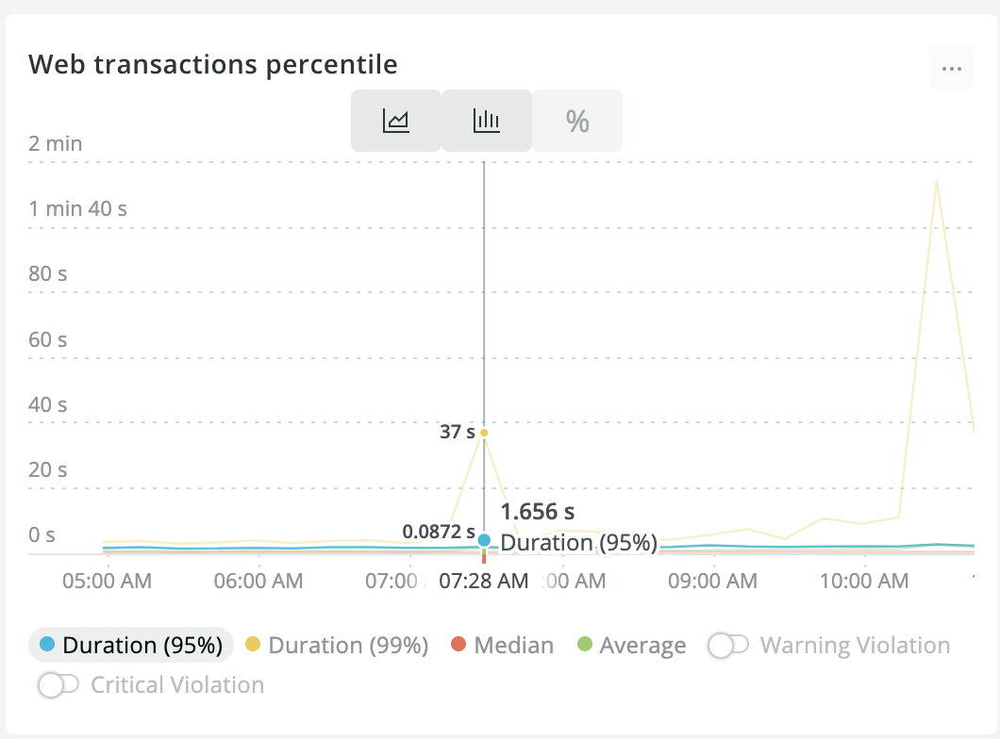 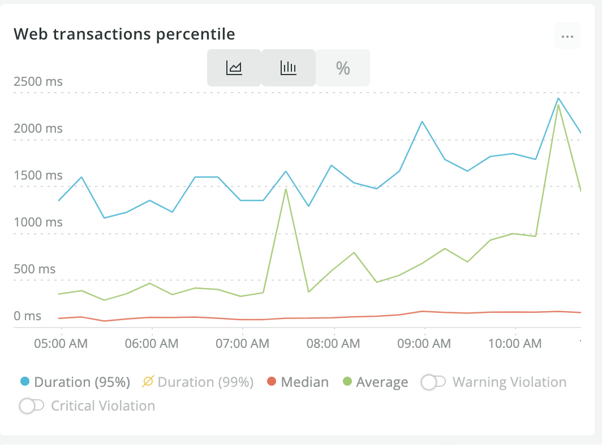

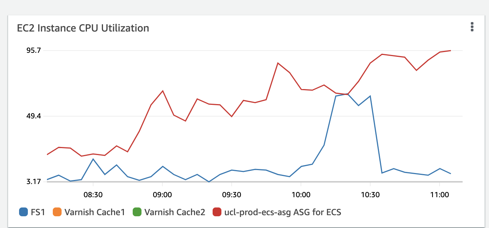

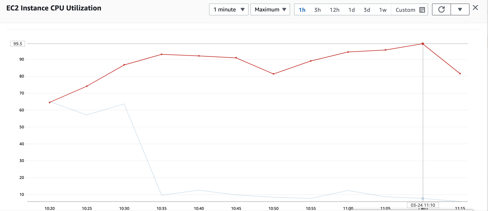

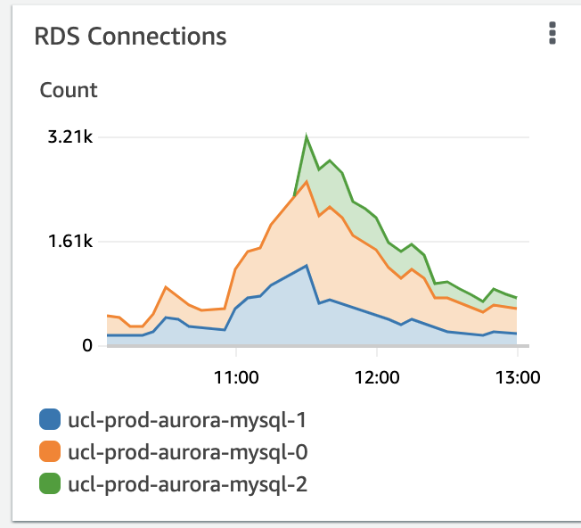  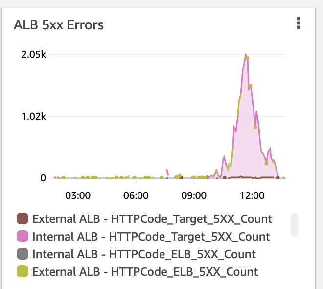

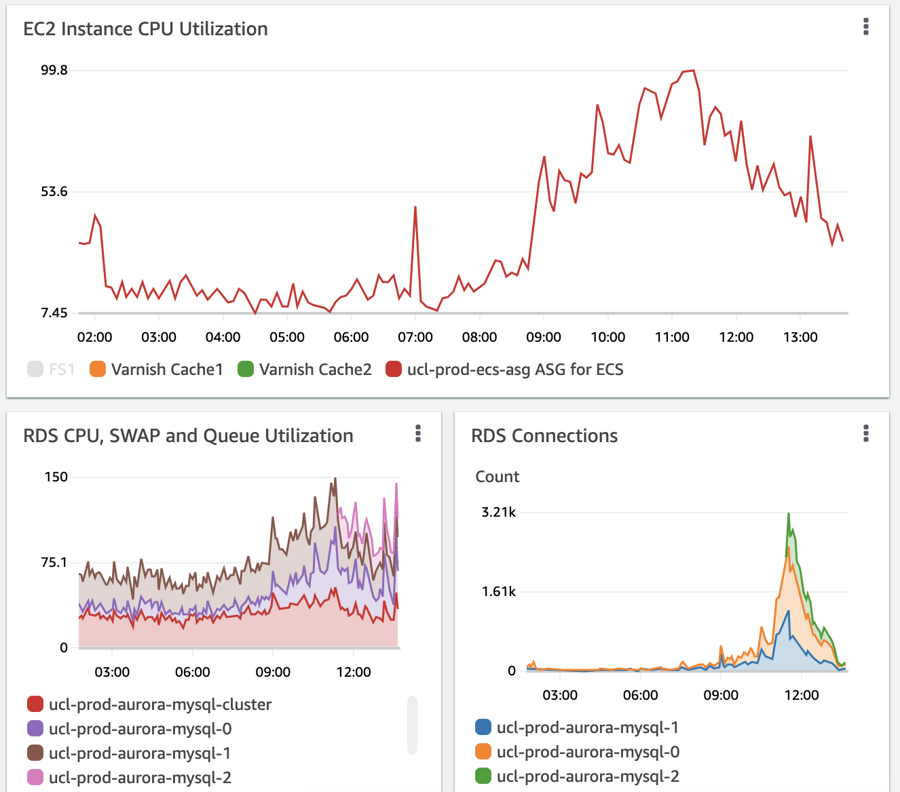

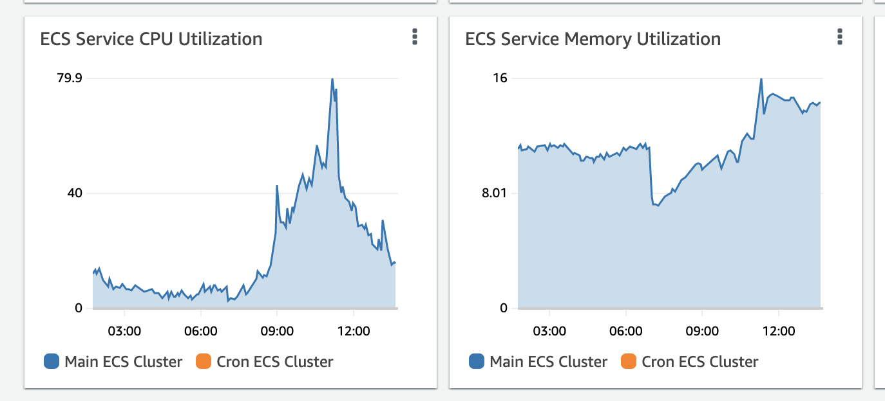

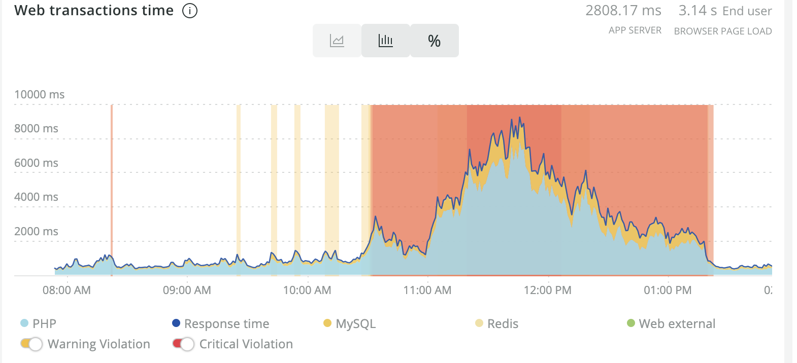

<https://eu-west-2.console.aws.amazon.com/rds/home?region=eu-west-2#database:id=ucl-prod-aurora-mysql-cluster;is-cluster=true;tab=monitoring>

<https://eu-west-2.console.aws.amazon.com/rds/home?region=eu-west-2#performance-insights-v20206:/resourceId/db-F7ECVW4IHRC6EY2Z2HWOCGYIOI/resourceName/ucl-prod-aurora-mysql-0/startTime/1648113783432/endTime/1648131783432>

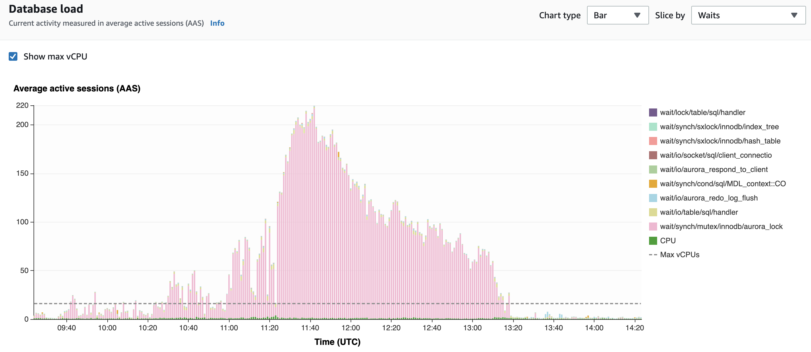

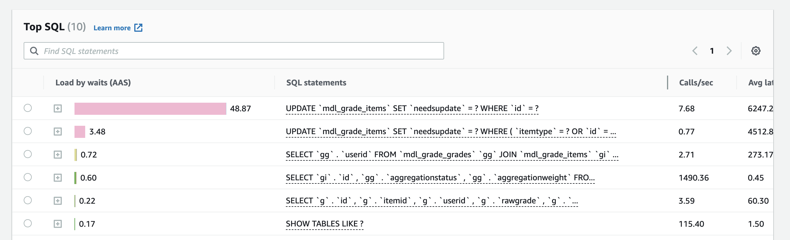
