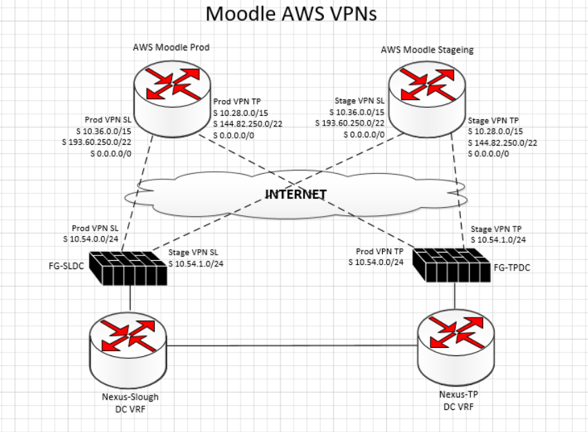
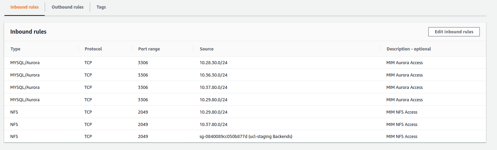

# AWS Site-to-Site VPN for Moodle

Pre-Prod:

-   1 link to Slough
-   1 link to TP

Production:

-   1 link to Slough
-   1 link to TP

Expected traffic is AWS-DC only:

-   AWS to ldap-auth-ad.ucl.ac.uk
-   mdl-admin0{1,2,1p,2p}.ad.ucl.ac.uk to AWS (DB & NFS mount)
-   AWS to SIEM

Note from Catalyst:

With regards to the VPN between the 2 On-Prem sites and the 2 AWS Environments we use AWS site-to-site VPN that is dual link IPSEC tunnel. I'm planning to have 1 set up between each that is 4 dual tunnels. This is only for LDAP and MIM. We should be able to provide config files for your end device if you let us know what devices you have.

I'll require the following details, I'll add some examples:
Vendor: Fortinet

Platform: FortiGate 40+ series
Software: FortiOS 4.0 (GUI?)

10.54.0.0/24 for one and 10.54.1.0/24 for the other

With the IP changes the routes will be simplified on the UCL side

 

Slough (SL) Endpoint IP:  193.60.238.33

Torrington Place (TP) Endpoint IP:  193.60.240.33

 

Static routes - AWS side:

 

Prod & Staging to TP: 10.28.0.0/15, 144.82.250.0/22, 0.0.0.0/0

Prod & Staging to SL:  10.36.0.0/15, 193.60.250.0/22, 0.0.0.0/0

 

Static Routes – UCL side:

 

TP to Prod: 10.54.0.0/24

TP to Staging: 10.54.1.0/24

SL to Prod: 10.54.0.0/24

SL to Staging: 10.54.1.0/24

marton.klecska.catalyst.eu:
IPs to ping:

Management host: 10.54.1.22

fs1: 10.54.1.68

fs2: 10.54.1.137

varnish1: 10.54.1.14

varnish2: 10.54.1.20

marton.klecska.catalyst.eu :
ucl-staging-slough-customer-gateway 193.60.238.33
ucl-staging-torrington-customer-gateway 193.60.240.33

Slough Tunnels:

Tunnel 1
3.11.129.156
169.254.211.84/30
UP

Tunnel 2
35.179.87.96
169.254.39.232/30
UP

Torrington:

Tunnel 1
3.10.244.232
169.254.99.216/30
UP
July 13, 2020 at 2:01:46 PM UTC+1
-

Tunnel 2
35.177.179.84
169.254.193.72/30
UP
July 8, 2020 at 8:14:16 AM UTC+1

VPN Connection diagram:

Because routes to the 10.54.0.0/24 and 10.54.1.0/24 networks only exist on the DC firewalls it is only possible for communication between the DC's and AWS, it is not possible for communication between Campus and AWS.

There are only rules on the DC firewalls between the Data-Centre VRF and the Moodle AWS, there is no communication with other interfaces.

There FW rules between the Data-Centre VRF and the Moodle AWS are based on a 'default deny' with only authorised exceptions allowed.

NFS Mounts:

EFS failover if there is an AWS AZ outage will need to be manually done on our end. EFS [DNS entries are only available within the VPC](https://docs.aws.amazon.com/efs/latest/ug/manage-fs-access-vpc-peering.html) and setting this manually in ISD's DNS or a host file or other location would not really help as NFS mount is very sticky to IP address anyway so we might as well deal with it in Puppet rather than somewhere we have no visibility into. Would need to update NFS mount  to one of the alternate IPs below:

Prod NFS EFS Mount:

<table>
<tbody>
<tr class="odd">
<td>eu-west-2a</td>
<td>10.54.0.83</td>
<td> 
</td>
</tr>
<tr class="even">
<td>eu-west-2b</td>
<td>10.54.0.177</td>
<td> 
</td>
</tr>
<tr class="odd">
<td>eu-west-2c</td>
<td>10.54.0.219</td>
<td>Currently mounted </td>
</tr>
</tbody>
</table>

<https://git.dcs.ucl.ac.uk/puppet_infrastructure_services/hiera_mdl/blob/master/admin/production.yaml#L21>

Staging NFS EFS Mount

<table>
<tbody>
<tr class="odd">
<td>eu-west-2a</td>
<td>10.54.1.71</td>
<td>Currently Mounted</td>
</tr>
<tr class="even">
<td>eu-west-2b</td>
<td>10.54.1.179</td>
<td> 
</td>
</tr>
<tr class="odd">
<td>eu-west-2c</td>
<td>10.54.1.249</td>
<td> 
</td>
</tr>
</tbody>
</table>

<https://git.dcs.ucl.ac.uk/puppet_infrastructure_services/hiera_mdl/blob/master/admin/preprod.yaml#L20>

VPN Firewall Rules - [ https://ucl.lightning.force.com/lightning/r/Report/00O3W000000SQZWUA4/view?queryScope=userFolders](https://ucl.lightning.force.com/lightning/r/Report/00O3W000000SQZWUA4/view?queryScope=userFolders)

AWS inbound rules:

-   10.29.80.0/24 and 10.37.80.0/24 for Moodle Admin servers (MIM Database and EFS access)

-   10.28.30.0/24 & 10.36.30.0/24 for Tableau Prod/Pre-Prod servers (Moodle read-only db access)

Tableau:

Prod:

cdwend01p.adcom.ucl.ac.uk - 10.28.30.101

cdwsvc01p.adcom.ucl.ac.uk - 10.28.30.100

PreProd:

cdwsvc01pp.adcom.ucl.ac.uk – 10.36.30.90

cdwend01pp.adcom.ucl.ac.uk - 10.36.30.90

## Attachments:

 [image2020-7-15\_10-5-58.png](attachments/137150647/137160835.png) (image/png)
 [MicrosoftTeams-image (2).png](attachments/137150647/143459420.png) (image/png)

