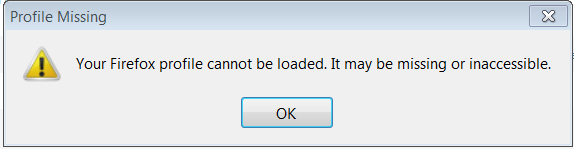

# Acceptance testing using Behat

Here are Jess's notes from her localhost install of Moodle and behat

-   -   [Overview](#AcceptancetestingusingBehat-Overview)
-   [Install behat](#AcceptancetestingusingBehat-Installbehat)
-   [Configure Moodle to use behat](#AcceptancetestingusingBehat-ConfigureMoodletousebehat)
-   [Run the tests](#AcceptancetestingusingBehat-Runthetests)
-   [Stop the tests](#AcceptancetestingusingBehat-Stopthetests)
-   [Create the tests](#AcceptancetestingusingBehat-Createthetests)
-   [Add new tests to behat](#AcceptancetestingusingBehat-Addnewteststobehat)
-   [Contribute your tests to Moodle](#AcceptancetestingusingBehat-ContributeyourteststoMoodle)
-   [Troubleshooting](#AcceptancetestingusingBehat-Troubleshooting)
    -   [Selenium is already running](#AcceptancetestingusingBehat-Seleniumisalreadyrunning)
        -   [Your behat test site is outdated](#AcceptancetestingusingBehat-Yourbehattestsiteisoutdated)
        -   [Firefox Profile missing error:](#AcceptancetestingusingBehat-FirefoxProfilemissingerror:)
        -   [Wrong server error:](#AcceptancetestingusingBehat-Wrongservererror:)

## Overview

-   Overview of Behat in Moodle: <https://docs.moodle.org/dev/Behat_integration>
-   Acceptance testing docs: <https://docs.moodle.org/dev/Acceptance_testing#Introduction>
-   Browsers it works on: <https://docs.moodle.org/dev/Acceptance_testing/Browsers>

## Install behat

See: <https://docs.moodle.org/dev/Acceptance_testing#Installation>

## Configure Moodle to use behat

Configuration file in moodle config.php should look like this$CFG-&gt;wwwroot   = '<http://localhost/moodle29>';
$CFG-&gt;dataroot  = 'C:\\\\wamp\\\\moodledata';
$CFG-&gt;admin     = 'admin';
$CFG-&gt;behat\_prefix = 'behat\_';
$CFG-&gt;behat\_dataroot = 'C:\\\\wamp\\\\behatdata';

$CFG-&gt;behat\_faildump\_path = 'C:\\\\wamp\\\\behatfails'; //where the failed step screenshots get saved
$CFG-&gt;behat\_wwwroot = '<http://127.0.0.1/moodle29>'; // must be different from wwwroot - which basically means pointing to wwwroot using an ip address

 

## Run the tests

To run the tests see: <https://docs.moodle.org/dev/Acceptance_testing#Running_tests> - essential info also below:

1.  **Start Wamp Server.**
2.  In one command line window start selenium:
    **java -jar "C:\\Program Files\\selenium-server-standalone-2.45.0.jar"**
3.  In another command line window run the php server on the ip address version of localhost and port 80808:
    **cd C:\\wamp\\www\\moodle29\\**
    **php -S 127.0.0.1:8080**
4.  In a third command line window:

    **cd C:\\wamp\\www\\moodle29\\**

    **php admin\\tool\\behat\\cli\\init.php**

5.  In a fourth command line window:
    **cd C:\\wamp\\www\\moodle29\\**
    **vendor\\bin\\behat --config [C:\\wamp\\behatdata\\behat\\behat.yml](file:///C:/wamp/behatdata/behat/behat.yml) "C:\\wamp\\www\\moodle29\\report\\myfeedback\\tests\\behat\\myfeedback\_general.feature"**
6.  To run all tests, instead of a particular one, leave off the second argument pointing to the feature file in the line above.

## Stop the tests

-   To stop tests running in the fourth command line window (running behat.yml) Ctrl+C and then y (to agree the 
-   To stop selenium server go here in a web browser: <http://localhost:4444/selenium-server/driver/?cmd=shutDownSeleniumServer>

## Create the tests

-   Find out how to write features: <https://docs.moodle.org/dev/Acceptance_testing#Writing_features>
-   The acceptance testing admin page is here - it shows the commands you can use to write your tests: <http://localhost/moodle29/admin/tool/behat/index.php>

## Add new tests to behat

See: <https://docs.moodle.org/dev/Acceptance_testing#Writing_features>

 

If you are adding new tests or steps definitions update the tests list:
-   **php admin/tool/behat/cli/util.php --enable**

## Contribute your tests to Moodle

See: <https://docs.moodle.org/dev/Acceptance_testing/Contributing_automated_tests>

## Troubleshooting

### Selenium is already running

In a web browser run: <http://localhost:4444/selenium-server/driver/?cmd=shutDownSeleniumServer>

Explanation from <http://automationtricks.blogspot.co.uk/2010/08/how-to-handle-selenium-is-already.html>:

When we run selenium RC test cases sometimes we faces this issue saying "[java.net](http://java.net).BindException: Selenium is already running on port 4444. Or some other service is." When you check the port 4444 no service is running. We change the port and run the program even that too is not working. 
In these cases we need to shutdown the selenium server on this port.
Use below command to shut down the server.
<http://localhost:4444/selenium-server/driver/?cmd=shutDownSeleniumServer>
If selenium server is already running on port 4444 then it will shut down the server and says 
OKOK

if selenium is not running on this port 4444 then by hitting above url will give you 
"Unable to connect"

#### Your behat test site is outdated

Put your behat config directly below the Moodle config line. It must be ABOVE the require\_once(dirname(\_\_FILE\_\_) . '/lib/setup.php'); line, or you'll get errors

<https://moodle.org/mod/forum/discuss.php?d=251832>: 

This is what I get when i run the /vendor/bin/behat ........ 

\[Exception\] 
Exception has been thrown in "beforeSuite" hook, defined in behat\_hooks::before\_suite() 
Your behat test site is outdated, please run php admin/tool/behat/cli/init.php from your moodle dirroot to drop and install the behat test site again.

If you still get an out of date error:

<https://tracker.moodle.org/browse/MDL-37768>:

-   You SHOULD see an exception stating that your behat testing site is outdated
-   cd /to/your/dirroot
-   php admin/tool/behat/cli/util.php --drop
-   php admin/tool/behat/cli/init.php - (it asked me to do this)
-   php admin/tool/behat/cli/util.php --enable
-   Run the tests again (vendor/bin/behat --config ......)
-   You SHOULD NOT see the exception any more and the tests SHOULD run as normal
-   Restore your version.php to avoid future conflicts

#### Firefox Profile missing error:

If you get a Firefox popup error saying 'Profile missing: Your Firefox profile cannot be loaded. It may be missing or inaccessible.

Restart your computer

#### Wrong server error:

I followed the steps and when I ran vendor/bin/behat --config C:\\wamp\\moodledata\_behat\\behat\\behat.yml

I found an error: Exception is thrown in before scenario hook. The base url is not a behat test site, ensure you started the built in web server in the correct directory or your webserver is incorrectly started or set up.

FIX - I thought I only had to initialise the behat environment once, but it seems like it's something I have to do every time by changing to my moodle29 root environment in the command line and running:
php admin/tool/behat/cli/init.php

<https://gist.github.com/danpoltawski/8036489>

## Attachments:

 [Image.png](attachments/55903885/55903887.png) (image/png)

