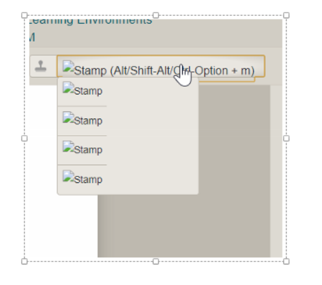
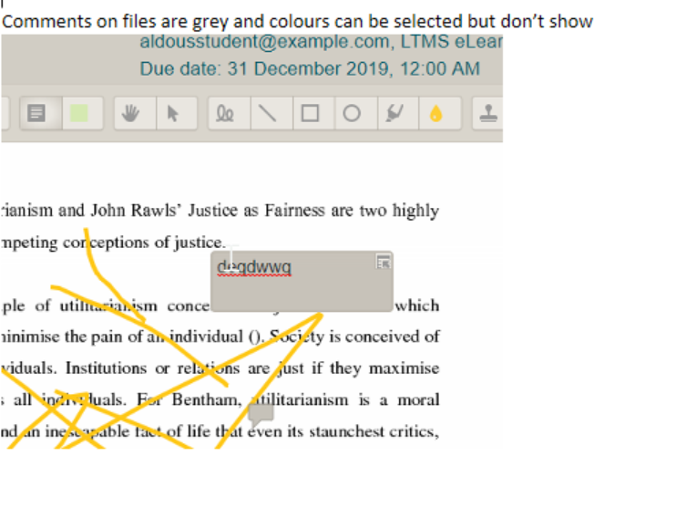
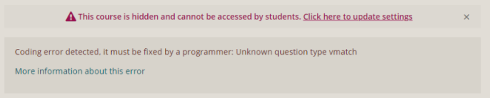
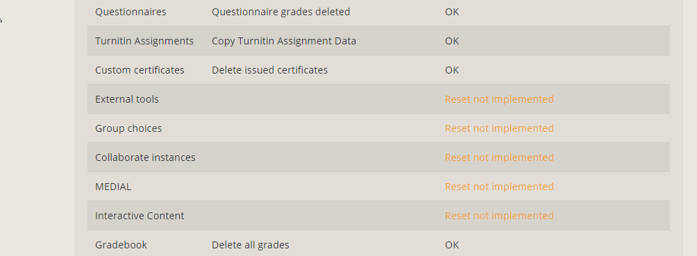

# Ad Hoc Moodle Testing - 25 July 2019

# <https://moodle-app-01-pp.ucl.ac.uk/upgrade-3-post-troubles/login/>

# Ignore the text, just edit the table with what you're testing.  Add new date.

This third round of testing is in 3 parts:

1.  Testing live New Moodle - notifications, settings, roles, previous fixes/issues
2.  Testing UAT when upgraded to 3.4.3, and any previous fixes/issues
3.  Portico/CMIS integration when it comes. 

-   Please make sure you are on the right instance for each part of testing outlined above! Instances are listed at the top of each section below.
-   1st pass testing report can be found here: [Moodle 3.4 Testing - 1st Pass - April/May](Moodle_3.4_Testing_-_1st_Pass_-_April_May)
-   2nd pass testing report can be found here: [Moodle 3.4 Testing - 2nd Pass - May/June](Moodle_3.4_Testing_-_2nd_Pass_-_May_June)
-   Migration testing report can be found here: [MIP Migration Tool Testing - June 2018](MIP_Migration_Tool_Testing_-_June_2018)

**Process:**

-   Please create any Test courses in the Miscellaneous &gt; Testing category.

-   Put your name against any section you are intending to test. Add in your exact browser version. 

1.  **Look at the tests linked next to each item, and in the 'details' section list which ones you have undertaken. **
    1.  (If Test does not exist then detail briefly what you did.)
2.  **Confirm in the details/passed section if the outcomes seems to be satisfactory next to each test. **
    1.  (If possible add a link to test activity etc as this will make logging errors easier. )
3.  **If any bugs were logged then please check that these have been fixed and note results in details. **
4.  **Log issues in Mantis <https://www.ucl.ac.uk/mantis>. See guide [here.](attachments/120785198/120785195.docx) **Choose the Moodle Improvement Project (MIP) from the Project dropdown. Provide as much info as possible. Leave tickets unassigned.**
    **
5.  **Add Mantis number to Mantis? column for reference. **

-   List of all current Test scripts can be found here: <https://wiki.ucl.ac.uk/pages/viewpage.action?title=Tests&spaceKey=ISMoodle> - please do not put results in those pages, only here, but do feel free to update or add to them, following existing format.  
-   Moodle doc release notes: <https://docs.moodle.org/dev/Moodle_3.4_release_notes>

**
**

**Table of contents**

-   [https://moodle-app-01-pp.ucl.ac.uk/upgrade-3-post-troubles/login/](#AdHocMoodleTesting25July2019-https://moodle-app-01-pp.ucl.ac.uk/upgrade-3-post-troubles/login/)
-   [Ignore the text, just edit the table with what you're testing. Add new date.](#AdHocMoodleTesting25July2019-Ignorethetext,justeditthetablewithwhatyou'retesting.Addnewdate.)
    -   [I. New Moodle go live testing - https://moodle-1819.ucl.ac.uk/](#AdHocMoodleTesting25July2019-I.NewMoodlegolivetesting-https://moodle-1819.ucl.ac.uk/)
        -   [Activities/ Plugins](#AdHocMoodleTesting25July2019-Activities/Plugins)
        -   [Miscellaneous/Any other things tested](#AdHocMoodleTesting25July2019-Miscellaneous/Anyotherthingstested)
    -   [II. 3.4.4 and updated plugins testing - July 2018 - https://v344.moodle-01-u.ucl.ac.uk](#AdHocMoodleTesting25July2019-II.3.4.4andupdatedpluginstesting-July2018-https://v344.moodle-01-u.ucl.ac.uk)
        -   [Activities/ Plugins](#AdHocMoodleTesting25July2019-Activities/Plugins.1)
        -   [Administration](#AdHocMoodleTesting25July2019-Administration)
        -   [Miscellaneous](#AdHocMoodleTesting25July2019-Miscellaneous)
    -   [III. Live environment testing - https://moodle-1819.ucl.ac.uk/](#AdHocMoodleTesting25July2019-III.Liveenvironmenttesting-https://moodle-1819.ucl.ac.uk/)
    -   [Testing live New Moodle - https://moodle-1819.ucl.ac.uk/](#AdHocMoodleTesting25July2019-TestingliveNewMoodle-https://moodle-1819.ucl.ac.uk/)
        -   [Activities/ Plugins](#AdHocMoodleTesting25July2019-Activities/Plugins.2)
        -   [Administration](#AdHocMoodleTesting25July2019-Administration.1)
        -   [Platform Administration](#AdHocMoodleTesting25July2019-PlatformAdministration)
        -   [Miscellaneous/Any other things tested](#AdHocMoodleTesting25July2019-Miscellaneous/Anyotherthingstested.1)

## **I.  New Moodle go live testing - <https://moodle-1819.ucl.ac.uk/>**

Phase 1 - New Moodle go live testing

Issue

Details

Who?

Browser?
IE/FF/Ch
(incl. v.)

Passed?  

Comments

 Mantis?
### **Activities/ Plugins**

** **

#### Non Assessment Activities

Attendance

-   See [Tests- Attendance](Tests-_Attendance)

#### Resources

Blackboard Collaborate Ultra

-   See [Tests-BlackboardCollaborate](Tests-BlackboardCollaborate)

#### Blocks

Disabled
Some blocks have been disabled on UAT and Moodle 18-19 Prod should also reflect that

JLH
Chrome 52 on Windows 7

**FIXED AS OF 2018-07-06**

Can be found under **Administration &gt; Site administration &gt; Plugins &gt; Blocks &gt; Manage blocks**

-   Private files

0007740
#### **Course formats**

Private Files
Private files should be disabled

JLH
Chrome 52 on Windows 7

**FIXED AS OF 2018-07-06**

Private files are still enabled on new Moodle. They can be disabled by:

-   Set the capabilities '**moodle/user:manageownfiles**' and '**repository/user:view**' to **Prohibit** in **Administration &gt; Site administration &gt; Users &gt; Permissions &gt; Define Roles &gt; Authenticated User**
-   Disable the **Private files** repository in **Administration &gt; Site administration &gt; Plugins &gt; Repositories &gt; Manage repositories**
-   Disable the **Private files** block in **Administration &gt; Site administration &gt; Plugins &gt; Blocks &gt; Manage blocks**

0007740
Guest access
Testing guest login

0007735
Roles - Define Roles
Configurations of all the roles on Moodle
JLH
Chrome 52 on Windows 7

**FIXED AS OF 2018-07-06**

While the new roles exist on 18-19 Moodle, there are a number of things that don't match the configuration on UAT. Everything listed below can be found in **Adminstration &gt; Site administration &gt; Users &gt; Permissions &gt; Define Roles**

**Manage roles**

-   All new roles exist on 18-19 Moodle but don't have the same order. This is important as this list/order also serves as a hierarchy if there are any conflicting permissions between role assignments.
-   Description of new roles have been amended (on UAT) so they're actually descriptive. This change should be carried over to live 18-19 Moodle.

**Allow role assignments**

-   All stock roles can still be assigned.
-   All stock roles can still assign other roles.
-   None of the new roles can assign other new roles.

**Allow role overrides**

-   Live 18-19 Moodle doesn't match 3.4 UAT

**Allow role switches**

-   Live 18-19 Moodle doesn't match 3.4 UAT

0007736
Roles - User Policies
Configuration options which role is give to visitors, to guests and the creator of new courses
JLH
Chrome 52 on Windows 7

**FIXED AS OF 2018-07-06**

Everything listed below can be found in **Adminstration &gt; Site administration &gt; Users &gt; Permissions &gt; User Policies**. Live 18-19 Moodle doesn't match the specified role in 3.4 UAT for:

-   **Role for visitors** should be **Guest (uclguest)**
-   **Role for guest** should be **Guest (uclguest)**
-   **Creators' role in new courses** should be **Course Administrator (uclcourseadmin)**

0007737
Roles - Enrolments
Defines the default role for a number of enrolment methods
JLH
Chrome 52 on WIndows 7

**FIXED AS OF 2018-07-06**

All of these are currently set to **stock-student** on Live 18-19 Moodle but should be to **Student**. Can be found under **Administration &gt; Site administration &gt; Plugins &gt; Enrolments**

-   Cohort sync (Default role)
-   Manual enrolments (Default role)
-   Self enrolment (Default role assignment)

0007738
Test student
RD
**FIXED AS OF 2018-07-18**

Test students are assigned 'stock-student' role, should be student. With JLH who's rolling this and other role issues into one mantis ticket.

0007751
### **Miscellaneous/Any other things tested**

***Please add any things that you notice that we may want to bear in mind as we go forward!***
Main dropdown menus
RD
Staff help -&gt; About Moodle at UCL (link broken - should be: <https://www.ucl.ac.uk/isd/services/learning-teaching/e-learning-staff/e-learning-core-tools/moodle-for-staff> \[[^](https://www.ucl.ac.uk/isd/services/learning-teaching/e-learning-staff/e-learning-core-tools/moodle-for-staff)\])
Student help -&gt; IT training for students (link broken should be: <https://www.ucl.ac.uk/isd/services/learning-teaching/digital-skills/courses-materials/student-courses-training-materials> \[[^](https://www.ucl.ac.uk/isd/services/learning-teaching/digital-skills/courses-materials/student-courses-training-materials)\]

0007727
Blogs
Verify if blogs are disabled on Live 18-19 Moodle
JLH
Chrome 52 on Windows 7

Blogs are disabled in Live 18-18 Moodle
Competencies
Verify if competencies are disabled on Live 18-19 Moodle
JLH
Chrome 52 on Windows 7

Competencies are disabled in Live 18-18 Moodle
Language Pack Customisation
Verify if language pack customisations in UAT are also present in Live 18-19 Moodle
JLH
Chrome 52 on Windows 7

Language pack customisations are present in Live 18-18 Moodle
Course contacts
Shows list of users in course description based on the role(s) they're enrolled as.
JLH
Chrome 52 on Windows 7

**FIXED AS OF 2018-07-06**

List of roles that can can be shown in the course description isn't identical to 3.4 UAT. The following should be ticked under **Administration &gt; Site administration &gt; Appearance &gt; Courses**

-   Leader
-   Tutor
-   Course Administrator

0007739

## **II.  3.4.4 and updated plugins testing - July 2018 - <https://v344.moodle-01-u.ucl.ac.uk> **

In this round we will be testing with 3 perspectives: 

1. Update of whole platform to 3.4.4 - changes listed here (with probable relevant highlights):

Highlights of 3.4.3 and 3.4.4

3.4.4:  <https://docs.moodle.org/dev/Moodle_3.4.4_release_notes> 

-   [MDL-59047](http://tracker.moodle.org/browse/MDL-59047) - Short answer question doesn't display correctly when using the Boost theme
-   [MDL-62358](http://tracker.moodle.org/browse/MDL-62358) - Question rendering API does not support all 'question numbers' that might be needed
-   [MDL-61832](http://tracker.moodle.org/browse/MDL-61832) - Editing options disappear after saving a Lesson page in expanded view
-   [MDL-62735](http://tracker.moodle.org/browse/MDL-62735) - Simple search does not obey global search on/off setting
-   [MDL-61932](http://tracker.moodle.org/browse/MDL-61932) - Glossary created via import does not display on the front page
-   [MDL-62386](http://tracker.moodle.org/browse/MDL-62386) - Audio file doesn't display when using HTML5 audio media player

3.4.3:  <https://docs.moodle.org/dev/Moodle_3.4.3_release_notes>

-   [MDL-61306](http://tracker.moodle.org/browse/MDL-61306) - Implement privacy API in various components and standard plugins for user data export and deletion
-   [MDL-58697](http://tracker.moodle.org/browse/MDL-58697) - Assignment: Fixed incorrect "No submission" status if group submission changed to individual submission
-   [MDL-52989](http://tracker.moodle.org/browse/MDL-52989) - Lesson: Fixed regression in cluster navigation
-   [MDL-61733](http://tracker.moodle.org/browse/MDL-61733) - Database module: Fixed bug with creating tables in templates using Atto editor
-   [MDL-61348](http://tracker.moodle.org/browse/MDL-61348) - Quiz: Fixed a report bug where the count of the number of attempts is sometimes incorrect in group averages
-   [MDL-61520](http://tracker.moodle.org/browse/MDL-61520) - Quiz: Fixed a bug where the question text was no longer exported in the quiz statistics HTML download
-   [MDL-61950](http://tracker.moodle.org/browse/MDL-61950) - Quiz: Fixed a bug in the statistics report to display the chosen questions for random question slots

3.4.2:  <https://docs.moodle.org/dev/Moodle_3.4.2_release_notes>

-   [MDL-61307](http://tracker.moodle.org/browse/MDL-61307) - New Privacy subsystem
-   [MDL-61477](http://tracker.moodle.org/browse/MDL-61477) - Allow plugins to handle site policies and overwrite $CFG-&gt;sitepolicy
-   [MDL-61423](http://tracker.moodle.org/browse/MDL-61423) - Signup process - add minimum age verification
-   [MDL-60815](http://tracker.moodle.org/browse/MDL-60815) - Fixed bug with loading CSS for editor
-   [MDL-60812](http://tracker.moodle.org/browse/MDL-60812) - Select correct default role during manual enrolment
-   [MDL-58006](http://tracker.moodle.org/browse/MDL-58006) - Assignment: reset 'Blind marking' status during 'Course reset'
-   [MDL-58845](http://tracker.moodle.org/browse/MDL-58845) - Choice: hide "unanswered" column when it is set so in choice settings
-   [MDL-56688](http://tracker.moodle.org/browse/MDL-56688) - Single View & grades export should follow the same order set in gradebook set up
-   [MDL-61249](http://tracker.moodle.org/browse/MDL-61249) - Corrected end date for manual enrolments

2. Updated plugins (see list below, items with TEST have been added to report.)

List of updated plugins

-   Ad hoc database queries report\_customsql 2018050900

-   TEST: Algebra qtype\_algebra 2018020401

-   TEST: Assignment (Turnitin) mod\_turnitintooltwo 2018052301 

-   TEST: Attendance block\_attendance 2018052100

-   TEST: CBM Summary quiz\_cbmgrades 2018051800

-   Code checker local\_codechecker 2018070100

-   Data privacy tool\_dataprivacy 2017111312

-   Essential theme\_essential 2017102904

-   TEST: Gapfill qtype\_gapfill 2018050700

-   TEST: Group choice mod\_choicegroup 2018062000

-   Hot Potatoes XML format qformat\_hotpot 2018052520

-   TEST: Hot Question mod\_hotquestion 2018060301

-   HotPot module mod\_hotpot 2018063027

-   TEST: Lightbox Gallery mod\_lightboxgallery 2018062700

-   Microsoft Word 2010 table format (wordtable) qformat\_wordtable 2018060401

-   More font colors atto\_morefontcolors 2018050202

-   TEST: Multinumerical qtype\_multinumerical 2018050801

-   TEST: My feedback report\_myfeedback 2018052900

-   Policies tool\_policy 2017111309

-   TEST: Questionnaire mod\_questionnaire 2017111104

-   Quickmail block\_quickmail 2017122001 

-   TEST: RegExp Adaptive mode with Help qbehaviour\_regexpadaptivewithhelp 2018050801

-   TEST: RegExp Adaptive mode with Help (no penalties) qbehaviour\_regexpadaptivewithhelpnopenalty 2018050801

-   TEST: Regular expression short answer qtype\_regexp 2018050801

-   TEST: Scheduler mod\_scheduler 2017051402

-   TEST: Turnitin plagiarism plugin plagiarism\_turnitin 2018062601

3. Items still not tested in 2nd and 3rd pass

Issue

Details

Who?

Browser?
IE/FF/Ch
(incl. v.)

Passed?  

Comments

 Mantis?
Red items = essential/priority 1

***Black bold = desirable/priority 2***

Normal text = optional/priority 3

******For items already tested in previous passes, please do skim test and mainly focus on open or known issues!***** *Please do click on on the mantis links and check the notes on the ticket, and add any notes or confirmation of fixes so we can keep up to date?**

### **Activities/ Plugins**

** **

#### Assessment

**\*\*Turnitin\*\***

-   **See Tests Turnitin**

<!-- -->

-   [0007776](https://www.ucl.ac.uk/mantis/view.php?id=7776) - Turnitin assignment inbox listing Tutors
-   [0007728](https://www.ucl.ac.uk/mantis/view.php?id=7728) - New TII assignments not anonymous by default
-   0007503 - Deletion only visible after refresh
-   0007502 - Submission inbox is squashed
-   0007501 - Closing Turnitin submission preview window
-   0007500 - Multiple marker functionality
-   See if TII assignments are displayed in Course overview block on /my/
-   See: https://github.com/turnitin/moodle-mod\_turnitintooltwo/blob/master/CHANGELOG.md 

NEW: 0007826 Bulk download of papers is not working

JK

*J**K- 25/07/19***

Firefox Quantum 61.0.1 (64-bit)

FF

****J**K- 25/07/19******

*** Tested existing assignments and course Resets***

******

\*\*Assignments\*\*

-   See Tests Assignment

EH 25.07.2019
Chrome
Bunch of errors, but appear to relate to config rather than anything else:

**\*\*Quizzes\*\***

-   **See Tests Quiz**

EH 25.07.2019
Chrome
Vmatch question type missing

Database
-   [MDL-61733](http://tracker.moodle.org/browse/MDL-61733) - Database module: Fixed bug with creating tables in templates using Atto editor

***Optional (tested 1st pass). Unable to test until Atto editor fixed.***
#### Non Assessment Activities

**\*\*MyFeedback\*\***

-   **See Tests-MyFeedback**

\*\*Choice\*\*

-   See Tests-Choice

<!-- -->

-   [MDL-58845](http://tracker.moodle.org/browse/MDL-58845) - Choice: hide "unanswered" column when it is set so in choice settings

***
***
***Has not yet been tested yet? (See 1st and 2nd pass)***
**\*\*Hot Question\*\***
***No tests currently documented for this -** **detail here or add new test page?** **See release notes here: <https://moodle.org/plugins/mod_hotquestion>***
***Plugin updated and has not yet been tested yet? (See 1st and 2nd pass)***
\*Questionnaire\*

-   See Tests-Questionnaire

***No tests currently documented for this - I've copied a test script page to get the format right, please detail test process while testing?***
***Plugin updated and has not yet been tested yet? (See 1st and 2nd pass)***
\*\*Group Choice\*\*

-   See Tests-GroupChoice

***No tests currently documented for this - I've copied a test script page to get the format right, please detail test process while testing?***
***Plugin updated and has not yet been tested yet? (See 1st and 2nd pass) - but only 287 instances on legacy Moodle***
**\*\*Scheduler\*\***

-   **See [Tests-Scheduler](Tests-Scheduler)**

******Plugin updated.*** Tested 2nd pass -** **Guidance may need to be updated to reflect new functionality:
******<https://moodle.org/plugins/pluginversion.php?id=16697>***
Chat
*No tests currently documented for this - detail here or add new test page?*
*Has not yet been tested yet? 334 instances in legacy (limited use)*
Hot Pot
*No tests currently documented for this - detail here or add new test page?*
*Has not yet been tested yet? *292 instances in legacy. *(limited use)***
Attendance

-   See Tests- Attendance

All test passed.
GKL
*Optional (tested 2nd pass)*
SCORM

-   See [Tests-SCORM](Tests-SCORM)

*Optional (tested 2nd pass)*
#### Resources

\*\*Lesson\*\*
-   [MDL-61832](http://tracker.moodle.org/browse/MDL-61832) - Editing options disappear after saving a Lesson page in expanded view
-   [MDL-52989](http://tracker.moodle.org/browse/MDL-52989) - Lesson: Fixed regression in cluster navigation

***No tests currently documented for this -** **detail here or add new test page?***

KU

25.07.2019

Chrome
***Plugin updated and has not yet been tested yet? (See 1st and 2nd pass)***
Lightbox gallery
See release notes here: <https://moodle.org/plugins/pluginversion.php?id=17248>

No tests exist yet - detail here or add new test page.

***Plugin updated and has not yet been tested yet? (See 1st and 2nd pass) - but only 82 instances on Legacy Moodle.***
Lecturecast

-   See [Tests-Lecturecast LTI](Tests-Lecturecast_LTI)

***Optional (tested 3rd pass)***
Blackboard Collaborate Ultra

-   See [Tests-BlackboardCollaborate](Tests-BlackboardCollaborate)

All tests passed.

GKL
***Optional (tested 3rd pass)***
Reading list
*No tests currently documented for this - detail here or add new test page?*
***Optional (tested 2nd pass)***
#### Blocks

\*\*Attendance block\*\*
No tests currently documented for this - detail here or add new test page?
***Plugin updated, not tested previously.***

***GL's previous RF Ticket IN02769124 - always showed 0 attendance?***

**Library Resources block**

[0007780](https://www.ucl.ac.uk/mantis/view.php?id=7780) - Library Resources block not allowing linking to a default reading list with a Portico code over 8 characters
ZW
FF 68.0.1
25/07
**Common Timetable**
[0007666](https://www.ucl.ac.uk/mantis/view.php?id=7666) - Common Timetable block links open in same page
ZW
25/07
**Unexpected blocks:**
For background, see [Tests-Blocks-Results](Tests-Blocks-Results) and list of blocks currently on New Moodle: <https://moodle-1819.ucl.ac.uk/admin/blocks.php>

Also Mantis tickets: [0007740](https://www.ucl.ac.uk/mantis/view.php?id=7740), [0007709](https://www.ucl.ac.uk/mantis/view.php?id=7709)

Notable surprises on new Moodle:

-   Blog menu
-   Blog tags
-   Flickr
-   MyPortfolio
-   Quiz results (disabled)
-   Social Activities bock (used on different course format)

ZW
25/07
### Administration

\*\*Text Editor\*\*
-   [MDL-60815](http://tracker.moodle.org/browse/MDL-60815) - Fixed bug with loading CSS for editor
-   [0007768](https://www.ucl.ac.uk/mantis/view.php?id=7768) - Moodle editor not working properly

***Update to platform may resolve mantis bug?***
**\*\*Course Reset\*\***
***Test following update to TII plugin***
UCL Tools
-   Reset quiz attempts

-   ***Quiz reset FH:*** Failed during 2nd pass testing but would like someone else to test too- close date and grace period enabled on quiz but course not found under quiz reset tool

User Tours
***Note anything odd encountered here! ***

Course format
-   [0007479](https://www.ucl.ac.uk/mantis/view.php?id=7497) - Course formats topic section highlight not shown
-   [0007605](https://www.ucl.ac.uk/mantis/view.php?id=7605) - Menu overlay on Topic moving popup

Collapsed topics

<https://moodle.org/plugins/pluginversions.php?plugin=format_topcoll> From MB: "It simply adds an extra dropdown in the course settings under format that allows you to select the number of sections."
AED

Imported CCMEG882B: Music Technology in Education from New Live into <https://v344.moodle-01-u.ucl.ac.uk/course/view.php?id=8956>.

Changed format to Collapsed Topics, then changed number of sections from 40 to 11. Seemed to display ok in collapsed Topics.

Reverted back (in UAT) to normal Topics format, and section number stayed at 11.

### **Miscellaneous**

***Please add any things that you notice on <https://v344.moodle-01-u.ucl.ac.uk/> that we may want to bear in mind as we go forward!***

## ***III.  Live environment testing - <https://moodle-1819.ucl.ac.uk/> ***

Some things are hard to test in development environments - like notifications and course creations etc... So a final bit of testing is required on the live environment

Issue

Details

Who?

Browser?
IE/FF/Ch
(incl. v.)

Passed?  

Comments

 Mantis?
## **Testing live New Moodle - <https://moodle-1819.ucl.ac.uk/>**

### **Activities/ Plugins**

** **

Turnitin

-   See [Tests Turnitin](Tests-Turnitin)

[0007670](https://www.ucl.ac.uk/mantis/view.php?id=7670) - need to test that:
1. An email notification is sent to Tutors on submission of a Moodle and Turnitin assignment
2. An email notification is sent to students on receipt of feedback
3. An email notification is sent to users on forum postings

\*\*Wiki\*\*

-   See Tests-Wiki

Created a wiki as a tutor and everything worked fine; uploaded photos, added / formatted text, etc.

Logged into a wiki as a student and edited a page, compared versions, and looked at history - everything looked good

Maria Duster

Chrome on Windows

******Tested by Student Migration Assistants
******- Issues with editor noted.

\*\*Workshop\*\*

-   See Tests-Workshop

Tutors can create workshops, name them and write a description, and adjust the grading/marking system as they see fit; the Workshop is split into five different phases: Setup, Submission, Assessment, Grading Evaluation, and Closed - you must complete everything in each phase to move on to the next

I created a workshop and opened it to submissions (I provided instructions for submissions as well) - Susannah submitted a file and I was able to grade it and also set sara as a peer reviewer. After grading it, I was able to write a conclusion for the worksop and close it indefinitely.

Maria Duster
Chrome on Windows

**********Tested by Student Migration Assistants******
**- **I find the interface of the Workshop feature pretty confusing and while I was eventually able to figure it out, I’m not sure it’s the best method for peer review and feedback
#### Non Assessment Activities

**\*\*Forum (Advanced)\*\***
\[FOR001TS\] :

\[FOR002TS\] :

\[FOR003TS\] :

\[FOR006TS\] :

\[FOR007TS\] :

\[FOR008TS\] : - Lack correct permissions

\[FOR009T\] :

\[FOR011TS\] : -***Could not figure out the correct way to hide the forum.***

***
***
Max Menaul
Chrome 68.0.3440.84 on Windows
 
***Tested by Student Migration Assistants***

***Still remaining to test:***

-   1.  Display entire forum thread for reference when replying, rather than just the immediate post you are replying to. This might be with a link that says 'See this post in context', which is what it has in the email.
    2.  Make it clear where forum post emails originate in terms of the Moodle installation, the course and the forum name.
    3.  New function to Unsubscribe from Discussions.
    4.  Fix advanced forum interface for composing posts and responses.
    5.  Check default Subscription Mode is set to Automatic, for Forum and Advanced Forum.
    6.  What is timing of email notification?

    7.  Does the course shortname in email change if it is changed in course?

**\*\*Feedback\*\***

-   **See [Tests-Feedback](Tests-Feedback)**

Created a question and provided answers; Susannah answered the feedback and I could see the responses

Maria Duster
Chrome on Windows

*********Tested by Student Migration Assistants
*********- Straightforward and easy to use***
***
**\*\*Glossary\*\***

-   **See [Tests-Glossary](Tests-Glossary)**

Created the wiki as a tutor, named it / wrote a description / uploaded a file / tagged the entry
Susannah created an entry as a Student / wrote a description / tagged the entry

Maria Duster
Chrome on Windows
 
*******Tested by Student Migration Assistants
*******- Everything worked great!
***- Unclear if auto linking was tested? "Glossary entries can be set to automatically link to elsewhere in the course where the word or phrase is mentioned"***
Forum

-   See [Tests-Forum](Tests-Forum)

\[FOR001TS\] :

\[FOR002TS\] :

\[FOR003TS\] :

\[FOR006TS\] :

\[FOR007TS\] :

\[FOR008TS\] : - Lack correct permissions

\[FOR009T\] :

\[FOR011TS\] : -***Could not figure out the correct way to hide the forum.***

Max Menaul
Chrome 68.0.3440.84 on Windows
 
*************Tested by Student Migration Assistants*************

*************Still remaining to test:*************

-   1.  Display entire forum thread for reference when replying, rather than just the immediate post you are replying to. This might be with a link that says 'See this post in context', which is what it has in the email.
    2.  Make it clear where forum post emails originate in terms of the Moodle installation, the course and the forum name.
    3.  New function to Unsubscribe from Discussions.
    4.  Fix advanced forum interface for composing posts and responses.
    5.  Check default Subscription Mode is set to Automatic, for Forum and Advanced Forum.
    6.  What is timing of email notification?

    7.  Does the course shortname in email change if it is changed in course?

\*\*Choice\*\*

-   See Tests-Choice

<!-- -->

-   [MDL-58845](http://tracker.moodle.org/browse/MDL-58845) - Choice: hide "unanswered" column when it is set so in choice settings

Students
Has not yet been tested yet? (See 1st and 2nd pass)
Hot question
No tests currently documented for this - detail here or add new test page? See release notes here: <https://moodle.org/plugins/mod_hotquestion>
Plugin updated and has not yet been tested yet? (See 1st and 2nd pass)
Scheduler

-   See [Tests-Scheduler](Tests-Scheduler)

***Testing on UAT for updated plugin, but need to check on live to check notifications? See: <https://docs.moodle.org/35/en/Scheduler_module#Messages_and_notifications>***
**\*\*MyFeedback\*\***

-   **See Tests-MyFeedback**

Plugin updated (tested 2nd pass)
#### Resources

**\*\*Media Central (Media Resource)\*\***

-   See Tests-MediaCentral

\[MED001T\]:  Yes though with notes:

-   Step 12 within the Details tab: It is unclear if we need to select 'Download media'? What does this mean?
-   Step 15 SRT file would not upload by itself but only as a zip
-   Step 17: This actually appears when you first click ‘Add media’ right away (so move to step 6)
-   All other steps work fine \[i.e. validation of file type\]
-   Screenshot \[s.19\]-[see here](attachments/120785198/120785192.png)

\[MED002T\]: ****** ***No webcam to test with***

\[MED003T\]: ****** ***Unsure how to add into new grouping***

-   Different process to creating a group on new moodle: Admin drop down; Users &gt; Groups &gt; Create group
-   Unsure how to add into new grouping
-   It states ‘Restricted Not available unless: You belong to Tutorial Grp 1’ but everyone when clicking, has been able to view it :(

\[MED004T\] : 

-   ‘Check that course is set to be Visible to students - see block in top right of course.’ ????? ***- this needs updating in tests***
-   Tutor account 1 & 2 can see the video uploaded by account 1

-   I am able to set the restriction and restriction works :)

\[MED005T\] : 

-   Can send logs apart from the webcam one

\[MED006T\] :  iPhone 6s: 11.4.1

-   Works validation file type; this file doesn’t have an accepted file extension
-   There is no details tab \[step 13\] ***- need amend test/guidance***
-   There is no Assoc Files tab ***- need amend test/guidance***
-   No ‘Include Download’ link ***- need amend test/guidance***
-   No ‘click edit details’ ***- need amend test/guidance***
-   No message appeared to confirm the upload it just appears on the page prior to save and return to course
-   On both desktop/mobile a new window did not appear unless I clicked ‘Open MediaCentral resource’ to which the video plays on mobile/desktop fine

\[MED007T\] : ****** iPhone 6s: 11.4.1

-   No ‘webcam’ version as there is no popup overlay only ‘browse’ which offers: Take video/photo / photo library / browse
-   Can’t update start and end time
-   No details tab only ‘Add new media’ which lets you edit title/description/tags/T&Cs
-   Step.12:
    -   Media central tc first link does not work - nothing opens
    -   UCL Information Security Policy T&C link works but can only see first page and can’t exit without exiting from the whole process
-   No confirmation of media size screen or include download link option
-   Video works

\[MED008T\]: 

-   You can’t select a thumbnail
-   Works and this appears: [see screenshot](attachments/120785198/120785191.png)

\[MED001S\] : 

-   Can’t download file on phone :(

\[MED002S\] : ******

-   Can’t enrol guest access?

Sarah B.
Chrome 68.0.3440.84
******
***Tested by Student Migration Assistants***

***- Unclear if email confirming upload was received?***

******- Unable to test guest access due to current issues with this functionality?******

\*\*Book\*\*

-   See Tests-Book

Created book and chapters and subchapters.

Adjust various settings on book.

Maria Duster
Chrome on Windows

*********Tested by Student Migration Assistants********* - Doesn’t seem like much more can be done than creating a book, adding chapters, and tagging it
#### Blocks

Reading lists
Quickmail
Added a Quickmail block to the course and sent an email to Max Menault’s UCL Outlook email with a file attached; Max received the email and was able to download the file 
Maria Duster
************Tested by Student Migration Assistants**********
**
### Administration

#### **Course formats**

Grid

One topic (AKA Tabs)

Topics

Collapsed

#### **Course Administration**

Edit Sections/Topics

**
**

Add/Edit content

Hide content - check with student test account

Navigate between activities

Course Reset
EH 25-07-19
Reset removed students and student data.

Tii dates reset, start date = course reset date, anonymous marking retained and tested with student submission.

New Class created on Turnitin UK.

Reset shows following messages:

Back up and restore

FH
Student switch role to
RD
0007839: tutors/admins can't view course when the use the 'switch role to student' functionality
Description
Tutors and admins use this fuctionality (found in the course admin block) to get an idea of what students see when they view a course - i.e if the items hidden from students are indeed hidden.
Currently in Production Moodle (New Moodle) when a course is hidden from students and this facility is used Moodle reports a permissions error.
The switch role to student should not (and doesn't in Legacy Moodle) result in this behaviour.
Steps To Reproduce
Go to any course (ensure it's hidden from students -&gt; Administration -&gt; course settings: Chose 'Hide' under 'visibility and save settings.
Click your name (top right hand corner of page) and select switch role - &gt; student - &gt; permission error message displayed.
Additional Information
See discussion of issue and potential link to resolution at:
<https://moodle.org/mod/forum/discuss.php?d=368789> \[[^](https://moodle.org/mod/forum/discuss.php?d=368789)\]
This will have quite a large impact on tutors and admins wanting to check courses without making them available to students.

0007839
### Platform Administration

UCL Hacks

-   See [Tests-UCLHacks](Tests-UCLHacks)

UCL001T 'All courses' link visibility
UCL002T 'All courses' settings
UCL003T Calendar export
UCL004T Calendar import
UCL005T Course Reset
UCL006T Fuzzy Search
UCL007T Country list - Kosovo
UCL008T Alphabetical students
UCL009T Test student account creation 

JLH
Chrome 52 on Windows 7
My home page &gt; Course overview

Categories

Navigation

Private Files
Private files should be disabled

JLH
Chrome 52 on Windows 7

**FIXED AS OF 2018-07-06**

Private files are still enabled on new Moodle. They can be disabled by:

-   Set the capabilities '**moodle/user:manageownfiles**' and '**repository/user:view**' to **Prohibit** in **Administration &gt; Site administration &gt; Users &gt; Permissions &gt; Define Roles &gt; Authenticated User**
-   Disable the **Private files** repository in **Administration &gt; Site administration &gt; Plugins &gt; Repositories &gt; Manage repositories**
-   Disable the **Private files** block in **Administration &gt; Site administration &gt; Plugins &gt; Blocks &gt; Manage blocks**

0007740
Guest access
Testing guest login

ZW

**FIXED AS OF 2018-07-05**

Guest login button is currently pointing towards MIP Moodle UAT

0007735
Roles - Define Roles
Configurations of all the roles on Moodle
JLH
Chrome 52 on Windows 7

**FIXED AS OF 2018-07-06**

While the new roles exist on 18-19 Moodle, there are a number of things that don't match the configuration on UAT. Everything listed below can be found in **Adminstration &gt; Site administration &gt; Users &gt; Permissions &gt; Define Roles**

**Manage roles**

-   All new roles exist on 18-19 Moodle but don't have the same order. This is important as this list/order also serves as a hierarchy if there are any conflicting permissions between role assignments.
-   Description of new roles have been amended (on UAT) so they're actually descriptive. This change should be carried over to live 18-19 Moodle.

**Allow role assignments**

-   All stock roles can still be assigned.
-   All stock roles can still assign other roles.
-   None of the new roles can assign other new roles.

**Allow role overrides**

-   Live 18-19 Moodle doesn't match 3.4 UAT

**Allow role switches**

-   Live 18-19 Moodle doesn't match 3.4 UAT

0007736
Roles - User Policies
Configuration options which role is give to visitors, to guests and the creator of new courses
JLH
Chrome 52 on Windows 7

**FIXED AS OF 2018-07-06**

Everything listed below can be found in **Adminstration &gt; Site administration &gt; Users &gt; Permissions &gt; User Policies**. Live 18-19 Moodle doesn't match the specified role in 3.4 UAT for:

-   **Role for visitors** should be **Guest (uclguest)**
-   **Role for guest** should be **Guest (uclguest)**
-   **Creators' role in new courses** should be **Course Administrator (uclcourseadmin)**

0007737
Roles - Enrolments
Defines the default role for a number of enrolment methods
JLH
Chrome 52 on WIndows 7

**FIXED AS OF 2018-07-06**

All of these are currently set to **stock-student** on Live 18-19 Moodle but should be to **Student**. Can be found under **Administration &gt; Site administration &gt; Plugins &gt; Enrolments**

-   Cohort sync (Default role)
-   Manual enrolments (Default role)
-   Self enrolment (Default role assignment)

0007738
Test student
RD
**FIXED AS OF 2018-07-18**

Test students are assigned 'stock-student' role, should be student. With JLH who's rolling this and other role issues into one mantis ticket.

0007751
### **Miscellaneous/Any other things tested**

***Please add any things that you notice that we may want to bear in mind as we go forward!***
Course Overview
Announcements
Help Icons
Main dropdown menus
RD
Staff help -&gt; About Moodle at UCL (link broken - should be: <https://www.ucl.ac.uk/isd/services/learning-teaching/e-learning-staff/e-learning-core-tools/moodle-for-staff> \[[^](https://www.ucl.ac.uk/isd/services/learning-teaching/e-learning-staff/e-learning-core-tools/moodle-for-staff)\])
Student help -&gt; IT training for students (link broken should be: <https://www.ucl.ac.uk/isd/services/learning-teaching/digital-skills/courses-materials/student-courses-training-materials> \[[^](https://www.ucl.ac.uk/isd/services/learning-teaching/digital-skills/courses-materials/student-courses-training-materials)\]

0007727
Moodle recycle bin
RD
Context: Within any Moodle course.
<https://v344.moodle-01-u.ucl.ac.uk/admin/search.php?query=recycle>

If course items are deleted (resources and activities) a recycle bin should appear under the course administration block.It is currently configured only to appear if it contains recently (within 2 weeks) deleted items. When items are deleted the bin doesn't appear.
If I configure the bin to appear always (not to auto-hide when empty) the recycle bin appears in the course settings block but still does not contain recently deleted items.

0007835
**Share** function for admins
Timeline icons
External Tools (LTIs)
Shared Files
Enrolled users
Blogs
Verify if blogs are disabled on Live 18-19 Moodle
JLH
Chrome 52 on Windows 7

Blogs are disabled in Live 18-18 Moodle
Competencies
Verify if competencies are disabled on Live 18-19 Moodle
JLH
Chrome 52 on Windows 7

Competencies are disabled in Live 18-18 Moodle
Language Pack Customisation
Verify if language pack customisations in UAT are also present in Live 18-19 Moodle
JLH
Chrome 52 on Windows 7

Language pack customisations are present in Live 18-18 Moodle
Course contacts
Shows list of users in course description based on the role(s) they're enrolled as.
JLH
Chrome 52 on Windows 7

**FIXED AS OF 2018-07-06**

List of roles that can can be shown in the course description isn't identical to 3.4 UAT. The following should be ticked under **Administration &gt; Site administration &gt; Appearance &gt; Courses**

-   Leader
-   Tutor
-   Course Administrator

0007739
GDPR
Course creation
Course Overview
Search Courses & Guest Login
Course reset
Quickmail
Course completion

|                          |
|--------------------------|
| **\*\*Hot Question\*\*** |

## Attachments:

 [MediaResource008T.png](attachments/120785198/120785191.png) (image/png)
 [MediaCentral19.png](attachments/120785198/120785192.png) (image/png)
 [image2018-8-2\_10-50-44.png](attachments/120785198/120785193.png) (image/png)
 [SwitchRoleNoNavigation.PNG](attachments/120785198/120785194.png) (image/png)
 [User Guide for Mantis.docx](attachments/120785198/120785195.docx) (application/vnd.openxmlformats-officedocument.wordprocessingml.document)
 [iconalignnmentBG.png](attachments/120785198/120785196.png) (image/png)
 [image2019-7-25\_13-22-46.png](attachments/120785198/120785268.png) (image/png)
 [image2019-7-25\_13-34-17.png](attachments/120785198/120785277.png) (image/png)
 [image2019-7-25\_13-34-31.png](attachments/120785198/120785278.png) (image/png)
 [image2019-7-25\_13-34-57.png](attachments/120785198/120785279.png) (image/png)

