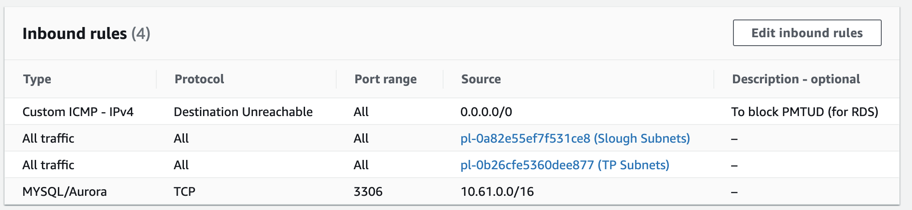

# Allow on-prem to talk to AWS via UCL managed transit gateway

1) Request Firewall opening for relevant on-prem IPs to cloud IPs (e.g. IN04728842)

<https://ucl--bmcservicedesk.eu7.visual.force.com/apex/selfservicenew#/support/search/firewall> 

2) Test connectivity

``` java
wget mdl-aws-db01-mim.cluster-cweddcllqbin.eu-west-2.rds.amazonaws.com:3306
```

This should download an index.html, if this fails something is wrong (use relevant hostname)

3) Security Groups

Add the Slough & TP subnets to the Inbound rules

<https://eu-west-2.console.aws.amazon.com/vpc/home?region=eu-west-2#securityGroups>:



 If using RDS, add the rule to block PMTUD

4) For RDS use, setup and configure a Parameter Group covering increased timeouts as per this video

<https://eu-west-2.console.aws.amazon.com/rds/home?region=eu-west-2#parameter-group-list>:

## Attachments:

 [Screenshot 2021-06-18 at 00.10.25.png](attachments/170397492/170399245.png) (image/png)

