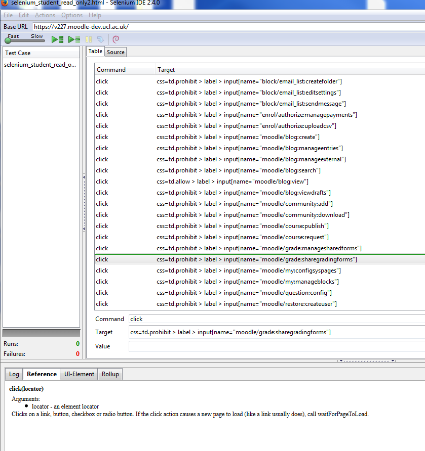

# Archive and year-end process - actions required

-   [Changes to site settings:](#Archiveandyearendprocessactionsrequired-Changestositesettings:)
    -   [Update forgotten password link:](#Archiveandyearendprocessactionsrequired-Updateforgottenpasswordlink:)

[Moodle archive roles](#Archiveandyearendprocessactionsrequired-Moodlearchiveroles)
-   [Create the new read only roles](#Archiveandyearendprocessactionsrequired-Createthenewreadonlyroles)
-   [Re-assign staff and students to the new roles](#Archiveandyearendprocessactionsrequired-Re-assignstaffandstudentstothenewroles)

[Map students and staff to the student read only and the staff read only roles](#Archiveandyearendprocessactionsrequired-Mapstudentsandstafftothestudentreadonlyandthestaffreadonlyroles)
-   [Map students to the read only student role](#Archiveandyearendprocessactionsrequired-Mapstudentstothereadonlystudentrole)
-   [Map participants (roleid 26) to the read only student role (roleid 115)](#Archiveandyearendprocessactionsrequired-Mapparticipants(roleid26)tothereadonlystudentrole(roleid115))
-   [Map tutor (role id = 3) to read only staff role (role id=117)](#Archiveandyearendprocessactionsrequired-Maptutor(roleid=3)toreadonlystaffrole(roleid=117))
-   [Map non editing tutor role to read only staff role](#Archiveandyearendprocessactionsrequired-Mapnoneditingtutorroletoreadonlystaffrole)
-   [Map course creator role (roleid=2) to read only staff role (roleid=117)](#Archiveandyearendprocessactionsrequired-Mapcoursecreatorrole(roleid=2)toreadonlystaffrole(roleid=117))
-   [Map course administrator (roleid=7) to staff read only role (roleid=117)](#Archiveandyearendprocessactionsrequired-Mapcourseadministrator(roleid=7)tostaffreadonlyrole(roleid=117))
-   [Map UCL support staff (roleid=24) to staff read only role](#Archiveandyearendprocessactionsrequired-MapUCLsupportstaff(roleid=24)tostaffreadonlyrole)
-   [Map enrolement keyholder (roleid=64) to staff read only role](#Archiveandyearendprocessactionsrequired-Mapenrolementkeyholder(roleid=64)tostaffreadonlyrole)
-   [Map non site admin to staff read only (not usually required)](#Archiveandyearendprocessactionsrequired-Mapnonsiteadmintostaffreadonly(notusuallyrequired))
-   [Other stuff](#Archiveandyearendprocessactionsrequired-Otherstuff)

[Snapshot Staff and Student read-only roles testing template](#Archiveandyearendprocessactionsrequired-SnapshotStaffandStudentread-onlyrolestestingtemplate)

 

 

 

\*\*This is worth looking at\*\*

See the [attached document](attachments/14611543/34701885.docx) for detailed instructions for creating the archive

\*\*\*\*\*\*\*\*\*\*\*\*\*\*\*\*\*\*\*\*\*\*\*\*\*\*\*

 

 

### Changes to site settings:

-   Remove guest login button - settings-&gt;siteadmin-&gt;plugins-&gt;authentication-&gt;manage auth-&gt;login button=hide
-   Create two new roles - student (read only) and tutor (read only). This is best achieved by copying a course from one archive to the other with a test account enrolled in both roles as this duplicates the roles inside the new instance. Adjust new capabilities introduced as needed.
-   Security &gt; Site policies &gt; Site policy URL = <http://moodle-archive.ucl.ac.uk/yy-yy/policy/about_the_archive.html> (update yy with 10-11, 11-12 etc)
-   Grades &gt; General Settings &gt; Graded roles - tick the box for Student (read-only) - once the role is created.
-   Edit Topic 0 of the homepage to add a notice about the archive, a news/messages section and the FAQ Glossary activity (adding questions as needed)
-   Remove the news section - how?
-   Add a Glossary to the homepage, exprt the entries from the previous archive, import the XML into this Glossary and edit any questions/answers as necessary.
-   Change cookie prefix to prevent session clashes (as more than one moodle instance on same server) : admin-&gt;server-&gt;session handling

##### **Update forgotten password link:**

-   Update 'Forgotten your username or password?' link on the home page to include the folder /yy-yy/. The file that needs to be edited is located at: /moodle/yy-yy/theme/ucl/layout/includes/ondex\_form.php - find link and include the folder ('href="/yy-yy/login/forgot\_password.php") otherwise lhe link will return a 'page cannot be found' error.

 

Set all instances of **<http://moodle.ucl.ac.uk/*>** **to \*\*\*\***<http://moodle-archive.ucl.ac.uk/yy-yy*>\* **(where yy-yy is the academic year, like 10-11) - this means all the hard set links to files and resources are replaced with the archive location and not the live**   - is this still needed?

**mdl\_course** = set all guest access to 0 and all enrolment options to 0 – this disables all enrolments, guest functionality and student course ‘browsing’ - covered elsewhere?

## Moodle archive roles

### Create the new read only roles

Create 2 new roles - Student (read only) and Staff (read only). All staff and students need to be mapped to these new roles to restrict access. 

The read-only roles are created in the normal way via the admin interface by duplicating the existing Student and Tutor roles and then modifying their permissions using a Selenium automation script that has been prepared by manually going through the permissions pages for these roles and recording these manual actions into a selenium test case via the FireFox Selenium add-in.

Steps to create role:

Note to carry out the following instructions a Moodle admin will need to use a firefox browser with selenium IDE plug-in installed.
For 13-14 Archive FF 29.01 and Selenium IDE 2.4.0 will be used.

1) Log-in as admin to newly created Moodle archive.

2) Go to Site Administration -&gt; Users -&gt; permissions -&gt; define roles

3) Duplicate student role and rename to Student (read-only)

4) Click pencil icon to edit the new role

5) Ensure the 'advanced' button is clicked so it shows 'hide advanced'

6) Ensure that the capability list is not filtered i.e that the page shows all permissions

7) Ensure the following check boxes for context are ticked: user, category, course, activity module and block

7.1) Open the Selenium IDE (found under the FF Tools menu)
7.2) Ensure that the 'Base URL' is indicating the correct URL for the version of Moodle the script will run against.

7.3) Download the Selenium Scripts (linked from step 8 below) and open the file in the Selenium IDE. Once loaded the IDE should look like the image below (with a different Base URL).

<table>
<colgroup>
<col width="50%" />
<col width="50%" />
</colgroup>
<tbody>
<tr class="odd">
<td>

</td>
<td>
 
</td>
</tr>
<tr class="even">
<td>
 
</td>
<td>
 
</td>
</tr>
</tbody>
</table>

.

8) Run the \[selenium [script selenium\_student\_read\_only2.html](../14611543/selenium_role_lockdown1)|\] attached to this page to modify the relevant student permissions: note to do this you'll need to use a firefox browser with selenium plug-in installed - open the script in the Selenium IDE and run the script ensuring that there are no errors reported.

Note that the Selenium script attached identifies the radio button elements on the page using CSS elements - the script therefore 'assumes' that these definitions haven't changed if there have been changes to the way in which page elements are defined the Selenium script may throw up errors and will need de-bugging.

**SAVE THE PAGE!**  The script does not save the page automatically - this is to allow a quick sanity check that the script operation has done what it was supposed to.

9) Follow the same procedure above to create the tutor read-only role (note the SQL script run to apply this role to tutor and admin roles is done 4 weeks after publishing of the archive to allow tutors a grace period in which they may hide materials they don't want to be visible in the archive). [The selenium script for Tutor read-only role](../14611543/selenium_staff_read_only1)

Ensure the new Student read-only role will appear in the gradebook:  Site Admin&gt;Grades&gt;general settings 

-   Untick any existing graded roles.
-   Tick student read only role

### Re-assign staff and students to the new roles

We need to identify the id's of the roles that need to be updated. This can be done by going to the users&gt;permissions&gt;define roles. Hover over the roles to see the id or executing the following sql:

mysql&gt; select id,name,shortname from mdl\_role;
---------------+----------+
| id  | name                       | shortname        |
---------------+----------+
|   1 | Manager                    | manager          |
|   2 | Course creator             | coursecreator    |
|   3 | Tutor                      | editingteacher   |
|   4 | Non-editing Tutor          | teacher          |
|   5 | Student                    | student          |
|   6 | Guest                      | guest            |
|   7 | Course Administrator       | courseadmin      |
|  24 | UCL Support Staff          | supportstaff     |
|  26 | Participant                | participant      |
|  28 | Authenticated user         | user             |
|  64 | Enrolment keyholder        | keyholder        |
|  90 | Service Desk Administrator | servicedeskadmin |
|  96 | CALT                       | calt             |
|  99 | Sub-Administrator          | subadmin         |
| 100 | Student (read-only)        | studentread-only |
| 117 | Tutor (read-only)          | tutorread-only   |
---------------+----------+

## Map students and staff to the student read only and the staff read only roles

#### *Map students to the read only student role*

update mdl\_role\_assignments set roleid=115 where roleid = 5

#### Map participants (roleid 26) to the read only student role (roleid 115)

In the mdl\_role\_assignments table, the contextid, roleid and userid are used to define a unique index. If we were to update the roleid to 97 where the role id was 26, the query would fail because it would result in duplicate fields in the unique index. Therefore we need to remove those records that would result in a duplicate being created. A temporary table is created containing a list of those records which will be removed from mdl\_role\_assignments. After removing the records from mdl\_role\_assignements, the update query is run and the temporary table is truncated ready for the next query.d

CREATE TABLE mdl\_role\_assignments\_temp (id BIGINT UNSIGNED NOT NULL DEFAULT 0);

INSERT INTO mdl\_role\_assignments\_temp
select d.id from
mdl\_role\_assignments m, mdl\_role\_assignments d
where
m.contextid=d.contextid and m.userid=d.userid
and m.roleid=115 and d.roleid in (26);

delete from mdl\_role\_assignments where id in (select id from mdl\_role\_assignments\_temp);

update mdl\_role\_assignments set roleid=115 where roleid = 26;

#### *Map tutor (role id = 3) to read only staff role (role id=117)*

update mdl\_role\_assignments set roleid=117 where roleid = 3;

delete from mdl\_role\_assignments\_temp;

#### Map non editing tutor role to read only staff role

INSERT INTO mdl\_role\_assignments\_temp
select d.id from
mdl\_role\_assignments m, mdl\_role\_assignments d
where
m.contextid=d.contextid and m.userid=d.userid
and m.roleid=117 and d.roleid = 4;

delete from mdl\_role\_assignments where id in (select id from mdl\_role\_assignments\_temp);

update mdl\_role\_assignments set roleid=117 where roleid = 4;

delete from mdl\_role\_assignments\_temp;

#### Map course creator role (roleid=2) to read only staff role (roleid=117)

INSERT INTO mdl\_role\_assignments\_temp
select d.id from
mdl\_role\_assignments m, mdl\_role\_assignments d
where
m.contextid=d.contextid and m.userid=d.userid
and m.roleid=117 and d.roleid = 2;

delete from mdl\_role\_assignments where id in (select id from mdl\_role\_assignments\_temp);

update mdl\_role\_assignments set roleid=117 where roleid = 2;

delete from mdl\_role\_assignments\_temp;

#### Map course administrator (roleid=7) to staff read only role (roleid=117)

INSERT INTO mdl\_role\_assignments\_temp
select d.id from
mdl\_role\_assignments m, mdl\_role\_assignments d
where
m.contextid=d.contextid and m.userid=d.userid
and m.roleid=117 and d.roleid = 7;

delete from mdl\_role\_assignments where id in (select id from mdl\_role\_assignments\_temp);

update mdl\_role\_assignments set roleid=117 where roleid = 7;

delete from mdl\_role\_assignments\_temp;

#### Map UCL support staff (roleid=24) to staff read only role

INSERT INTO mdl\_role\_assignments\_temp
select d.id from
mdl\_role\_assignments m, mdl\_role\_assignments d
where
m.contextid=d.contextid and m.userid=d.userid
and m.roleid=117 and d.roleid = 24;

delete from mdl\_role\_assignments where id in (select id from mdl\_role\_assignments\_temp);

update mdl\_role\_assignments set roleid=117 where roleid = 24;

delete from mdl\_role\_assignments\_temp;

#### Map enrolement keyholder (roleid=64) to staff read only role

INSERT INTO mdl\_role\_assignments\_temp
select d.id from
mdl\_role\_assignments m, mdl\_role\_assignments d
where
m.contextid=d.contextid and m.userid=d.userid
and m.roleid=117 and d.roleid = 64;

delete from mdl\_role\_assignments where id in (select id from mdl\_role\_assignments\_temp);

update mdl\_role\_assignments set roleid=117 where roleid = 64;

delete from mdl\_role\_assignments\_temp;

#### Map non site admin to staff read only (not usually required)

INSERT INTO mdl\_role\_assignments\_temp
select d.id from
mdl\_role\_assignments m, mdl\_role\_assignments d
where
m.contextid=d.contextid and m.userid=d.userid
and m.roleid=117 and d.roleid = 1 and d.contextid&lt;&gt;1;

delete from mdl\_role\_assignments where id in (select id from mdl\_role\_assignments\_temp);

update mdl\_role\_assignments set roleid=117 where roleid = 1 and contextid&lt;&gt;1;

#### Other stuff

 

update mdl\_enrol set status=0;

 

Preventing new users being assigned to the student role instead of the readonly role

If a user has never logged in to the moodle snapshot, they will be assigned the role of student. It was discovered that a number of users who were assigned the role of student were enrolling themselves on courses. This is prevented in the student readonly role.

To check who has been assigned the student role:

select userid, contextid, from\_unixtime(ra.timemodified),modifierid,firstname,lastname from mdl\_role\_assignments as ra left join mdl\_user as u on [u.id](http://u.id)=userid where roleid=5;

There are a number of ways to address this issue:

-   Ensure that the default role is set to student readonly

This is the preferred option but requires that the archetype for the student readonly role is set to none, otherwise it will not show up in the drop down list for 'Default role for all users' in *Settings &gt; Site administration &gt; Users &gt; Permissions &gt; User policies*

*NB. This **was** the preferred option but it prevented users from seeing content on their course so I reverted the student readonly role archetype back to student, set the default role to authenticated user*

-   Prevent enrolment on all courses

This can be achieved by running the following sql query:

update mdl\_enrol set status=0;

-   Update the student role to prevent self enrolment

We'd rather not change an existing role and there may be other permissions in the student role that we don't want to allow.

-   Disable self enrollment

Self enrollment has been disable to prevent students from self enrolling

 

 

In 14-15 archive I have changed the default role to the student readonly role.

## Snapshot Staff and Student read-only roles testing template

[Template for Snapshot Student and Staff Read-only roles tests YY/YY](../ISMoodle/Template_for_Snapshot_Student_and_Staff_Read-only_roles_tests_YY_YY)

 

 

## Attachments:

 [demo.JPG](attachments/14611543/14714625.jpg) (image/jpeg)
 [Moodle 2.4 upgrade plan v4.docx](attachments/14611543/34701771.docx) (application/vnd.openxmlformats-officedocument.wordprocessingml.document)
 [Moodle 2.4 upgrade plan v5.docx](attachments/14611543/34701772.docx) (application/vnd.openxmlformats-officedocument.wordprocessingml.document)
 [selenium\_staff\_read\_only2.html](../14611543/selenium_staff_read_only1) (text/html)
 [Moodle 2.4 upgrade plan v5-3.docx](attachments/14611543/34701885.docx) (application/vnd.openxmlformats-officedocument.wordprocessingml.document)
 [selenium\_student\_read\_only2.html](../14611543/selenium_role_lockdown1) (text/html)
 [SeleniumIDE.png](attachments/14611543/42205307.png) (image/png)

