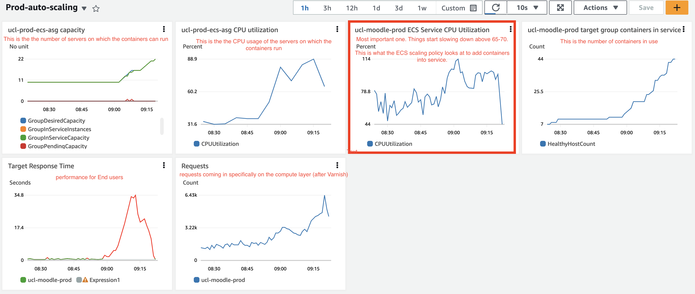

# Auto-Scaling monitoring

<https://ucl-cloud.awsapps.com/start#/>

Monitoring Dashboard - <https://eu-west-2.console.aws.amazon.com/cloudwatch/home?region=eu-west-2#dashboards:name=Prod-auto-scaling>

ECS scaling

<https://eu-west-2.console.aws.amazon.com/ecs/v2/clusters/ucl-prod/services/ucl-moodle-prod/deployments?region=eu-west-2>

<https://eu-west-2.console.aws.amazon.com/ecs/v2/clusters/ucl-prod/services/ucl-moodle-prod/health?region=eu-west-2>

ASG Scaling

<https://eu-west-2.console.aws.amazon.com/ec2/home?region=eu-west-2#AutoScalingGroupDetails:id=ucl-prod-ecs-asg;view=monitoring>

<https://eu-west-2.console.aws.amazon.com/ec2/home?region=eu-west-2#AutoScalingGroupDetails:id=ucl-prod-ecs-asg;view=activity>

## Attachments:

 [Screenshot 2023-03-10 at 09.24.27.png](attachments/250418935/250418934.png) (image/png)

