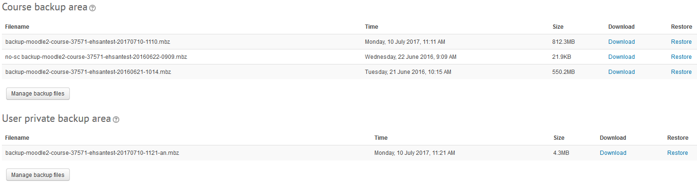
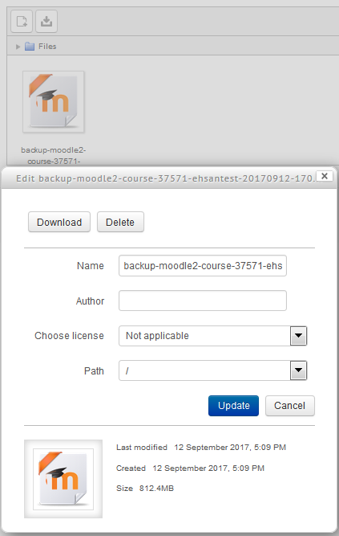
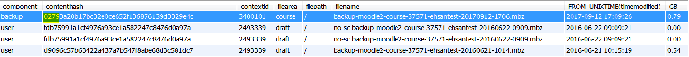
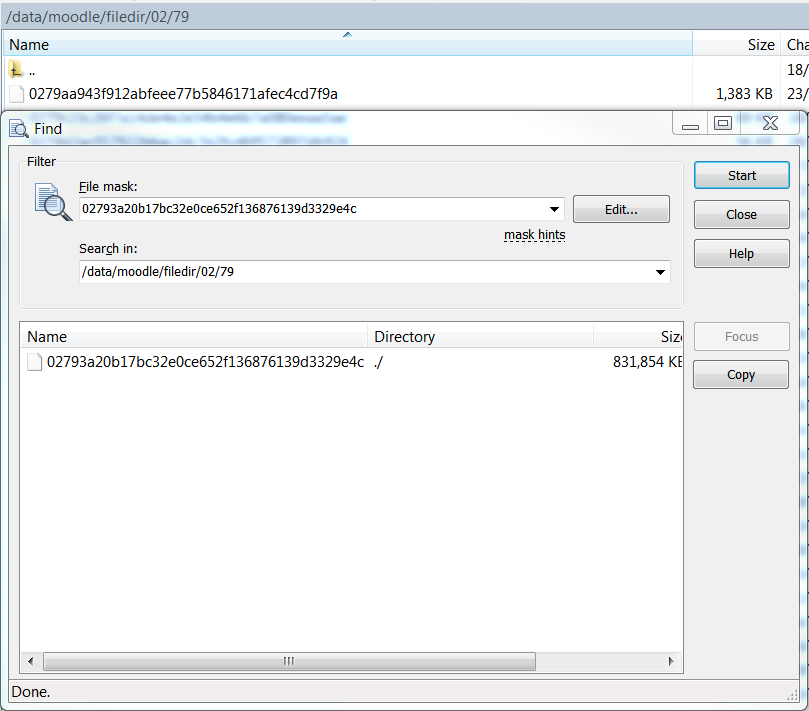
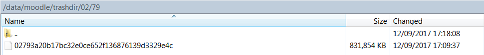

# Automated Course Backup Deletion

### Issue:

Alot of course backups that are made by the users but are not being managed resulting in backups getting old and filling up storage on the server

### Solution:

To automate the deletion of course backups

### Deletion Process .mbz (Front End Moodle):

1. Go to course administration &gt; restore

2. You'll see a list of backups



3. Click manage backup files &gt; click on a course back up &gt; delete &gt; save.  The backup has now been deleted



### Deletion Process .mbz (Back End): 

1. All backups are stored in the mdl\_files table; run the following query to see the list of backups or to specify a specific filename

**Backups** Expand source

``` sql
SELECT 
contenthash,
contextid,
filearea,
filepath,
filename,
FROM_UNIXTIME(timemodified),
round(((filesize)/1024/1024/1024),2) "GB" 
FROM mdl_files as f
#WHERE f.filename like "%-course-%.mbz"
WHERE f.filename = 'backup-moodle2-course-37571-ehsantest-20160621-1014.mbz'
ORDER BY timemodified desc
LIMIT 10
```

2. Note that the mdl\_files table are just a reference and not the actual backup file; the actual file is located in the moodle data filedir location in a hash format  The filedir location in the first 4 characters of the contenthash



3. navigate to [moodlevm-nfs.ucl.ac.uk](http://moodlevm-nfs.ucl.ac.uk) /data/moodle/filedir/d9/09 and you'll see the same contenthash which is the actual backup.



4. When a backup file is deleted from Moodle, the backup contenthash is moved from filedir to trashdir



5. The trashed files (not present in files table) are deleted after 24 hours by the cron

## Attachments:

 [image2017-9-12\_10-22-24.png](attachments/72057663/75236037.png) (image/png)
 [image2017-9-12\_10-23-32.png](attachments/72057663/75236038.png) (image/png)
 [image2017-9-12\_10-24-37.png](attachments/72057663/75236042.png) (image/png)
 [image2017-9-12\_10-40-26.png](attachments/72057663/75236079.png) (image/png)
 [image2017-9-12\_10-41-10.png](attachments/72057663/75236081.png) (image/png)
 [image2017-9-12\_12-28-12.png](attachments/72057663/75236214.png) (image/png)
 [image2017-9-12\_12-33-5.png](attachments/72057663/75236215.png) (image/png)
 [image2017-9-12\_15-13-27.png](attachments/72057663/75236370.png) (image/png)
 [image2017-9-12\_15-15-5.png](attachments/72057663/75236371.png) (image/png)
 [image2017-9-12\_15-17-16.png](attachments/72057663/75236375.png) (image/png)
 [image2017-9-12\_15-39-18.png](attachments/72057663/75236389.png) (image/png)
 [image2017-9-12\_15-44-8.png](attachments/72057663/75236396.png) (image/png)
 [image2017-9-12\_17-13-40.png](attachments/72057663/75236472.png) (image/png)
 [image2017-9-12\_17-15-43.png](attachments/72057663/75236473.png) (image/png)
 [image2017-9-12\_17-17-7.png](attachments/72057663/75236474.png) (image/png)
 [image2017-9-12\_17-19-11.png](attachments/72057663/75236475.png) (image/png)

