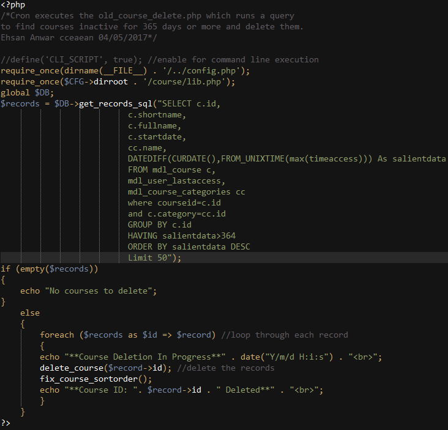
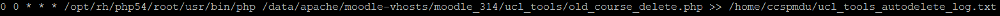
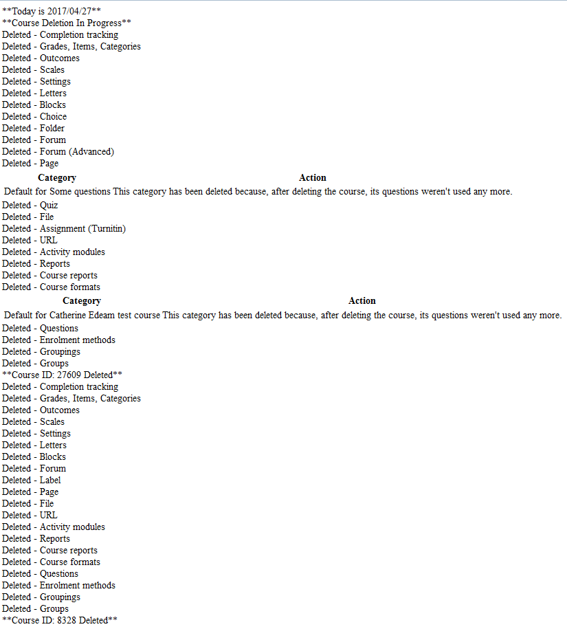
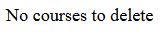
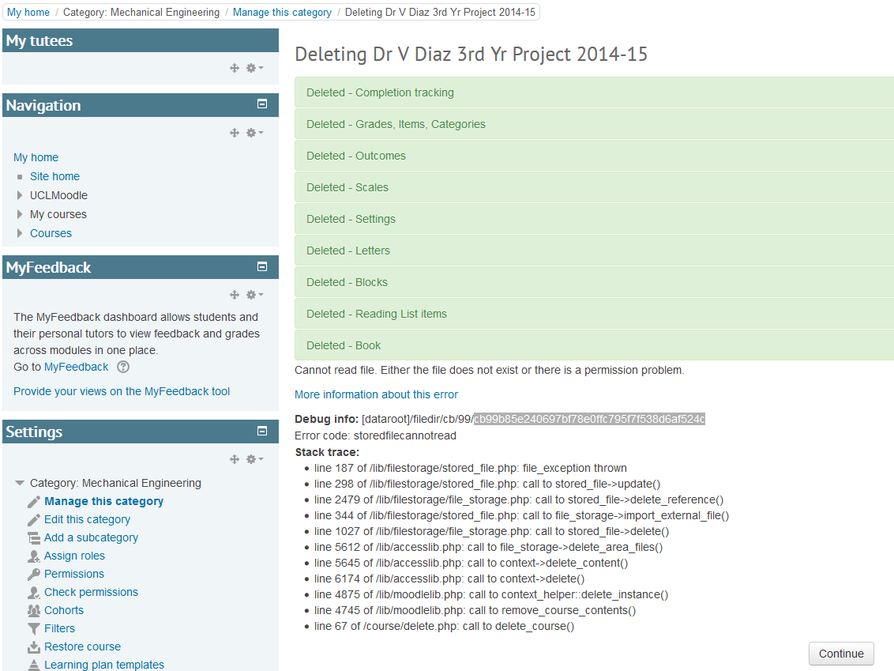
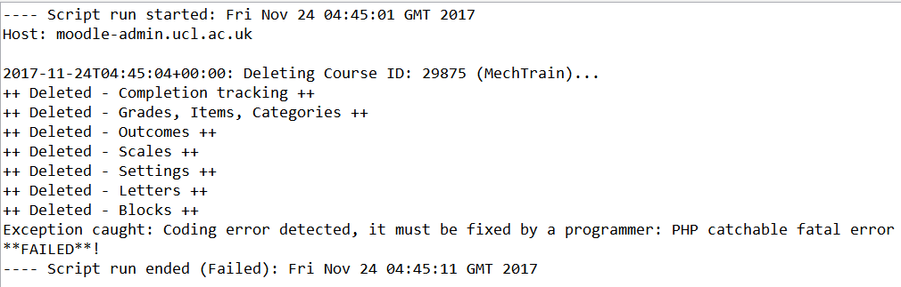

# Automated deletion of courses inactive for 365 days or more

### Overview:

Cron executes the old\_course\_delete.php which runs a query to find courses inactive for 365 days or more and deletes them.

### Library & API:

<https://docs.moodle.org/dev/lib/moodlelib.php>

<https://docs.moodle.org/dev/lib.php>

### Code:

/data/apache/moodle-vhosts/v312-1004/ucl\_tools



### \*\*Cron\*\*



/home/ccspmdd/ucl\_tools\_autodelete\_log.txt

### \*\*Manually deletion through webpage\*\*

<https://v312.moodle-dev.ucl.ac.uk/ucl_tools/old_course_delete.php>



### \*\*Output message when no courses to delete\*\*



### \*\*Errors\*\*

This would cause the autodelete to get stuck as unable to delete the course.  Workaround around would be to visit the course so it is no longer appears in the sql query and the autodelete would continue as normal.  This error seems to be specific to the course on the dev/uat environment as the course has been deleted on live Moodle fine.



# \*\*Moodle Production Updated\*\*

### Final Code

<https://git.dcs.ucl.ac.uk/lta/moodle/blob/ucl_stable/ucl_tools/ucl-mdl-delete_old_courses.php>

**ucl-mdl-delete\_old\_course.php** Expand source

``` php
<?php
/**
 * Executed by nightly cron.
 * Runs a query to find courses inactive for 400 days or more, and then deletes them.
 *
 * Ehsan Anwar cceaean 04/05/2017
 **/

define('CLI_SCRIPT', true);  // Enable for command line execution.
require_once(dirname(__FILE__) . '/../config.php');
require_once($CFG->dirroot . '/course/lib.php');

global $DB;


$sql = <<<SQL
SELECT
    c.id
  , c.shortname
  , c.fullname
  , c.startdate
  , cc.name
  , DATEDIFF(CURDATE(), FROM_UNIXTIME(MAX(timeaccess))) AS salientdata
FROM mdl_course c
   , mdl_user_lastaccess
   , mdl_course_categories cc
WHERE courseid = c.id
AND c.category = cc.id
GROUP BY c.id
HAVING salientdata > 400
ORDER BY salientdata DESC
LIMIT 50
SQL;


try {
    $records = $DB->get_records_sql($sql);

    if (empty($records)) {
        echo "No courses to delete!\n";
    } else {
        foreach ($records as $id => $record) {
            echo "\n" . date('c') . ": Deleting Course ID: " . $record->id . ' ('. $record->fullname . ")...\n";
            delete_course($record->id);
            echo date('c') . ": Course ID: " . $record->id . "...  Done!\n";
            fix_course_sortorder();
        }
    }
} catch (Exception $e) {
    echo 'Exception caught: ' . $e->getMessage() . "\n";
    exit(1);
}

exit(0);
```

### Logs

moodle-admin.ucl.ac.uk / /var/log/moodlecron

### Troubleshooting

If course are not auto deleting, check the logs and you'll see the following error.



For an unknown reason isn't being automatically deleted so it will need to be done manually.  This can be done as follow

1.  Go to <https://moodle.ucl.ac.uk/ucl_tools/courses.php?opt=inactive>
2.  Search for the course ID from the logs
3.  under the Zap column, click on the delete button
4.  This will take you to the course to delete manually.

## Attachments:

 [image2017-4-27 13:36:48.png](attachments/66756828/66756823.png) (image/png)
 [image2017-4-27 13:37:18.png](attachments/66756828/66756824.png) (image/png)
 [image2017-4-27 13:38:59.png](attachments/66756828/66756825.png) (image/png)
 [image2017-4-27 13:40:39.png](attachments/66756828/66756827.png) (image/png)
 [image2017-4-27 13:44:32.png](attachments/66756828/66756830.png) (image/png)
 [image2017-4-27 13:57:32.png](attachments/66756828/66756838.png) (image/png)
 [image2017-5-4 11:8:19.png](attachments/66756828/66758025.png) (image/png)
 [image2017-5-4 14:30:23.png](attachments/66756828/66758144.png) (image/png)
 [image2017-5-5 10:40:24.png](attachments/66756828/66758357.png) (image/png)
 [image2017-5-5 10:41:17.png](attachments/66756828/66758360.png) (image/png)
 [image2017-5-5 10:42:14.png](attachments/66756828/66758361.png) (image/png)
 [image2017-5-5 10:44:16.png](attachments/66756828/66758362.png) (image/png)
 [image2017-5-5 10:55:3.png](attachments/66756828/66758370.png) (image/png)
 [image2017-11-24\_15-6-48.png](attachments/66756828/79505541.png) (image/png)

