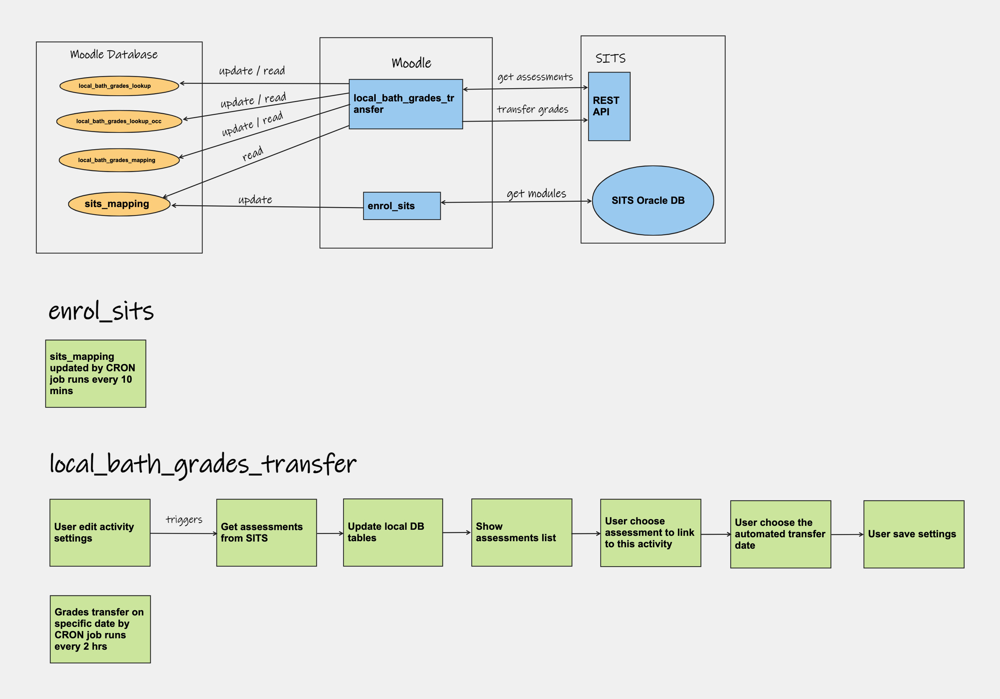

# Bath Grades Transfer Plugin

This is the grades transfer UI attached to the activity's settings page.

This is a high level diagram showing how the grades transfer plugin from University of Bath transfers grades from Moodle to SITS.

There are some keys Moodle database tables used:

sits\_mapping - module to course mapping

local\_bath\_grades\_lookup - assessments from SITS

local\_bath\_grades\_lookup\_occ - module occurrence to assessments mapping

local\_bath\_grades\_mapping - course module to SITS assessment mapping

## Attachments:

 [Bath Grades Transfer.png](attachments/233638215/233638238.png) (image/png)
 [activity settings.png](attachments/233638215/233638244.png) (image/png)

