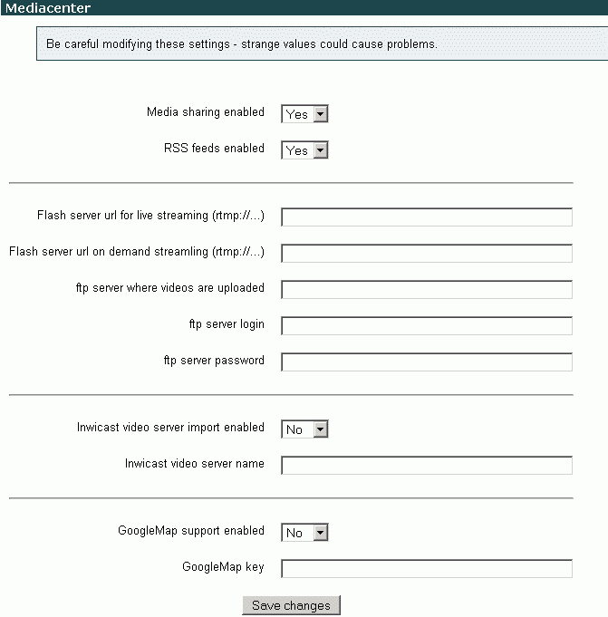

# Block - INWICAST Mediacenter

# Comments on use

This plugin seems to be a way of organising links media in a moodle course. It does not actually play media.

It can cope with the media linking code better such as:

``` java
<script language="JavaScript" src="http://www.ucl.ac.uk/mediares/js/mediaplayer.js" type="text/javascript"> </script>
<script type="text/javascript">
<!-- Hide from old browsers
embedMediaPlayer(idJW_FLASHVIDEO, '',
'config=http://www.ucl.ac.uk/mediaplayer/jw_flvplayer/config/config_edupsych_train1.xml', 320, 400);
// End hide -->
</script>
```

When you add the code above as a Moodle resource it works, but if you go to edit that resource the code is corrupted. If you add it, then edit through the mediacenter this seems to keep the code as it should be.

## We need to check:

-   We need to check where it stores the files, we want media files to be stored on the media server (flash server) not the moodle server.

<!-- -->

-   Flash (.flv) files do play through moodle. We need to check that .m4v files play. 

# How to install the plugin

-   Download from <http://moodle.org/mod/data/view.php?d=13&rid=1038>

<!-- -->

-   unzip the files to **/data/apache/htdocs/moodle/blocks** so that a new **inwicast** folder is created

<!-- -->

-   move the **/data/apache/htdocs/moodle/blocks/inwicast/lang** files to **/data/apache/htdocs/moodle/lang/**
    (there is a **block\_inwicast.php** file and a **help/block\_inwicast** folder to be moved)

<!-- -->

-   ensure all the files have the correct permissions

<!-- -->

-   Go to the Notifications page, 1 new row is added to the existing **mdl\_blocks** table and 3 new tables are created:
    -   **mdl\_inwi\_cours\_medias**
    -   **mdl\_inwi\_map\_medias**
    -   **mdl\_inwi\_medias**

<!-- -->

-   The following values need to be completed at **Administration** &gt; **Modules** &gt; **Blocks** &gt; **Mediacenter**
    

## Attachments:

 [mediacenter options.gif](attachments/3670174/3932161.gif) (image/gif)

