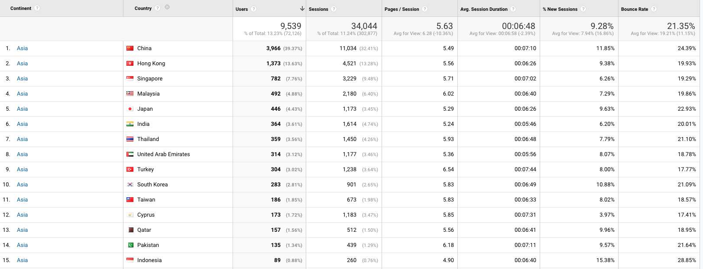
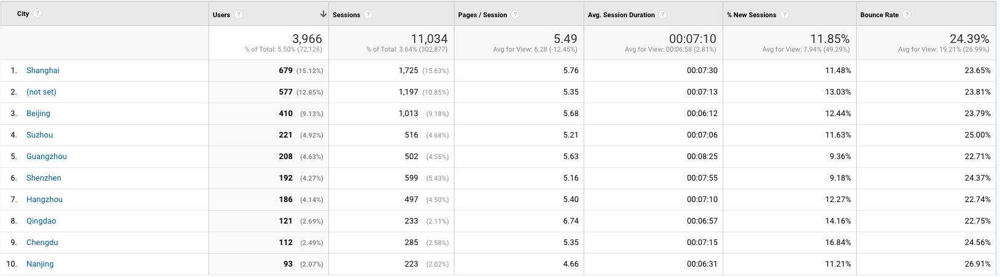

# Breakdown of usage in Asia / China

Google Analytics stats for the 19th - 25th March.

Breakdown by continent

Breakdown by Countries within Asia

Breakdown for Cities within China

Global Breakdown by Country

## Attachments:

 [Screenshot 2020-03-26 at 01.10.09.png](attachments/131386933/131386930.png) (image/png)
 [Screenshot 2020-03-26 at 01.10.27.png](attachments/131386933/131386931.png) (image/png)
 [Screenshot 2020-03-26 at 01.10.54.png](attachments/131386933/131386932.png) (image/png)
 [Screenshot 2020-03-26 at 01.25.16.png](attachments/131386933/131386938.png) (image/png)

