# CI028 - Moodle Issues - Jmeter Results

## **Scripts Details**

**GradeRptVM05 -** students going through their courses and viewing their grades for their activities (quiz,assignment) ****

**SpiderVM03 -** students viewing their courses and performing searches for other courses**
**

## **Results - NFS4
**

LOAD TEST 1

Environment changes\*\*

-   None, same as moodle.ucl.ac.uk

Test Scenario\*\*

-   GradeRptVM05 - 300 threads x 3 looping

-   SpiderVM03 - 300 threads x 3 looping

# GradeRptVM05\_2019-07-24\_09\_13\_55

#    SpiderVM03\_2019-07-24\_09\_13\_29

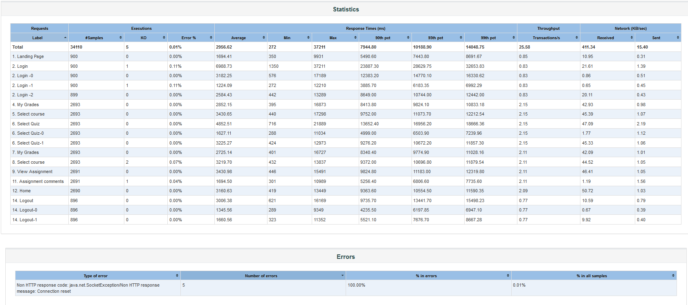

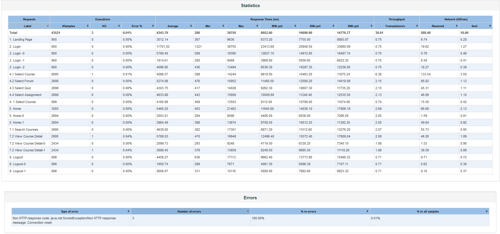

LOAD  TEST 2

Environment changes

-   echo 0 &gt; /proc/sys/fs/leases-enable sysctl -w fs.leases-enable=0
-   restart of app + nfs servers

Test Scenario\*\*

-   GradeRptVM05 - 300 threads x 3 looping

-   SpiderVM03 - 300 threads x 3 looping

# GradeRptVM05\_2019-07-30\_16\_03\_41

# SpiderVM03\_2019-07-30\_16\_03\_24

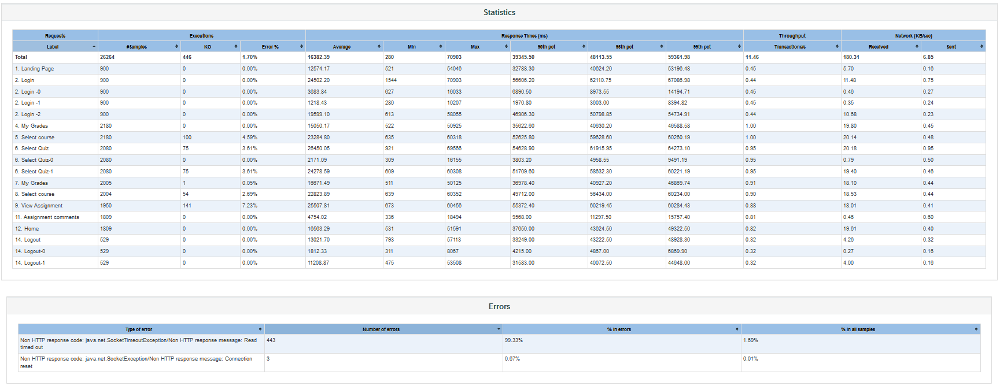

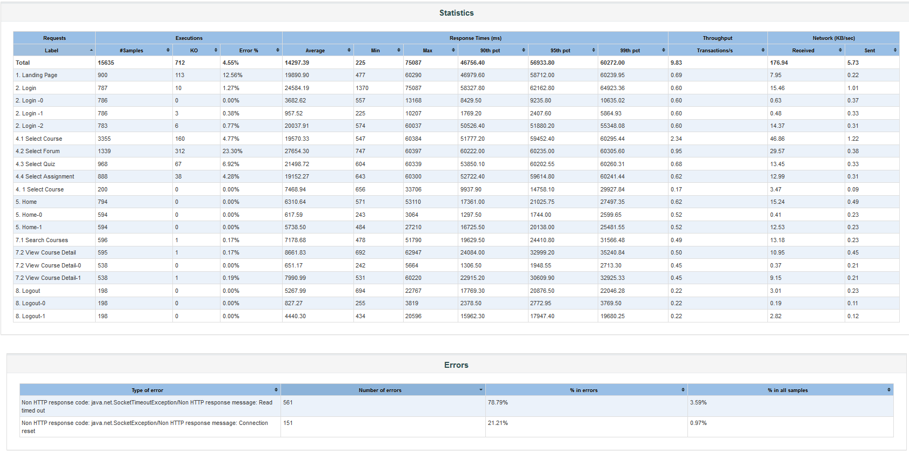

LOAD  TEST 3

Environment changes

-   cat /etc/sysconfig/nfs | grep -i RPCNFSDCOUNT \# comment this out or set it to 64 in puppet

Test Scenario\*\*

-   GradeRptVM05 - 300 threads x 3 looping

-   SpiderVM03 - 300 threads x 3 looping

# GradeRptVM05\_2019-07-31\_09\_42\_50

# SpiderVM03\_2019-07-31\_09\_42\_16

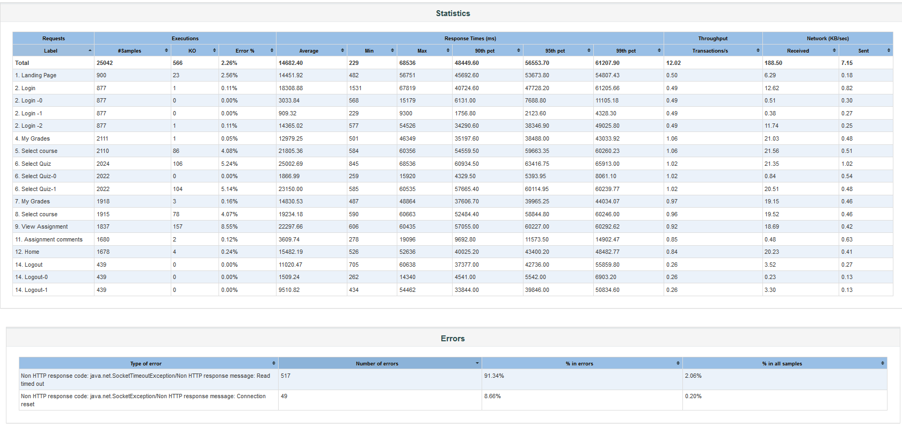

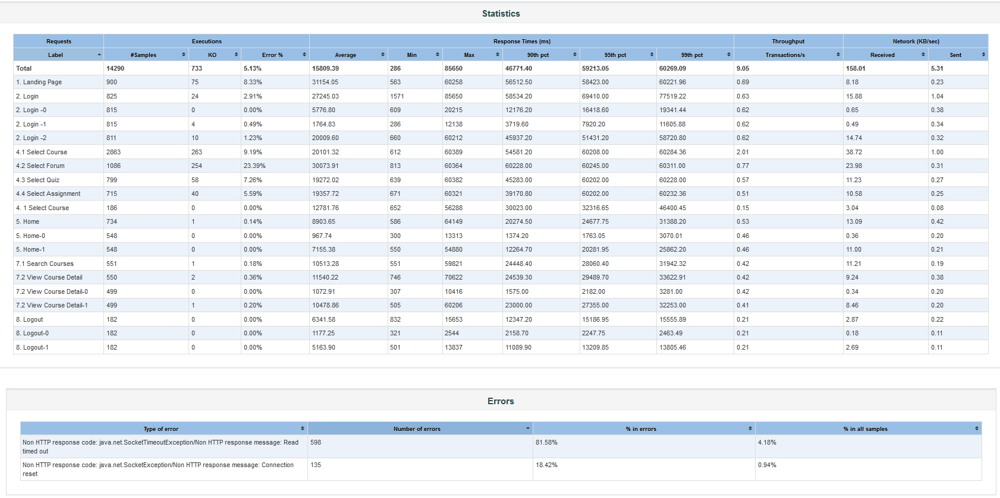

LOAD  TEST 4

Environment changes

-   Set rzise and wsize same as old setup for app pp servers \# Already added to puppet

-   Set local account for apache
    \[root@mdl-nfs01p ~\]\# /usr/sbin/groupadd -g 48 apache
    \[root@mdl-nfs01p ~\]\# /usr/sbin/useradd -s /sbin/nologin -g 48 -u 48 -M -d /usr/share/httpd apache
    \[root@mdl-nfs01p ~\]\# /usr/bin/passwd -l apache
    Locking password for user apache.
    passwd: Success

Test Scenario\*\*

-   GradeRptVM05 - 300 threads x 3 looping

-   SpiderVM03 - 300 threads x 3 looping

# GradeRptVM05\_2019-07-31\_12\_22\_37

# SpiderVM03\_2019-07-31\_12\_22\_21

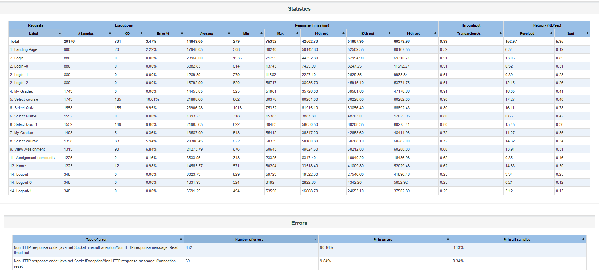

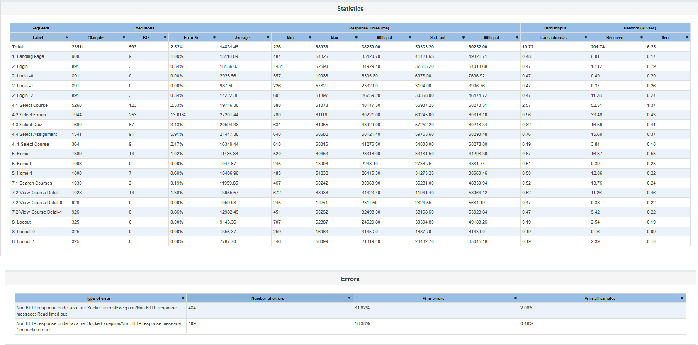

LOAD TEST 5

Environment changes

-   Turn off selinux on app and nfs pp servers

Test Scenario\*\*

-   GradeRptVM05 - 300 threads x 3 looping

-   SpiderVM03 - 300 threads x 3 looping

# GradeRptVM05\_2019-07-31\_13\_04\_59

# SpiderVM03\_2019-07-31\_13\_04\_49

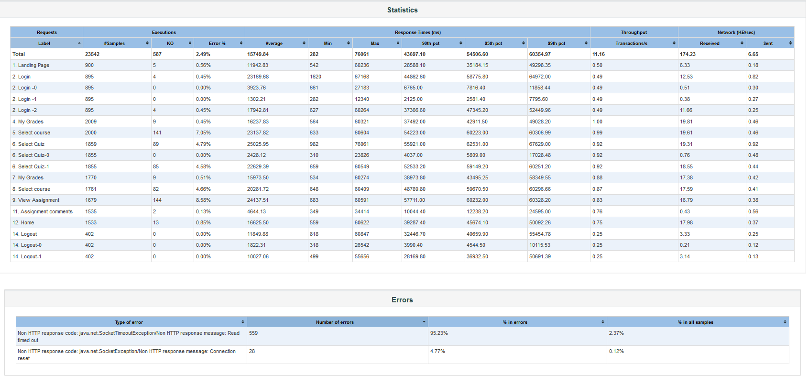

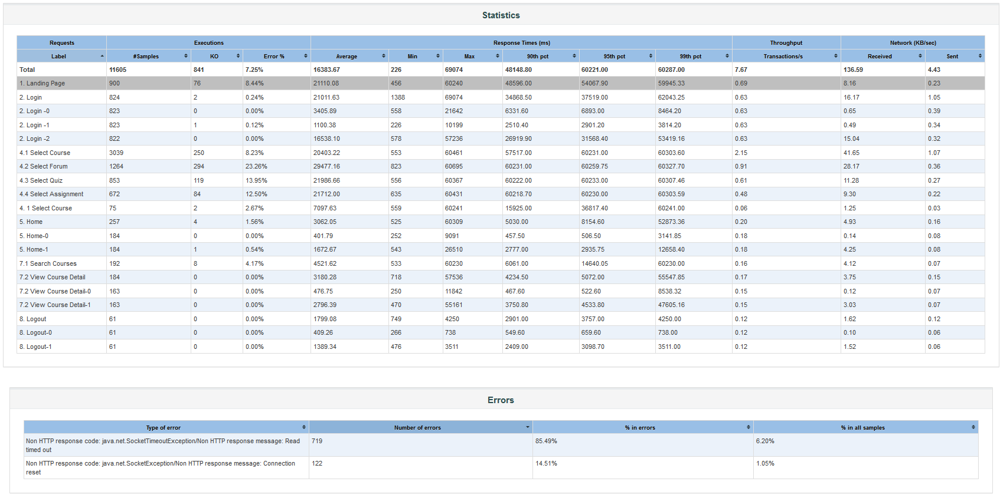

## **Results - NFS3**

<table>
<thead>
<tr class="header">
<th>
LOAD TEST 6 

Environment changes

<ul>
<li>moodle-pp.ucl.ac.uk is now using nfs3</li>
<li>restart of the servers</li>
</ul>

Test Scenario**

<ul>
<li>
GradeRptVM05 - 600 threads x 3 looping
</li>
<li>
SpiderVM03 - 600 threads x 3 looping
</li>
</ul></th>
<th> 
</th>
</tr>
</thead>
<tbody>
<tr class="odd">
<td><h1 id="CI028MoodleIssuesJmeterResults-GradeRptVM05_2019-07-31_16_03_12">GradeRptVM05_2019-07-31_16_03_12</h1></td>
<td><h1 id="CI028MoodleIssuesJmeterResults-SpiderVM03_2019-07-31_16_01_48">SpiderVM03_2019-07-31_16_01_48</h1></td>
</tr>
<tr class="even">
<td>

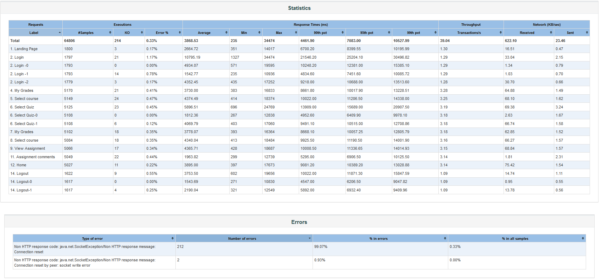

</td>
<td>

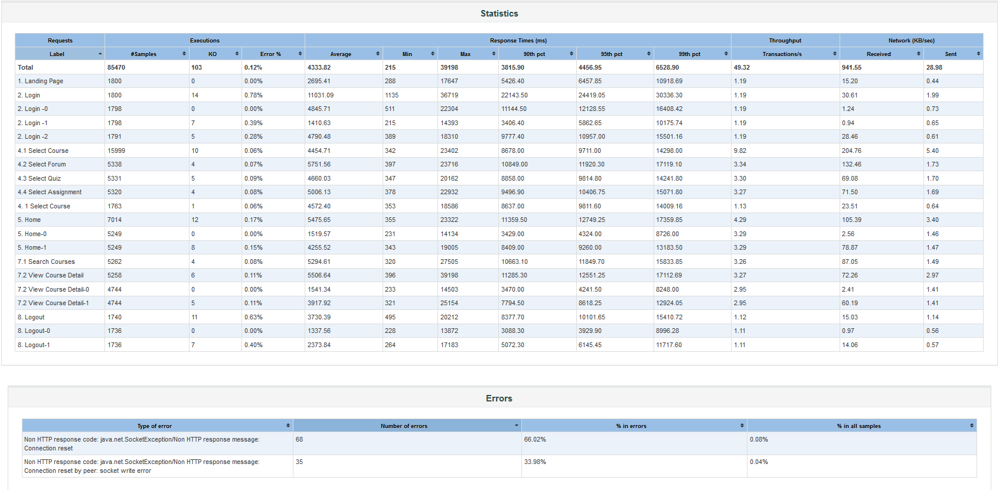

</td>
</tr>
<tr class="odd">
<td>
LOAD TEST 7 

Environment changes

<ul>
<li>None</li>
</ul>

Test Scenario**

<ul>
<li>
GradeRptVM05 - 1000 threads x 3 looping
</li>
<li>
SpiderVM03 - 1000 threads x 3 looping
</li>
</ul></td>
<td> 
</td>
</tr>
<tr class="even">
<td><h1 id="CI028MoodleIssuesJmeterResults-&quot;GradeRptVM05_2019-07-31_17_14_08.csv&quot;">&quot;GradeRptVM05_2019-07-31_17_14_08.csv&quot;</h1></td>
<td><h1 id="CI028MoodleIssuesJmeterResults-SpiderVM03_2019-07-31_17_13_30">SpiderVM03_2019-07-31_17_13_30</h1></td>
</tr>
<tr class="odd">
<td>

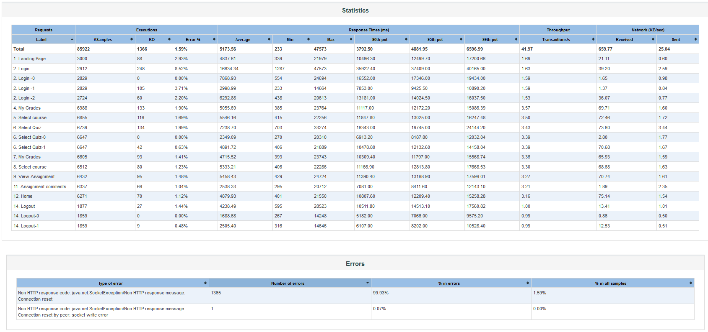

</td>
<td>

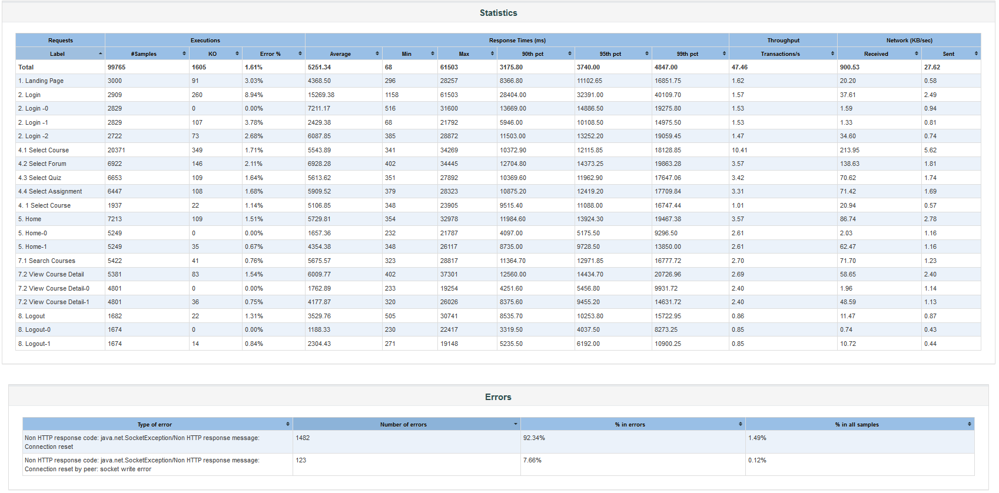

</td>
</tr>
</tbody>
</table>

**
**

**
**

**
**

## Attachments:

 [image2019-7-31\_12-6-28.png](attachments/120787551/120787493.png) (image/png)
 [image2019-7-31\_12-16-45.png](attachments/120787551/120787503.png) (image/png)
 [image2019-7-31\_12-17-58.png](attachments/120787551/120787504.png) (image/png)
 [image2019-7-31\_12-18-51.png](attachments/120787551/120787505.png) (image/png)
 [image2019-7-31\_12-35-10.png](attachments/120787551/120787524.png) (image/png)
 [image2019-7-31\_12-36-19.png](attachments/120787551/120787525.png) (image/png)
 [GradeRptVM05\_2019-07-24\_09\_13\_55.JPG](attachments/120787551/120787536.jpg) (image/jpeg)
 [image2019-7-31\_12-56-33.png](attachments/120787551/120787548.png) (image/png)
 [image2019-7-31\_12-58-38.png](attachments/120787551/120787549.png) (image/png)
 [image2019-7-31\_13-10-56.png](attachments/120787551/120787562.png) (image/png)
 [image2019-7-31\_13-11-51.png](attachments/120787551/120787564.png) (image/png)
 [image2019-7-31\_13-16-35.png](attachments/120787551/120787572.png) (image/png)
 [image2019-7-31\_13-18-35.png](attachments/120787551/120787574.png) (image/png)
 [image2019-7-31\_13-38-45.png](attachments/120787551/120787595.png) (image/png)
 [image2019-7-31\_13-41-42.png](attachments/120787551/120787603.png) (image/png)
 [image2019-7-31\_17-3-40.png](attachments/120787551/120787724.png) (image/png)
 [image2019-7-31\_17-11-24.png](attachments/120787551/120787725.png) (image/png)
 [image2019-7-31\_18-1-4.png](attachments/120787551/120787729.png) (image/png)
 [image2019-7-31\_18-2-27.png](attachments/120787551/120787730.png) (image/png)

