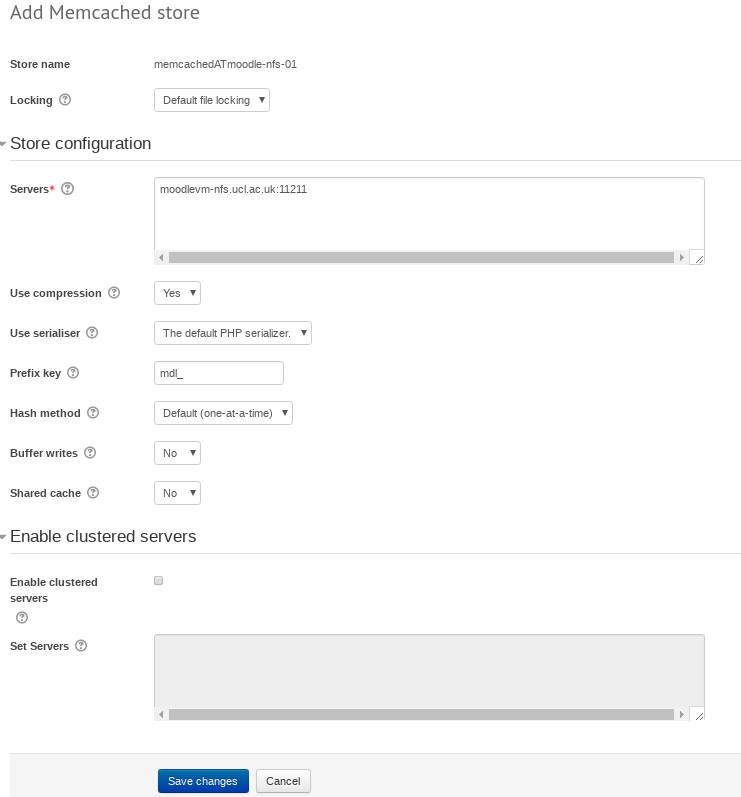

# Cache configuration in Moodle

-   [Session cache configuration](#CacheconfigurationinMoodle-Sessioncacheconfiguration)
-   [Application cache](#CacheconfigurationinMoodle-Applicationcache)
    -   [To add a Memcache store](#CacheconfigurationinMoodle-ToaddaMemcachestore)
    -   [To edit a store](#CacheconfigurationinMoodle-Toeditastore)
-   [Add a Redis cache store](#CacheconfigurationinMoodle-AddaRediscachestore)

Reference:  M[oodle documentation](https://docs.moodle.org/34/en/Caching).

Since Moodle 2.4, Moodle has provided a caching plugin framework to give administrators the ability to control where Moodle stores cached data.

The default configuration works however UCL has some customisation.

To edit, go to the configuration page is: https://moodle.ucl.ac.uk/cache/admin.php

In Moodle 3.1.5 the following cache store are availabe:

File cache
Memcache
Memcached
MongoDB

On Moodle 3.4, the Redis cache store is also available (without needing a plugin).

At the time of writing our Moodle configuration is as on the attached pdf document: [moodle\_cache\_administration.pdf](attachments/87925985/90179939.pdf)

(see: <https://moodle.ucl.ac.uk/cache/admin.php>)

## Session cache configuration

Configuration of a 'backend database' (memcache, redis, RDBMS, etc.) as session cache, one needs to edit the main Moodle configuration file.

That mean **ssh** into the App servers and edit the relevant file.

There is a waning about using Memcache as session cache

// Please be aware that when selecting either Memcached or Memcache for sessions that it is advised to use a dedicated
// memcache server. The memcache and memcached extensions do not provide isolated environments for individual uses.
// Using the same server for other purposes (MUC for example) can lead to sessions being prematurely removed should
// the other uses of the server purge the cache.                                                                                                                                           

## Application cache

### To add a Memcache store

click the link 'Add Instance' next to Memcached. You'll see the following screen

Fill the 2 mandatory fields by providing a 'store name' and details of your server.

Click the 'save changes' button.

### To edit a store

Click the 'edit store' link next to the appropriate store.

Edit the store details, click 'save' to save you changes.

## Add a Redis cache store

Available on our Moodle 3.4

Click the 'add instance' link next to  Redis

Enter the details of the server then click 'save changes'.

Changes will be reflected on the cache administration page.

Map your cache store as desired.

## Attachments:

 [moodle\_cache\_administration.pdf](attachments/87925985/90179939.pdf) (application/pdf)
 [moodle\_cache\_administration.jpg](attachments/87925985/90179953.jpg) (image/jpeg)
 [add\_memcached.jpg](attachments/87925985/90179955.jpg) (image/jpeg)
 [edit\_memcached.jpg](attachments/87925985/90179964.jpg) (image/jpeg)
 [new\_cache\_admin.png](attachments/87925985/91029623.png) (image/png)
 [add\_redis\_store.png](attachments/87925985/91029624.png) (image/png)
 [new\_cache\_store\_instances.png](attachments/87925985/91029625.png) (image/png)
 [config\_php.png](attachments/87925985/91029626.png) (image/png)

