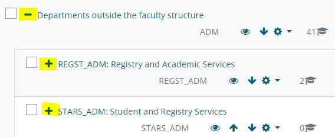

# Category level permissions/access

|                 |                                                                                  |
|-----------------|----------------------------------------------------------------------------------|
| Epic            | CTP-410 - Moodle (CLC) Course Life Cycle and End of Academic Year Processes Done |
| Document status | DRAFT                                                                            |
| Document owner  | Silvia Giannitrapani                                                             |
| Developers      | Unknown User (cceabab)                                                           |
| QA              |                                                                                  |

## Goals

-   To allow Moodle users enrolled at category level to have access to the equivalent/same Moodle courses for the following academic year.
-   To grant Moodle users enrolled at category level the same role and permissions as the previous academic year.
-   To reduce site administrators’ administrative burden. 

## Background

Because of the way Moodle works, permissions are assigned to users via roles.

A role is a collection of permissions defined for the whole system that you can assign to specific users in specific contexts.

The combination of roles and context define a specific user's ability to do something on any page.

The most common examples are the roles of student and tutor in the context of a course, so the same user in Moodle can have student permissions in a course and tutor permissions in another course.

However, staff users often need access to all courses in a faculty or department.

To avoid manually enrolling them into each course, these users are manually enrolled at category level using a role that grants them the same permissions for all courses in that category.

Currently, a large number of staff is enrolled at category level (Faculty, Department, School) in a variety of roles (such as category administrator, category observer, disability assistant) by site administrators only.

We have 1060 users enrolled at category level across 137 Moodle categories.

Having multiple years in the same Moodle site, each year we need to grant them access with the same role/permissions to the new year category.  

To note: Moodle category roles have been created, are assigned, and exist only in Moodle, they do not have any equivalent/corresponding role in SITS or any other system:

-   [Service Desk](https://moodle.ucl.ac.uk/admin/roles/define.php?action=view&roleid=22) 
-   [Category Administrator](https://moodle.ucl.ac.uk/admin/roles/define.php?action=view&roleid=43) 
-   [Course Administrator (No E-Mail)](https://moodle.ucl.ac.uk/admin/roles/define.php?action=view&roleid=19) 
-   [Non-editing Tutor (No E-Mail)](https://moodle.ucl.ac.uk/admin/roles/define.php?action=view&roleid=20) 
-   [Category Observer](https://moodle.ucl.ac.uk/admin/roles/define.php?action=view&roleid=44) 
-   [MyFeedback Departmental Administrator](https://moodle.ucl.ac.uk/admin/roles/define.php?action=view&roleid=15) 
-   [Accessibility Assistant](https://moodle.ucl.ac.uk/admin/roles/define.php?action=view&roleid=31) 
-   [Faculty Learning Technologist](https://moodle.ucl.ac.uk/admin/roles/define.php?action=view&roleid=39) 
-   [SSW Support Staff](https://moodle.ucl.ac.uk/admin/roles/define.php?action=view&roleid=40) 

## Assumptions

-   A new yearly ‘branch/top level category’ is created once a year in Moodle by site administrators (such as 2020/21, 2021/22, 2022/23)  
-   The yearly top level category includes all the sub-categories based on the SITS structure
-   Users exist in Moodle and have been enrolled in a category with a role 

## Requirements

| \#  | Title                                      | User Story                                                                                                                                                                                                                                                                     | Importance   | Notes                                                    |
|-----|--------------------------------------------|--------------------------------------------------------------------------------------------------------------------------------------------------------------------------------------------------------------------------------------------------------------------------------|--------------|----------------------------------------------------------|
| 1   | Copy category enrolments                   | As a site administrator, each year I need to give the same level of access to users enrolled at category level                                                                                                                                                                 | Must have    | -   To reduce site administrators’ administrative burden |
| 2   | Manage multiple years category enrolments. | As a site admin, I would like to be able to add new staff and remove users from all yearly branches easily.                                                                                                                                                                    
                                                                                                                                                                                                                                                                                   
   For example, if a new member of staff is manually added to the current year, they should also have access to previous years or if a member of staff leaves and is removed from the current year, they should also be removed from previous years.                               | Nice to have | -   To reduce site administrators’ administrative burden |
| 3   | Purge unnecessary category enrolments      | As a site admin, I would like to make sure that only current/relevant users have access at category level. For example, staff with category level access who haven’t logged in for over 12 months should have permissions removed and email sent to inform user of the reason. | Nice to have | -   To reduce site administrators’ administrative burden |

## User interaction and design

|              |                                                          |
|--------------|----------------------------------------------------------|
| For          | Moodle Site Administrators                               |
| who          | Need to enrol users at category level each year          |
| The product  | Is a tool/plugin                                         |
| That         | Copies enrolments to next year categories                |
| Unlike       | Enrolling hundreds of users manually each academic year  |
| The tool     | Offers control over Category Enrolments in Moodle        |

Example: Site Admins are presented with a new ‘**copy enrolments**’ option from the drop-down menu on any category management page such as <https://moodle.ucl.ac.uk/course/management.php?categoryid=0>  

 

This new setting will allow the site admin to select the new category. 

Each top-level category is presented as a separate line with the option to expand and view the subcategories  

This new setting will allow the tool to copy the enrolment of each user enrolled from that category (and subcategories) to the selected category (and subcategories). 

## Questions

Below is a list of questions to be addressed as a result of this requirements document:

| Question                                                                                                                                             | Outcome |
|------------------------------------------------------------------------------------------------------------------------------------------------------|---------|
| Historically, users were able to override role permissions at category level. Do we have any override still in place for any department or faculty?  |         |

## Not in Scope

-   Pulling staff enrolments from SITS (might be revisited later)

## Attachments:

 [image2022-2-11\_10-0-44.png](attachments/197034403/197035502.png) (image/png)
 [image2022-2-11\_10-1-37.png](attachments/197034403/197035503.png) (image/png)

