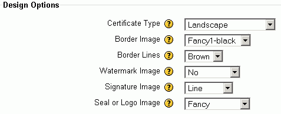

# Certificate Module

-   [Installing](#CertificateModule-Installing)
-   [Adding additional images to the Certificate module](#CertificateModule-AddingadditionalimagestotheCertificatemodule)
-   [Creating a Certificate in Moodle](#CertificateModule-CreatingaCertificateinMoodle)
-   [Suggested Changes to the Certificate Module](#CertificateModule-SuggestedChangestotheCertificateModule)
-   [Copyright issues with the addition of copyrighted logos](#CertificateModule-Copyrightissueswiththeadditionofcopyrightedlogos)

-   Documentation about the certificate module can be found at <http://docs.moodle.org/en/certificate_module>

# Installing

-   Download the Certificate zip file from <http://moodle.org/mod/data/view.php?d=13&rid=683>
-   unzip it to **/data/apache/htdocs/moodle/mod**
-   no need to move any language files etc
-   click on **Notifications**
-   3 new tables are created:
    -   mdl\_certificate
    -   mdl\_certificate\_issues
    -   mdl\_certificate\_linkedmodules

# Adding additional images to the Certificate module

The certificate module comes with some images that are available as default, these are:

<table>
<colgroup>
<col width="25%" />
<col width="25%" />
<col width="25%" />
<col width="25%" />
</colgroup>
<thead>
<tr class="header">
<th>
/mod/certificate/pix/borders/ 

</th>
<th>
/mod/certificate/pix/seals/ 

</th>
<th>
/mod/certificate/pix/signatures/
</th>
<th>
/mod/certificate/pix/watermarks/
</th>
</tr>
</thead>
<tbody>
<tr class="odd">
<td>
(appears around the 
edge of the certificate) 

</td>
<td>
(appears in the 
bottom right of the certificate) 

</td>
<td>
(appears in the 
bottom left of the certificate) 

</td>
<td>
(appears in the background 
of the certificate, must be big and light enough 
to fill the certificate page and 
not make the text hard to read) 

</td>
</tr>
<tr class="even">
<td><ul>
<li>Fancy1-black.jpg</li>
<li>Fancy1-blue.jpg</li>
<li>Fancy1-brown.jpg</li>
<li>Fancy1-green.jpg</li>
<li>Fancy2-black.jpg</li>
<li>Fancy2-blue.jpg</li>
<li>Fancy2-brown.jpg</li>
<li>Fancy2-green.jpg</li>
</ul></td>
<td><ul>
<li>Fancy.png</li>
<li>Logo.png</li>
<li>Plain.png</li>
<li>Quality.png</li>
<li>Teamwork.png</li>
</ul></td>
<td><ul>
<li>Line.png</li>
<li>RVincent.png</li>
</ul></td>
<td><ul>
<li>Crest.png</li>
<li>Fleursdelis.png</li>
</ul></td>
</tr>
</tbody>
</table>

png and jpg files work, but gif files give an error message.

For the .png format, a 32-bit png contains an alpha channel, but the 24-bit png does not. If you get the error "**FPDF error: Alpha channel not supported**" you may need to re-save your png file. Open the file in **Photoshop Elements** (available on WTS) and go to **File** &gt; **Save** for web and choose **PNG-24** or **PNG-8**.

Make sure your image files have sensible/intuitive names as the file name appears in the drop down list.

Upload your new image file to the appropriate folder and check it has the right permissions (`chmod 644 <filename>`)

Your files will then appear in the drop down lists when you create a certificate in Moodle.

# Creating a Certificate in Moodle

1.  Go to your Moodle course and **turn editing on**
2.  Go to **Add an Activity**
3.  Choose **Certificate** from the drop down list
4.  Fill in the details and select the options you want for your certificate and click on save

# Suggested Changes to the Certificate Module

To be looked at by Rachel ...

see ISH0098964 in Remedy

-   Add/rename BSCMRonly and SCMRonly (the underscores look out of place - can we add spaces?) in /data/apache/htdocs/moodle/mod/certificate/pix/seals
-   Add the UCLH and UCL logos
-   Remove the default logos (logo, plain, quality and teamwork)
-   Keep the fancy logo as it's generic enough and doesn't look too bad
-   Remove the crest watermark, but leave the other one (it's pretty generic)

# Copyright issues with the addition of copyrighted logos

It is my belief that the copyright issue should not be too much of a problem as it is difficult to copy the image from the certificate itself as its a PDF and if we provide a more suitable logo option (UCL), users are unlikely to choose it - Jess

See copyright issues discussed via email:

 ---

james.moon@uclh.nhs.uk wrote:

BSCMR stands for the British Society of Cardiovascular magnetic resonance. www.bscmr.org. They will be accrediting the course.
SCMR stands for the (international) Society of Cardiovascular magnetic resonance. www.scmr.org They will be accrediting the course.
The logos are copyrighted, so a name like 'only\_for\_BSCMR'may be appropriate.

 ---

rachel.f.cooper@ucl.ac.uk wrote:
please note that I think the most we can do to restrict it is to name the file 'only\_for\_BSCMR' or similar to dissuade users from using it, but they still could use it if they wanted to. Does that meet the copyright for these images and any signature you send?

 ---

james.moon@uclh.nhs.uk wrote:
Re copyright, yes, it is an issue, but what can you do in this electronic age? Everytime someone logs onto the websites, they download these images.

 ---

## Attachments:

 [certificate-design-options.gif](attachments/3670276/5865596.gif) (image/gif)

