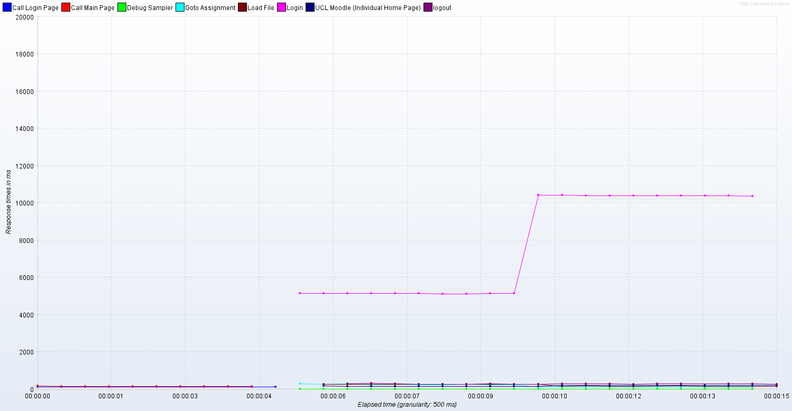
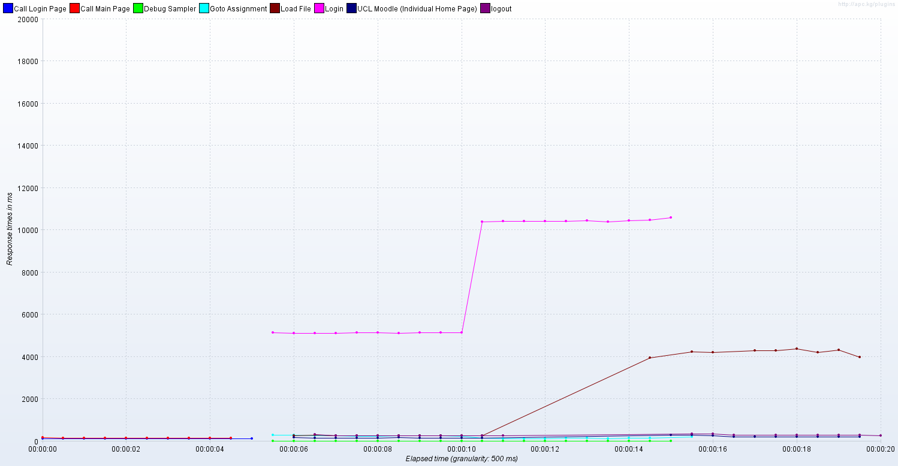

# Clam AV testing

Carried out on wasdev-b using a jmeter (version 2.5.1) script ([attached](attachments/20715307/21005149.jmx)) to log in, navigate to a test course, upload a file (1MB PDF) to an assignment and log out.

To test clamAV could detect a virus I used the [EICAR](http://eicar.org/86-0-Intended-use.html) test file, which is a string of ascii characters. 

Used 10 test users to create 25 threads set off at 1 second intervals.

Without clamAV  :

The brown line is the important one: the upload takes 0.2 seconds.

With Clam AV :
 An average of 2.2 seconds, but half the uploads fail (a bug with JMeter) - so of the ones that work 4 seconds is nearer to the mark.

A 156MB video file takes on average 17.6 seconds to load without clamAV and 18.5 seconds with scanning enabled.

## Attachments:

 [groupnoclam.png](attachments/20715307/21005093.png) (image/png)
 [groupwithclam.png](attachments/20715307/21005094.png) (image/png)
 [groupnoclam.png](attachments/20715307/21005091.png) (image/png)
 [groupwithclam.png](attachments/20715307/21005092.png) (image/png)
 [turnitinv1915.jmx](attachments/20715307/21005106.jmx) (application/octet-stream)
 [noclamav-smallfile.png](attachments/20715307/21005147.png) (image/png)
 [clamav-smallfile.png](attachments/20715307/21005148.png) (image/png)
 [load file.jmx](attachments/20715307/21005149.jmx) (application/octet-stream)

