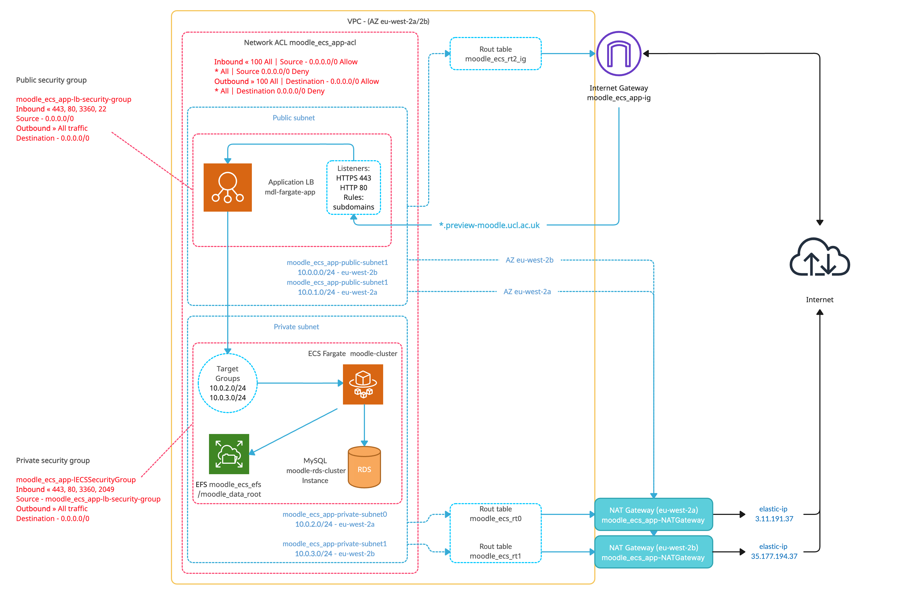
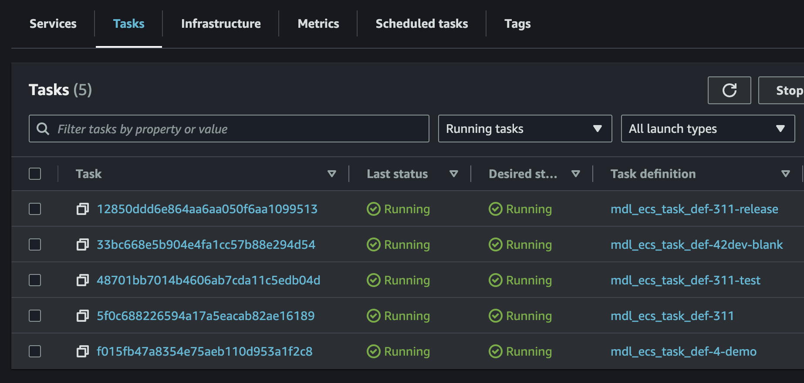

# Cloud Moodle Preview - AWS ECS Documentation

****

-   [Spinning up a new instance](#CloudMoodlePreviewAWSECSDocumentation-Spinningupanewinstance)
-   [Refreshing 4-demo instance](#CloudMoodlePreviewAWSECSDocumentation-Refreshing4-demoinstance)
-   [Setup information for container deploys](#CloudMoodlePreviewAWSECSDocumentation-Setupinformationforcontainerdeploys)
-   [ElastiCach Redis](#CloudMoodlePreviewAWSECSDocumentation-ElastiCachRedis)
-   -   [Cron run service](#CloudMoodlePreviewAWSECSDocumentation-Cronrunservice)
-   [MySQL database server](#CloudMoodlePreviewAWSECSDocumentation-MySQLdatabaseserver)
-   [Elastic Load Balancer](#CloudMoodlePreviewAWSECSDocumentation-ElasticLoadBalancer)
-   [AWS auto scaling](#CloudMoodlePreviewAWSECSDocumentation-AWSautoscaling)
-   [EFS moodle data root](#CloudMoodlePreviewAWSECSDocumentation-EFSmoodledataroot)
-   [VPC peering connection](#CloudMoodlePreviewAWSECSDocumentation-VPCpeeringconnection)
-   [HLD preview cloud](#CloudMoodlePreviewAWSECSDocumentation-HLDpreviewcloud)
-   [SSH in to a Moodle container](#CloudMoodlePreviewAWSECSDocumentation-SSHintoaMoodlecontainer)

### **Spinning up a new instance**

Use the following to spin up an instance

-   Create a new branch in ucl-isd/moodle-build with the relevant instance details in the settings.yml
-   restore Moodle DB from prod via GHA - <https://github.com/ucl-isd/moodle-mysql-restore/actions/workflows/main.yml> main branch
-   Upgrade DB via GHA - <https://github.com/ucl-isd/moodle-mysql-restore/actions/workflows/main.yml> upgrade-311-to-42 branch
-   Update AAD config to allow auth for that instance - <https://portal.azure.com/#view/Microsoft_AAD_RegisteredApps/ApplicationMenuBlade/~/Authentication/appId/1a7eb314-9b75-48d4-9874-401c13124fbf> (for an extend instance - <https://portal.azure.com/#view/Microsoft_AAD_RegisteredApps/ApplicationMenuBlade/~/Authentication/appId/ce15f53e-1648-4da2-84a7-54a2b0895ae8> )

### **Refreshing 4-demo instance**

-   restore a Moodle DB including MIM (8h+)
-   assign select and show view privileges to eliot\_ro\_mdl rds user (grant select, show view on  moodle\_42\_23????.\* to eliot\_ro\_mdl@'%';) 
-   upgrade DB via GHA (3h+)
-   configure the **4-demo-prep** moodle-build branch to make this available on a separate domain and make is on a new moodledata folder
-   deploy **4-demo-prep**
-   apply all of the config outlined in this release page - [Moodle 4.x Theme updates (pre-upgrade)](Moodle_4.x_Theme_updates_pre-upgrade_)
-   delete **4-demo-prep** service - <https://eu-west-2.console.aws.amazon.com/ecs/v2/clusters/moodle_cluster/services?region=eu-west-2>
-   update **4-demo** to point to the new moodle & mim databases and new moodledata directory used by 4-demo-prep (not doing this will corrupt the instance!)  and **deploy** - goes live to users
-   delete old database and old moodledata directory (a few days later)

If you did a database restore without MIM, then run this database query:

``` java
UPDATE mdl_block SET visible='0' WHERE name='portico_enrolments';
```

### **Setup information for container deploys**

When preview cloud pipeline runs, terraform creates or updates some aws resources. The main resources includes the Task definition, Cluster service, Target group and Task.

**Elastic container service**

The moodle containers, which are called tasks, are created from a task definition, this is like a Dokerfile.

The cluster service manages and runs the task. 

-   Cluster name: moodle\_cluster
-   Launch type: Fargate, serverless service
-   Default memory: 1GB
-   Default cpu: 0.5
-   Container ports: 80 443
-   Moodle docker image:
    -   There are currently two images available which the pipeline pulls from ECR, moodle-ecs-docker-7.4 and moodle-ecs-docker-8.0. The versions are defined in the settings.yml file php\_version.
    -   Added parameter in settings.yml: preview\_docker\_img: 123456789.dkr.ecr.eu-west-2.amazonaws.com/vle-repo:moodle-ecs-docker-{{php\_version}}

### ElastiCach Redis

AWS Elasticash is setup to use the redis engine (v5) for moodle application and session caching.

-   Cluster name: moodle-redis
-   Engine: Redis
-   Node name: moodle-redis-001
-   Node type: cache.r6g.large (13GiB memory, up to 10G network performance)
-   Primary endpoint: moodle-redis.wtcdy6.ng.0001.euw2.cache.amazonaws.com:6379
-   Usage:
    -   First edit your instances config.php file to include the redis cache config, details here 
    -   Add the redis server (moodle-redis.wtcdy6.ng.0001.euw2.cache.amazonaws.com) and update the redis prefix - mdl\_{{preview\_link}} in settings.yml
    -   This will automatically configure your instance to use Elasticash redis. You can check that redis is working correctly be visiting https://41-demo.preview-moodle.ucl.ac.uk/admin/tool/forcedcache/index.php

The moodle containers will have redis-cli installed, you can ssh in to the containers to run a simple command to check that the keys are being set by moodle.

The code below will list all the keys in redis with the prefix pattern 41demo\*

``` java
redis-cli -h moodle-redis.wtcdy6.ng.0001.euw2.cache.amazonaws.com -p 6379 keys 41demo*
```

### Cron run service

Running moodle cron jobs on a container uses a different solution than the normal linux cron, this is due to the serverless aspects of fargate.

The cron service runs in a container on ecs moodle\_cluster (moodle\_cron\_service). It works by executing a bash script which runs on the targeted container instance. 

This script (runcron.sh) then runs the moodle cron.php file on that container and saves the logs on the efs folder.

``` java
#!/bin/bash
php8.0 /data/apache/htdocs/xxsitefolderxx/admin/cli/cron.php >> /xxefsrootxx/cron_logs/cron_xxsitelinkxx.log
```

Moodle cron service uses the gnu parallel tool to run cron jobs on multiple moodle instances.

The script which starts the process, utilises AWS Session Manager to establish a connection with the running targeted container, this is accomplished by executing an awscli command.

``` java
 aws ecs execute-command --region {{region}} --cluster {{cluster_name}} --task {{task_id}} \
                         --container {{target_service}} --command "/data/runcron.sh &" --interactive
```

This command gets triggered every 2 minutes, the intervals can be set via the moodle cron service pipeline.

-   Service name: moodle\_cron\_service
-   Pipeline: Reusable workflow - <https://github.com/ucl-isd/moodle-build-github-actions/tree/mdl-cron-task>
-   Docker image uri:  xxxxxx/vle-repo:moodle-cron-docker-1
-   CPU 1GB
-   Memory 2GB
-   Cron logs location: /moodle\_data\_root/cron\_logs/cron\_xxsitelinkxx.log
-   Monitoring: Launch progress and cron service updates for all registered instances can be monitored at [ECS-moodle\_cron\_service](https://eu-west-2.console.aws.amazon.com/ecs/v2/clusters/moodle_cluster/services/moodle_cron_service/logs?region=eu-west-2)
-   Usage: To activate cron on your instance, add the cron parameter in settings.yml (cron: true) then re-deply your instance.

### **MySQL database server**

The pipline will automatically create a database and user based on the settings in settings.yml, If a database and user already exists, it will ignore.

-   Aurora serverless cluster name: moodle-rds-cluster (instance name: moodle-rds-cluster-inst )
-   Writer endpoint: moodle-rds-cluster.cluster-cweddcllqbin.eu-west-2.rds.amazonaws.com (use this for preview\_db\_host )
-   Reader endpoint: moodle-rds-cluster.cluster-cweddcllqbin.eu-west-2.rds.amazonaws.com
-   Read replica instance
    -   Name: moodle-rds-reader
    -   Endpoint: moodle-rds-reader.cweddcllqbin.eu-west-2.rds.amazonaws.com
    -   Usage: Add 'preview\_db\_host\_read\_replica: Endpoint' in settings.yml and un-comment the 'readonly' option in config.php
-   Access details are in last pass (rds-moodle-master)
-   Engine version: 8.0.mysql\_aurora.3.02.2

**Restoring database from prod**

There is a GHA mysql restore pipeline that can be used to restore a moodle prod backup (including mim) to the RDS cluster instance. This will need to be requested via the OPS team.

The pipeline  provisions and deploys a self-hosted runner (ec2 instance) which is used to create the database, user and then restore to the RDS cluster instance.

-   GHA Repo: <https://github.com/ucl-isd/moodle-mysql-restore/actions/workflows/main.yml>
-   Default mysql user password is in LastPass - Mysql restore default password

### **Elastic Load Balancer**

Preview domain points to this LB which forwards HTTPS traffic to the moodle containers

-   LB name: mdl-fargate-app
-   DNS name: [mdl-fargate-app-1968662235.eu-west-2.elb.amazonaws.com](http://mdl-fargate-app-1968662235.eu-west-2.elb.amazonaws.com/)
-   HTTPS listener: traffic rules points to container once deployed
-   HTTP listener:  traffic is redirected to HTTPS
-   Target groups: This registers the ip address of a new container (task) to allow incoming traffic to the container 

### AWS auto scaling

Moodle ECS cluster uses application auto scaling, the auto scaling policy scales up or down by 1 task, and the cloud watch metric is set to cpu utilasation

-   Cloud watch alarm name: moodle\_cpu\_utilization
-   Mimimum count of tasks: 1
-   Maximum count of tasks: 4
-   Cloud watch cpu threshold %: 85 (when this threshold is breeched, an additional task will be added to the service)

When a new service (moodle container) is created, aws auto scaling will be added to that service.

**Full moodle docker image**

Container instances have the option to use a full moodle docker image or the default (partial) docker image. The full build means that the pipeline will use a docker image that does not require downloading of the moodle application during task deployment. The purpose of this is to reduce time during auto-scaling.

To use this feature, you must edit the settings.yml file and include the full image parameter: auto\_scaling\_full\_img true 

### EFS moodle data root

All ecs containers have mounted folders which points to an Elastic File System shared volume. This file system exists in both AZ within the private subnet

-   File system name: moodle\_ecs\_efs
-   Mounted volume path: /moodle\_data\_root

### VPC peering connection

The VPC peering connection, connects the Preview cloud VPC to the UCL on-prem VPC. This connection was created so that all moodle instances will have a connection to any resource within UCL on-prem VPC and vice versa.

UCL on-prem servers (mdl-admin02p) can communicate with any resource witin the UCL on-prem VPC.

-   Peering connection name:  moodle-ecs-onprem
-   Requester VPC: vpc-00738557910dc1bee / moodle\_ecs\_app-vpc
-   Accepter VPC: vpc-0b29e5bf3e5c90f6f / UCL-Moodle-on-prem-IP-range

**Route tables**

|                                                        |                                                     |
|--------------------------------------------------------|-----------------------------------------------------|
| rtb-0de0a32779e91778c / dev-Public-Routes-540370667459 | vpc-0b29e5bf3e5c90f6f / UCL-Moodle-on-prem-IP-range |
| rtb-04cd4d5019ec8b5fd / moodle\_ecs\_rt1               | vpc-00738557910dc1bee / moodle\_ecs\_app-vpc        |
| rtb-042401e31ef9238e1 / moodle\_ecs\_rt0               | vpc-00738557910dc1bee / moodle\_ecs\_app-vpc        |

### HLD preview cloud 



[Resource list](attachments/249169390/254640442.txt)

### SSH in to a Moodle container

Ensure aws cli is installed - https://docs.aws.amazon.com/cli/latest/userguide/getting-started-install.html

Install the session manager plugin on your system.

-   [Install the Session Manager plugin on Windows](https://docs.aws.amazon.com/systems-manager/latest/userguide/session-manager-working-with-install-plugin.html#install-plugin-windows)
-   [Install and uninstall the Session Manager plugin on macOS](https://docs.aws.amazon.com/systems-manager/latest/userguide/session-manager-working-with-install-plugin.html#install-plugin-macos)
-   [Install the Session Manager plugin on macOS with the signed installer](https://docs.aws.amazon.com/systems-manager/latest/userguide/session-manager-working-with-install-plugin.html#install-plugin-macos-signed)
-   [Install Session Manager plugin on Linux](https://docs.aws.amazon.com/systems-manager/latest/userguide/session-manager-working-with-install-plugin.html#install-plugin-linux)
-   [Install the Session Manager plugin on Ubuntu](https://docs.aws.amazon.com/systems-manager/latest/userguide/session-manager-working-with-install-plugin.html#install-plugin-debian)

Once the plugin is installed, login using aws sso - [Setup AWS CLI for SSO](https://wiki.ucl.ac.uk/display/DP/Setup+AWS+CLI+for+SSO)

Find the task id of the container you need to ssh in to.

**AWS console** - Amazon Elastic Container Service &gt; moodle\_cluster &gt; Click on the 'Task' tab then copy the task id for --task.



**AWS CLI** - \[ec2-user@ip-10-0-1-59 ~\]$ aws ecs list-tasks --cluster moodle\_cluster --family mdl\_ecs\_task\_def-{{preview-link}}

Then run the execute command:

\[ec2-user@ip-10-0-1-59 ~\]$ aws ecs execute-command --region eu-west-2 --cluster moodle\_cluster --task f015fb47a8354e75aeb110d953a1f2c8 --container {{preview-link}} --command "/bin/bash" --interactive

## Attachments:

 [Screenshot 2023-03-05 at 23.07.51.png](attachments/249169390/250415861.png) (image/png)
 [Moodle ECS Network.png](attachments/249169390/254640418.png) (image/png)
 [aws resource list.txt](attachments/249169390/254640442.txt) (text/plain)
 [Moodle ECS Network.jpg](attachments/249169390/254640814.jpg) (image/jpeg)
 [Moodle ECS Network 2.jpg](attachments/249169390/255950849.jpg) (image/jpeg)
 [Moodle ECS Networkv2.png](attachments/249169390/255951634.png) (image/png)
 [image-2023-6-21\_19-56-35.png](attachments/249169390/271452869.png) (image/png)
 [redis.jpg](attachments/249169390/271452870.jpg) (image/jpeg)

