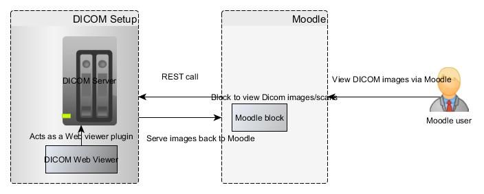

# DICOM viewer and Moodle Integration

<table>
<colgroup>
<col width="50%" />
<col width="50%" />
</colgroup>
<tbody>
<tr class="odd">
<td>Document status</td>
<td>VERSION 1.0</td>
</tr>
<tr class="even">
<td>Document owner</td>
<td>
cceanse
</td>
</tr>
</tbody>
</table>

-   -   [Goals](#DICOMviewerandMoodleIntegration-Goals)
-   [Research](#DICOMviewerandMoodleIntegration-Research)
    -   [Osirix](#DICOMviewerandMoodleIntegration-Osirix)
    -   [Orthanc](#DICOMviewerandMoodleIntegration-Orthanc)
-   [Comparison table](#DICOMviewerandMoodleIntegration-Comparisontable)
-   [Assumptions](#DICOMviewerandMoodleIntegration-Assumptions)
-   [Requirements](#DICOMviewerandMoodleIntegration-Requirements)
-   [Timeline estimation](#DICOMviewerandMoodleIntegration-Timelineestimation)
-   [User interaction and design](#DICOMviewerandMoodleIntegration-Userinteractionanddesign)
-   [Questions](#DICOMviewerandMoodleIntegration-Questions)
-   [Conclusion](#DICOMviewerandMoodleIntegration-Conclusion)

## Goals

-   A system that would host images/scans and allow students to access them remotely via Moodle
-   Means of remotely viewing radiology images/scans via Moodle

## Research

### Osirix

**Features** 

-   Based on OsiriX DICOM engine and Database (SQLite) engine

-   Manage your PACS through OsiriX GUI

-   Fully compatible with **MAC** hardware and software

-   Fully compatible with DICOM protocol (C-Move, C-Store, C-Find, C-Get, WADO)

-    Support encryption TLS layer

-   Seamless integration with any DICOM viewers, through the DICOM protocol

-   Web access through built-in web server, built-in Java viewer (Weasis)

-   Open-Source: write your own plugins to extend the integration with any protocols/systems

**Setup**

PACS Server (Osirix):

-   Server with a lot of hard disk space and a PACS Server software. 
-   The PACS Server software needs to be robust, working flawlessly 24/7, with a powerfull database engine, capable of storing millions of DICOM images.

Specification :

-   MacPro, 8 cores, 2.8GHz, 6GB
-   4TB of storage to store up to 25 millions of CT images
-   Recommended RAID system
-   Network built on a 1-GB or faster Ethernet hardware

PACS Client (Osirix or Weasis):

A computer with a **DICOM viewer** software, like Osirix or Weasis. These **PACS Clients** can query and retrieve the DICOM images from the PACS server, by using the DICOM network protocol (DICOM C-Move, C-Store, C-Get, C-Find, WADO)

Generic specification for client machines:

-   Minimum 8GB RAM

**Limitations**

-   Requires MAC servers
-   Do we have resources to configure and support MAC servers.
-   Osirix themselves recommend using iMac/MacPro for  3D post-processing and 2D viewing. How would the performance be if client is not MAC
-   Performance concerns for large data storage. [check here](http://www.osirixexperts.com/osirix-is-not-the-best-storage-solution/) 

*References:*

*wiki :-<https://en.wikipedia.org/wiki/OsiriX>*

**Official website :- <http://www.osirix-viewer.com/PACS.html> **

***Server specs :- <http://www.osirix-viewer.com/OsiriX-64bit.html>***

****How to configure demo -<https://www.youtube.com/watch?v=wIqwT-HKXCw>****

 

------------------------------------------------------------------------

### **Orthanc**

**Features** 

-   Cross-platform (at least Linux, Windows and OS X)
-   Architecture is lightweight and standalone (no complex database administration is required, nor the installation of third-party dependencies)
-   Provides RESTful API
-   Compliant with the DICOM standard
-   Hides the complexity of the DICOM format and of the DICOM protocol.

**Setup**

Server specification : Downloads available for Mac, Windows, Debian, Fedora

No information available for server specification - **TBC**

**DICOM viewer specific to Orthanc **

1.  Web Viewer from Orthanc 

    Orthanc can be extended by a plugin that brings a Web viewer of medical images.

    Supported platforms :

    -   Linux 32 bit
    -   Linux 64 bit
    -   Windows 32 bit

    Source : <https://bitbucket.org/sjodogne/orthanc-webviewer/src>

    Installation and configuration :

    <http://www.orthanc-server.com/static.php?page=web-viewer>

     

2.  dwv-orthanc-plugin

    An [Orthanc](http://www.orthanc-server.com/) plugin to preview DICOM series and instances using [dwv](https://github.com/ivmartel/dwv/wiki), a pure HTML5/JavaScript**D**ICOM **W**eb **V**iewer. Adds preview buttons to the OrthancExplorer to launch dwv. 

    Requirements :

    -   python ([2.7.8](https://www.python.org/download/releases/2.7.8/)),
    -   CMake ([2.8.12](http://www.cmake.org/download/) or higher),
    -   a C++ compiler

    Source : <https://github.com/ivmartel/dwv-orthanc-plugin>

    Installation and configuration :

    <https://github.com/ivmartel/dwv-orthanc-plugin>

*References :*

*Official website :- <http://www.orthanc-server.com/>*

*List of REST calls :- <https://docs.google.com/spreadsheets/d/1muKHMIb9Br-59wfaQbDeLzAfKYsoWfDSXSmyt6P4EM8/pubhtml?gid=525933398&single=true>*

*User forums :- <https://groups.google.com/forum/#!topic/orthanc-users/Rb2SngyX3FI>*

## Comparison table

 

<table style="width:100%;">
<colgroup>
<col width="14%" />
<col width="14%" />
<col width="14%" />
<col width="14%" />
<col width="14%" />
<col width="14%" />
<col width="14%" />
</colgroup>
<thead>
<tr class="header">
<th>Name</th>
<th>
Open source
</th>
<th>Programming Language</th>
<th>Platforms</th>
<th>Web viewer Plugins</th>
<th>Webservice</th>
<th>Which one suits our requirements?</th>
</tr>
</thead>
<tbody>
<tr class="odd">
<td>Osirix</td>
<td>
No

(Osirix Lite free version

has some performance concerns)
</td>
<td>Objective C</td>
<td>MAC OSx</td>
<td>Osirix, Weasis</td>
<td>No</td>
<td> </td>
</tr>
<tr class="even">
<td>Orthanc</td>
<td>Yes</td>
<td>C++</td>
<td>Linux, Windows, OS X</td>
<td>Orthanc web viewer</td>
<td>REST</td>
<td></td>
</tr>
</tbody>
</table>

 

## Assumptions

-   Will be accessed by users within Moodle
-   Images will be uploaded outside of Moodle

## Requirements

<table>
<colgroup>
<col width="20%" />
<col width="20%" />
<col width="20%" />
<col width="20%" />
<col width="20%" />
</colgroup>
<thead>
<tr class="header">
<th>#</th>
<th>Title</th>
<th>Summary</th>
<th>Importance</th>
<th>Notes</th>
</tr>
</thead>
<tbody>
<tr class="odd">
<td>1</td>
<td>Server</td>
<td>A server to host all images/scans</td>
<td>Must Have</td>
<td>Recommended server : Orthanc</td>
</tr>
<tr class="even">
<td>2</td>
<td>DICOM Web Viewer</td>
<td>A viewer to view Dicom images</td>
<td>Must Have</td>
<td>Recommended plugin : DICOM Web viewer</td>
</tr>
<tr class="odd">
<td>3</td>
<td>Moodle block</td>
<td>A block within Moodle to access DICOM images</td>
<td>Must Have</td>
<td><ul>
<li>Block acts as REST client. Requests DICOM server for images using REST webservice.</li>
<li>Settings page: 
To configure DICOM server details.  
Manage adding this block only to Medical courses that are listed within settings page.</li>
<li>Moodle form within block to add certain patient records etc per Moodle course</li>
<li>Clicking on view link should connect user to DICOM web viewer plugin</li>
</ul>

 
</td>
</tr>
</tbody>
</table>

## Timeline estimation

 

Task
Resources required
Time (Number of days)
Server set-up and configuration
LTA team and DCS team
10
Web viewer plugin set-up and configuration.
LTA team and DCS team
5
Moodle block or plugin development
LTA team (developer)
10
Initial testing
LTA team and ELE team
3
UAT testing
LTA team and End-users
3

Final wrap-up (re-factoring, bug fixes etc) based on feedbacks
LTA team
5
**Total**
**36 days**

## User interaction and design

 

 

## Questions

Below is a list of questions to be addressed as a result of this requirements document:

<table>
<colgroup>
<col width="50%" />
<col width="50%" />
</colgroup>
<thead>
<tr class="header">
<th>Question</th>
<th>Outcome</th>
</tr>
</thead>
<tbody>
<tr class="odd">
<td>Are students using any DICOM viewer to view scans currently? If yes, please specify the name</td>
<td>No</td>
</tr>
<tr class="even">
<td>Is there a DICOM server used currently? If yes, please specify the name</td>
<td>No Server. Images circulated via DVD</td>
</tr>
<tr class="odd">
<td>Who will handle Anonymity of patients data in scans before it goes on the server?</td>
<td>
May be another layer to check anonymity before uploading

images onto server would be better.
</td>
</tr>
<tr class="even">
<td>Do we need uploading DICOM images via Moodle? - This could be complicated as we need to to override Moodle default upload method</td>
<td>No</td>
</tr>
<tr class="odd">
<td>
How many DICOM images will be uploaded to the server?

We need this to finalise server requirements in terms of disk space and RAM.
</td>
<td>10-60 images. 500 MB-1 GB per course (approx)</td>
</tr>
<tr class="even">
<td>How do we need to configure Server? Do we need a RAID system for performances?</td>
<td>RAID system not required at this point</td>
</tr>
<tr class="odd">
<td>
Exact requirements regarding features in Moodle block?

Authentication of Moodle user?

Is it expected that link to DICOM images should be embedded within activity? - This is not possible

When exactly is the student expected to refer to DICOM images (Eg assignment, quiz etc) ?
</td>
<td>
Beneficial to have a link that could be embedded or redirected to DICOM

viewer launch page.
</td>
</tr>
<tr class="even">
<td>Client browsers and their versions?</td>
<td>TBC</td>
</tr>
<tr class="odd">
<td>How many concurrent users accessing images via Moodle</td>
<td>
Could vary based on users logged into Moodle and viewing an

activity in a course that has link to DICOM images.
</td>
</tr>
</tbody>
</table>

## Conclusion

Using Orthanc server, its REST APIs and DICOM web viewer, it should be possible to develop a system in Moodle that could launch DICOM images.

## Attachments:

 [Moodle-Dicom Architecture.jpg](attachments/56496077/56496313.jpg) (image/jpeg)
 [Moodle-Dicom Architecture.jpg](attachments/56496077/56496308.jpg) (image/jpeg)

