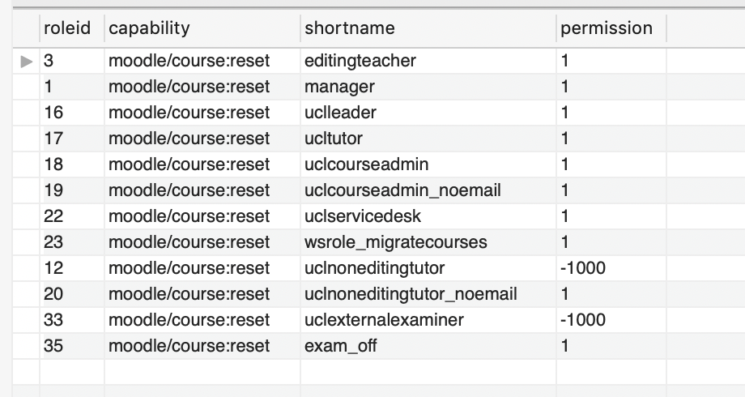

# Disable role course reset

1.  Run query [SQL Queries of Moodle\#Rolecapabiltieswithcoursereset](SQL-Queries-of-Moodle_6164026.html#SQLQueriesofMoodle-Rolecapabiltieswithcoursereset) in MySQL workbench to see a list of roles who currently have the reset capability
    

1.  Navigate to site administrator &gt; users &gt; permissions &gt; define roles 
2.  Click on the 'edit role' button to the right of the role
3.  Search for moodle/course:reset
4.  click show advanced
5.  Change permission to 'Prohibit'
6.  Click save changes
7.  Again run query [SQL Queries of Moodle\#Rolecapabiltieswithcoursereset](SQL-Queries-of-Moodle_6164026.html#SQLQueriesofMoodle-Rolecapabiltieswithcoursereset) in MySQL workbench to check the role has the correct permissions level

|                         |                                                 |
|-------------------------|-------------------------------------------------|
| Moodle permisions level | mdl\_role\_capabilities permissions field value |
| Not set                 | no value set so no row visible                  |
| Allow                   | 1                                               |
| Prevent                 | -1                                              |
| Prohibit                | -1000                                           |

## Attachments:

 [Screenshot 2020-06-09 at 08.37.24.png](attachments/116017000/137147872.png) (image/png)

