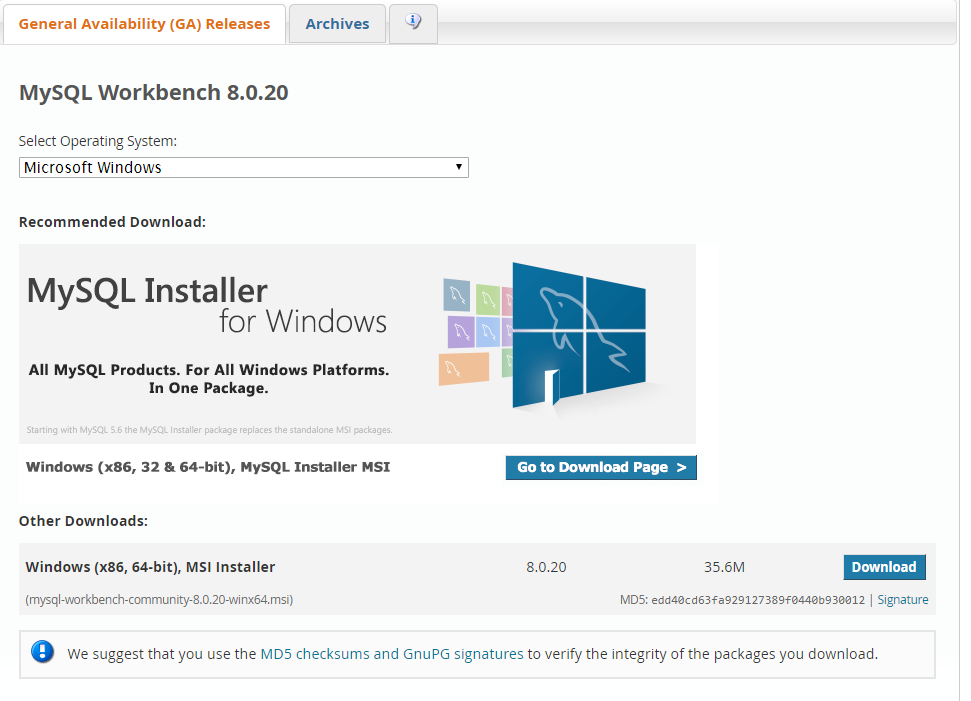
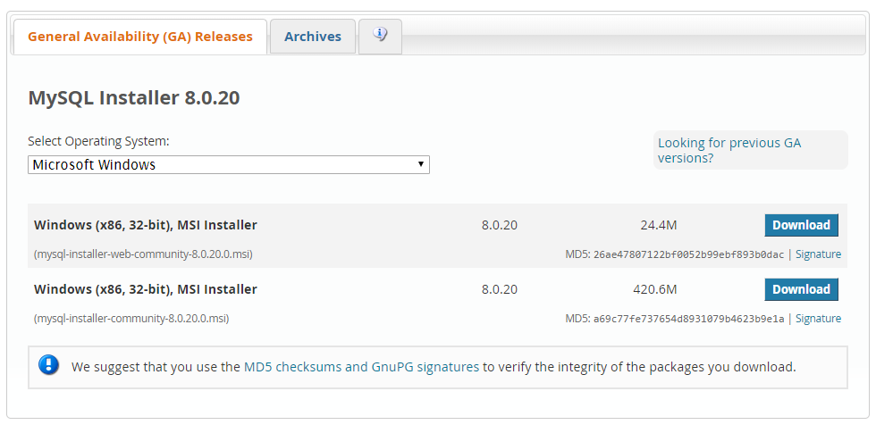
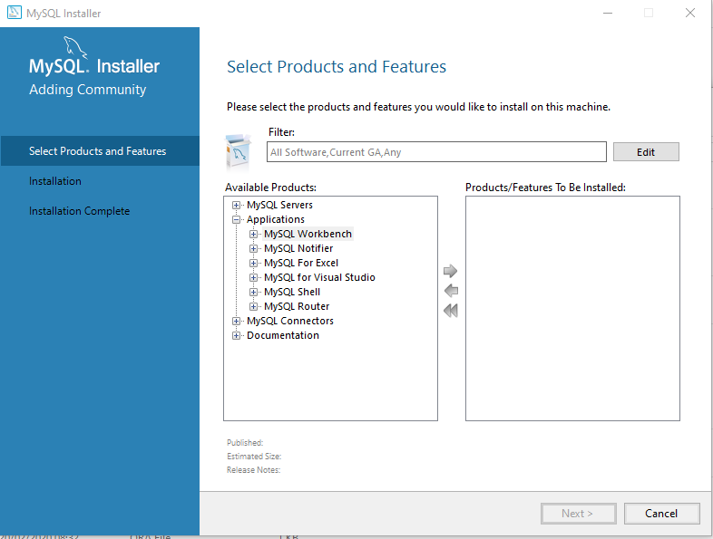
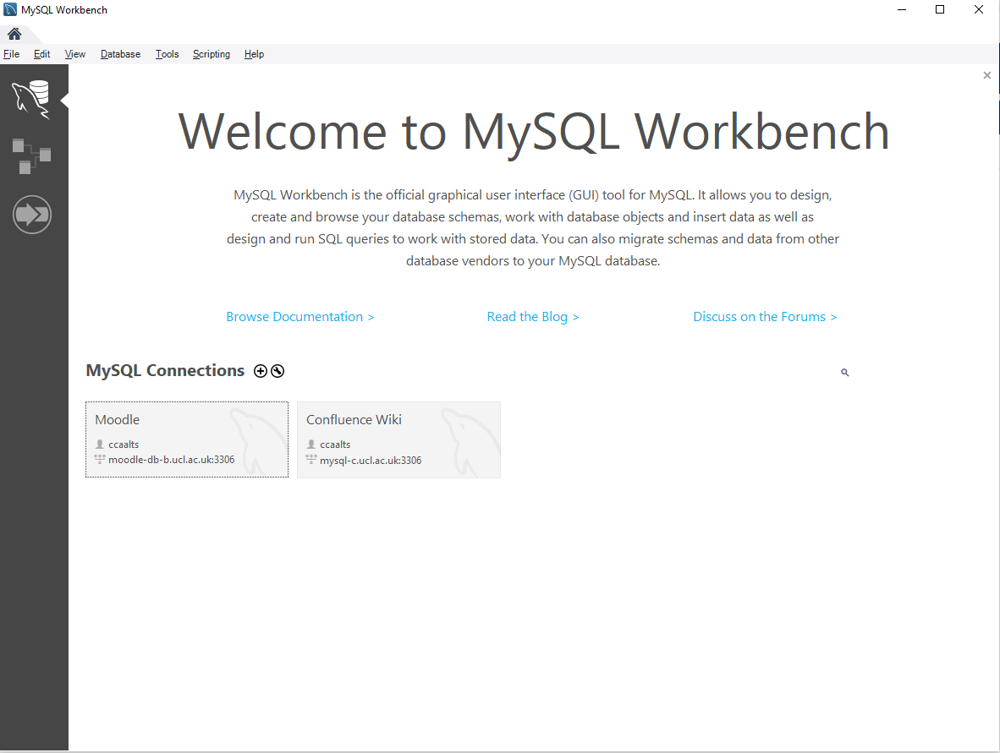

# Download and Install MySQL Workbench 8.0 for Windows 10

# Method 1

Go to <https://dev.mysql.com/downloads/workbench/> and download Workbench 8.0 and download the suggested installer under other downloads.

Prerequisite for MySQL WorkBench 8.0  is Visual c++ redistributable for visual studio 2019. Go to <https://aka.ms/vs/16/release/VC_redist.x64.exe> download it and install it.

Now install MySQL Workbench 

# Alternative way of installation

Go to <https://dev.mysql.com/downloads/workbench/> but choose Go to Download Page

Choose the larger download which is the whole MySQL package (we only need Workbench)

Run the installer and choose custom install and select only Workbench

The installer will check for missing dependencies (such as MySQL WorkBench 8.0  is Visual c++ redistributable for visual studio 2019) and will prompt to download and install it for you.

Now you should have MySQL Workbench installed and ready to use.

## If after installing you are unable to connect to Moodle database uninstall the current version and download and install Workbench 6.3.8. which is proven to work and connect successfully.

## Attachments:

 [image2020-4-28\_7-28-35.png](attachments/137134579/137134571.png) (image/png)
 [image2020-4-28\_7-29-31.png](attachments/137134579/137134572.png) (image/png)
 [image2020-4-28\_7-34-26.png](attachments/137134579/137134573.png) (image/png)
 [image2020-4-28\_7-35-14.png](attachments/137134579/137134575.png) (image/png)
 [image2020-4-28\_7-43-11.png](attachments/137134579/137134577.png) (image/png)
 [image2020-4-28\_7-47-11.png](attachments/137134579/137134578.png) (image/png)

