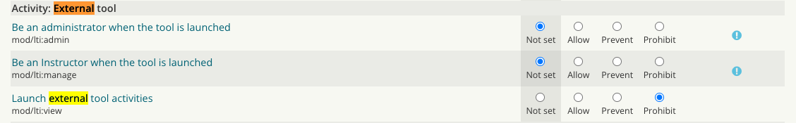

# Echo360 - user issues Oct2022 & Moodle snapshot remedial work

# Disable user creation in snapshots 1819,1920,2021. This is needed to prepare migration to AAD.

-   authpreventaccountcreation set to 1 

# Create a new process (or update existing) for support team to provide access to snapshots

-   NOW create manual accounts with right attributes e.g. ucl userid (moodle username), firstname, lastname, email (initial.lastname@[ucl.ac.uk](http://ucl.ac.uk))

<!-- -->

-   create a new user account. Set the following user fields:

username = ucl userid e.g. cceanbo

firstname= firstname

lastname= lastname

email = ucl email alias e.g. <n.bozhkov@ucl.ac.uk>

authentication = LDAP

-   Assign the newly created [No LTI Role](https://moodle-snapshot.ucl.ac.uk/20-21/admin/roles/define.php?action=view&roleid=47) to all newly created accounts. Go to Site administration-&gt;Users-&gt;Permissions-&gt;Assign system roles and select No LTI role. Then add the newly created user to the role. This prevents user mismatching in Echo360 until the long term solution is in place. 

<!-- -->

-   FUTURE match the newly created account to AAD user account TBC

# Frontend work

-   create new system role in 18/19, 19/20, 20/21 - [No LTI Role](https://moodle-snapshot.ucl.ac.uk/20-21/admin/roles/define.php?action=view&roleid=47)



20/21 roleid=47 <https://moodle-snapshot.ucl.ac.uk/20-21/admin/roles/define.php?action=edit&roleid=47>

19/20 roleid=41 <https://moodle-snapshot.ucl.ac.uk/19-20/admin/roles/define.php?action=view&roleid=41>

18/19 roleid=27 <https://moodle-snapshot.ucl.ac.uk/18-19/admin/roles/define.php?action=view&roleid=27>

# SQL Work

-   get the users created after the snapshot was taken 

``` java
SELECT from_unixtime(u.timecreated),u.* 
FROM moodle_archive_2021.mdl_user u
WHERE from_unixtime(u.timecreated)> '2021-07-07 21:38:19';

SELECT from_unixtime(u.timecreated),u.* 
FROM moodle_archive_1920.mdl_user u
WHERE from_unixtime(u.timecreated)> '2020-07-13 21:00:00';

SELECT from_unixtime(u.timecreated),u.* 
FROM moodle_archive_1819.mdl_user u
WHERE from_unixtime(u.timecreated)> '2019-07-26 17:00:00';
```

-   create insert scripts x3  

Snapshot1819\_insert\_sqlSnapshot1920\_insert\_sqlSnapshot2021\_insert\_sql

-   create mdl\_role\_assignments table backup x3

``` java
CREATE table moodle_archive_2021.mdl_role_assignments_backup like moodle_archive_2021.mdl_role_assignments; 
INSERT moodle_archive_2021.mdl_role_assignments_backup select * from moodle_archive_2021.mdl_role_assignments;

CREATE table moodle_archive_1920.mdl_role_assignments_backup like moodle_archive_1920.mdl_role_assignments; 
INSERT moodle_archive_1920.mdl_role_assignments_backup select * from moodle_archive_1920.mdl_role_assignments;

CREATE table moodle_archive_1819.mdl_role_assignments_backup like moodle_archive_1819.mdl_role_assignments; 
INSERT moodle_archive_1819.mdl_role_assignments_backup select * from moodle_archive_1819.mdl_role_assignments;
```

-   run insert scripts x3 - for 26k users it took 8 minutes 

# Last steps

-   purge caches x3
-   check snapshot instances x3
-   done

## Attachments:

 [image2022-10-26\_12-50-30.png](attachments/227186779/227186783.png) (image/png)
 [image2022-10-26\_12-50-37.png](attachments/227186779/227186784.png) (image/png)
 [Snapshot1819\_insert\_sql](attachments/227186779/229245188) (application/octet-stream)
 [Snapshot1920\_insert\_sql](attachments/227186779/227186810) (application/octet-stream)
 [Snapshot2021\_insert\_sql](attachments/227186779/227186811) (application/octet-stream)
 [Snapshot1819\_insert\_sql](attachments/227186779/227186809) (application/octet-stream)

