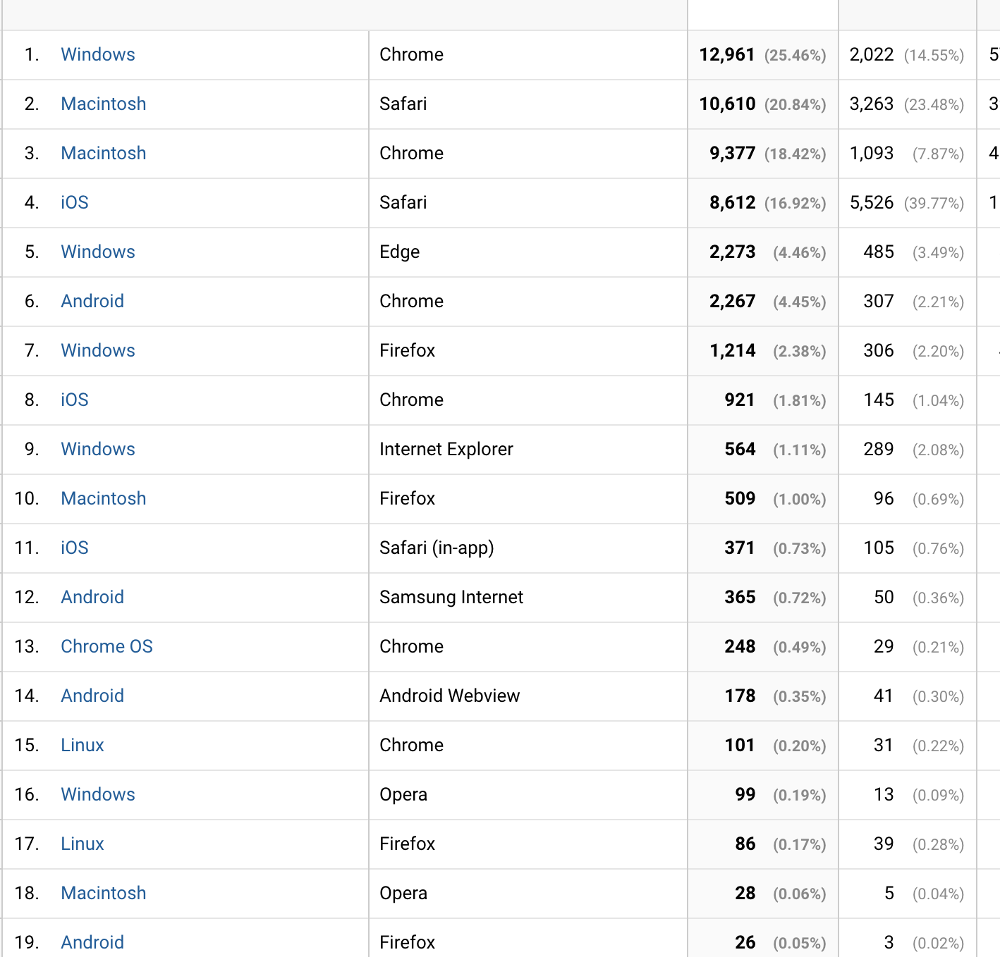
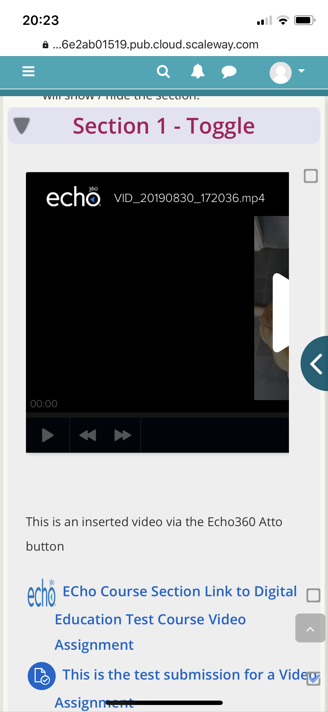
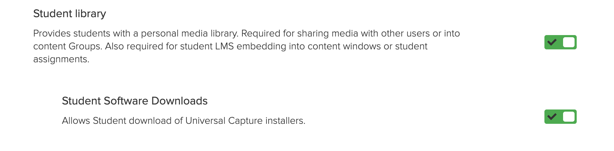
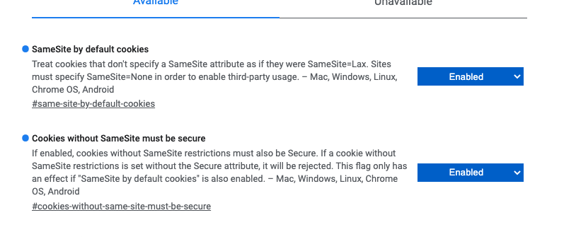
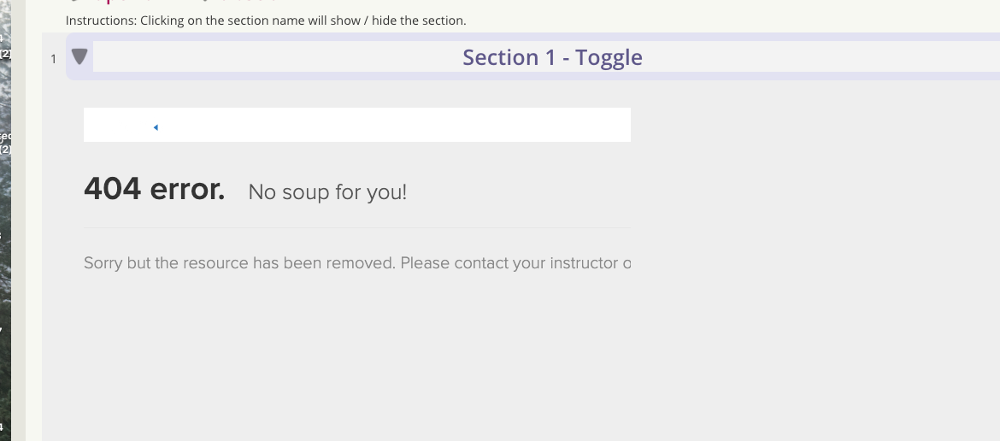

# Echo360 Integration Testing Plan

-   [Areas to be covered:](#Echo360IntegrationTestingPlan-Areastobecovered:)
-   [Cross-browser testing (upload & playback)](#Echo360IntegrationTestingPlan-Cross-browsertesting(upload&playback))
    -   [Mobile](#Echo360IntegrationTestingPlan-Mobile)
-   [Settings which need to be changed on the Echo360 side:](#Echo360IntegrationTestingPlan-SettingswhichneedtobechangedontheEcho360side:)
-   [Accessibility](#Echo360IntegrationTestingPlan-Accessibility)
-   [SameSite](#Echo360IntegrationTestingPlan-SameSite)
-   [File Formats](#Echo360IntegrationTestingPlan-FileFormats)
-   [Load and scaling:](#Echo360IntegrationTestingPlan-Loadandscaling:)

n.b. a condensed version of failures / questions from this testing, for our meeting with Echo360 on 15 Apr 2020 are available here: [Feedback for Echo360 on Integration](Feedback_for_Echo360_on_Integration)

# Areas to be covered:

-   Upload a video anywhere: upload existing, use UCAP, select from library - Pass
-   Upload a video in a Moodle Assignment - Pass
-   Test restrictions around a Video uploaded in a Moodle Assignment - Pass

 Can students edit their video after submission - Pass

 Can other students see their video - Pass

-   Cross-browser testing (upload & playback) - Can work but very painful
-   Test with a user that has already PCAP and Lecture Recordings on Echo360 end & review how these work together
-   Test course rollover and impact on permissions to view video: course copy & course reset - Pass
-   Is there a video collection capability? e.g. can staff share videos across courses or is just the teacher's personal library? → Groups feature which UCL does not currently use  - irrelevant
-   Delete/inactivate the user in Echo which uploaded the video → is the video still available? - Pass
-   Accessibility testing - refer to Michele, but seems poor
-   Snapshot process implications - Pass - Not tested but really can't foresee any issues, won't be affected by course resets.
-   delete user from echo360 - Pass
-   Close and grade assignment. release marks. What happens to video is it still locked? 
-   File formats supported - quirks?

<table>
<thead>
<tr class="header">
<th>Test</th>
<th>User</th>
<th>Feature</th>
<th>Outcome</th>
<th>Expected behaviour Pass/Fail</th>
<th>Notes</th>
</tr>
</thead>
<tbody>
<tr class="odd">
<td>Upload Video</td>
<td>cceaean</td>
<td>General Atto Enabled Label</td>
<td>Successsful</td>
<td>Pass</td>
<td>49Mb sized file used</td>
</tr>
<tr class="even">
<td>Upload Video</td>
<td>cceaean</td>
<td>Video Assignment</td>
<td>Successsful</td>
<td>Pass</td>
<td>20Mb file used</td>
</tr>
<tr class="odd">
<td>Upload Video</td>
<td>cceaean</td>
<td>Echo library</td>
<td>Successful</td>
<td>Pass</td>
<td>Accessed Library via LTI</td>
</tr>
<tr class="even">
<td>Upload Video</td>
<td>cceaean</td>
<td>PCAP</td>
<td> 
</td>
<td> 
</td>
<td>Requires non SSO account to test</td>
</tr>
<tr class="odd">
<td>Embed Video</td>
<td>cceaean</td>
<td>Echo360</td>
<td>fail</td>
<td> 
</td>
<td>Feature Disabled</td>
</tr>
<tr class="even">
<td>Upload assignment</td>
<td>student13</td>
<td>File upload from PC</td>
<td>Successful</td>
<td>Pass</td>
<td> 
</td>
</tr>
<tr class="odd">
<td>Other Student view of submissions</td>
<td>student12</td>
<td>Within Moodle Assignment submissions</td>
<td>Cannot view</td>
<td>Pass</td>
<td> 
</td>
</tr>
<tr class="even">
<td>Teacher view of student submissions</td>
<td>cceaean</td>
<td>Within Moodle Assignment submissions</td>
<td>Can view</td>
<td>Pass</td>
<td> 
</td>
</tr>
<tr class="odd">
<td>Select Assignment from Uploaded content</td>
<td>student13</td>
<td>Within Moodle Assignment submissions</td>
<td>Successful</td>
<td>Pass</td>
<td>Student can change up to point of pressing Submit</td>
</tr>
<tr class="even">
<td>Submit multiple videos </td>
<td>student5</td>
<td>Submit multiple videos  within Moodle Assignment text editor</td>
<td>Successful</td>
<td>Pass</td>
<td> 
</td>
</tr>
<tr class="odd">
<td>Edit videos after submitting as draft</td>
<td>student5</td>
<td>Go directly to Echo360's My Content Tab, try to edit or delete video</td>
<td>Not possible</td>
<td>Pass</td>
<td> 
</td>
</tr>
<tr class="even">
<td>Once Submitted try to upload another</td>
<td>student13</td>
<td>Within Moodle Assignment submission</td>
<td>Fail</td>
<td>Pass</td>
<td>No additional submission allowed</td>
</tr>
<tr class="odd">
<td>Access student library</td>
<td>student13</td>
<td>Student Library Echo360</td>
<td>pass</td>
<td>Pass</td>
<td> 
</td>
</tr>
<tr class="even">
<td>Access to submitted content via Echo360 Library</td>
<td>student13</td>
<td>Student Library - Content feature : SHARE</td>
<td>can share within Echo Library system</td>
<td>Pass</td>
<td>only with users in the echo360 user list. No notification of share sent</td>
</tr>
<tr class="odd">
<td>Access to submitted content via Echo360 Library</td>
<td>student13</td>
<td>Student Library - Content feature : Edit</td>
<td>cannot edit</td>
<td>Pass</td>
<td> 
</td>
</tr>
<tr class="even">
<td>Access to submitted content via Echo360 Library</td>
<td>student13</td>
<td>Student Library - Content feature : Delete</td>
<td>cannot delete</td>
<td>Pass</td>
<td> 
</td>
</tr>
<tr class="odd">
<td>Access to submitted content via Echo360 Library</td>
<td>student13</td>
<td>Student Library - Content feature : Rename</td>
<td>can rename</td>
<td>Pass</td>
<td>No impact on assignment submission - name of submission is updated for viewing in Moodle</td>
</tr>
<tr class="even">
<td>Access to submitted content via Echo360 Library</td>
<td>student13</td>
<td>Student Library - Content feature : Copy</td>
<td>can create copy</td>
<td>Pass</td>
<td>copy has full features including delete and edit</td>
</tr>
<tr class="odd">
<td>Access to submitted content via Echo360 Library</td>
<td>student13</td>
<td>Student Library - Content feature : Download</td>
<td>Successful</td>
<td>Pass</td>
<td>Student can download a copy of the submission</td>
</tr>
<tr class="even">
<td>Access to assignment after submission has closed but late submissions open</td>
<td>student48</td>
<td>Within Moodle Assignment submissions</td>
<td>Successful</td>
<td>Pass</td>
<td>Student can submit</td>
</tr>
<tr class="odd">
<td>Access to assignment after submission has closed (not late submissions</td>
<td>student49</td>
<td>Within Moodle Assignment submissions</td>
<td>Successful</td>
<td>Pass</td>
<td>Sudent could not submit no button</td>
</tr>
<tr class="even">
<td>Can student delete content once submission has closed</td>
<td>Student1</td>
<td>Unable to to delete or edit</td>
<td>Successful</td>
<td>Pass</td>
<td> 
</td>
</tr>
<tr class="odd">
<td>Course rolled over with user data</td>
<td>teacher18</td>
<td>Video embedded in Label plays</td>
<td>Successful</td>
<td>Pass</td>
<td> 
</td>
</tr>
<tr class="even">
<td>Course rolled over with user data</td>
<td>teacher18</td>
<td>LTI link to Echo section</td>
<td>Prompted to map section</td>
<td>Pass</td>
<td>Doesn't work but expected. Not really part of the scope of this feature </td>
</tr>
<tr class="odd">
<td>Course rolled over with user data</td>
<td>teacher18</td>
<td>Assignment with video submission, copied from original course available to teacher</td>
<td>Successful</td>
<td>Pass</td>
<td> 
</td>
</tr>
<tr class="even">
<td>As a logged in student access a video submitted by another student in the same course</td>
<td>student multiple</td>
<td>As a logged in student access a video submitted by another student in the same course</td>
<td>Unsuccessful</td>
<td>
<del>Pass</del>

Questionable

 

</td>
<td>
Following a media link fails - <a href="https://echo360.org.uk/media/40296e5b-dc9e-40f8-9cf9-deb29892f3c0" class="uri">https://echo360.org.uk/media/40296e5b-dc9e-40f8-9cf9-deb29892f3c0</a>

 

Following a secure-link succeeded in one instance - <a href="https://echo360.org.uk/secure-links/1bf32831-1fd0-45bf-a051-bcea31f4aef0/access" class="uri">https://echo360.org.uk/secure-links/1bf32831-1fd0-45bf-a051-bcea31f4aef0/access</a>

<del>However, seems possible that the access was mostly due to cookies for cloudfront being retained for a different user.</del>

<del>Tried using the content ID from the first link and put it into the format of the second and that failed. Student would first have to be given that link (can't be guessed, not visible via Moodle or Echo) so chances are very slim and likely null. So not a risk</del>

 

The link for this video <a href="https://echo360.org.uk/media/52c63638-71a3-4829-a754-f356edc55e65" class="uri">https://echo360.org.uk/media/52c63638-71a3-4829-a754-f356edc55e65</a> is translated to this secure link to it -&gt; <a href="https://echo360.org.uk/secure-links/06a2a966-e8e0-49bf-a406-c2bc6f7496f2/access" class="uri">https://echo360.org.uk/secure-links/06a2a966-e8e0-49bf-a406-c2bc6f7496f2/access</a>

If someone without the necessary Moodle access is given the secure link URL, then they are granted the full viewing access. 

 

Admittedly, this requires someone with access to the secure link to share it with someone not authorised, AND for the unauthorised user viewing it to be logged into Echo360 from the same institution.

 

</td>
</tr>
<tr class="odd">
<td>
Goto <a href="https://echo360.org.uk/admin/users" class="uri">https://echo360.org.uk/admin/users</a>

and make student13 inactive, login as teacher6 in Moodle and go to grade student's submission
</td>
<td>teacher6 / student13</td>
<td>Should be able to mark assignment even if student account made inactive</td>
<td>Success</td>
<td>Pass</td>
<td> 
</td>
</tr>
<tr class="even">
<td>
Goto <a href="https://echo360.org.uk/admin/users" class="uri">https://echo360.org.uk/admin/users</a>

and make &quot;An, E&quot; (cceaean) inactive, login as a student in Moodle in course 3 and play video in label (which cceaean uploaded)
</td>
<td>cceaean / student</td>
<td>Should be able to view video even if teacher account made inactive</td>
<td>Success</td>
<td>Pass</td>
<td> 
</td>
</tr>
<tr class="odd">
<td>Renable inactive tutor account</td>
<td>cceaean</td>
<td>should be able to access content again</td>
<td>Success</td>
<td>Pass</td>
<td>content all available</td>
</tr>
<tr class="even">
<td>Delete user from Echo360</td>
<td>Student5</td>
<td>
Content remains accessible to grade

Student can still content within Moodle assignment previously submitted.

When student tries to access Echo360 again. Offered privacy statement and &quot;NEW&quot; account is created.

Student has a NEW library created, no provious content is available within library
</td>
<td>Success</td>
<td>Pass</td>
<td>
content available for tutor

 

All previous content is unaccessible to student but submissions are still available to tutor and student to view.
</td>
</tr>
<tr class="odd">
<td>On Echo side, (site-admin enables feature for instructors) create a group, upload a video into it, share group with teacher 18 as view only</td>
<td>teacher1</td>
<td>In Moodle select video to embed into Atto </td>
<td>Success</td>
<td>Pass</td>
<td>Because user uploaded it so it goes in My content and just has a link available in the group not a separate copy. </td>
</tr>
<tr class="even">
<td>Have been granted  &quot;view-only&quot; access to a group with a video</td>
<td>teacher18</td>
<td>In Moodle select video to embed into Atto </td>
<td>No video available</td>
<td>Fail</td>
<td>Not currently an Institutional video library solution</td>
</tr>
<tr class="odd">
<td>Have been granted  &quot;Owner&quot; access to a group with a video</td>
<td>teacher6</td>
<td>In Moodle select video to embed into Atto </td>
<td>No video available</td>
<td>Fail</td>
<td>Not currently an Institutional video library solution</td>
</tr>
<tr class="even">
<td>Delete User (student13) which has submitted videos to a Moodle Assignment and ensure videos are still available</td>
<td>student13 / teacher1</td>
<td>In Moodle Assignment videos are still present and available for marking</td>
<td>
Video still available.

In Echo interface, video present, it has only lost ownership information
</td>
<td>Pass</td>
<td>Not sure what we think about it from a GDPR standpoint if we needed to delete a user's data but it does mean there is no risk there. That's a matter for Echo360 SO/SOM not for this Moodle integration.</td>
</tr>
</tbody>
</table>

Technical note - this is how the videos added in Moodle Assignment are made non-editable -&gt;  <https://git.automation.ucl.ac.uk/moodle/moodle-atto_echo360attoplugin/-/blob/master/LtiConfiguration.php#L254-278>

There is no mechanism in there to inform Echo about the status of the submission. A parameter is passed to differentiate regular embeds from "howework" which results in echo360 platform making it permanently un-editable.

# Cross-browser testing (upload & playback)

<table>
<thead>
<tr class="header">
<th>OS</th>
<th>Browser</th>
<th>Tester</th>
<th>Pass/Fail</th>
<th>Comments</th>
</tr>
</thead>
<tbody>
<tr class="odd">
<td>MacOS</td>
<td>Chrome</td>
<td>AS</td>
<td>Pass</td>
<td>
<a href="#Echo360IntegrationTestingPlan-SameSite">SameSite</a> is a significant concern, fails with that enabled. Rollout on hold for now but not for long - <a href="https://www.chromium.org/updates/same-site" class="uri">https://www.chromium.org/updates/same-site</a>

<a href="https://groups.google.com/a/chromium.org/forum/m/#!topic/blink-dev/AknSSyQTGYs" class="uri">https://groups.google.com/a/chromium.org/forum/m/#!topic/blink-dev/AknSSyQTGYs</a>
</td>
</tr>
<tr class="even">
<td>MacOS</td>
<td>Safari</td>
<td>AS</td>
<td>Fail</td>
<td>Need to go to Privacy &gt; Website Tracking &gt; Prevent cross-site tracking and untick feature. Fails gracefully by directing to documentation about which settings to change, first page messy but this is not that bad - <a href="https://help.echo360.com/hc/en-us/articles/360035038992" class="uri">https://help.echo360.com/hc/en-us/articles/360035038992</a></td>
</tr>
<tr class="odd">
<td>MacOS</td>
<td>Firefox</td>
<td>AS</td>
<td>Fail</td>
<td>
Upload - Pass. (Tested with Firefox Nightly 77.0a1) FF holding off with Samesite - <a href="https://bugzilla.mozilla.org/show_bug.cgi?id=1604212#c21" class="uri">https://bugzilla.mozilla.org/show_bug.cgi?id=1604212#c21</a>

Then failed to play video. After this could not upload any further videos.

Advice is available for current version of FF -<a href="https://help.echo360.com/hc/en-us/articles/360035409131"> https://help.echo360.com/hc/en-us/articles/360035409131</a> but this does not apply to upcoming nightly build where this has been wrapped up into a &quot;Standard&quot;, &quot;Strict&quot;, &quot;Custom&quot;. Tinkering with settings for Custom did not fix this.
</td>
</tr>
<tr class="even">
<td>iOS</td>
<td>Safari</td>
<td>AS</td>
<td>Fail</td>
<td>Need to go to Settings &gt; Safari &gt; Privacy &amp; Security &gt;  Prevent cross-site tracking and untick feature. It provides the same message &amp; guides for Safari on MacOS, where there are iOS specific instructions lower down on the page.</td>
</tr>
<tr class="odd">
<td>iOS</td>
<td>Chrome</td>
<td>AS</td>
<td>Pass</td>
<td>Though Samesite will be no doubt soon reach Chrome on iOS similarly to the desktop version.</td>
</tr>
<tr class="even">
<td>Windows 10</td>
<td>Chrome</td>
<td>JN</td>
<td>Pass?</td>
<td>Samesite as per MacOS.</td>
</tr>
<tr class="odd">
<td>Windows 10</td>
<td>Edge</td>
<td>JN</td>
<td>Pass</td>
<td> 
</td>
</tr>
<tr class="even">
<td>Windows 10</td>
<td>IE 11</td>
<td>JN</td>
<td>Pass</td>
<td> 
</td>
</tr>
<tr class="odd">
<td>Android</td>
<td>Chrome</td>
<td>JN</td>
<td>Pass</td>
<td> 
</td>
</tr>
<tr class="even">
<td>Android</td>
<td>Firefox</td>
<td>JN</td>
<td>Pass</td>
<td> 
</td>
</tr>
<tr class="odd">
<td>Android</td>
<td>Samsung Internet</td>
<td>JN?</td>
<td>Pass</td>
<td> 
</td>
</tr>
</tbody>
</table>

<https://analytics.google.com/analytics/web/?authuser=1#/report/visitors-browser/a4551567w178622850p177076510/explorer-segmentExplorer.segmentId=analytics.operatingSystem&explorer-table.plotKeys=%5B%5D&explorer-table.secSegmentId=analytics.browser&explorer-table.rowStart=0&explorer-table.rowCount=100>

## Mobile

Video embed is not responsive, looks bad with standard embed size, worse with the larger embed sizes available.

# Settings which need to be changed on the Echo360 side:

-   Enable Student Library & Student Software Downloads

-   Enable simplified login - <https://admin.echo360.com/hc/en-us/articles/360035035372-Enable-or-Disable-Universal-Capture-Features->    Only required to work with non SSO accounts

# Accessibility

Failures:

-   Can't navigate with tab, pop up gets stuck on X for close window, → <https://tracker.moodle.org/browse/MDL-67365> (fixed in Moodle 3.8/3.9?)
-   Can't navigate with tab, then if clicking in embed area, the "Create New Media" and "Upload New Media" options can't be selected.
-   Wave report indicates many errors specifically referring to Echo portion of the window.

Link to Keyboard tabbing article broken, guessing this is it <https://a11yproject.com/posts/macos-browser-keyboard-navigation/>

This does not fix the above issues as far as I can see.

Quick thought on Alternative instructions for Accessibility users:
Go to [echo360.org.uk/home\#selectedTab=myContent&viewType=grid](http://echo360.org.uk/home#selectedTab=myContent&viewType=grid) and upload, once done, go to Moodle, select the uploaded video, embed  and submit

(this skips the need to switch to the "Create New Media" tab that can't be accessed by tabbing, it's not a full solution though)

# SameSite

Enabled Samesite explicitly in Chrome Canary (Version 84.0.4110.0) - that is also the default in that version 

All Echo360 embeds result in the following  (however on reactivation all links resume working)

# File Formats

Test variety of file formats:

| File Format | Pass/Fail |
|-------------|-----------|
| MP4         | Pass      |
| MOV         | Pass      |
| 3GP         | Pass      |
| WMV         | Pass      |
| AVI         | Pass      |
| OGV         | Pass      |
| WEBM        | Pass      |
| FLV         | Pass      |

<https://learn.echo360.com/hc/en-us/articles/360035035852-Supported-Content-Formats>

There is no declared file size limit. AWS S3/EBS limits per file are about 2TB-5TB, I think we are safe on that front.

Test files with odd things

| File Format                             | Pass/Fail                                                                                                                                                                                          |
|-----------------------------------------|----------------------------------------------------------------------------------------------------------------------------------------------------------------------------------------------------|
| Audio-only                              | Pass                                                                                                                                                                                               |
| video with no soundtrack                | Pass (BC)                                                                                                                                                                                          |
| Large File upload (7.5GB)               | Pass. File Upload took just under 24h (13:19→13:10) and Moodle login had timed out so post was lost. But after logging back in video was in "My Content" and could be added again so nothing lost. 
                                                                                                                                                                                                      
  May be worth mentioning something to students?                                                                                                                                                      |
| Powerpoint Presentation (regular .pptx) | Fail ("404. No soup for you" but file processed and visible in My Content. Does not appear in "Choose from My Home" if trying to embed it elsewhere afterwards)                                    |
| PDF                                     | Fail ("404. No soup for you" but file processed and visible in My Content. Does not appear in "Choose from My Home" if trying to embed it elsewhere afterwards)                                    |
| Narrated Powerpoint Presentation        | Fail ("404. No soup for you" but file processed and visible in My Content. Does not appear in "Choose from My Home" if trying to embed it elsewhere afterwards)                                    |

# Load and scaling:

Echo360 is an AWS cloud hosted SaaS service, the UCL contract with Echo defines pricing if there is increased usage over, we remain in the lower tiers defined in the contract so no significant concern there.

Due to it being a cloud-native SaaS solution, there is **no concern** around:

-   it's ability to scale up to handle more load
-   storage capacity to store thousands of video submissions without notice

## Attachments:

 [Screenshot 2020-04-10 at 13.45.19.png](attachments/135757994/135758005.png) (image/png)
 [Screenshot 2020-04-10 at 17.11.33.png](attachments/135757994/135758018.png) (image/png)
 [Screenshot 2020-04-10 at 17.11.20.png](attachments/135757994/135758020.png) (image/png)
 [IMG\_9191-1.PNG](attachments/135757994/135758046.png) (image/png)
 [Screenshot 2020-04-15 at 12.24.48.png](attachments/135757994/135758436.png) (image/png)

