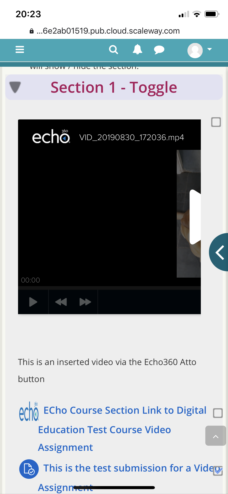

# Feedback for Echo360 on Integration

# I\] Samesite is a very big problem - what are you doing about it?

Every single browser fails. Except Chrome for now, but not for long.

Guides make it seem it's a user issue but it's an implementation issue 

# II\] Accessibility

Failures:

-   Can't navigate with tab, pop up gets stuck on X for close window, → <https://tracker.moodle.org/browse/MDL-67365> (fixed in Moodle 3.8/3.9?)
-   Can't navigate with tab, then if clicking in embed area, the "Create New Media" and "Upload New Media" options can't be selected.
-   Wave report indicates many errors specifically referring to Echo portion of the window.

Link to Keyboard tabbing article broken, guessing this is it <https://a11yproject.com/posts/macos-browser-keyboard-navigation/>

This does not fix the above issues as far as I can see.

# III\] Mobile 

Video embeds are not responsive and don't look great on mobile devices

# IV\] Plans for Moodle Integration

What are the plans for the Moodle Integration?

Is an Institutional Video Library aspect still on the roadmap? If so, how will this work with the current integration?

# V\] Security Flaw

The link for this video <https://echo360.org.uk/media/52c63638-71a3-4829-a754-f356edc55e65> is translated to this secure link to it -&gt; <https://echo360.org.uk/secure-links/06a2a966-e8e0-49bf-a406-c2bc6f7496f2/access>

If someone without the necessary Moodle access is given the secure link URL, then they are granted the full viewing access. 

Admittedly, this requires someone with access to the secure link to share it with someone not authorised, AND for the unauthorised user viewing it to be logged into Echo360 from the same institution.

# VI\] Presentation type embeds

Can upload pdf and pptx but not embed (404)

# VII\] Processing times for large file

7.5GB file took 4 hours to process.

Might be helpful to have better progress reporting

