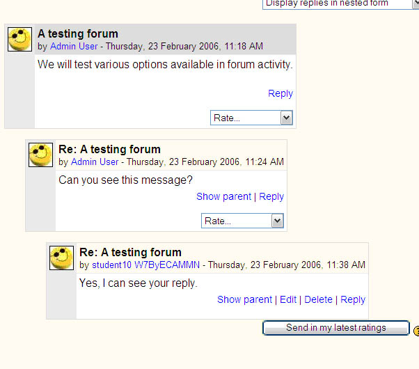
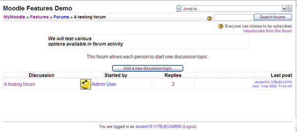
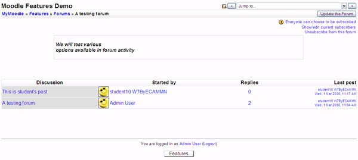
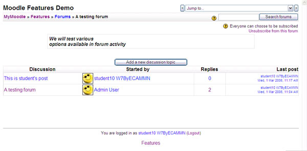
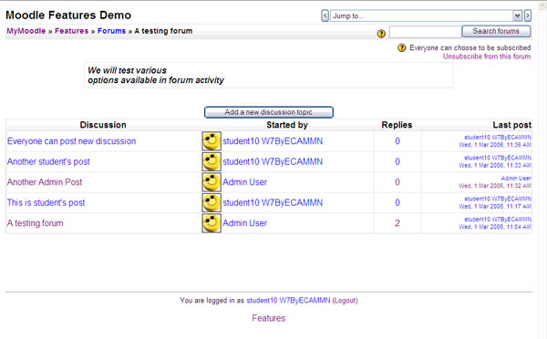
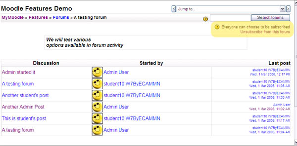
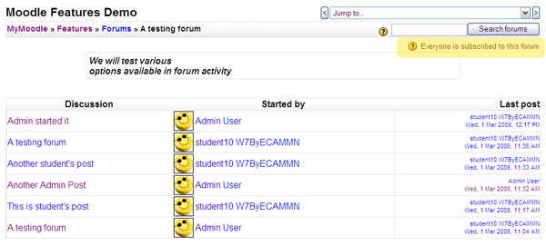
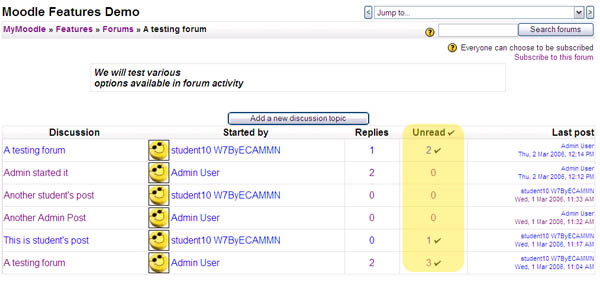

# Forum Test Plan

# FOR001TS Testing Forum Type (Single Simple Discussion)

1.  Click the **Turn editing on** button on the top right corner window.
2.  And go to the **Forums** topic, click the **Add an activity…** dropdown box and choose **Forum**
3.  You should get the configuration-setting page for new forum.
    1.  In the **Forum name**, type **A testing forum**
    2.  In the **Forum type** drop-down box, choose **A single simple discussion.**
    3.  In the **Forum introduction**, type **We will test various options available in forum activity**.
    4.  In the **Group Mode** drop-down box, choose **No groups.**
    5.  Leave the other options as their default values.
    6.  Click **Save and display**.
4.  You should get a new page that shows your posting saying **We will test various options available in forum activity**
5.  Click the **Reply** link and you should get a text-box form in a new page where you can type your reply. Type any text in the box and click **Post to forum**.
6.  You should get a confirmation page and automatically redirected to the forum page.
7.  Now, go to the student’s browser (if you have closed it, open the page using different browser and login using student’s access) and go the forum page (**A testing forum**)
8.  You should be able to see both postings that you have just made using admin privilege. Click **Reply** in the second admin’s post, type any text in the text-box and click **Post to forum**.
9.  You should get a page looks like the following:
    

# FOR002TS Testing Forum Type (Each person posts one discussion)

1.  Go to the admin’s browser, now update the forum setting, either by going back to the Course Main page and clicking the edit button next to the forum’s title or by clicking the **Update this Forum** button on the corner of forum page.
2.  Change the **Forum Type** to **Each person posts one discussion** and click **Save Changes**. This option allows each person to post one discussion ONLY in the forum.
3.  You should get a new page where you can see a table listing the discussion. There should be one discussion in this forum, titled ‘**A testing forum**’.
4.  As an admin you will not be able to post a new discussion since you have already started one (‘**A testing forum**’).
5.  However, if you look at the same page using the student’s browser, you should be able to see the ‘**Add a new discussion topic**’ button that allows the student to post a new discussion.
    
6.  Now, click the button, and you should see the text-box form to post a new discussion.
    1.  Type ‘**Student’s Discussion**’ as the Subject.
    2.  Type any text in the **Message** text-box.
    3.  Click ‘**Post to forum**’
7.  You should have two discussion topics now. The ‘**Add a new discussion topic**’ button should have gone, just like the screenshot below. A user is only allowed to start one discussion.
    

# FOR003TS Testing Forum Type (Standard forum for general use)

1.  Go back to the admin’s browser again, now update the forum setting, either by going back to the **Course Main** page and clicking the (edit) button next to the forum’s title or by clicking the **Update this Forum** button on the corner of forum page.
2.  Change the **Forum Type** to Standard forum for general use and click **Save Changes**. This option allows each person to post more than one discussion in the forum.
3.  You should get a new page where you can see a table listing the discussion. There should be one discussion in this forum, titled ‘**A testing forum**’. Just like what we have before.
4.  However, you should see the ‘**Add a new discussion topic**’ button, both from the admin and student view.
    
5.  Try adding new discussions both from admin and student’s access. Student and Admin should be able to add new discussions.
6.  Try deleting a forum posting as an Admin
7.  You should get a warning asking you if you are sure you want to delete the post and all replies (if there are any)...
    

# FOR004TS Testing Forum Subscription

1.  Now, we are going to test forum subscription through email. Go back again to admin’s browser and update the forum’s setting.
2.  You can see the option **Subscription Mode** is set default to **Optional Subscription**
3.  From the student’s browser, open the forum again (**A testing forum**). In the forum settings block on the right, you can see '**Optional Subscription**'.
    
4.  Click the **unsubscribe from this forum** link. You should get a confirmation message that you have just **unsubscribed from the forum**.
5.  The **unsubscribe from this forum** link has now been changed to **subscribe to this forum**. Click the link again, and now you will be subscribed back to the forum.
6.  Now, go back to admin’s browser and update the forum’s setting. Change the option **Subscription Mode** from **Optional Subscription** to **Forced** **Subscription**. If set this value then students will not be able to unsubscribe themselves from the forum (ie. forever subscribed).
7.  Click **Save Changes**
8.  From the student’s browser, open the forum again (**A testing forum**). You should see 'Forced subscription' in the Forum settings block, with no **Unsubscribe from this forum** link.
    

# FOR005TS Testing Forum Subscription (Auto subscription)

1.  Go back to admin’s browser and update the forum’s setting. Change the option **Optional Subscription** to **Auto subscription**
2.  With this option active, all current and future course users will be subscribed initially but they can unsubscribe themselves at any time.
3.  Now, if you switch back to student’s browser, you will be able to see the **unsubscribe** link in the settings. To make sure everything works well, click **unsubscribe**, you will get a confirmation message. Click the link again, and now you will be subscribed back to the forum.

# FOR006TS Testing Forum Tracking

1.  NB This test only possible if read tracking is enabled at Site wide level in Site Admin settings for forum.
2.  Go back to admin’s browser and update the forum’s setting. Change the option **Read tracking for this forum** from **Optional** to **Forced**. If this option is set to **Forced** then users can track read and unread messages in forums and discussions.
3.  The discussion lists should look different now, you will have an column addition, called **Unread**. (screenshot below)
    

# FOR007TS Testing Forum Ratings

1.  Go back to admin’s browser and update the forum’s setting. Now we are testing the **Post Rating**.
2.  Go to **Ratings** and select a rating method from the **Aggregrate Type** dropdown.
3.  Choose a scale from the **Scale** dropdown
4.  Leave the Restrict ratings to post with dates in this range un-ticked. 
5.  Now go to one of the discussion (still using the admin priviledge), you should see a **dropdown box** where you could put rating for a particular post.
6.  You will see the rating is displayed under the post. 

# FOR008TS Testing Forum Visibility

1.  Go back to admin’s browser and update the forum’s setting.
2.  Change the value of **Visible to students** from **Show** to **Hide.**
3.  Click **Save changes**
4.  Go to student’s browser and refresh the page, you should get an error message saying **“Sorry, this activity is currently hidden”**. You will be directed to the course page and you should not be able to see the forum, since it is now hidden.

## Attachments:

 [Tests-forum1.jpg](attachments/158339418/158339407.jpg) (image/jpeg)
 [Tests-forum2.jpg](attachments/158339418/158339410.jpg) (image/jpeg)
 [Tests-forum3.jpg](attachments/158339418/158339412.jpg) (image/jpeg)
 [Tests-forum4.jpg](attachments/158339418/158339413.jpg) (image/jpeg)
 [Tests-forum5.jpg](attachments/158339418/158339414.jpg) (image/jpeg)
 [Tests-forum9.jpg](attachments/158339418/158339415.jpg) (image/jpeg)
 [Tests-forum10.jpg](attachments/158339418/158339416.jpg) (image/jpeg)
 [Tests-forum11.jpg](attachments/158339418/158339417.jpg) (image/jpeg)

