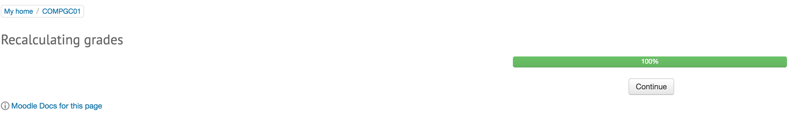

# General Moodle Issues and Fixes

test

### **Looping grade calculation**

<https://moodle.org/mod/forum/discuss.php?d=336933>

Issue:

When logging into Moodle &gt; navigate to the course that has the issue &gt; settings &gt; grades or grade book setup &gt; its shows the recalculating grades bar and reaches 100% but when clicking continue, nothing happens on the screen and just re loops

**Reason:**

This is caused by a problem with a custom calculation in the gradebook, which is referring to a grade item that no longer exists and causing this 'recalculating grades' loop.

Fix:

1.      Run the query SELECT \* FROM \`mdl\_grade\_items\` WHERE \`courseid\` = enter the course id AND \`needsupdate\` = 1;

2.      Results will show which ID has a calculation

3.      Navigate to the address changing the coursed and id as required

[https://moodle.ucl.ac.uk/grade/edit/tree/calculation.php?courseid=**2818**&id=**4789**&gpr\_type=edit&gpr\_plugin=tree&gpr\_courseid=**2818**](https://moodle.ucl.ac.uk/grade/edit/tree/calculation.php?courseid=2818&id=4789&gpr_type=edit&gpr_plugin=tree&gpr_courseid=2818)

4.      The Item name should be empty so has been deleted but the calculation still remains.  Delete the calculation &gt; save changed and now the grade page will load fine

\*\*\*\*\*\*\*\*\*\*\*\*\*\*\*\*\*\*\*\*\*\*\*\*\*

### Blank moodle course page due to invalid a rss feed block containing a invalid URL

<https://moodle.org/mod/forum/discuss.php?d=227613>

**Issue:**

When navigation to a Moodle course page; the page does not load and left with a blank screen

**Reason:**

When turning Moodle debugging on it shows the error message "Error loading this RSS feed (cURL Error: name lookup timed out)".  There is a rss block that is using a URL that’s moodle does like

**Fix:**

1.  Run query changing instanceid to id from the moodle URL

SELECT \* FROM moodle\_live.mdl\_context WHERE instanceid = 7121;

1.  Run Query getting the parentcontextid from the previous query that has a context level of 50

SELECT \* FROM moodle\_live.mdl\_block\_instances WHERE parentcontextid = 400159;

The issue lies with one of the rss\_client entries within in the blockname field.  Check DEV/UAT if possible to view the course &gt; turning editing on &gt; edit the rss block to view to match up with the id in the query results otherwise it will be trial and error to delete a rss\_client field one by one until the pages loads fine

**
**

## Attachments:

 [screenshot2.png](attachments/62801776/62801789.png) (image/png)

