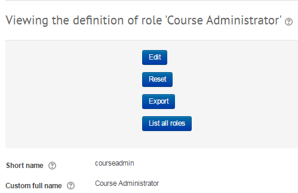

# Hide activity from "add an activity or resource" menu chooser

[Forum Post: https://moodle.org/mod/forum/discuss.php?d=272545](https://moodle.org/mod/forum/discuss.php?d=272545)

 

1. Click site admin &gt;  users &gt; permissions &gt; define roles

2. Click on the role you want to edit

3. Click edit button

 

4. Scroll down and within the filter search box, type the name of the original component activity name as typing the rename wont be found

 

5. Untick the capability "mod/../addinstance" allow permission &gt; save

 

6. Log in as a user who the role that has just been modified and the activity will now be hidden from the activity chooser menu but other roles will still see the activity as normal and existing activities in the course are still accesible.

\*\*Before\*\*                                                                                                                     

    

  \*\*After\*\*

     

## Attachments:

 [image2017-7-6 16:57:52.png](attachments/70127488/70127468.png) (image/png)
 [image2017-7-6 16:59:53.png](attachments/70127488/70127469.png) (image/png)
 [image2017-7-6 17:0:46.png](attachments/70127488/70127471.png) (image/png)
 [image2017-7-6 17:1:26.png](attachments/70127488/70127472.png) (image/png)
 [image2017-7-6 17:3:30.png](attachments/70127488/70127474.png) (image/png)
 [image2017-7-6 17:4:13.png](attachments/70127488/70127476.png) (image/png)
 [image2017-7-6 17:5:26.png](attachments/70127488/70127478.png) (image/png)
 [image2017-7-6 17:17:46.png](attachments/70127488/70127482.png) (image/png)
 [image2017-7-6 17:18:27.png](attachments/70127488/70127483.png) (image/png)
 [image2017-7-6 17:19:25.png](attachments/70127488/70127485.png) (image/png)
 [image2017-7-6 17:20:29.png](attachments/70127488/70127487.png) (image/png)
 [image2017-7-6 17:33:27.png](attachments/70127488/70127495.png) (image/png)
 [image2017-7-6 17:35:4.png](attachments/70127488/70127497.png) (image/png)
 [image2017-7-6 17:35:52.png](attachments/70127488/70127498.png) (image/png)
 [image2017-7-6 17:44:9.png](attachments/70127488/70127502.png) (image/png)
 [image2017-7-6 18:5:9.png](attachments/70127488/70127505.png) (image/png)
 [image2017-7-13 9:54:11.png](attachments/70127488/70129342.png) (image/png)
 [image2017-7-13 10:6:29.png](attachments/70127488/70129350.png) (image/png)

