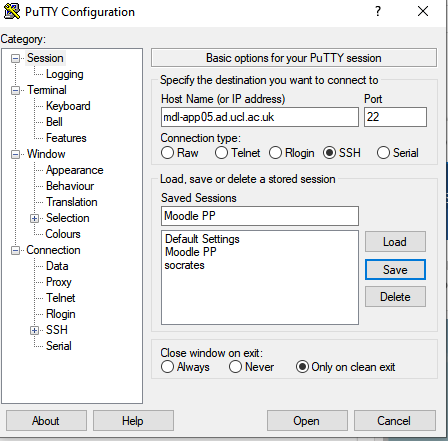
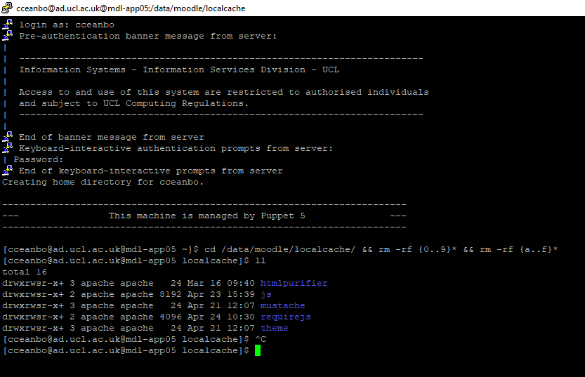

# How to Clear Cache on Moodle Server

On Windows you need a client like Putty (see below)

Open Putty and connect to the desired server with SSH



Login with your username and password ( you need to have been granted access to the server beforehand)

Run the following command 

``` bash
cd /data/moodle/localcache/ && rm -rf {0..9}* && rm -rf {a..f}* 
```

You can check with *ll* before and after to verify the files have cleared



## Attachments:

 [image2020-4-24\_15-41-24.png](attachments/135761708/135761712.png) (image/png)
 [image2020-4-24\_16-22-16.png](attachments/135761708/135761720.png) (image/png)
 [image2020-4-24\_16-24-42.png](attachments/135761708/135761722.png) (image/png)

