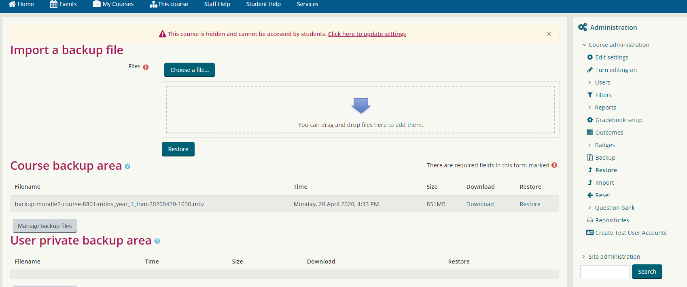
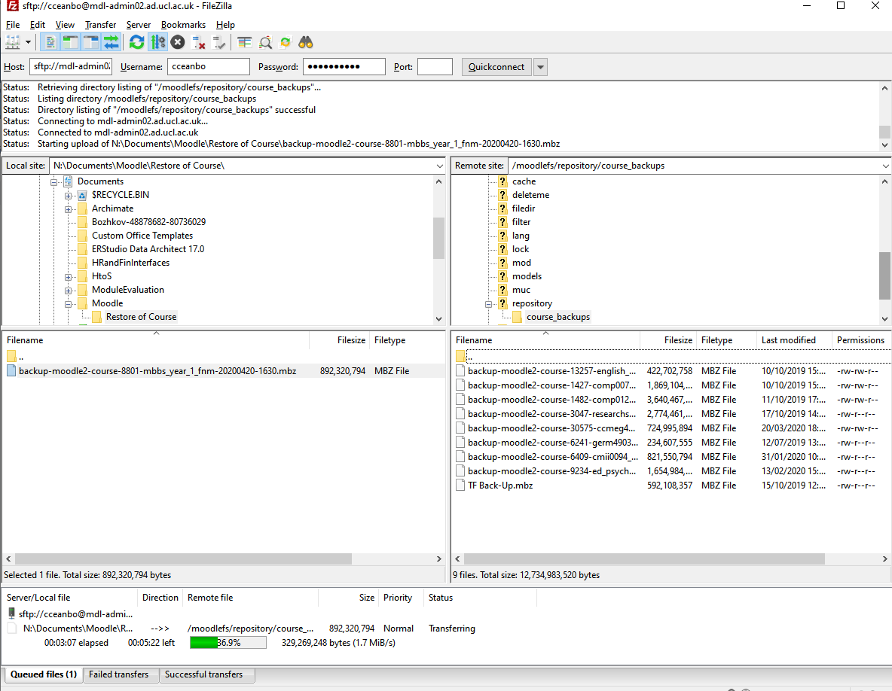

# How to Create Single Course Backup

1.  Navigate to the Moodle instance you want to restore from ( you need admin rights). 
2.  Find the course you want to restore 
3.  Locate the Administration section on the right hand side and either
    1.  Go to Backup and start the backup creation process
    2.  Or under Restore check if there is already a backup file.
    3.  
4.  Download the file.
5.  If you need to place the backup file on ucl server use Filezilla(Windows) or SCP(Linux) 

    SCP &lt;username&gt;[@mdl-admin02.ad.ucl.ac.uk](mailto:cceanbo@mdl-admin02.ad.ucl.ac.uk):/moodlefs/repository/course\_backups/

6.  Using FIleZilla connect to the following server using your ucl username and password and port 22 

    [mdl-admin02.ad.ucl.ac](http://mdl-admin02.ad.ucl.ac).[uk:/moodlefs/repository/course\_backups/](http://uk/moodlefs/repository/course_backups/)

    

7.  Transfer the downloaded backup file in the above folder.

## Attachments:

 [image2020-4-24\_0-51-21.png](attachments/135761388/135761396.png) (image/png)
 [image2020-4-24\_0-54-14.png](attachments/135761388/135761398.png) (image/png)

