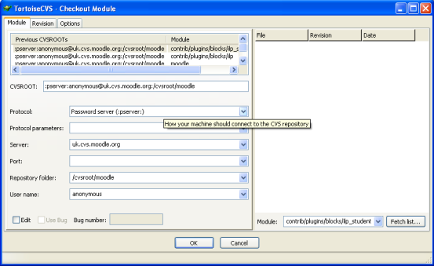
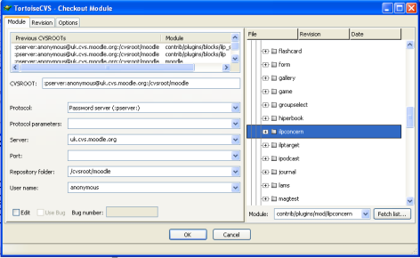
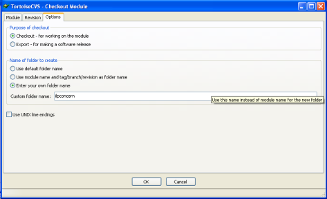

# Installing ILP

# Installing the Activity Module: Individual Learning Plan (ILP)

This module consists of 4 pluggins, 2 modules(or activities) and 2 blocksThere are 4 folders that need to be installed in moodle for the ILP module:
[blocks/ilp](http://download.moodle.org/plugins/blocks/ilp.zip) [blocks/ilp\_student\_info](http://download.moodle.org/plugins/blocks/ilp_student_info.zip) [mod/ilpconcern](http://download.moodle.org/plugins/mod/ilpconcern.zip) [mod/ilptarget](http://download.moodle.org/plugins/mod/ilptarget.zip)
These instructions use cvs (assumes tortoisecvs installed) to download the files which is a much more efficient method of installing pluggins since it is much quicker to update the files when a new version of the pluggin becomes available. All you need to do is right click on the folder and select 'CVS update' Each of the 4 folders need to be checked out of cvs individually.

### Check out the ilpconcern folder

1.  Change to the moodle/blocks folder
2.  Right click in the moodle/mod folder.
3.  Select CVS-&gt;checkout…
4.  Select the module tab and setup the fields in the left hand window as below.

1.  Click on the 'fetch list…' button to the right of Module. This will display a list of folders in the moodle repository
2.  The modules are in the contrib/pluggins folder so click on the '+' sign to the left of contribs to expand the contribs folder
3.  Expand the pluggins folder
4.  Expand the mod folder
5.  Select the ilpconcern folder

The module field should now display contrib/pluggins/blocks/ilpconcern

1.  Click on the options tab and select the 'Enter your own folder name radio button.
2.  In the 'custom folder name field' type ilpconcern.

Note. If you don't type a folder name here, your checkout files will be created in moodle/mod/contrib/pluggins/mod/iplconcern.
Click Ok.

### Check out the ilptarget folder

Repeat steps 1 to 3.
You shouldn't need to do step 4 as tortoise cvs will remember your setting from before.
Click on the fetch list button
Select the contrib/plugins/mod/ilptarget folder
Select the options tab and select the 'enter your own folder name' radio button.
Type 'ilptarget' in the custom folder name.
Click ok.
UCL specific customisation
Displaying colors for status
Copy ilp.css to the theme folder used for moodle
Modify the config.php within the theme folder used for moodle:
$THEME-&gt;sheets = array('fw\_layout','fw\_color','fw\_fonts','ilp');

### Renaming report to PLP report

Modify moodle/lang/en\_utf8.php/ilpconcern.php
Modify:
$string\['modulename'\] = 'Report';
To:
$string\['modulename'\] = 'PLP Report';
Modify:
$string\['modulenameplural'\] = 'Reports';
To:
$string\['modulenameplural'\] = 'PLP Reports';

### Renaming Targets to PLP Targets

Modify moodle/lang/en\_utf8.php/ilptarget.php
Modify
$string\['modulename'\] = 'Target';
To:
$string\['modulename'\] = 'PLP Target';
Modify:
$string\['modulenameplural'\] = 'Targets';
To:
$string\['modulenameplural'\] = 'PLP Targets';

### Displaying the icons

Copy /mod/ilpconcern/pix/icon.gif to /moodle/pix/mod/ilpconcern/icon.gif
Copy /mod/ilptarget/pix/icon.gif to /moodle/pix/mod/ilptarget/icon.gif
Copy /mod/ilptarget/pix/complete.gif to /moodle/pix/mod/ilptarget/target.gif

## Attachments:

 [worddavf3a7d7511ce65aff0d26fc209c8d5f85.png](attachments/6784018/6946886.png) (image/png)
 [worddava47e1bda926d92d7f1afbc733990195d.png](attachments/6784018/6946887.png) (image/png)
 [worddav0e1b72f0c87dbc8f06d1b0631808ecd4.png](attachments/6784018/6946888.png) (image/png)

