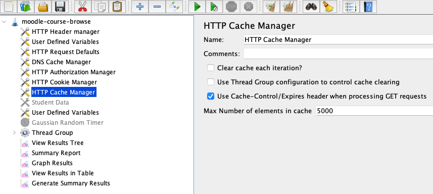
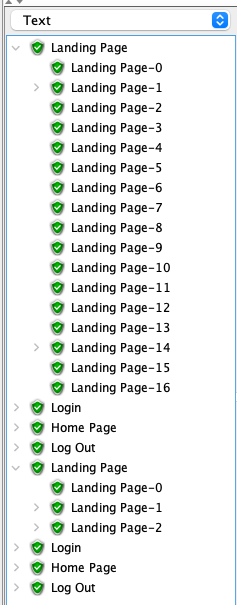
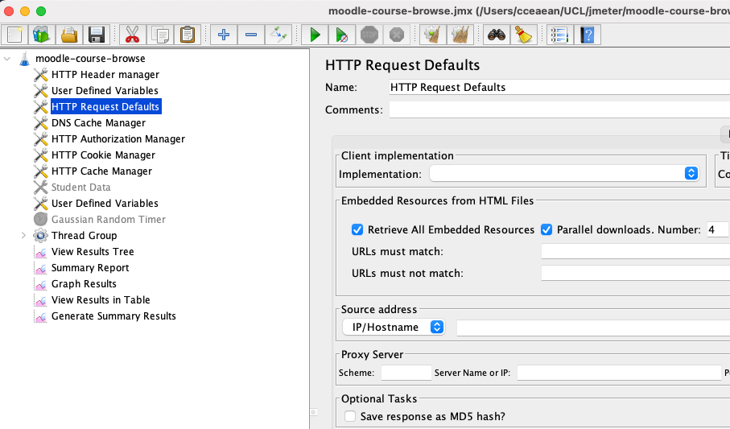
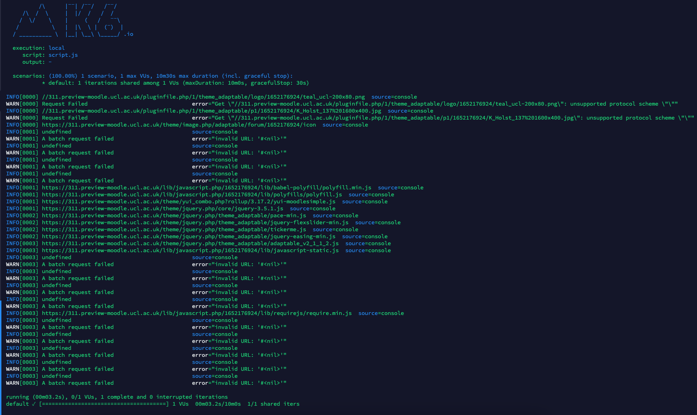

# K6 Automated Load Testing

-   -   [What is K6](#K6AutomatedLoadTesting-WhatisK6)
-   [Learning Apps Pipeline Integration](#K6AutomatedLoadTesting-LearningAppsPipelineIntegration)
    -   [Installation](#K6AutomatedLoadTesting-Installation)
    -   [Integration with Jenkins](#K6AutomatedLoadTesting-IntegrationwithJenkins)
    -   [Integration with GitHub actions](#K6AutomatedLoadTesting-IntegrationwithGitHubactions)
    -   [Integration with GitLab CICD](#K6AutomatedLoadTesting-IntegrationwithGitLabCICD)
-   [Writing Test Scripts](#K6AutomatedLoadTesting-WritingTestScripts)
-   [Executing Load Tests](#K6AutomatedLoadTesting-ExecutingLoadTests)
-   [Tests Results Output](#K6AutomatedLoadTesting-TestsResultsOutput)
-   [Areas of improvement for K6](#K6AutomatedLoadTesting-AreasofimprovementforK6)
    -   [Caching](#K6AutomatedLoadTesting-Caching)
    -   [Embedded Resources](#K6AutomatedLoadTesting-EmbeddedResources)
-   [TI Sprint Stories](#K6AutomatedLoadTesting-TISprintStories)

## What is K6

<https://github.com/grafana/k6>

<https://k6.io/blog/k6-vs-jmeter/>

## Learning Apps Pipeline Integration

### Installation

K6 is simple to install and there is a docker image that we can run on the current CICD runner servers.  Once installed, to create a separate responsibly for K6 load testing.  This will include the Jenkins file and the the test scripts.

<https://k6.io/docs/getting-started/installation/>

### Integration with Jenkins

<https://k6.io/blog/integrating-load-testing-with-jenkins/>

Jenkins file

<https://git.automation.ucl.ac.uk/moodle/moodle-1819/-/blob/MOODLE_K6_LOAD_TESTING/Jenkinsfile>

Playbook

<https://git.automation.ucl.ac.uk/moodle/moodle-candidate-cicd/-/blob/main/playbook.yml>

Jenkins pipeline

<https://jenkins.automation.ucl.ac.uk/job/moodle/job/candidate-builds/job/moodle-1819/job/MOODLE_K6_LOAD_TESTING/>

### Integration with GitHub actions

Add the necessary steps in the Jenkins file to integrate with Jenkins.  Once we get access to GitHub Enterprise from the Dev Ops team, then we will move to GitHub actions.

<https://k6.io/blog/load-testing-using-github-actions/>

<https://github.com/ehsan42/K6/actions/workflows/main.yml>

### Integration with GitLab CICD

<https://gitlab.com/ehsananwar100/k6-gitlab-example/-/jobs>

## Writing Test Scripts

<https://k6.io/docs/test-authoring/recording-a-session/browser-recorder/>

The browser recorder is a browser extension that allows the recording of steps that get turned into a test script that is saved to the cloud account.

<https://k6.io/docs/cloud/creating-and-running-a-test/script-editor/>

There is a online editor to make changes to the script but it best to just copy the code from the recording and paste into a local editor to makes changes.  Visual Studio is best recommenced.

JMeter has a GUI which means writing, troubleshooting and running of the scripts can all be done in one application.  As K6 is primary focused as a command line application so to troubleshooting to a see a visual of the test steps, traffic can be routed through Postman to give more of a GUI experience for fixing/testing steps.

<https://k6.io/blog/load-testing-with-postman-collections/>

You can convert existing Jmeter scripts to K6.  Doesnt work well with a heavily scripted Jmeter test.  Best to build a basic test in Jmeter and build further in K6.  Example below on how to convert

<https://github.com/grafana/jmeter-to-k6>

sudo docker run -it -v "/Users/cceaean/UCL/jmeter/:/output/" loadimpact/jmeter-to-k6 /Users/cceaean/UCL/jmeter/HTTP\\ Request.jmx -o /output/MyTestOutput/

Testing script

<https://git.automation.ucl.ac.uk/moodle/k6-load-testing-scripts>

## Executing Load Tests

<https://k6.io/docs/getting-started/running-k6/>

Initially writing and testing the scripts should be done locally with a single user to check through that the script is functioning correctly.  Once happy with the results, then full load test can be ran using the pipeline integration as mentioned above.

## Tests Results Output

<https://k6.io/docs/getting-started/results-output/>

<https://k6.io/docs/results-visualization/>

K6 provides a simple summary of the test results, this is useful for local testing but K6 has great integration with other metric tools that provides much more better output of the results.  We will integrate K6 with new relic so we can compare with real live Moodle metrics.

<https://k6.io/docs/results-visualization/new-relic/>

## Areas of improvement for K6

### Caching

JMeter has a config element called 'HTTP Cache Manager' which has a real great benefit of emulating a a real user of returning to Moodle where unless its their first time, requests are cached and this has a dramatic affect on the load performance



For example with cache enabled.  When a virtual user going to the moodle login page for the first time, alot of resources are requested.  Within the same running test, when the same user interates through the test again, alot less resources are requested as they have been cached.



K6 does not implement any sort of caching so its means that everytime a virtual user in the load test visits the site, it like they are visiting for the first time repeatly which is unrelastic.  Unfortunately its not on their roadmap off features to add in the future <https://github.com/grafana/k6/issues/142>

### Embedded Resources

JMeter has a config element called 'HTTP Requests Defaults' that allows the downloading of embedded resources i.e. css, img, js which are done in parallel.



In K6, embedded resources are located as following.  Using parsehtml <https://k6.io/docs/examples/parse-html/> the code locates every element and attribute that is specificed.  Example the code would locate in the html body &lt;img src="//[moodle-staging.ucl.ac.uk/pluginfile.php/1/theme\_adaptable/logo/1652203599/teal\_ucl-200x80.png](http://moodle-staging.ucl.ac.uk/pluginfile.php/1/theme_adaptable/logo/1652203599/teal_ucl-200x80.png)" id="logo" alt="Logo"&gt;  

``` js
export default function() {

 const res = http.get("https://311.preview-moodle.ucl.ac.uk");
  const doc = parseHTML(res.body);
   doc.find('img').toArray().forEach(function (item) {
       //console.log(item.attr('src'));
       //http.get(item.attr("src"))
  const responses = http.batch([
    ['GET', (item.attr("src")), null, { tags: { ctype: 'html' } }],
]);
});
};
```

Unfortnately this is not as clean as JMeter where some embeded resources are fine and most requests shows undefined/failed



## TI Sprint Stories

| Story | Summary                                      | Description                                                  | Acceptance Criteria                                                     | Story Points |
|-------|----------------------------------------------|--------------------------------------------------------------|-------------------------------------------------------------------------|--------------|
| 1     | Install docker on the pipeline runner server | -   HIS team to install docker on the pipeline runner server 
   -   Download the docker image and run container               | Docker has been installed and K6 running in container                   | 2            |
| 2     | Setup docker file with Jenkins               | -   Create new repository                                    
   -   Create the Docker file for the steps to run               
   -   Setup integration with Jenkins                            | New repository has been created with Docker file and setup with Jenkins | 3            |
| 3     | Create simple browsing script                | -   Use recorder to record scripts                           
   -   Use local editor to edit the scripts                      
   -   Copy the existing JMeter script as a guideline            
   -   Run scripts locally to test                               | Simple browsing script has been created                                 | 4            |
| 4     | Integrate K6 with New Relic                  | -   Setup K6 with New Relic for output visualization         | K6 has been setup with New Relic                                        | 2            |
| 5     | Perform Load Test                            | -   Run a real load test against moodle-staging              | Load test has been completed                                            | 3            |
| 6     | Analyse Results                              | -   Analyse the results and feedback to the team             | Analyses and feedback completed                                         | 2            |

## Attachments:

 [Screenshot 2022-05-11 at 12.45.48.png](attachments/194972516/205623879.png) (image/png)
 [Screenshot 2022-05-11 at 13.06.50.png](attachments/194972516/205623892.png) (image/png)
 [Screenshot 2022-05-11 at 20.18.01.png](attachments/194972516/205624225.png) (image/png)
 [Screenshot 2022-05-11 at 20.42.52.png](attachments/194972516/205624231.png) (image/png)

## Comments:

<table>
<colgroup>
<col width="100%" />
</colgroup>
<tbody>
<tr class="odd">
<td><p>1 is already done.</p>
<p><br />
</p>
<p>Ehsan Anwar I would pencil this in for sprint 4 &amp; 5. Place those stories into the relevant sprints </p>
<p><br />
</p>
<p>for 2 take a look at Moodle candidate pipeline that’s how it works. But you will need for this to be ansible not Jenkins </p>
<p>I would have thought 3 might have taken longer(?) seems like login to service with 10 users would be a good example to flesh out wether it can do what’s needed.</p>
<p><br />
</p>
<p><br />
</p>
<p><br />
</p>
<div class="smallfont" align="left" style="color: #666666; width: 98%; margin-bottom: 10px;">
 Posted by cceaasp at Jan 28, 2022 18:09
</div></td>
</tr>
</tbody>
</table>


