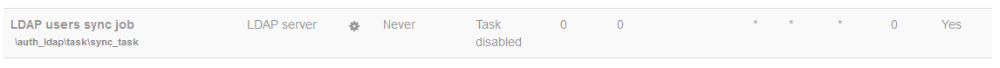

# LDAP auth create users

-   [How to set up new](#LDAPauthcreateusers-Howtosetupnew)
    -   [The code](#LDAPauthcreateusers-Thecode)
    -   [The cron](#LDAPauthcreateusers-Thecron)
-   [How to stop old](#LDAPauthcreateusers-Howtostopold)

## How to set up new

### The code

edit auth/ldap/auth.php    and on line 667  change $do\_updates from true to false - although this doesnt always seem to work.  Can also comment out the section of code where it does the updates.

This stops the sync users script trying to go through ALL the accounts and updating them. Only need to add new accounts.

File is auth/ldap/auth.php

a temporary table gets built at 675   - to hold ALL the user records retrieved from LDAP.

What we want to do is add a line so it hase a field for email.  Something like       $table-&gt;add\_field('email', XMLDB\_TYPE\_CHAR, '100', null, XMLDB\_NOTNULL, null, null);

``` php
 $dbman = $DB->get_manager();
    /// Define table user to be created
        $table = new xmldb_table('tmp_extuser');
        $table->add_field('id', XMLDB_TYPE_INTEGER, '10', XMLDB_UNSIGNED, XMLDB_NOTNULL, XMLDB_SEQUENCE, null);
        $table->add_field('username', XMLDB_TYPE_CHAR, '100', null, XMLDB_NOTNULL, null, null);
        $table->add_field('mnethostid', XMLDB_TYPE_INTEGER, '10', XMLDB_UNSIGNED, XMLDB_NOTNULL, null, null);
        $table->add_key('primary', XMLDB_KEY_PRIMARY, array('id'));
        $table->add_index('username', XMLDB_INDEX_UNIQUE, array('mnethostid', 'username'));
        print_string('creatingtemptable', 'auth_ldap', 'tmp_extuser');
        $dbman->create_temp_table($table);
```

then at 925

we would need to check that the email IS getting passed from LDAP    so check if there is anything in $user-&gt;email

``` php
$sql = 'SELECT e.id, e.username
                  FROM {tmp_extuser} e
                  LEFT JOIN {user} u ON (e.username = u.username AND e.mnethostid = u.mnethostid)
                 WHERE u.id IS NULL';
        $add_users = $DB->get_records_sql($sql);

        if (!empty($add_users)) {
            print_string('userentriestoadd', 'auth_ldap', count($add_users));

            $sitecontext = context_system::instance();
            if (!empty($this->config->creators) and !empty($this->config->memberattribute)
              and $roles = get_archetype_roles('coursecreator')) {
                $creatorrole = array_shift($roles);      // We can only use one, let's use the first one
            } else {
                $creatorrole = false;
            }

$transaction = $DB->start_delegated_transaction();
            foreach ($add_users as $user) {
                $user = $this->get_userinfo_asobj($user->username);
                // Prep a few params
                $user->modified   = time();
                $user->confirmed  = 1;
                $user->auth       = $this->authtype;
                $user->mnethostid = $CFG->mnet_localhost_id;
                // get_userinfo_asobj() might have replaced $user->username with the value
                // from the LDAP server (which can be mixed-case). Make sure it's lowercase
                $user->username = trim(core_text::strtolower($user->username));
                // It isn't possible to just rely on the configured suspension attribute since
                // things like active directory use bit masks, other things using LDAP might
                // do different stuff as well.
                //
                // The cast to int is a workaround for MDL-53959.
                $user->suspended = (int)$this->is_user_suspended($user);
                if (empty($user->lang)) {
                    $user->lang = $CFG->lang;
                }
                if (empty($user->calendartype)) {
                    $user->calendartype = $CFG->calendartype;
                }
                $id = user_create_user($user, false);
                echo "\t"; print_string('auth_dbinsertuser', 'auth_db', array('name'=>$user->username, 'id'=>$id)); echo "\n";
                $euser = $DB->get_record('user', array('id' => $id));
                if (!empty($this->config->forcechangepassword)) {
                    set_user_preference('auth_forcepasswordchange', 1, $id);
                }
                // Add course creators if needed
                if ($creatorrole !== false and $this->iscreator($user->username)) {
                    role_assign($creatorrole->id, $id, $sitecontext->id, $this->roleauth);
                }
            }
            $transaction->allow_commit();
            unset($add_users); // free mem
```

### The cron

go to

/admin/tool/task/scheduledtasks.php



3rd down.  You can enable or disable.  Cron timings format   \*/20  =  every 20 mins,     \* = every minute    ,    20 = on the 20th minute

To monitor cron progress -

## How to stop old

file "webct-data" gets dropped in to   /nfs/rcs/sysman/cso/upi    (production only)

and gets read by

ucl-mdl-usersync.php

which lives in ucl tools

Assume it is cronned somewhere

## Attachments:

 [image2018-9-6\_15-36-56.png](attachments/62803032/96726596.png) (image/png)

