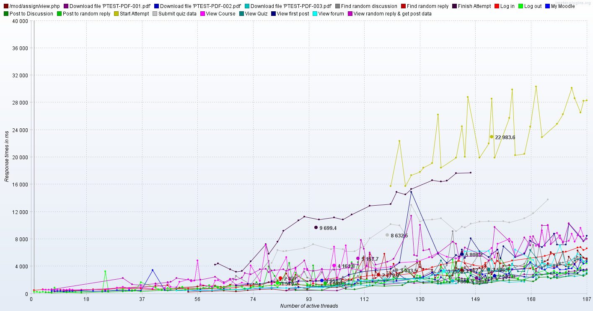
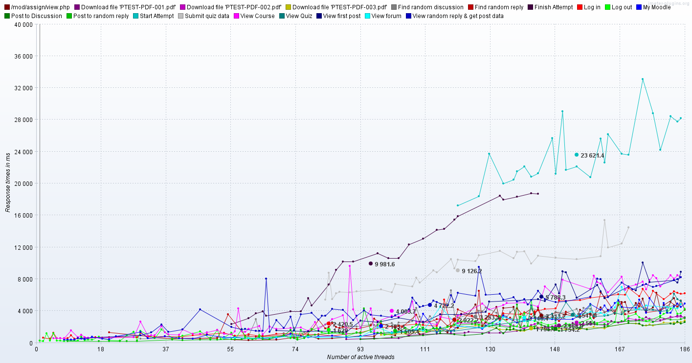
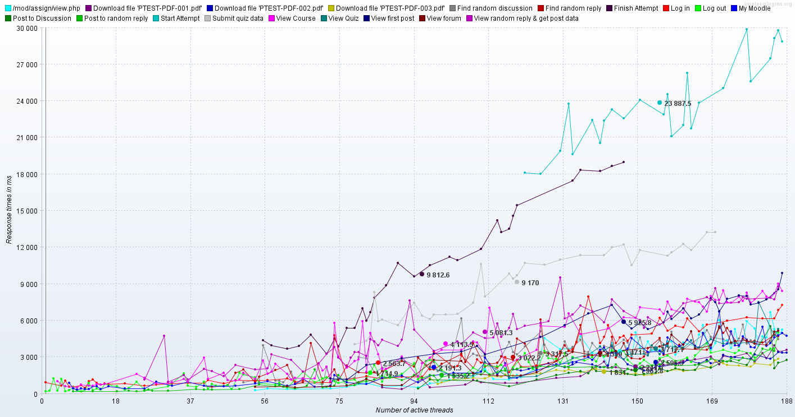

# Load testing for 2.4

# Scope

To carry out a performance benchmarking exercise on a copy of the current live Moodle platform (both 2.4.7 version of code and live data) running on a separate load testing environment that is as close the the current live infrastructure as is realistically possible. We will then run the same tests on an upgraded environment and compare the results.

# Approach

Moodle access logs are available for each academic year. The 2013-14 logs (to date) reveal the top ten most popular module types (by hits) to be:

<table>
<colgroup>
<col width="50%" />
<col width="50%" />
</colgroup>
<thead>
<tr class="header">
<th>
hits
</th>
<th>
module
</th>
</tr>
</thead>
<tbody>
<tr class="odd">
<td>
8835347
</td>
<td>
resource
</td>
</tr>
<tr class="even">
<td>
5549069
</td>
<td>
quiz
</td>
</tr>
<tr class="odd">
<td>
3514364
</td>
<td>
user
</td>
</tr>
<tr class="even">
<td>
3358386
</td>
<td>
turnitintool
</td>
</tr>
<tr class="odd">
<td>
1421691
</td>
<td>
forum
</td>
</tr>
<tr class="even">
<td>
959879
</td>
<td>
assign
</td>
</tr>
<tr class="odd">
<td>
814072
</td>
<td>
url
</td>
</tr>
<tr class="even">
<td>
792964
</td>
<td>
book
</td>
</tr>
<tr class="odd">
<td>
681961
</td>
<td>
folder
</td>
</tr>
<tr class="even">
<td>
533261
</td>
<td>
page
</td>
</tr>
</tbody>
</table>

A JMeter test script has been used which:

-   Downloads three separate PDF files (resource)
-   Attempts a hundred question quiz (quiz)
-   Posts a new discussion and replies to other posts (forum)
-   Submits an online text (assignment)

The script has been configured to run with a maximum of 50 concurrent (i.e. Apache instances) users. Ramp up period was 50 seconds (i.e. one user per second). Note that analysis of Moodle log data suggests approx 600 concurrent (note this is number of active users in any 5 minute window - a very different definition) users.

# Test Process

**You will need:**

-   JMeter - we used version 2.11 - [download from here](http://jmeter.apache.org/)
-   JMeterPlugins-Standard, JMeterPlugins-Standard - [download from here](http://jmeter-plugins.org/downloads/all/)
-   JMeter Test Script and associated data - [download](attachments/42008803/42205329.zip)
-   Moodle test course PTEST-01 - you will need to be recombined into a single ZIP file before extracting the .MBZ file contained therein: [backup-moodle2-course-197-ptest-01-20131114-1306.zip.001](attachments/42008803/42205330.001), [backup-moodle2-course-197-ptest-01-20131114-1306.zip.002](attachments/42008803/42205331.002), [backup-moodle2-course-197-ptest-01-20131114-1306.zip.003](attachments/42008803/42205332.003), [backup-moodle2-course-197-ptest-01-20131114-1306.zip.004](attachments/42008803/42205333.004)
-   Example test-run.bat file - [test-run.bat](attachments/42008803/42205334.bat)

Note that the JMeter test script references the Moodle test course and the plugins it contains by id and therefore the id numbers in the test script will need to be changed accordingly. Use the 'View Results Tree' listener to check that the page responses are those expected.

**Procedure:**

1.  Reset 'PTEST-01: Performance Test Module'
2.  Truncate mdl\_log table
3.  Run JMeter test from command line (not using the JMeter gui) using test-run.bat file.

**Notes:**

-   We are not purging any caches between runs.
-   We are only testing Moodle on a single application server (moodle-d.ucl.ac.uk). Catalyst have been commissioned by ELE to investigate performance of application landscape so we have concentrated only on application performance.

# Results

[Download results (ZIP file)](attachments/42008803/42205312.zip)

## Graph of Response Time vs. Threads - 1st run

## Graph of Response Time vs. Threads - 2nd run

## Graph of Response Time vs. Threads - 3rd run

## Attachments:

 [v247.zip](attachments/42008803/42205312.zip) (application/zip)
 [responsetime\_v\_threads\_1.png](attachments/42008803/42205313.png) (image/png)
 [responsetime\_v\_threads\_2.png](attachments/42008803/42205314.png) (image/png)
 [responsetime\_v\_threads\_3.png](attachments/42008803/42205315.png) (image/png)
 [jmeter.zip](attachments/42008803/42205329.zip) (application/zip)
 [backup-moodle2-course-197-ptest-01-20131114-1306.zip.001](attachments/42008803/42205330.001) (application/octet-stream)
 [backup-moodle2-course-197-ptest-01-20131114-1306.zip.002](attachments/42008803/42205331.002) (application/octet-stream)
 [backup-moodle2-course-197-ptest-01-20131114-1306.zip.003](attachments/42008803/42205332.003) (application/octet-stream)
 [backup-moodle2-course-197-ptest-01-20131114-1306.zip.004](attachments/42008803/42205333.004) (application/octet-stream)
 [test-run.bat](attachments/42008803/42205334.bat) (application/octet-stream)

