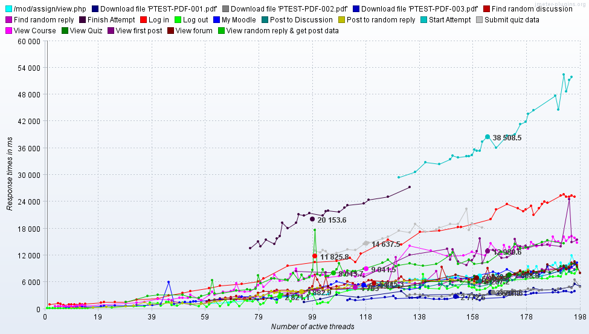
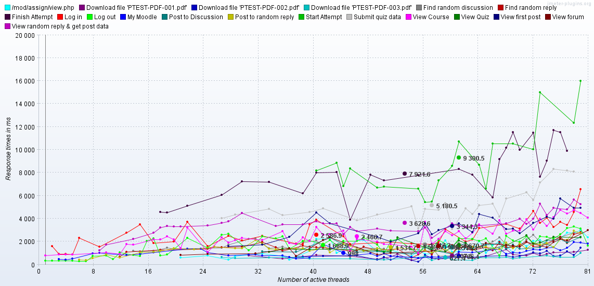

# Load testing for 2.6

# Scope, Approach & Test Process

Please see [Load testing for 2.4](https://wiki.ucl.ac.uk/display/ISMoodle/Load+testing+for+2.4). Both the 2.4.7 and 2.6.2 code were installed on the same infrastructure.

# Results

[Download results (ZIP file)](attachments/42008814/42205319.zip)

The following graphs are generated using default MUC settings (i.e. not using memcached).

## Graph of Response Time vs. Threads - 1st run

## Graph of Response Time vs. Threads - 2nd run

## Graph of Response Time vs. Threads - 3rd run

## Investigating Performance Improvements

The following potential performance factors have been investigated:

-   New Moode theme
-   MUC (variable) caching

Note that DCS and DBA teams are responsible for servers and databases respectively.

### Comparing response of 'Standard' and new 'UCL' theme

[Download results (ZIP file)](attachments/42008814/42205323.zip)

It can be seen from the graphs below that the response of the new UCL theme is very similar to Moodle's 'Standard' theme.

#### Response Time vs. Threads - 'Standard' Theme

#### Response Time vs. Threads - 'UCL' Theme

### Configuring MUC

We can configure the following to use memcached: *language strings, list of available plugins, database meta information, question definitions, HTML purifier cleaned content, config settings, course group information, calendar subscriptions, YUI module definitions, event observers, plugin info manager, course categories tree, list of course contacts, external badges for particular user, accumulated information about modules and sections for each course, user grades cached for evaluating conditional availability*.

#### Response Time vs. Threads - MUC configured to use memcached (as above)

Note the graph below is the third of three runs (to hopefully populate the cache as required).

[Download results (ZIP file)](attachments/42008814/42205325.zip)

# Production Environment Tests

Test carried out on moodle-a immediately before go live. Note this was 30 threads (i.e. users) with 100 sec ramp up. The reason for not using 50 users with 50 sec ramp up is that the server load average seemed very high (approx 70). However, because the load average is based on processes waiting in the run queue we can expect to see a high load average without a high CPU utilization.

## Attachments:

 [responsetime\_v\_threads\_1.png](attachments/42008814/42205326.png) (image/png)
 [responsetime\_v\_threads\_2.png](attachments/42008814/42205317.png) (image/png)
 [responsetime\_v\_threads\_3.png](attachments/42008814/42205318.png) (image/png)
 [v262.zip](attachments/42008814/42205319.zip) (application/zip)
 [v262\_results\_20140617-115725\_standard.jtl](attachments/42008814/42205320.jtl) (application/octet-stream)
 [standard.png](attachments/42008814/42205321.png) (image/png)
 [ucl.png](attachments/42008814/42205322.png) (image/png)
 [theme\_compare.zip](attachments/42008814/42205323.zip) (application/zip)
 [v262\_results\_20140620-140606.zip](attachments/42008814/42205325.zip) (application/zip)
 [responsetime\_v\_threads\_1.png](attachments/42008814/42205316.png) (image/png)
 [LIVE\_01\_v262\_results\_20140707-100941.png](attachments/42008814/42205648.png) (image/png)

