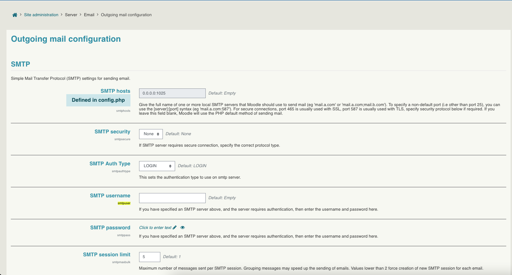
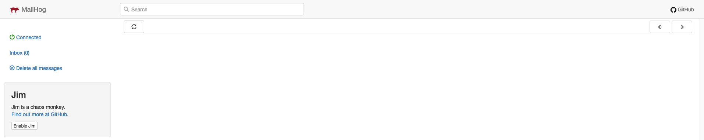
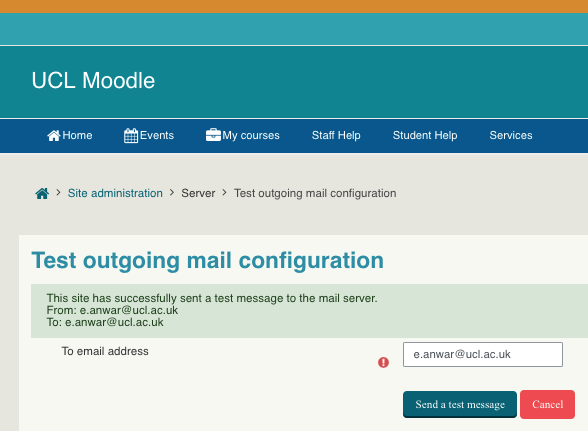
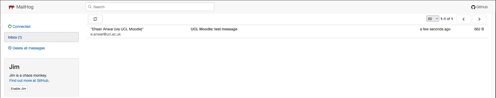
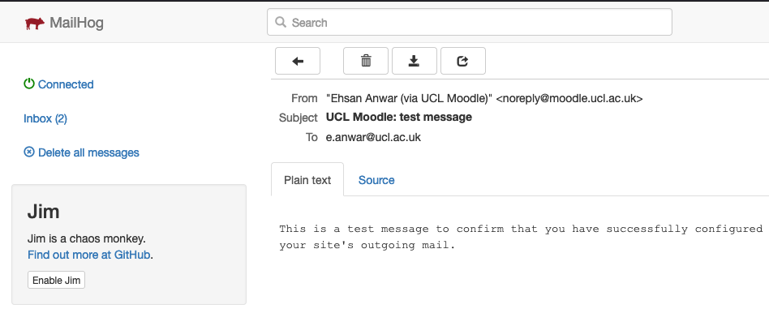
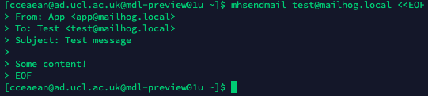
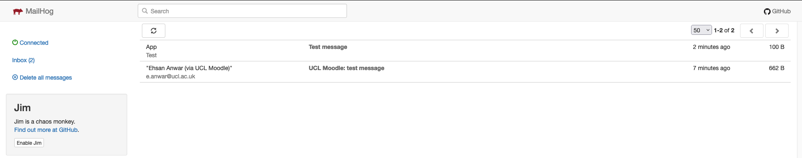
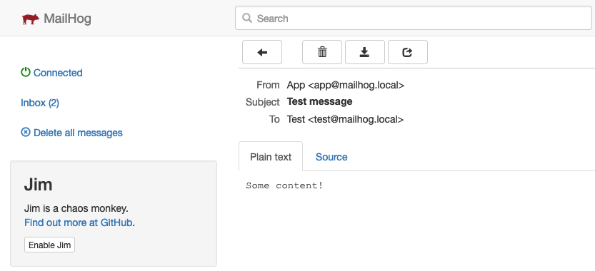

# Mailhog & mhsendmail on Preview

Mailhog is a testing tools for developers to send emails without the need of a real smtp server.  mhsendmail is a php sendmail replacement which forwards mail to an SMTP server.

### **Moodle config**

The mhsendmail settings are set in the moodle config file <https://git.automation.ucl.ac.uk/moodle/moodle-1819/-/blob/PREVIEW_311_REBASE/config.php#L47>

enabling and disabling sending emails is set in the setting.yml <https://git.automation.ucl.ac.uk/moodle/moodle-1819/-/blob/PREVIEW_311_REBASE/settings.yml#L1>

ensure that

SMTP security = 'none'

SMTP username is blank

SMTP password is blank



### **Running mailhog**

At the moment mailhog needs to be run manually as following

``` powershell
ssh onto mdl-preview01u.ad.ucl.ac.uk

run 'tmux a -t mailhog'

run '/usr/local/bin/mailhog'

following message is shown

2022/05/17 15:22:04 Using in-memory storage
2022/05/17 15:22:04 [SMTP] Binding to address: 0.0.0.0:1025
[HTTP] Binding to address: 0.0.0.0:8025
2022/05/17 15:22:04 Serving under http://0.0.0.0:8025/

detatch from the session 'ctrl + b then d'
```

### **Viewing mailhog**

The gui is accessible from here <http://mdl-preview01u.ad.ucl.ac.uk:8025/>



### **Testing sending emails**

Moodle - <https://311.preview-moodle.ucl.ac.uk/admin/testoutgoingmailconf.php>







mhsendmail - <https://github.com/mailhog/mhsendmail>

``` powershell
ssh onto mdl-preview01u.ad.ucl.ac.uk  

mhsendmail test@mailhog.local <<EOF
From: App <app@mailhog.local>
To: Test <test@mailhog.local>
Subject: Test message

Some content!
EOF
```







## Attachments:

 [Screenshot 2022-05-17 at 23.10.52.png](attachments/205625341/205626290.png) (image/png)
 [Screenshot 2022-05-17 at 23.13.58.png](attachments/205625341/205626293.png) (image/png)
 [Screenshot 2022-05-17 at 23.14.18.png](attachments/205625341/205626294.png) (image/png)
 [Screenshot 2022-05-17 at 23.20.17.png](attachments/205625341/205626299.png) (image/png)
 [Screenshot 2022-05-17 at 23.20.46.png](attachments/205625341/205626300.png) (image/png)
 [Screenshot 2022-05-17 at 23.21.08.png](attachments/205625341/205626301.png) (image/png)
 [Screenshot 2022-05-17 at 23.22.54.png](attachments/205625341/205626304.png) (image/png)
 [Screenshot 2022-05-17 at 23.26.24.png](attachments/205625341/205626308.png) (image/png)

