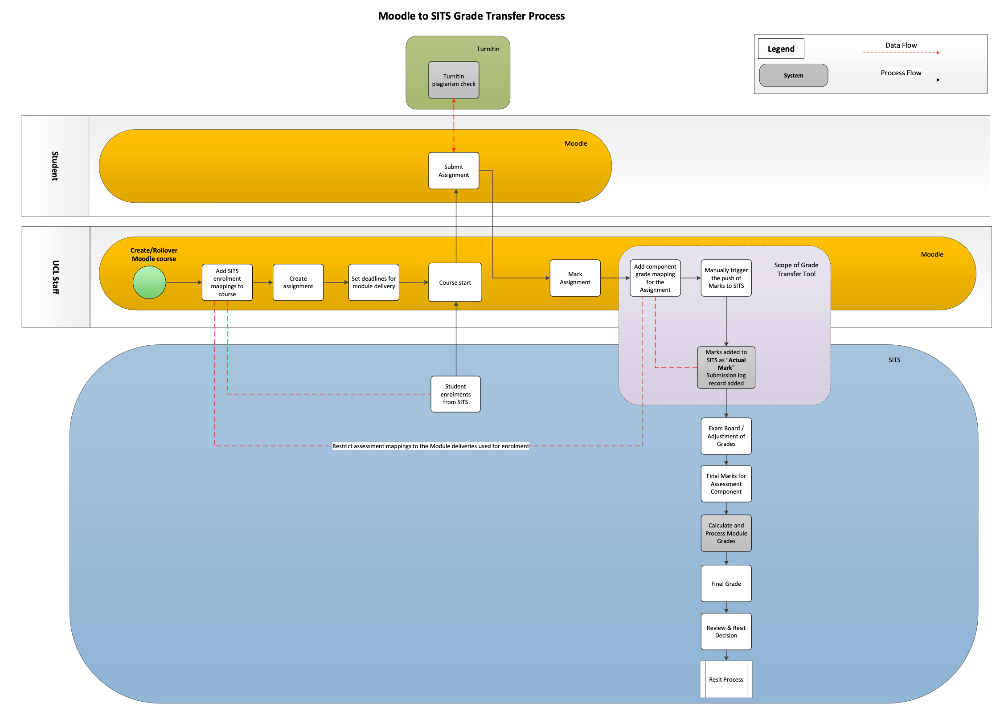
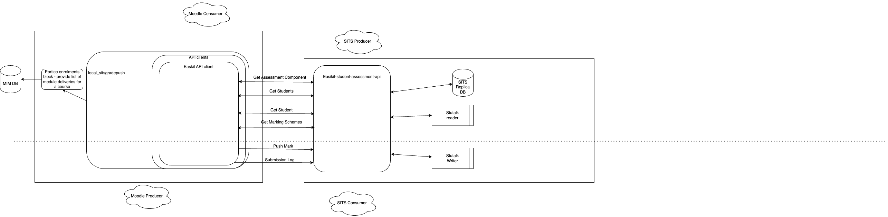

# Marks Transfer High Level Design

## Integration Principles

a) Reliance on legacy integration 

The decision was made to focus on delivering the new value offered by the Marks Transfer over refactoring the enrolments & other data integrations covered by MIM ( [Moodle Integration Manager (MIM) - SITS/CMIS integration](../ISMoodle/Moodle_Integration_Manager_MIM_-_SITS_CMIS_integration)). Marks Transfer continues to explore how we can evolve the way we modernise our integrations with SITS, building upon the learnings of the Course LifeCycle integration. 

In order to reduce the risk of incorrect mappings, pushing data in the wrong place,  we use the Moodle course level enrolment mappings of SITS Module deliveries to restrict the list of Assessment Component mappings that can be used in that Moodle course for Marks Transfer. The interface for this, provided by the block\_portico\_enrolments has been abstracted in a way which will allow an easy switch over as & when MIM gets refactored into the modern integration pattern.

b) Integration reusability

The UCL API integration strategy is focussed on API reusability **within** UCL. Moodle being an open source platform, we are uniquely interested in also making our integrations reusable **beyond** UCL; we know there are 100s of institutions using Moodle & SITS together but there are 100s of unique integrations bespoke to each institution. We are driven as part of this Marks Transfer integration and the upcoming rewrite of MIM to produce a reusable integration that can apply to any Moodle & SITS using institution, in doing so we can foster a collaborative ecosystem that keeps expanding the feature set of this integration to a level not seen before.

In order to achieve this, we need to be able to abstract away the communication interface so that multiple API clients can be used:

-   Stutalk direct (likely used by most institutions)
-   Easikit (UCL bespoke EDM backed by API Gateway & AAD JWTs)
-   any other bespoke API platform (e.g. Kings are also rolling out an institutional standardised API platform but which will be different to UCL) - each of which can be implemented as a sub-plugin of the integration.

c) Modern integration principles

The UCL API integration strategy outlines standards through which different applications need to talk to one another, it however does not cover how things are done under the hood of the API Gateway. As per the long running Moodle strategy, when we build things, we build them on solid long-term foundations. We have defined a set of principles ( [Modern API Integration Principles](https://wiki.ucl.ac.uk/display/ISMoodle/Modern+API+Integration+Principles) ) to be used in the development of integrations, in short for SITS this means developing Stutalk endpoints which can be wrapped by API gateway, not relying on database views which are to be deprecated as part of SITS to Cloud phase 2, and prefer an event based integration pattern over an API based integration pattern where possible. This is ultimately the SITS Platform Team's responsibility to own and maintain but we can be a voice to keep driving modernisation.

d) Leverage existing Assessment@UCL integration APIs

Stutalk & easikit endpoints have already been built for Assessment@UCL, we will leverage the latest versions of these in order to speed up the implementation of the Moodle Marks Transfer integration. 

→ [Assessment API \[HLD\]](https://wiki.ucl.ac.uk/pages/viewpage.action?pageId=264897410)

→ [Service Transition Digital Assessment API](https://wiki.ucl.ac.uk/display/API/Service+Transition+Digital+Assessment+API)

# Business Process Overview 

# Data flow overview

## Attachments:

 [Screenshot 2023-11-14 at 13.23.26.png](attachments/299699960/299699959.png) (image/png)
 [Mark Transfer diagram.drawio v1.png](attachments/299699960/299700406.png) (image/png)

