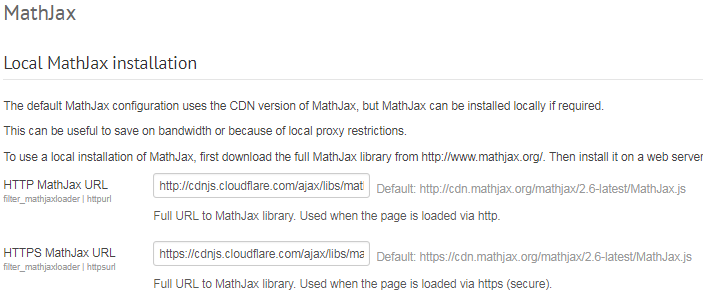
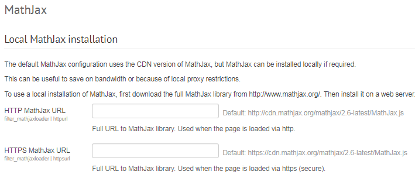
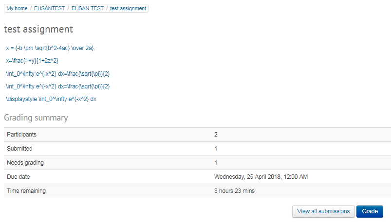
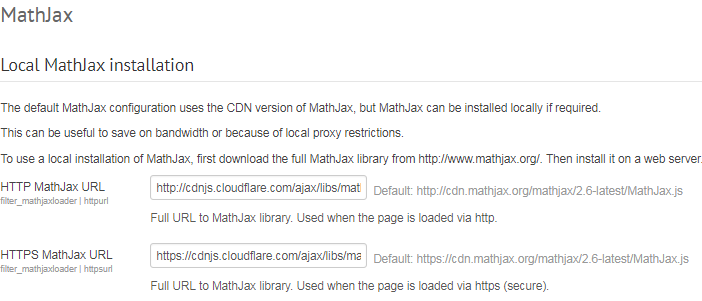
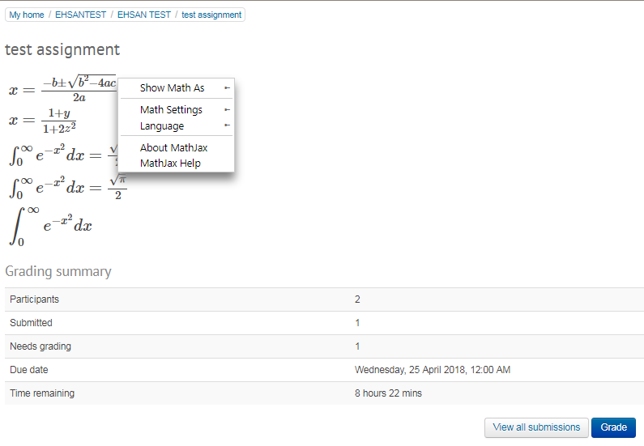

# MathJax Filter - Changing CND Provider

## Overview

<https://www.mathjax.org/cdn-shutting-down/>

The MathJax CDN hosted at [cdn.mathjax.org](https://www.mathjax.org/cdn-shutting-down/cdn.mathjax.org) will be shutting down on April 30, 2017.

Temporary redirect starting May 1, 2017\]

\[Updated 2017/04/10\]

We will implement a temporary redirect on `cdn.mathjax.org` to redirect users to cdnjs.

\[Updated 2017/04/18\] The code for the redirect can be [found on GitHub](https://github.com/mathjax/cdn-redirect).

Note This is a temporary stopgap. While most sites should continue to work as usual, this will not work in all edge cases, e.g., custom configurations with hard-coded references to `cdn.mathjax.org`, sites with security policies that whitelist only `cdn.mathjax.org`, poorly synchronized code.

Additionally, end users with browser extensions that block scripts broadly may have allowed scripts from `cdn.mathjax.org` and will have to allow scripts from `cdnjs.cloudflare.com` for the redirect to work.

We recommend switching to another CDN provider or your own copy of MathJax as soon as possible.

## Changing the CND provider

Pre Change Test

1.  Navigate to <https://moodle-pp.ucl.ac.uk/admin/settings.php?section=filtersettingmathjaxloader> &gt; remove <http://cdn.mathjax.org/mathjax/2.6-latest/MathJax.js> URL from HTTP and HTTPS address (this is the same test as if the URL was not valid) &gt; saves changed
    
    
2.  Go to <https://moodle-pp.ucl.ac.uk/mod/assign/view.php?id=3340951> which has a TeX equation in the description of the assignment visible under the assignment title &gt; the equation is no longer showing using the MathJax filter.
    
    Post Change Test
3.  Navigate to <https://moodle-pp.ucl.ac.uk/admin/settings.php?section=filtersettingmathjaxloader> &gt; add to HTTPS <https://cdnjs.cloudflare.com/ajax/libs/mathjax/2.6.1/MathJax.js> and HTTP <https://cdnjs.cloudflare.com/ajax/libs/mathjax/2.6.1/MathJax.js> &gt; saves changed
    
4.  Navigate to <https://moodle-pp.ucl.ac.uk/mod/assign/view.php?id=3340951> &gt; the TeX equation is now being displayed using MathJax.
    

## Attachments:

 [image2018-4-24\_15-16-49.png](attachments/90179300/90179284.png) (image/png)
 [image2018-4-24\_15-17-17.png](attachments/90179300/90179286.png) (image/png)
 [image2018-4-24\_15-21-16.png](attachments/90179300/90179292.png) (image/png)
 [image2018-4-24\_15-24-6.png](attachments/90179300/90179297.png) (image/png)
 [image2018-4-24\_15-25-28.png](attachments/90179300/90179299.png) (image/png)
 [image2018-4-24\_15-36-49.png](attachments/90179300/90179304.png) (image/png)
 [image2018-4-24\_15-37-55.png](attachments/90179300/90179309.png) (image/png)

