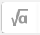
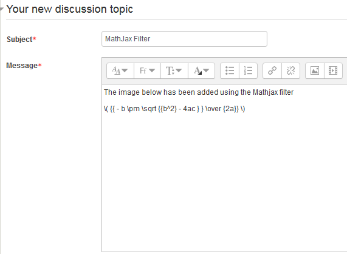
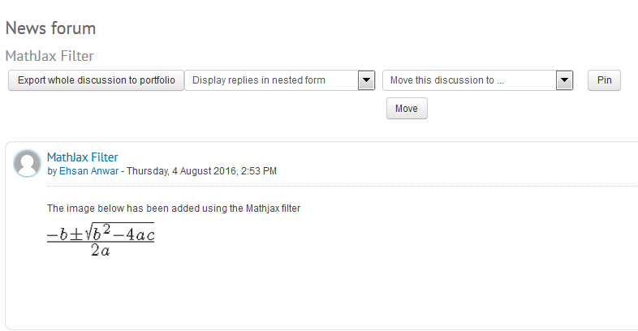
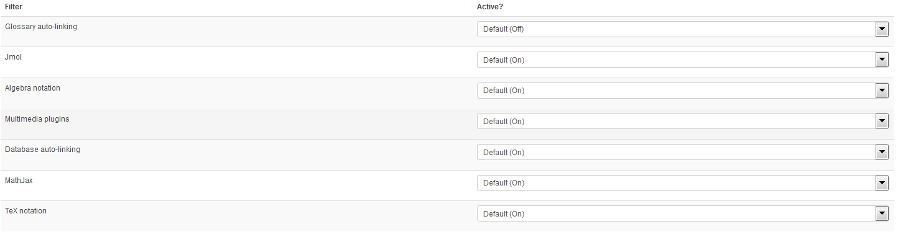
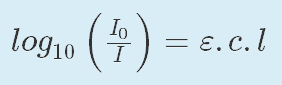
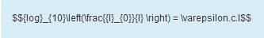
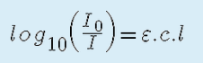

# MathJax Filter - How To Use

## Overview:

<https://docs.moodle.org/31/en/MathJax_filter>

<https://www.mathjax.org>

## How to use:

1. Log into <https://moodle.ucl.ac.uk/>

2. Check Mathjax filter is turned on - Site administration &gt; Plugins &gt; Filters &gt; [Manage filters](https://v31-0802.moodle-uat.ucl.ac.uk/admin/filters.php)

3.Go to any course &gt; enter a resource/activity which has input messaging text box (using a forum as an example).

4. In the “message “ input box, on the toolbar menu, click on the “equation editor” icon

5. Type math text in the box using TeX &gt; Equation is shown as a image in “equation preview” &gt; click “save equation”

6. Set any other additional settings &gt; click “post to forum”

7. When viewing the post; you can now see the equation as an image

## Using TeX Notation with MathJax

<https://docs.moodle.org/29/en/TeX_notation_filter#Compatability_with_MathJax>

In Moodle 2.8 onwards, the TeX Notation and MathJaxloader filter may be used in combination. If both filters are enabled on the page, images will be displayed first by the TeX notation filter, and the MathJax version of the TeX expression will replace a little while later when MathJax has finished loading and processing. If both filters are available, a teacher may decide which to use in an activity by enabling one and disabling the other.  The images below show how the different options render equations.

### Order of filters (Important)

Site adminsitration &gt; plugins &gt; filters &gt; manage filters

The order of the TeX notation and Mathjax must be arrange in the order as below.  This is because with both enabled, Moodle with run both filters in sequence with Mathjax being the preference as the equation display is a lot cleaner.

### Enabling/disabling filters through course

Course administration &gt; filters

### TeX notation (ON) / Mathjax (ON)

### TeX notation (OFF) / Mathjax (ON)

### TeX notation (ON) / Mathjax (OFF)

### TeX notation (OFF) / Mathjax (OFF)

## Attachments:

 [image2016-8-4 13:4:33.png](attachments/62788106/62788109.png) (image/png)
 [image2016-8-4 13:6:7.png](attachments/62788106/62788110.png) (image/png)
 [image2016-8-4 13:8:23.png](attachments/62788106/62788111.png) (image/png)
 [image2016-8-4 13:8:38.png](attachments/62788106/62788112.png) (image/png)
 [image2016-8-4 13:9:1.png](attachments/62788106/62788113.png) (image/png)
 [image2016-8-4 14:50:14.png](attachments/62788106/62788137.png) (image/png)
 [image2016-8-4 14:52:7.png](attachments/62788106/62788139.png) (image/png)
 [image2016-8-4 14:54:2.png](attachments/62788106/62788141.png) (image/png)
 [image2017-1-26 12:29:9.png](attachments/62788106/64236862.png) (image/png)
 [image2017-1-26 12:44:7.png](attachments/62788106/64236866.png) (image/png)
 [image2017-1-26 12:45:30.png](attachments/62788106/64236867.png) (image/png)
 [image2017-1-26 12:47:56.png](attachments/62788106/64236868.png) (image/png)
 [image2017-1-26 13:0:8.png](attachments/62788106/64236882.png) (image/png)

