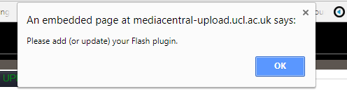
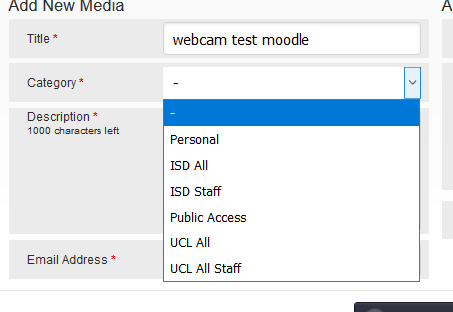
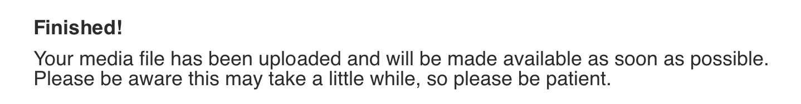
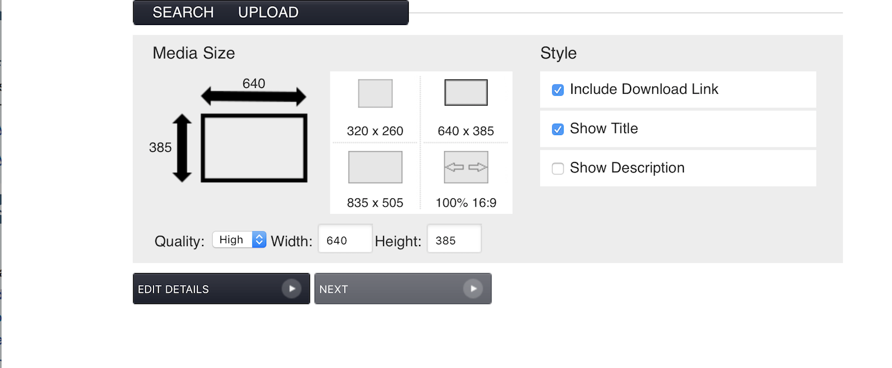
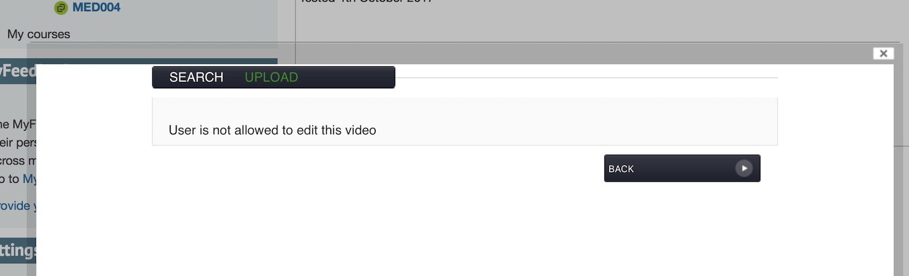
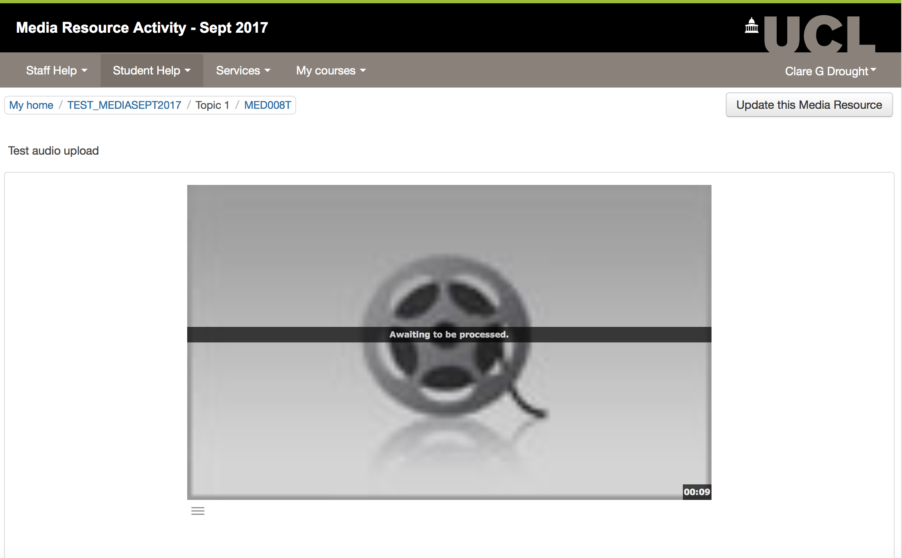
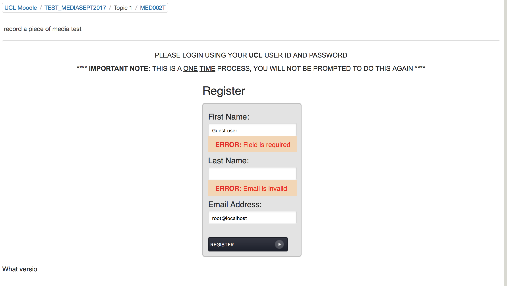

# Media Central Plugin - Medial - June-Sept 2017

### **Possibly useful resources:**

<https://v315.moodle-dev.ucl.ac.uk/>

ID:   mcstudent1 - PW:  MCstudent1!

ID: mcstudent2 - PW: MCstudent2!

-   Full list of test scripts can be found here: [Tests-MediaCentral](https://wiki.ucl.ac.uk/display/ISMoodle/Tests-MediaCentral)
-   Requirements document attached here:  [Video upload Moodle plugin Requirements June 2017.docx](attachments/70125201/70125182.docx)
-   Notes from [Bin ? - MediaCentral Demo May 2017](https://wiki.ucl.ac.uk/pages/viewpage.action?pageId=66760505)

## **Media Resource production Moodle testing - Digi Ed Core - 14/12/2017**

<table>
<thead>
<tr class="header">
<th>
Test -
</th>
<th>
Browser? 
IE/FF/Ch 
(incl. v.)
</th>
<th>
Outcome 
   
</th>
<th>
Tester/Notes/Suggested further work
</th>
</tr>
</thead>
<tbody>
<tr class="odd">
<td><strong>Staff Tests</strong></td>
<td> 
</td>
<td> 
</td>
<td> 
</td>
</tr>
<tr class="even">
<td> 

[MED001T] Upload a piece of media to Moodle course using Media Resource Activity
</td>
<td>
ChromeVersion 63.0.3239.84

Win10
</td>
<td>

</td>
<td>

All Tests below undertaken on <a href="https://moodle.ucl.ac.uk/course/view.php?id=4083" class="uri">https://moodle.ucl.ac.uk/course/view.php?id=4083</a>

RD: Allowed upload but a 5MB mp4 file hadn't processed after 40 minutes?

</td>
</tr>
<tr class="odd">
<td>
[MED002T] Record a piece of media to Moodle course using Media Resource Activity
</td>
<td>
 

</td>
<td>

</td>
<td>

RD: Tried webcam recording but got warning that flash needing adding/updating, it didn't, my Chrome preferences should have allowed me to allow flash but didn't 

After cancelling the attempt above a 6 second recording of Claire D appeared !!! <a href="https://moodle.ucl.ac.uk/mod/helixmedia/view.php?id=3262255" class="uri">https://moodle.ucl.ac.uk/mod/helixmedia/view.php?id=3262255</a>

Repeated in firefox got flash warnings but did allow me to allow flash.

on upload of webcam capture got choices of categories to place video in which I didn't get with file upload? The recording didn't appear with my personal recordings on direct login to Mediacentral but this drop-down is confusing

 

 

 

</td>
</tr>
<tr class="even">
<td>
[MED003T] Restrict uploaded media to a Group
</td>
<td>
 

</td>
<td>
RD 

 

</td>
<td>
 

</td>
</tr>
<tr class="odd">
<td>
[MED004T] Check appearance/access of videos once original uploading staff are unenrolled
</td>
<td>
 

</td>
<td>
RD 
</td>
<td>

Wanted to wait until above tests processed before doing this..........

</td>
</tr>
<tr class="even">
<td>
[MED005T] Check logging for actions on uploaded media content
</td>
<td> 
</td>
<td>RD </td>
<td> 
</td>
</tr>
<tr class="odd">
<td>
[MED006T] Upload a Media Resource using a mobile device
</td>
<td>
 

</td>
<td>
RD 
</td>
<td>

Uploaded 38 second video, file type .3gp - but took nearly 2 hours to process which seems a lot!

</td>
</tr>
<tr class="even">
<td>
[MED007T] Record a piece of media to Moodle course using Media Resource Activity
</td>
<td>
 

</td>
<td>
RD   
</td>
<td>
Tested on iPad OS 10.3.2 model number MD510B/A (iPad 4)

Recorded 30 second .mov - confused by category choices of personal, isd all, public access (does it make a difference? should user be choosing a category in this context.

 

10.Click Play recording and see if you can update start and end time. Note any errors. (no option to update st/end time?

12. links don't work on terms and conditions nor does link to UCL information security policy

15. Title not updated

16. Download screen is checked by default (not unchecked)

17. Message not available long enough to read (about 1 second)
</td>
</tr>
<tr class="odd">
<td>
[MED008T] Audio test 
</td>
<td> 
</td>
<td> 
</td>
<td>

 

</td>
</tr>
<tr class="even">
<td><strong>Student Tests</strong></td>
<td> 
</td>
<td> 
</td>
<td> 
</td>
</tr>
<tr class="odd">
<td>
[MED001S] View a Media Resource using a mobile device
</td>
<td> 
</td>
<td> 
</td>
<td>
View on ipad used above OK - view on older Mobile android using Chrome 63.0 OS 4.4.2 GT19505 failed

 

</td>
</tr>
<tr class="even">
<td>
[MED002S] Guest Access
</td>
<td> 
</td>
<td>RD </td>
<td>

Guests are able to view this content

</td>
</tr>
</tbody>
</table>

## Testing on Moodle with Media Central Outage - 12/12/017

Test -12/12/2017

Browser?
IE/FF/Ch
(incl. v.)

Outcome
   

Notes/Decision/Suggested further work needed to pass

**Staff Tests**
\[MED009T\] Media Central Outage - Viewing an existing Medial activity

Firefox 45.5.1

Tested in : <https://moodle-pp.ucl.ac.uk/course/view.php?id=44627>

Media frame embed is blank, clicking the 'Press to launch this activity' button does nothing. Description and title text are still visible.

See screen shot in [attached document](attachments/70125201/82444652.docx).

NB! ***Note that in dev where existing Medials had been embedded using the other 'in-editor' plugin, rather than the activity plugin which does not embed on course page, the page loads up with spaces for the embedded Media resources, but then hangs and waits for time outs for each resource. This will therefore seem unresponsive if you try to turn editing on or similar. Editing generally is slow to load. This is definitely something to consider if the 'in-editor' plugin were to be reviewed for implementation at a later date. Tested in: <https://v315.moodle-dev.ucl.ac.uk/course/view.php?id=41418> See last screenshot of attached document.***

\[MED010T\] Media Central Outage - Updating an existing Medial activity

IE 11.0

Tested in : <https://moodle-pp.ucl.ac.uk/course/view.php?id=44627>

Overlay is blank and then times out. 

Description and title text are still visible and have been updated.

See screen shot in [attached document](attachments/70125201/82444652.docx).

\[MED011T\] Media Central Outage - Adding a Medial activity

Chrome 62.0.3 (64bit)

Tested in : <https://moodle-pp.ucl.ac.uk/course/view.php?id=44627>

Overlay is blank and then times out. 

Description and title text are still visible.

See screen shot [in attached document.](attachments/70125201/82444652.docx)

**Student Tests**

\[MED003S\] Media Central Outage - Viewing an existing Medial activity

IE 11.0

Firefox 45.5.1

Media frame embed is blank on Firefox. Time out with Page can't be displayed message on IE/Edge. Clicking the 'Press to launch this activity' button in either browser does nothing. Description and title text are still visible if set previously.

See screen shot in attached document.

**Performance and other comments**
The Press to launch this activity button does not usually appear when Media Central is up and running - it would be better if it did not appear in the case of outage, but does not seem to do anything, so is low impact, if a little confusing.

As there is currently no holding or maintenance page for Media Central as a whole at present, we're not certain how such a page would be presented to users through Moodle in an outage scenario. Tony will check with Streaming/Medial what functionality is available within the platform for maintenance/outage signalling.

Martin Burrow (RDE- Learning) monitored performance at this time - see [attached screenshot](attachments/70125201/82444785.jpg) - and accessing the pages with these activities in pp seemed to make little change in terms of performance/load. However, it is worth noting that quick testing on dev, which included adding of Media Resources using the other in-editor version of the plugin seemed to make pages very slow to load, at least in Chrome. This is definitely something to consider if the 'in-editor' plugin were to be reviewed for implementation at a later date

## **
Pete Castle performance testing - 17/11/2017:**

Two scripts run which loaded the course – 200 users 10 times through. These were each run 3 times to get the averages. Results ([attached](attachments/70125201/79503925.xlsx)) show no real difference between page load with or without a couple of instances of media widget added to a course.

## **Testing Sept 2017- Clare Drought - Project Office**

<table>
<thead>
<tr class="header">
<th>
Test - #DATE COMPLETED#
</th>
<th>
Browser? 
IE/FF/Ch 
(incl. v.)
</th>
<th>
Outcome 
   
</th>
<th>
Notes/Decision/Suggested further work needed to pass
</th>
</tr>
</thead>
<tbody>
<tr class="odd">
<td><strong>Staff Tests</strong></td>
<td> 
</td>
<td> 
</td>
<td> 
</td>
</tr>
<tr class="even">
<td> 

[MED001T] Upload a piece of media to Moodle course using Media Resource Activity
</td>
<td>Safari 10.11</td>
<td>

?
</td>
<td>

Step 17 - include download link is TICKED by default, this setting is for whole of MediaCentral &amp; cannot be locally set for Moodle, discussed with DE and not seen as a major issues.

Step 19 confirmation message screen shot

NB If you go back and edit via add media button you get a different confirmation message &quot;Finished! Your media selection has been completed.&quot;

<ul>
<li><em>Now amended by DM 06/10/2017 -</em> &quot;Your media selection changes have been confirmed&quot;.</li>
</ul>

</td>
</tr>
<tr class="odd">
<td>
[MED002T] Record a piece of media to Moodle course using Media Resource Activity
</td>
<td>
Safari 10.11
</td>
<td>

</td>
<td>
step 9 fail - error on playback - <em>Edit 06/10/2017 - error on system generally - Gordon has resolved and testing seems ok now.</em>

step 11 links in T&amp;Cs would not open, tested on other Macs &amp; OK seems to be to do with a local setting on Mac.

step 15 - include download link is TICKED by default, this setting is for whole of MediaCentral &amp; cannot be locally set for Moodle, discussed with DE and not seen as a major issues.

 

 

</td>
</tr>
<tr class="even">
<td>
[MED003T] Restrict uploaded media to a Group
</td>
<td>
Safari 10.11
</td>
<td>

 

</td>
<td>
 

</td>
</tr>
<tr class="odd">
<td>
[MED004T] Check appearance/access of videos once original uploading staff are unenrolled
</td>
<td>
 

</td>
<td>
?
</td>
<td>

step 7 - Tutor 2 can edit view settings

but not detail settings

</td>
</tr>
<tr class="even">
<td>
[MED005T] Check logging for actions on uploaded media content
</td>
<td> 
</td>
<td></td>
<td>All activity logged.</td>
</tr>
<tr class="odd">
<td>
[MED006T] Upload a Media Resource using a mobile device
</td>
<td>
iPad

Safari

iPad (iOS Version 11.0.1)
</td>
<td>

NB. behaviour is slightly different, help notes may need to be tweaked.

 

</td>
<td>

<strong>step 9 iPad does not allow me to browse for a non video or photo file.</strong>

<strong>NB. No terms and conditions option</strong>

<strong>step 15. on trying to select a captions file get error</strong> &quot;Note: You cannot upload associated files to this page on an iPad.&quot;

step. 17 include down load link is ticked by default.

 

</td>
</tr>
<tr class="even">
<td>
[MED007T] Record a piece of media to Moodle course using Media Resource Activity
</td>
<td>
iPad

Safari

iPad (iOS Version 11.0.1)
</td>
<td>

NB. behaviour is slightly different
</td>
<td>
Step 7. Works differently on an iPad. Only options Upload &amp; Search are displayed, on selecting upload and browse you are given options to Take photo or video and Photo Library (NB. You get an incorrect file type error on selecting a photo). Take video or photo option goes to iPad webcam.

<strong>Terms and conditions displayed this time.</strong>

step 17 No message confirmation message displayed (is this because it is already processed??)
</td>
</tr>
<tr class="odd">
<td>
[MED008T] Audio test 
</td>
<td>Safari 10.11</td>
<td></td>
<td>

</td>
</tr>
<tr class="even">
<td><strong>Student Tests</strong></td>
<td> 
</td>
<td> 
</td>
<td> 
</td>
</tr>
<tr class="odd">
<td>
[MED001S] View a Media Resource using a mobile device
</td>
<td> 
</td>
<td></td>
<td>
All works OK

 

</td>
</tr>
<tr class="even">
<td>
[MED002S] Guest Access
</td>
<td> 
</td>
<td>?</td>
<td>

step 10 On trying to view the content as the Guest account for the first time gave me this screen below.

It allowed me to use my uczmcdr details.When viewing other content on other course I was not prompted.

</td>
</tr>
</tbody>
</table>

## **Mapped Tests to Requirements**

<table>
<thead>
<tr class="header">
<th>
Test
</th>
<th>
Requirements addressed
</th>
</tr>
</thead>
<tbody>
<tr class="odd">
<td><strong>Staff Tests</strong></td>
<td> 
</td>
</tr>
<tr class="even">
<td> 

[MEDT001] Upload a piece of media to Moodle course using Activity Chooser
</td>
<td>
<em>1) The solution should provide a way for staff to easily upload media so that it sits outside Moodle.</em>

<em>2) The solution will clearly define if, and be consistent with regards to, the ability of users to browse and add content from existing repositories such as MediaCentral. </em>

<em>3) The solution should allow staff to restrict viewing access to those on Moodle course(s), making permissions options clear.</em>

<em>4) The solution should allow for staff to control whether or not media content uploaded is downloadable by students.</em>

<em>14) The solution should provide clear confirmation to users who have uploaded media that their upload has been successful or failed.</em>

<em>16) The permissible file types for upload should be clearly defined to the user.</em>

<em>20) Solution must be able to inform users and allow them to sign up to UCL usage terms  and conditions. I.e. not for inappropriate content delivery. </em>

<em>23) The system should support closed caption support with a preference for multiple language caption on a per video basis.</em>
</td>
</tr>
<tr class="odd">
<td>
[MED002T] Upload and embed a piece of media into a Moodle Label
</td>
<td>
<em>1) The solution should provide a way for staff to easily upload media so that it sits outside Moodle.</em>

<em>2) The solution will clearly define if, and be consistent with regards to, the ability of users to browse and add content from existing repositories such as MediaCentral. </em>

<em>3) The solution should allow staff to restrict viewing access to those on Moodle course(s), making permissions options clear.</em>

<em>4) The solution should allow for staff to control whether or not media content uploaded is downloadable by students.</em>

<em>12) The solution should have the ability to support the recording of content from webcam, for staff and students, and for this to be visible in context within Moodle. E.g. As part of post on forum by tutor. </em>

<em>14) The solution should provide clear confirmation to users who have uploaded media that their upload has been successful or failed.</em>

<em>16) The permissible file types for upload should be clearly defined to the user.</em>

<em>20) Solution must be able to inform users and allow them to sign up to UCL usage terms  and conditions. I.e. not for inappropriate content delivery. </em>
</td>
</tr>
<tr class="even">
<td>
[MED003T] Create an Anonymous Moodle Assignment with Media upload
</td>
<td>
<em>5) The solution should allow staff to set up assignments where students can submit media, with the same group, cut off date etc… functionality as with a text/document upload assignment.</em>

<em>9) The solution should ensure that students are not able to edit media submissions after the due date has passed, be this in MediaCentral or through Moodle.  </em>
</td>
</tr>
<tr class="odd">
<td>
[MED004T]  Create a Group Moodle Assignment with Media upload
</td>
<td>
<em>5) The solution should allow staff to set up assignments where students can submit media, with the same group, cut off date etc… functionality as with a text/document upload assignment.</em>
</td>
</tr>
<tr class="even">
<td>
[MED005T] View and grade a video assignment
</td>
<td><em>6) The solution should allow staff to mark student media submissions using as much of Moodle’s marking and feedback tools as with a text or document upload assignment.</em></td>
</tr>
<tr class="odd">
<td>
[MED006T]  Review Assignment with Media upload feedback for a student in MyFeedback dashboard
</td>
<td><em>10) The solution should allow students to view any feedback on a media assignment/submission in MyFeedback, as with all other submissions.</em></td>
</tr>
<tr class="even">
<td>[MED007T] Check appearance/access of videos once original uploading staff are unenrolled</td>
<td><em>27) The solution should allow staff to have equal permissions on uploaded media in a Moodle course, in line with existing access and permissions for the same role to other materials uploaded on the Moodle course.</em></td>
</tr>
<tr class="odd">
<td>[MED008T] Check logging for actions on uploaded media content</td>
<td>
<em>29) The solution must allow for interactions with the plugin within Moodle to be logged with Moodle’s logging functionality. E.g. viewing, upload to course, upload to assignment, grading, deletion.</em>
</td>
</tr>
<tr class="even">
<td>[MED010T] Reset course, ensure student Media submissions are cleared</td>
<td>
<em>15) The solution should be integrated with Moodle in such a way as to allow later viewing in the Moodle archive, and to ensure that all submitted student material is cleared when the course is reset.</em>
</td>
</tr>
<tr class="odd">
<td><strong>Student Tests</strong></td>
<td> 
</td>
</tr>
<tr class="even">
<td>[MED001S] View media content in Moodle course - guest access, groups</td>
<td><em>3) The solution should allow staff to restrict viewing access to those on Moodle course(s), making permissions options clear.</em></td>
</tr>
<tr class="odd">
<td>[MED002S] Upload and embed a piece of media into Forum post using text editor</td>
<td>
<em><em>7) The solution should be compatible for viewing and upload across a variety of devices, operating systems, and browsers.</em> </em>

<em>12) The solution should have the ability to support the recording of content from webcam, for staff and students, and for this to be visible in context within Moodle. E.g. As part of post on forum by tutor. </em>

<em>13) The solution should allow students to upload media through Moodle, so that it is viewable by other students on the course – eg in Forum etc…</em>

<em>14) The solution should provide clear confirmation to users who have uploaded media that their upload has been successful or failed.</em>

<em>16) The permissible file types for upload should be clearly defined to the user.</em>
</td>
</tr>
<tr class="even">
<td>[MED003S] Check media added by other student is visible</td>
<td>
<em><em>7) The solution should be compatible for viewing and upload across a variety of devices, operating systems, and browsers.</em> </em>

<em>13) The solution should allow students to upload media through Moodle, so that it is viewable by other students on the course – eg in Forum etc…</em>
</td>
</tr>
<tr class="odd">
<td>[MED004S] Submit a Video Assignment</td>
<td>
<em>8) The solution should allow students to submit a piece of media in an assignment set up for that purpose, and for this to remain private and only visible to tutors and other students if in a group.</em>

<em>9) The solution should ensure that students are not able to edit media submissions after the due date has passed, be this in MediaCentral or through Moodle.  </em>

<em>14) The solution should provide clear confirmation to users who have uploaded media that their upload has been successful or failed.</em>

<em>16) The permissible file types for upload should be clearly defined to the user.</em>

<em>23) The system should support closed caption support with a preference for multiple language caption on a per video basis.</em>
</td>
</tr>
<tr class="even">
<td>[MED005S] Check and update a group submission</td>
<td><em>8) The solution should allow students to submit a piece of media in an assignment set up for that purpose, and for this to remain private and only visible to tutors and other students if in a group.</em></td>
</tr>
<tr class="odd">
<td>[MED006S] Check group grade/feedback</td>
<td> 
</td>
</tr>
<tr class="even">
<td>[MED007S] Viewing your own My Feedback report as a student</td>
<td><em>10) The solution should allow students to view any feedback on a media assignment/submission in MyFeedback, as with all other submissions.</em></td>
</tr>
</tbody>
</table>

## **Testing 28/06/2017 - Annora Eyt-Dessus (Digital Education Team)**

<table>
<thead>
<tr class="header">
<th>
Test
</th>
<th>
Browser? 
IE/FF/Ch 
(incl. v.)
</th>
<th>
Outcome 
   
</th>
<th>
Notes/Decision/Suggested further work needed to pass
</th>
</tr>
</thead>
<tbody>
<tr class="odd">
<td><strong>Staff Tests</strong></td>
<td> 
</td>
<td> 
</td>
<td> 
</td>
</tr>
<tr class="even">
<td> 

[MEDT001] Upload a piece of media to Moodle course using Activity Chooser
</td>
<td>Chrome <em>58.0.3029.110 (64-bit))</em></td>
<td>
 

</td>
<td><ul>
<li><em><strong>Is this not a resource rather than activity? How is it interactive?</strong></em></li>
<li><strong><em>Medial is not very descriptive - suggest change to Media upload or Media Resource?</em></strong></li>
<li><em>Discrepancy in terms used - Summary vs Description elsewhere in Moodle and in help for tick box options</em></li>
<li><em>Details tab - Category: can select - but then get error message - see <a href="attachments/70125201/70127669.png">screenshot</a></em></li>
<li><em>T&amp;Cs &quot;click here to read&quot; link - comes up as 'Disclaimer text' which doesn't sound quite right? - <em>see <a href="attachments/70125201/70127671.png">screenshot</a></em></em></li>
<li><em>Terms of usage etc not highlighted as urls, UCL IT policy eats screen - see <a href="attachments/70125201/70127671.png">screenshot</a></em></li>
<li><em>Upload your own thumbnail doesn't show any preview or confirmation until very end on Confirm tab?</em></li>
<li><strong><em>&quot;Associated files&quot; must be disabled as conflicts with existing Moodle file upload limits and navigation of files, without adding strong value. (See screenshot <a href="attachments/70125201/70127668.png">here</a>)</em></strong></li>
<li><strong><em>Confirmation message is shown only for a second - far too short for anyone to actually read it?</em></strong></li>
<li><em><strong><em><em>Search does not seem to work at first and n</em></em> o indication given in search that this will only show my content from Moodle silo of MC.</strong> <strong>Can select filters but they seem to make no difference? See <a href="attachments/70125201/70127670.png">screenshot</a></strong></em></li>
<li><strong><em>No indication given during upload that this content will not be passed to MediaCentral public silo. </em></strong></li>
<li><em>Restriction by groups seems to work as expected.</em> <strong><em></em></strong></li>
</ul></td>
</tr>
<tr class="odd">
<td>
[MED002T] Upload and embed a piece of media into a Moodle Label
</td>
<td>
 

</td>
<td>
 

</td>
<td><ul>
<li><em>There does not seem to be a way to update media uploaded through text editor, like you can with embedded picture. Could delete it and add it again, but not an easy flow for users.</em></li>
<li><em>Recording from webcam sometimes not working - error message given: &quot;</em> <em>Please add (or update) your Flash plugin.&quot; (Chrome </em> <em>Version 58.0.3029.110 (64-bit))</em></li>
<li><em>If record/upload audio this displays in same size as video which takes up a lot of space.</em></li>
<li><em><strong>Previewing newly recorded media and setting start/end point etc not possible as media still processing - error given is neither informational nor reassuring</strong> - <strong><a href="attachments/70125201/70127672.png">See screenshot</a></strong></em></li>
<li><strong><em>Confirmation message is shown only for a second - far too short for anyone to actually read it? </em> <em> 
</em></strong></li>
</ul></td>
</tr>
<tr class="even">
<td>
[MED003T] Create an Anonymous Moodle Assignment with Media upload
</td>
<td>
 

</td>
<td>
 

</td>
<td>
 

</td>
</tr>
<tr class="odd">
<td>
[MED004T]  Create a Group Moodle Assignment with Media upload
</td>
<td>
 

</td>
<td>
 

</td>
<td>
 

</td>
</tr>
<tr class="even">
<td>
[MED005T] View and grade a video assignment
</td>
<td> 
</td>
<td> 
</td>
<td> 
</td>
</tr>
<tr class="odd">
<td>
[MED006T]  Review Assignment with Media upload feedback for a student in MyFeedback dashboard
</td>
<td> 
</td>
<td> 
</td>
<td> 
</td>
</tr>
<tr class="even">
<td>[MED007T] Check appearance/access of videos once original uploading staff are unenrolled</td>
<td> 
</td>
<td> 
</td>
<td> 
</td>
</tr>
<tr class="odd">
<td>[MED008T] Check logging for actions on uploaded media content</td>
<td> 
</td>
<td> 
</td>
<td> 
</td>
</tr>
<tr class="even">
<td>[MED010T] Reset course, ensure student Media submissions are cleared</td>
<td> 
</td>
<td> 
</td>
<td> 
</td>
</tr>
<tr class="odd">
<td><strong>Student Tests</strong></td>
<td> 
</td>
<td> 
</td>
<td> 
</td>
</tr>
<tr class="even">
<td>[MED001S] View media content in Moodle course - guest access, groups</td>
<td> 
</td>
<td> 
</td>
<td> 
</td>
</tr>
<tr class="odd">
<td>[MED002S] Upload and embed a piece of media into Forum post using text editor</td>
<td> 
</td>
<td> 
</td>
<td> 
</td>
</tr>
<tr class="even">
<td>[MED003S] Check media added by other student is visible</td>
<td> 
</td>
<td> 
</td>
<td> 
</td>
</tr>
<tr class="odd">
<td>[MED004S] Submit a Video Assignment</td>
<td> 
</td>
<td> 
</td>
<td> 
</td>
</tr>
<tr class="even">
<td>[MED005S] Check and update a group submission</td>
<td> 
</td>
<td> 
</td>
<td> 
</td>
</tr>
<tr class="odd">
<td>[MED006S] Check group grade/feedback</td>
<td> 
</td>
<td> 
</td>
<td> 
</td>
</tr>
<tr class="even">
<td>[MED007S] Viewing your own My Feedback report as a student</td>
<td> 
</td>
<td> 
</td>
<td> 
</td>
</tr>
</tbody>
</table>

Janice

## **Testing 11/07/2017 - Janice (Digital Education Team)**

<table>
<thead>
<tr class="header">
<th>
Test
</th>
<th>
Browser? 
IE/FF/Ch 
(incl. v.)
</th>
<th>
Outcome 
  
</th>
<th>
Notes/Decision/Suggested further work needed to pass
</th>
</tr>
</thead>
<tbody>
<tr class="odd">
<td><strong>Staff Tests</strong></td>
<td> 
</td>
<td> 
</td>
<td> 
</td>
</tr>
<tr class="even">
<td>
[MEDT001] Upload a piece of media to Moodle course using Activity Chooser
</td>
<td>Chrome <em>58.0.3029.110 (64-bit))</em></td>
<td> 
</td>
<td><ul>
<li><em><strong>Was able to sucessfulyy upload media</strong></em></li>
<li>Media took a long time to process</li>
<li>When recreating link for 2nd time, it kept the summary text.</li>
<li>Moodle test refers to 'summary', MEDIAL refers to description.I think Default Moodle language would have been description and must have been changed at some point by LTA?</li>
<li>CategDetails Tab&gt; category &gt; Personal- no other options provided</li>
<li>Where are associated files displayed?</li>
<li>Confirmation message only appeared for a few second. Not sure what was displayed.</li>
</ul>

 

 

</td>
</tr>
<tr class="odd">
<td>
[MED002T] Upload and embed a piece of media into a Moodle Label
</td>
<td> 
</td>
<td> 
</td>
<td><ul>
<li><em><strong>Previewing newly recorded media and setting start/end point etc not possible as media still processing - error given is neither informational nor reassuring</strong> - <strong><a href="attachments/70125201/70127672.png">See screenshot</a></strong></em></li>
<li><strong><em>Confirmation message is shown only for a second - far too short for anyone to actually read it? </em> Observed as AN above<em> 
</em></strong></li>
</ul></td>
</tr>
<tr class="even">
<td>
[MED003T] Create an Anonymous Moodle Assignment with Media upload
</td>
<td> 
</td>
<td> 
</td>
<td> 
</td>
</tr>
<tr class="odd">
<td>
[MED004T] Create a Group Moodle Assignment with Media upload
</td>
<td> 
</td>
<td> 
</td>
<td> 
</td>
</tr>
<tr class="even">
<td>
[MED005T] View and grade a video assignment
</td>
<td> 
</td>
<td> 
</td>
<td> 
</td>
</tr>
<tr class="odd">
<td>
[MED006T] Review Assignment with Media upload feedback for a student in MyFeedback dashboard
</td>
<td> 
</td>
<td> 
</td>
<td> 
</td>
</tr>
<tr class="even">
<td>[MED007T] Check appearance/access of videos once original uploading staff are unenrolled</td>
<td> 
</td>
<td> 
</td>
<td> 
</td>
</tr>
<tr class="odd">
<td>[MED008T] Check logging for actions on uploaded media content</td>
<td> 
</td>
<td> 
</td>
<td> 
</td>
</tr>
<tr class="even">
<td>[MED010T] Reset course, ensure student Media submissions are cleared</td>
<td> 
</td>
<td> 
</td>
<td> 
</td>
</tr>
<tr class="odd">
<td><strong>Student Tests</strong></td>
<td> 
</td>
<td> 
</td>
<td> 
</td>
</tr>
<tr class="even">
<td>[MED001S] View media content in Moodle course - guest access, groups</td>
<td> 
</td>
<td> 
</td>
<td> 
</td>
</tr>
<tr class="odd">
<td>[MED002S] Upload and embed a piece of media into Forum post using text editor</td>
<td> 
</td>
<td> 
</td>
<td> 
</td>
</tr>
<tr class="even">
<td>[MED003S] Check media added by other student is visible</td>
<td> 
</td>
<td> 
</td>
<td> 
</td>
</tr>
<tr class="odd">
<td>[MED004S] Submit a Video Assignment</td>
<td> 
</td>
<td> 
</td>
<td> 
</td>
</tr>
<tr class="even">
<td>[MED005S] Check and update a group submission</td>
<td> 
</td>
<td> 
</td>
<td> 
</td>
</tr>
<tr class="odd">
<td>[MED006S] Check group grade/feedback</td>
<td> 
</td>
<td> 
</td>
<td> 
</td>
</tr>
<tr class="even">
<td>[MED007S] Viewing your own My Feedback report as a student</td>
<td> 
</td>
<td> 
</td>
<td> 
</td>
</tr>
</tbody>
</table>

## Attachments:

 [Video upload Moodle plugin Requirements June 2017 (1).docx](attachments/70125201/70125182.docx) (application/vnd.openxmlformats-officedocument.wordprocessingml.document)
 [MEDT001\_AssocFiles.png](attachments/70125201/70127668.png) (image/png)
 [MEDT001\_Category.png](attachments/70125201/70127669.png) (image/png)
 [MEDT001\_Search.png](attachments/70125201/70127670.png) (image/png)
 [MEDT001\_TnC\_URLS.png](attachments/70125201/70127671.png) (image/png)
 [MEDT00\_WebcamPlayback.png](attachments/70125201/70127672.png) (image/png)
 [Screen Shot 2017-09-28 at 15.32.19.png](attachments/70125201/76384778.png) (image/png)
 [Screen Shot 2017-09-28 at 13.19.04.png](attachments/70125201/76384780.png) (image/png)
 [Screen Shot 2017-09-28 at 15.49.16.png](attachments/70125201/76384781.png) (image/png)
 [Screen Shot 2017-10-04 at 12.24.40.png](attachments/70125201/76386682.png) (image/png)
 [Screen Shot 2017-10-04 at 12.28.06.png](attachments/70125201/76386683.png) (image/png)
 [Screen Shot 2017-10-04 at 13.18.16.png](attachments/70125201/76386739.png) (image/png)
 [Results 161117.xlsx](attachments/70125201/79503925.xlsx) (application/vnd.openxmlformats-officedocument.spreadsheetml.sheet)
 [MedialPlugin\_OutageTestingDec2017.docx](attachments/70125201/82444652.docx) (application/vnd.openxmlformats-officedocument.wordprocessingml.document)
 [MedialOutageTesting\_Dec2017\_MBTransactions.jpg](attachments/70125201/82444785.jpg) (image/jpeg)
 [image2017-12-15\_16-18-46.png](attachments/70125201/82445313.png) (image/png)
 [image2017-12-15\_16-35-42.png](attachments/70125201/82445317.png) (image/png)

