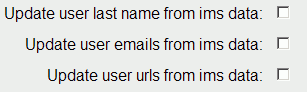
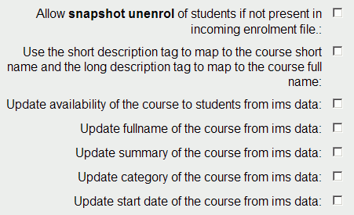

# Minted imsenterprise plugin

See

-   <https://studydirect.sussex.ac.uk/downloads/imsenterprise.php>
-   <http://moodle.org/mod/data/view.php?d=13&rid=804&nbsp>;

This plugin overwrites some Moodle source code so install it with care!

Un-compressing the tar file gives you the following files, move these files into their locations in /data/apache/htdocs/moodle taking care to first backup the files that will be overwritten so you can roll back if necessary.

<table>
<colgroup>
<col width="50%" />
<col width="50%" />
</colgroup>
<thead>
<tr class="header">
<th>
files
</th>
<th>
status
</th>
</tr>
</thead>
<tbody>
<tr class="odd">
<td>
enrol/imsenterprise/<strong>config.html</strong>
</td>
<td>
existing file, backup first! 

</td>
</tr>
<tr class="even">
<td>
enrol/imsenterprise/<strong>enrol.php</strong>
</td>
<td>
existing file, backup first!
</td>
</tr>
<tr class="odd">
<td>
lang/en_utf8/<strong>enrol_imsenterprise.php</strong> 

</td>
<td>
existing file, backup first!
</td>
</tr>
<tr class="even">
<td>
lang/en_utf8/help/enrol/imsenterprise/<strong>capita.html</strong>
</td>
<td>
existing file, backup first! 

</td>
</tr>
<tr class="odd">
<td>
lang/en_utf8/help/enrol/imsenterprise/<strong>categorisation.html</strong>
</td>
<td>
existing file, backup first! 

</td>
</tr>
<tr class="even">
<td>
lang/en_utf8/help/enrol/imsenterprise/<strong>createnewcourses.html</strong>
</td>
<td>
existing file, backup first! 

</td>
</tr>
<tr class="odd">
<td>
lang/en_utf8/help/enrol/imsenterprise/<strong>createnewusers.html</strong>
</td>
<td>
existing file, backup first! 

</td>
</tr>
<tr class="even">
<td>
lang/en_utf8/help/enrol/imsenterprise/<strong>deleteusers.html</strong>
</td>
<td>
existing file, backup first! 

</td>
</tr>
<tr class="odd">
<td>
lang/en_utf8/help/enrol/imsenterprise/<strong>formatoverview.html</strong>
</td>
<td>
existing file, backup first!
</td>
</tr>
<tr class="even">
<td>
lang/en_utf8/help/enrol/imsenterprise/<strong>photos.html</strong>
</td>
<td>
existing file, backup first! 

</td>
</tr>
<tr class="odd">
<td>
lang/en_utf8/help/enrol/imsenterprise/<strong>snapshotunenrol.html</strong>
</td>
<td>
existing file, backup first! 

</td>
</tr>
<tr class="even">
<td>
lang/en_utf8/help/enrol/imsenterprise/<strong>sourceddidfallback.html</strong>
</td>
<td>
existing file, backup first! 

</td>
</tr>
<tr class="odd">
<td>
lang/en_utf8/help/enrol/imsenterprise/<strong>target.html</strong>
</td>
<td>
existing file, backup first! 

</td>
</tr>
<tr class="even">
<td>
lang/en_utf8/help/enrol/imsenterprise/<strong>truncatecoursecodes.html</strong>
</td>
<td>
existing file, backup first!
</td>
</tr>
<tr class="odd">
<td>
lang/en_utf8/help/enrol/imsenterprise/<strong>unenrol.html</strong>
</td>
<td>
existing file, backup first!
</td>
</tr>
<tr class="even">
<td>
lang/en_utf8/help/enrol/imsenterprise/<strong>update_useremails.html</strong>
</td>
<td>
new file 

</td>
</tr>
<tr class="odd">
<td>
lang/en_utf8/help/enrol/imsenterprise/<strong>update_userlastname.html</strong>
</td>
<td>
new file
</td>
</tr>
<tr class="even">
<td>
lang/en_utf8/help/enrol/imsenterprise/<strong>update_userurls.html</strong>
</td>
<td>
new file
</td>
</tr>
<tr class="odd">
<td>
lang/en_utf8/help/enrol/imsenterprise/<strong>updatecategory.html</strong>
</td>
<td>
new file
</td>
</tr>
<tr class="even">
<td>
lang/en_utf8/help/enrol/imsenterprise/<strong>updatestartdate.html</strong>
</td>
<td>
new file
</td>
</tr>
<tr class="odd">
<td>
lang/en_utf8/help/enrol/imsenterprise/<strong>updatesummary.html</strong>
</td>
<td>
new file
</td>
</tr>
<tr class="even">
<td>
lang/en_utf8/help/enrol/imsenterprise/<strong>updatevisibility.html</strong>
</td>
<td>
new file
</td>
</tr>
</tbody>
</table>

After installing the above files you get the following extra options when you go to **Administration** &gt; **Courses** &gt; **Enrolments** and click on **Edit** for the **IMS Enterprise file**
(<http://moodle-test.ucl.ac.uk/admin/enrol_config.php?enrol=imsenterprise>)

## Attachments:

 [minted\_ims1.gif](attachments/2557150/2785290.gif) (image/gif)
 [minted\_ims2.gif](attachments/2557150/2785291.gif) (image/gif)

