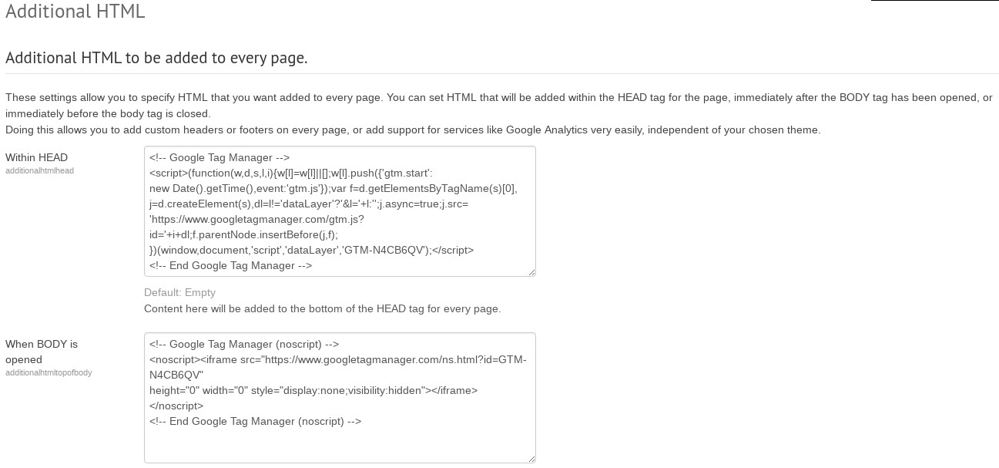
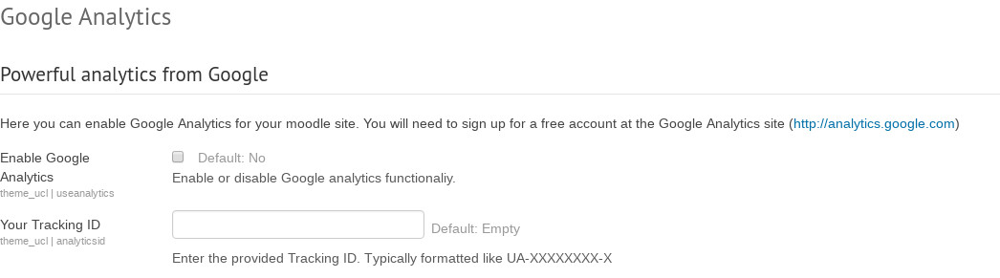
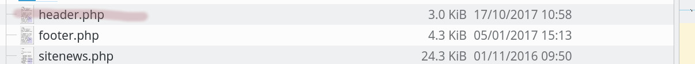
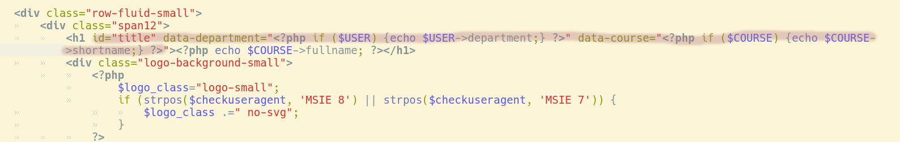

# Moodle - CR00002179 - Analytics change

We don't need an outage for this change.

Change is done via the web interface.

A code snippet is inserted into the pages header template, to provide additional user data.

Steps involved:

-   Add the google tag manager container tag.
-   Remove the google analytics tracking code.
-   Edit the page header template.

**We'll start tracking the following events:**

Course View
Email Link Clicks
External Link Clicks
Internal Link Clicks
MyFeedback - 'My students' View
Myfeedback - 'Overview' View
MyFeedback - Dept Admin View
MyFeedback - Feedback Comments View
MyFeedback - Tutor Dashboard View
Quiz Attempts

Add the google tag manager container tag

Remove the google analytics tracking code

Edit the page header template

## Attachments:

 [additional\_html.jpg](attachments/79502267/79502257.jpg) (image/jpeg)
 [data\_department.jpg](attachments/79502267/79502258.jpg) (image/jpeg)
 [header.jpg](attachments/79502267/79502259.jpg) (image/jpeg)
 [ga.jpg](attachments/79502267/79502264.jpg) (image/jpeg)

