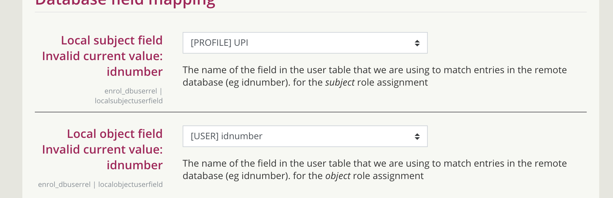

# Moodle 2019 Upgrade - Plan A - 26/07/2019

Any updates to ISD News Item, contact Chris Moos directly, he has agreed to pick up.

## Step 0 - Prep

| Who           | What                                                                                      | Expected Completion | Completed             |
|---------------|-------------------------------------------------------------------------------------------|---------------------|-----------------------|
| Learning Apps | Moodle 3.7 build & config.php deployed on all RHEL7 Apps & Admin servers                  | 24/07/19            | -                     |
| Learning Apps | initial Rsync of Moodledata to new RHEL7 & snapshot environment                           | 22/07/19            | snapshot 06 Jul 2019  
                           
    rhel7                  
                           
    22 Jul 2019            |
| Learning Apps | penultimate Rsync of Moodledata to new RHEL7 & snapshot environment                       | 26/07/19 10am       | started at 2pm        |
| PI            | New New RHEL7 servers GTM/LTM config setup ready to go on moodle.ucl.ac.uk                | 24/07/19            | -                     |
| PI            | URL rewrite from moodle-1819.ucl.ac.uk to equivalent path on moodle.ucl.ac.uk ready to go | 24/07/19            | -                     |
| Learning Apps | RHEL7 Moodle Admin servers are setup for MIM and ready to go live                         | 24/07/19            | -                     |
| PI            | Disable cron for MIM                                                                      | 25/07/19 4pm        | -                     |
| DBA           | MySQL dump of moodle\_int\_management                                                     | 26/07/19 2pm start  | -                     |
| DBA           | Restore moodle\_int\_management on RHEL7 DB                                               | 26/07/19 3:30pm     | -                     |
| Learning Apps | Check MIM runs ok on RHEL7                                                                | 26/07/19 4pm        | -                     |

Required team under ESS

-MySQL DBA - Roy 

-PI - Sam Washington

-HIS - TBC - probably should

-Ed Apps →  EA for start, AS / DK for rest of night / weekend

-Digi-Ed → Jason (?pm for final sanity check and comms)

We should reserve a bank of seats/room in BH or 1SMLG to do this & pre-order some food.

## Step 1 - Follow regular [Change Deployment plan for Learning Apps](Change_Deployment_plan_for_Learning_Apps)

| Who                 | What                                                      | Expected Completion | Completed |
|---------------------|-----------------------------------------------------------|---------------------|-----------|
| Learning Apps       | Outage Manager warning to start at 14h00min on 26/07/19   | 2:00pm              | -         |
| Learning Apps / HIS | Switch off Cron on moodle-admin-01 for moodle             
                                                             
  cd /data/apache/htdocs/ && rm moodle                       
                                                             
  (remove symlink, crons will fail as files won't be found)  | 5:00pm              | -         |
| Learning Apps       | Activate Maintenance Mode                                 | 5:01pm              | -         |
| Learning Apps       | Apply .htaccess redirects to ISD News                     | 5:03pm              | -         |

## Step 2 - Upgrades

**Priority 1 - Upgrade**

<table>
<thead>
<tr class="header">
<th>Who</th>
<th>What</th>
<th>Expected Completion</th>
<th>Completed</th>
</tr>
</thead>
<tbody>
<tr class="odd">
<td>DBA</td>
<td>MySQL dump backup of moodle_live excluding mdl_logstore_standard_log table (15min backup, 5 min transfer)</td>
<td>5:30pm</td>
<td><ul>
<li> </li>
</ul></td>
</tr>
<tr class="even">
<td>Learning Apps</td>
<td>Final Rsync of Moodledata to new RHEL7 environment</td>
<td>5:30pm</td>
<td><ul>
<li> </li>
</ul></td>
</tr>
<tr class="odd">
<td>Learning Apps</td>
<td>
rm -rf /moodlefs/cache/*

rm -rf /moodlefs/localcache/*

rm -rf /moodlefs/muc/*

rm -rf /moodlefs/sessions/*

rm -rf /moodlefs/temp/*
</td>
<td>5:30pm</td>
<td><ul>
<li> </li>
</ul></td>
</tr>
<tr class="even">
<td>DBA</td>
<td>Notify Learning Apps moodle_live restore on mdl-db01.ad and mdl-db02.ad has started</td>
<td>5:35pm</td>
<td><ul>
<li> </li>
</ul></td>
</tr>
<tr class="odd">
<td>DBA</td>
<td>Start mysqldump of mdl_logstore_standard_log</td>
<td>5:35pm</td>
<td><ul>
<li> </li>
</ul></td>
</tr>
<tr class="even">
<td>DBA/ Learning Apps</td>
<td>

Add empty schema for mdl_logstore_standard_log on mdl-db01/mdl-db02

Use latest DDL from moodle_live on moodle-db-01 for table mdl_logstore_standard_log

 

</td>
<td> 
</td>
<td><ul>
<li> </li>
</ul></td>
</tr>
<tr class="odd">
<td>DBA</td>
<td>Restore moodle_live db backup on rhel7 db server complete (should take 1h50m)</td>
<td>7:25pm</td>
<td><ul>
<li> </li>
</ul></td>
</tr>
<tr class="even">
<td>DBA</td>
<td>Notify Learning Apps moodle_live restore complete</td>
<td>7:30pm</td>
<td><ul>
<li> </li>
</ul></td>
</tr>
<tr class="odd">
<td>Learning Apps</td>
<td>Check everything in place</td>
<td>7:35pm</td>
<td><ul>
<li> </li>
</ul></td>
</tr>
<tr class="even">
<td>Learning Apps</td>
<td>Run the Upgrade</td>
<td>7:55pm</td>
<td><ul>
<li> </li>
</ul></td>
</tr>
<tr class="odd">
<td>Learning Apps</td>
<td>Validate that the site is upgraded successfully</td>
<td>8:00pm</td>
<td><ul>
<li> </li>
</ul></td>
</tr>
<tr class="even">
<td>Learning Apps</td>
<td>
chmod -R 777 /moodlefs/cache/*

chmod -R 777 /moodlefs/localcache/*

chmod -R 777 /moodlefs/temp/*
</td>
<td> 
</td>
<td><ul>
<li> </li>
</ul></td>
</tr>
<tr class="odd">
<td>Learning Apps</td>
<td>
<a href="https://moodle.ucl.ac.uk/admin/settings.php?section=theme_adaptable_color" class="uri">https://moodle.ucl.ac.uk/admin/settings.php?section=theme_adaptable_color</a>

Update menubkcolor to #02598C

<a href="https://moodle.ucl.ac.uk/admin/settings.php?section=theme_adaptable_color" class="uri">https://moodle.ucl.ac.uk/admin/settings.php?section=theme_adaptable_color</a>

Update mobileslidebartabbkcolor to #006174

Update mobileslidebartabiconcolor to #FFFFFF

<a href="https://moodle.ucl.ac.uk/admin/settings.php?section=theme_adaptable_navbar" class="uri">https://moodle.ucl.ac.uk/admin/settings.php?section=theme_adaptable_navbar</a>

Update editsettingsbutton to Show edit button only

<a href="https://moodle.ucl.ac.uk/admin/settings.php?section=theme_adaptable_blocks" class="uri">https://moodle.ucl.ac.uk/admin/settings.php?section=theme_adaptable_blocks</a>

Update smallscreenshowsearchicon to No (unticked)

<a href="https://moodle.ucl.ac.uk/admin/settings.php?section=theme_adaptable_layout" class="uri">https://moodle.ucl.ac.uk/admin/settings.php?section=theme_adaptable_layout</a>

Update viewselect to Yes (ticked)

<a href="https://moodle.ucl.ac.uk/admin/settings.php?section=theme_adaptable_header" class="uri">https://moodle.ucl.ac.uk/admin/settings.php?section=theme_adaptable_header</a>

Update socialorsearch to Nnoe
</td>
<td>8:01pm</td>
<td><ul>
<li> </li>
</ul></td>
</tr>
<tr class="even">
<td>Learning Apps</td>
<td>Notify PI that site can be made available</td>
<td>8:05pm</td>
<td><ul>
<li> </li>
</ul></td>
</tr>
<tr class="odd">
<td>Learning Apps</td>
<td>Delete rows where id = 185261, 185259 in mdl_block_instances</td>
<td> 
</td>
<td><ul>
<li> </li>
</ul></td>
</tr>
<tr class="even">
<td>PI</td>
<td>Make moodle.ucl.ac.uk available</td>
<td>8:10pm</td>
<td><ul>
<li> </li>
</ul></td>
</tr>
<tr class="odd">
<td>PI</td>
<td>Implement moodle-1819.ucl.ac.uk rewrite to moodle.ucl.ac.uk</td>
<td>8:20pm</td>
<td><ul>
<li> </li>
</ul></td>
</tr>
<tr class="even">
<td>Learning Apps</td>
<td>Disable Activities block (This duplicates the &quot;This Course&quot; dropdown)</td>
<td>8:25pm</td>
<td><ul>
<li> </li>
</ul></td>
</tr>
<tr class="odd">
<td>Learning Apps</td>
<td>Set Navigation block setting &quot;Generate navigation for the following&quot; to &quot;Categories and courses&quot;</td>
<td>8:25pm</td>
<td><ul>
<li> </li>
</ul></td>
</tr>
<tr class="even">
<td>Digi-Ed</td>
<td>Login to site (Still in Maintenance mode) and do a final sanity check</td>
<td>8:30pm</td>
<td><ul>
<li> </li>
</ul></td>
</tr>
<tr class="odd">
<td>Learning Apps</td>
<td>

Update the Search Courses block to fix formatting errors and to search the correct Moodle

<a href="https://moodle.ucl.ac.uk/my/indexsys.php" class="uri">https://moodle.ucl.ac.uk/my/indexsys.php</a>

Click <strong>Blocks editing on</strong>

Configure search courses block

Open HTML and replace existing code with the HTML below

Press <strong>Save changes</strong>

Click <strong>Blocks editing off</strong>, wait for page to refresh and then click Reset dashboard for all users

<strong></strong> Expand source

<pre class="xml" data-syntaxhighlighter-params="brush: xml; gutter: false; theme: Confluence; collapse: true" data-theme="Confluence" style="brush: xml; gutter: false; theme: Confluence; collapse: true"><code>&lt;div&gt;
  &lt;form action=&quot;https://moodle.ucl.ac.uk/course/search.php&quot;&gt;
    &lt;label class=&quot;hidden&quot; for=&quot;search-1&quot; style=&quot;display: none;&quot;&gt;Search courses&lt;/label&gt;
    &lt;div&gt;
      &lt;input placeholder=&quot;Search Courses&quot; accesskey=&quot;6&quot; style=&quot;width:90%;&quot; name=&quot;search&quot; id=&quot;search-1&quot; autocomplete=&quot;off&quot; type=&quot;text&quot;&gt;
      &lt;button title=&quot;Search Courses&quot; type=&quot;submit&quot;&gt;
        &lt;abbr class=&quot;fa fa-search&quot; title=&quot;Search Courses&quot;&gt;&lt;/abbr&gt;
      &lt;/button&gt;
    &lt;/div&gt;
  &lt;/form&gt;
&lt;/div&gt;
&lt;br&gt;
&lt;br&gt;
&lt;div&gt;
  &lt;a href=&quot;https://moodle.ucl.ac.uk/course/index.php&quot;&gt;All Courses..&lt;/a&gt;
&lt;/div&gt;</code></pre>

</td>
<td>8:45 PM</td>
<td><ul>
<li> </li>
</ul></td>
</tr>
<tr class="even">
<td>Learning Apps</td>
<td>re allow course reset capability for roles <a href="Disable_role_course_reset">Disable role course reset</a></td>
<td>9:05pm</td>
<td><ul>
<li> </li>
</ul></td>
</tr>
<tr class="odd">
<td>Learning Apps</td>
<td>

Update mappings in <a href="https://moodle.ucl.ac.uk/admin/settings.php?section=enrolsettingsdbuserrel" class="uri">https://moodle.ucl.ac.uk/admin/settings.php?section=enrolsettingsdbuserrel</a> to:

</td>
<td>9:20pm</td>
<td><ul>
<li> </li>
</ul></td>
</tr>
<tr class="even">
<td>Learning Apps</td>
<td>Do a global turn off of MIM - <a href="SQL-Queries-of-Moodle_6164026.html#SQLQueriesofMoodle-Updatesitsfiltermappingactivefrom%E2%80%98Y%E2%80%99to%E2%80%98N%E2%80%99">SQL Queries of Moodle#Updatesitsfiltermappingactivefrom%E2%80%98Y%E2%80%99to%E2%80%98N%E2%80%99</a></td>
<td>9:30pm</td>
<td><ul>
<li> </li>
</ul></td>
</tr>
<tr class="odd">
<td>Learning Apps</td>
<td>php admin/tool/replace/cli/replace.php --search=' https://moodle-1819.ucl.ac.uk/ ' --replace='https://moodle.ucl.ac.uk/' --non-interactive --shorten=true</td>
<td>8:30pm</td>
<td><ul>
<li> </li>
</ul></td>
</tr>
<tr class="even">
<td>Learning Apps</td>
<td>Resolved issue with mdl-app02.ad line break in config.php before the &lt;?php</td>
<td>10pm</td>
<td><ul>
<li> </li>
</ul></td>
</tr>
<tr class="odd">
<td>Learning Apps</td>
<td>Update dropdown menu links from moodle-1819.ucl.ac.uk to moodle.ucl.ac.uk</td>
<td> 
</td>
<td><ul>
<li> </li>
</ul></td>
</tr>
<tr class="even">
<td>Learning Apps</td>
<td>
Replace &quot;Learn to use Moodle&quot; from <a href="https://moodle.ucl.ac.uk/course/view.php?id=34285" class="uri">https://moodle.ucl.ac.uk/course/view.php?id=34285</a>

to <a href="https://moodle.ucl.ac.uk/course/view.php?id=9182" class="uri">https://moodle.ucl.ac.uk/course/view.php?id=9182</a>

 

</td>
<td> 
</td>
<td><ul>
<li> </li>
</ul></td>
</tr>
<tr class="odd">
<td>Learning Apps</td>
<td>
Remove guest login to mitigate navbar problem - set to empty setting toolsmenu4 on https://moodle.ucl.ac.uk/admin/settings.php?section=theme_adaptable_header_navbar_menu

For reference, was set to:

&lt;span class=&quot;fa fa-user&quot;&gt;&lt;/span&gt; Guest Login| /login/index.php | Guest Login
</td>
<td> 
</td>
<td><ul>
<li> </li>
</ul></td>
</tr>
<tr class="even">
<td>Learning Apps</td>
<td>Take site out of Maintenance Mode after sign-off from Digi-Ed</td>
<td>
<del>00:40am</del>

11am?
</td>
<td><ul>
<li> </li>
</ul></td>
</tr>
<tr class="odd">
<td>Digi-Ed</td>
<td>Comms that New New Moodle is live</td>
<td>Monday 10:00am</td>
<td><ul>
<li> </li>
</ul></td>
</tr>
<tr class="even">
<td>Learning Apps</td>
<td>
Re-Enable / set to Yes - enrol_imsenterprise | imsunenrol

and disable scheduled task \enrol_imsenterprise\task\cron_task
</td>
<td> 
</td>
<td><ul>
<li> </li>
</ul></td>
</tr>
<tr class="odd">
<td>Learning Apps / HIS</td>
<td>enable cron on new RHEL7 admin servers</td>
<td>by monday</td>
<td><ul>
<li> </li>
</ul></td>
</tr>
</tbody>
</table>

**Secondary Priority - Moodle 1819 snapshot**

<table>
<thead>
<tr class="header">
<th>Who</th>
<th>What</th>
<th>Expected Completion</th>
<th>Completed</th>
</tr>
</thead>
<tbody>
<tr class="odd">
<td>Learning Apps</td>
<td>Final Rsync of Moodledata to Snapshot /18-19</td>
<td>5:50pm</td>
<td><ul>
<li> </li>
</ul></td>
</tr>
<tr class="even">
<td>Learning Apps</td>
<td>
rm -rf /data/moodle/18-19/cache/*

rm -rf /data/moodle/18-19/localcache/*

rm -rf /data/moodle/18-19/muc/*

rm -rf /data/moodle/18-19/sessions/*

rm -rf /data/moodle/18-19/temp/*
</td>
<td> 
</td>
<td><ul>
<li> </li>
</ul></td>
</tr>
<tr class="odd">
<td>DBA</td>
<td>restore moodle_live db backup on snapshot DB server as moodle_archive_1819 (excludes log table) - start about 5:35pm</td>
<td>
<del>7:35pm</del>

1am
</td>
<td><ul>
<li> </li>
</ul></td>
</tr>
<tr class="even">
<td> 
</td>
<td>start restore of mdl_logstore_standard_log into moodle_archive_1819</td>
<td>
 

</td>
<td><ul>
<li> </li>
</ul></td>
</tr>
<tr class="odd">
<td>DBA</td>
<td>Notify Learning Apps restore of moodle_live is complete and restore of mdl_logstore_standard_log has started on mysdb-04</td>
<td>
 

</td>
<td><ul>
<li> </li>
</ul></td>
</tr>
<tr class="even">
<td>DBA</td>
<td>Notify Learning Apps that mdl_logstore_standard_log completed on mysdb-04 moodle-db-02 (restore fails for 30 odd tables on mysdb-04)</td>
<td>
 

 

</td>
<td><ul>
<li> </li>
</ul></td>
</tr>
<tr class="odd">
<td>Learning Apps</td>
<td>Check everything in place</td>
<td>10am</td>
<td><ul>
<li> </li>
</ul></td>
</tr>
<tr class="even">
<td>Learning Apps</td>
<td>Run the Upgrade</td>
<td>10:30am</td>
<td><ul>
<li> </li>
</ul></td>
</tr>
<tr class="odd">
<td>Learning Apps</td>
<td>
chmod -R 777 /data/moodle/18-19/cache/*

chmod -R 777 /data/moodle/18-19/localcache/*

chmod -R 777 /data/moodle/18-19/temp/*
</td>
<td> 
</td>
<td><ul>
<li> </li>
</ul></td>
</tr>
<tr class="even">
<td>Learning Apps</td>
<td>
Run URL update tool

php admin/tool/replace/cli/replace.php --search=' https://moodle-1819.ucl.ac.uk/ ' --replace='https://moodle-snapshot.ucl.ac.uk/18-19/' --non-interactive --shorten=true
</td>
<td>11am</td>
<td><ul>
<li> </li>
</ul></td>
</tr>
<tr class="odd">
<td>Learning Apps</td>
<td>delete row from `mdl_registration_hubs`</td>
<td> 
</td>
<td><ul>
<li> </li>
</ul></td>
</tr>
<tr class="even">
<td>Learning Apps</td>
<td>Delete rows where id = 185261, 185259 in mdl_block_instances</td>
<td> 
</td>
<td><ul>
<li> </li>
</ul></td>
</tr>
<tr class="odd">
<td>Learning Apps</td>
<td>Validate that the site is upgraded successfully</td>
<td>10:45am</td>
<td><ul>
<li> </li>
</ul></td>
</tr>
<tr class="even">
<td> 
</td>
<td>
Update the Search Courses block to point to the snapshot url

<a href="https://moodle-snapshot.ucl.ac.uk/18-19/my/indexsys.php" class="uri">https://moodle-snapshot.ucl.ac.uk/18-19/my/indexsys.php</a>

Click <strong>Blocks editing on</strong>

Configure search courses block

Open HTML and replace

<a href="https://moodle-1819.ucl.ac.uk" class="uri">https://moodle-1819.ucl.ac.uk</a> with <a href="https://moodle-snapshot.ucl.ac.uk/18-19" class="uri">https://moodle-snapshot.ucl.ac.uk/18-19</a>

Press <strong>Save changes</strong>

Click <strong>Blocks editing off</strong>, wait for page to refresh and then click Reset dashboard for all users
</td>
<td> 
</td>
<td><ul>
<li> </li>
</ul></td>
</tr>
<tr class="odd">
<td> 
</td>
<td>Update LDAP settings - make sure TLS disabled and ldap url uses ldap:// and not ldaps://</td>
<td> 
</td>
<td><ul>
<li> </li>
</ul></td>
</tr>
<tr class="even">
<td> 
</td>
<td>
Add to Custom CSS on <a href="https://moodle-snapshot.ucl.ac.uk/18-19/admin/settings.php?section=theme_adaptable_generic" class="uri">https://moodle-snapshot.ucl.ac.uk/18-19/admin/settings.php?section=theme_adaptable_generic</a>

.block_myoverview .myoverviewimg { 
height: 0px; 
}
</td>
<td> 
</td>
<td><ul>
<li> </li>
</ul></td>
</tr>
<tr class="odd">
<td>Learning Apps</td>
<td>Make site live (remove .htaccess)</td>
<td>11am</td>
<td><ul>
<li> </li>
</ul></td>
</tr>
<tr class="even">
<td>Digi-Ed</td>
<td>Login to site (Still in Maintenance mode) and do a final sanity check</td>
<td>15:15pm</td>
<td><ul>
<li> </li>
</ul></td>
</tr>
<tr class="odd">
<td>Learning Apps</td>
<td>Take site out of Maintenance Mode after sign-off from Digi-Ed &amp; add link on snapshot homepage</td>
<td>11am</td>
<td><ul>
<li> </li>
</ul></td>
</tr>
<tr class="even">
<td>Learning Apps</td>
<td>Remove .htaccess and do a git pull in /data/apache/htdocs/moodle/ to update the index.php to add link to 18-19 snapshot</td>
<td>11am</td>
<td><ul>
<li> </li>
</ul></td>
</tr>
<tr class="odd">
<td>Learning Apps</td>
<td>Enable Hub Plugin on moodle.ucl.ac.uk - copy config from PP</td>
<td>16:00pm</td>
<td><ul>
<li> </li>
</ul></td>
</tr>
<tr class="even">
<td>Digi-Ed</td>
<td>Comms that Moodle 1819 snapshot is live</td>
<td>Monday 10am</td>
<td><ul>
<li> </li>
</ul></td>
</tr>
</tbody>
</table>

## Step 3 - Complete

| Who           | What                                                            | Expected Completion | Completed |
|---------------|-----------------------------------------------------------------|---------------------|-----------|
| Learning Apps | Notify ele-core & Service Desk that upgrade & snapshot complete | Friday/Saturday     | -         |
| Learning Apps | Thank everyone involved and let everyone go home                | Saturday            | -         |
| Learning Apps | Update CR and mark change as complete and succesful             | Monday              | -         |

## Attachments:

 [Screenshot 2019-07-18 at 21.19.40.png](attachments/116005058/120783471.png) (image/png)

