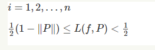

# Moodle 3.9.4

Release date: Tuesday 26th January 1am-2am

Release Lead: AS

1) Minor Release of Moodle 3.9.4

Update from 3.9.3+

2)Add Mathematical expressions support using LaTex in H5P - <https://h5p.org/mathematical-expressions>

-   Add the below code to config.php

``` php
$CFG->mod_hvp_library_config = array(
  "H5P.MathDisplay" => array(
    "observers" => array(
      array("name" => "mutationObserver", "params" => array("cooldown" => 500)),
      array("name" => "domChangedListener"),
      array("name" => "interval", "params" => array("time" => 1000))
    ),
    "renderer" => array(
      "mathjax" => array(
        "src" => "https://cdnjs.cloudflare.com/ajax/libs/mathjax/2.7.5/MathJax.js",
        "config" => array(
          "extensions" => array("tex2jax.js"),
          "jax" => array("input/TeX", "output/HTML-CSS"),
          "tex2jax" => array(
            // Important, otherwise MathJax will be rendered inside CKEditor
            "ignoreClass" => "ckeditor"
          ),
          "messageStyle" => "none"
        )
      )
    )
  )
);
```

-   Add the following H5P library <https://h5p.org/sites/default/files/h5p-math-display-1.0.6.h5p>
-   Purge caches
-   In H5P activity you can use Accordion type as text field. Then Use $$ on both sides of your LaTex to test 

Example LaTex: 

$$ i=1,2,\\ldots,n $$

$$\\frac12(1-\\|P\\|)\\le L(f,P)&lt;\\frac12\\ $$

Expected result:



3) Changes to the language pack:

| Component  | Stringname        | Before                                                                                                           | After                                                                                                                                                           | Reason                                                  |
|------------|-------------------|------------------------------------------------------------------------------------------------------------------|-----------------------------------------------------------------------------------------------------------------------------------------------------------------|---------------------------------------------------------|
| hvp        | modulename        | Interactive Content                                                                                              | Interactive Content (H5P)                                                                                                                                       | [LNA-713](https://ucldata.atlassian.net/browse/LNA-713) |
| qtype\_mtf | pluginname        | Multiple True False (ETH)                                                                                        | Multiple True False (MTF)                                                                                                                                       | [LNA-696](https://ucldata.atlassian.net/browse/LNA-696) |
| qtype\_mtf | pluginnamesummary | In Multiple True/False ("Type X") questions a number of options have to be correctly rated as "true" or "false". | Multiple True False (MTF) questions consist of a question stem followed by a series of prompts or statements that students evaluate as being "true" or "false". | LNA-696                                                 |

Release Notes:

**Update Moodle to version 3.9.4**

-   fixes [bugs](https://docs.moodle.org/dev/Moodle_3.9.4_release_notes) and security issues
-   fixed theme issues with Safari - Adding Activities and Course Formatting

**New Plugin: Multiple True/False Question Type (MTF)**

-   Miniguide: [M12e - Multiple True/False Question Type (MTF)](https://wiki.ucl.ac.uk/pages/viewpage.action?pageId=161875352)

**New H5P Feature: Use LaTex Mathematical formulae within H5P**

-   [Authoring guidance](https://documentation.h5p.com/content/1290620298372631978)

## Attachments:

 [image2021-1-15\_11-28-27.png](attachments/151266376/160694975.png) (image/png)

