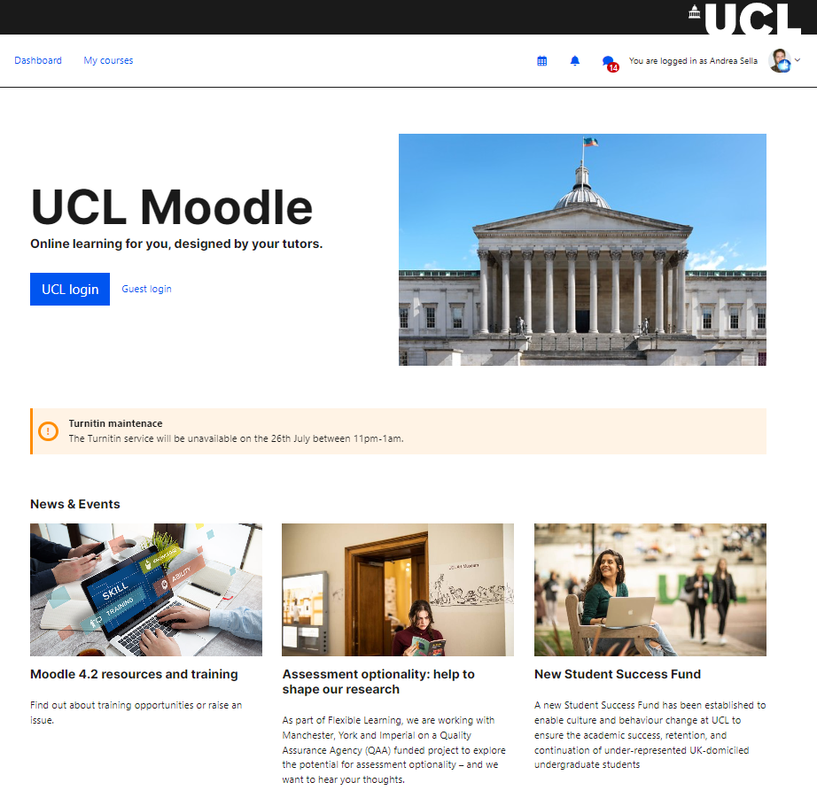
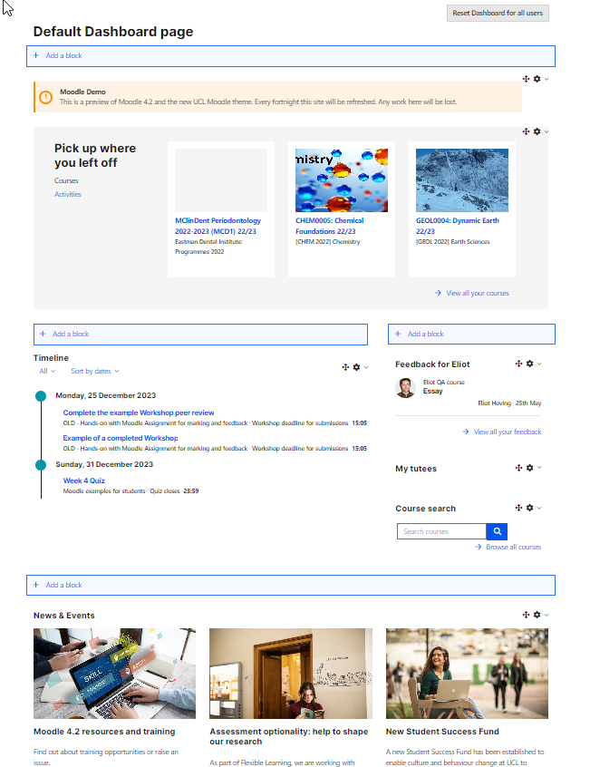

# Moodle 4.2.1

Release date: Thursday 27th July 2023 1am - 9am

Release Lead: Alistair Spark

-   Deadline to add changes to this release: Friday 21st July 2023 5pm
-   Deadline to handover release to Catalyst: Monday 24th July 2023 11am
-   Must deploy to staging by: Tuesday 25th July 2023 11am
-   Complete load testing of build by: Tuesday 11th July 5pm

## 1) Major Release of Moodle 4.2.1+ (20230721)

Update from 3.11.15

## 2) Catalyst runbook for the upgrade

-   uninstall plugins removed from build
-   upgrade from MySQL5.7 to MySQL8.0
-   upgrade from Moodle 3.11.15 to Moodle 4.2.1
-   run database queries listed below
-   release site in soft maintenance mode

**Database queries to run **

a) Change all collapsed topics courses to topics format.

``` java
SET SQL_SAFE_UPDATES=0;
UPDATE mdl_course SET format='topics' WHERE format='topcoll';
```

b) Update Lecturecast & Library LTI icon

``` java
UPDATE mdl_lti SET icon='https://moodle.ucl.ac.uk/pix/lecturecast.svg' WHERE typeid='3';
UPDATE mdl_lti SET secureicon='https://moodle.ucl.ac.uk/pix/lecturecast.svg' WHERE typeid='3';
UPDATE mdl_lti_types SET secureicon='https://moodle.ucl.ac.uk/pix/lecturecast.svg' WHERE id='3';
UPDATE mdl_lti_types SET icon='https://moodle.ucl.ac.uk/pix/lecturecast.svg' WHERE id='3';

UPDATE mdl_lti SET icon='https://moodle.ucl.ac.uk/theme/norse/pix_plugins/mod/readinglist/monologo.svg' WHERE typeid='503';
UPDATE mdl_lti SET secureicon='https://moodle.ucl.ac.uk/theme/norse/pix_plugins/mod/readinglist/monologo.svg' WHERE typeid='503';
UPDATE mdl_lti_types SET secureicon='https://moodle.ucl.ac.uk/theme/norse/pix_plugins/mod/readinglist/monologo.svg' WHERE id='503';
UPDATE mdl_lti_types SET icon='https://moodle.ucl.ac.uk/theme/norse/pix_plugins/mod/readinglist/monologo.svg' WHERE id='503';
```

c) Change all user preferences for course overview block to card.

``` java
UPDATE mdl_user_preferences SET value='card' where name='block_myoverview_user_view_preference';
```

d) Purge Caches for this to apply

<https://moodle.ucl.ac.uk/admin/purgecaches.php>

## 3) Config  Changes that will need to be applied after site is released in soft maintenance mode

**a) Switch to Titus theme **

Got to <https://moodle.ucl.ac.uk/theme/index.php> and for Norse - click on "Use Theme"

**b) Upload  norse theme config file **

Go to <https://moodle.ucl.ac.uk/theme/norse/customise.php?tab=advanced> click import and upload the below zip

theme\_norse\_settings (25-07-23).zip

This config is minimalist. It is only required to pull UCL icon images, the images on the login page, and footer links.

**c) Site admin changes**

Component

Setting name

Before

After

Reason

core

<https://moodle.ucl.ac.uk/admin/settings.php?section=themesettings>

custommenuitems

Staff Help
-Moodle Staff Guides|<https://wiki.ucl.ac.uk/x/-xliAQ>   "target=\\"\_blank
-Lecturecast Staff Guides|<https://wiki.ucl.ac.uk/x/ZBhiAQ>
-Request a Moodle Course|<https://wiki.ucl.ac.uk/x/URUVAw>   "target=\\"\_blank
-Exam Notification Form|<https://ucl--bmcservicedesk.eu28.visual.force.com/apex/BMCServiceDesk__SelfServiceNew?fromSiteUrl=#/support/problem-requests/all?id=a3S0J0000026LLoUAM> "target=\\"\_blank
-Digital Skills|<https://www.ucl.ac.uk/isd/services/learning-teaching/learning-teaching-services/digital-skills-development>   "target=\\"\_blank
-Quickscan Dyslexia Screening|<https://wiki.ucl.ac.uk/x/TL8sC>
-UCL Moodle User Group|<https://moodle.ucl.ac.uk/course/view.php?id=12159>   "target=\\"\_blank
-About Moodle at UCL|<https://www.ucl.ac.uk/isd/services/learning-teaching/moodle> "target=\\"\_blank
Student Help
-Login issues?|<https://wiki.ucl.ac.uk/x/-AKmAQ>  "target=\\"\_blank
-Moodle Student guides|<https://wiki.ucl.ac.uk/x/RQKmAQ>  "target=\\"\_blank
-Digital Education at UCL|<https://moodle.ucl.ac.uk/course/view.php?id=9119>  "target=\\"\_blank
-Plagiarism & Academic Writing|<https://moodle.ucl.ac.uk/course/view.php?id=34>  "target=\\"\_blank
-LibrarySkills@UCL|<https://www.ucl.ac.uk/library/training>  "target=\\"\_blank
-Digital Skills|<https://www.ucl.ac.uk/isd/services/learning-teaching/learning-teaching-services/digital-skills-development>   "target=\\"\_blank
-Quickscan Dyslexia Screening|<https://wiki.ucl.ac.uk/x/TL8sC>
Services
-Moodle Snapshot|<https://moodle-snapshot.ucl.ac.uk/> "target=\\"\_blank
-LinkedIn Learning| <https://www.ucl.ac.uk/isd/linkedin-learning> "target=\\"\_blank
-Portico|<http://www.ucl.ac.uk/portico> "target=\\"\_blank
-Common Timetable|<http://www.ucl.ac.uk/timetable> "target=\\"\_blank
-Library|<http://www.ucl.ac.uk/library> "target=\\"\_blank
-MyAccount|<https://myaccount.ucl.ac.uk/> "target=\\"\_blank
-Live@UCL Email|<http://outlook.com/live.ucl.ac.uk> "target=\\"\_blank
-MyPortfolio|<https://myportfolio.ucl.ac.uk> "target=\\"\_blank

Remove any dropdowns, course library link etc.

multiple columns... e.g. staff 


Becomes

Dashboard, My courses


core

customusermenuitems

profile,moodle|/user/profile.php
accessibilitytool,local\_accessibilitytool|/local/accessibilitytool/manage.php
calendar,core\_calendar|/calendar/view.php?view=month
privatefiles,moodle|/user/files.php
reports,core\_reportbuilder|/reportbuilder/index.php

profile,moodle|/user/profile.php
calendar,core\_calendar|/calendar/view.php?view=month
privatefiles,moodle|/user/files.php
reports,core\_reportbuilder|/reportbuilder/index.php

accessibility tool has been removed 

atto\_collapse

<https://moodle.ucl.ac.uk/admin/settings.php?section=atto_collapse_settings>

showgroups

5
6

New default for Moodle.
editor\_atto

<https://moodle.ucl.ac.uk/admin/settings.php?section=editorsettingsatto>

toolbar

style1 = fullscreen, title, fontfamily, fontsize, morefontcolors
list = unorderedlist, orderedlist
links = link
files = echo360attoplugin, image, media
undo = undo
style2 = bold, italic, underline, strike, subscript, superscript
align = align
indent = indent
insert = equation, charmap, table, clear, embedquestion
pastespecial = pastespecial
accessibility = accessibilitychecker, accessibilityhelper
other = htmlplus
primary = title, bold, italic
list = unorderedlist, orderedlist
links = link
files = echo360attoplugin, image, media, embedquestion
pastespecial = clear, pastespecial
collapse = collapse
align = align
insert = equation, charmap, table
fullscreen = fullscreen
other = htmlplus

Trial a simplified version of the Atto editor.
block\_alerts

<https://moodle.ucl.ac.uk/admin/settings.php?section=blocksettingalerts>

date1

block\_alerts

title1

block\_alerts

description1

 

block\_news

<https://moodle.ucl.ac.uk/admin/settings.php?section=blocksettingnews>

date1

27/07/2023
block\_news

title1

Moodle 4.2 Staff resources and training

block\_news

image1

https://www.ucl.ac.uk/isd/sites/isd/files/study-skills-e-learning-resized-istock-889968488.jpg

block\_news

description1

Find out about the new upgraded Moodle (July 2023). Updated mini-guides and access to self paced staff training.

block\_news

link1

https://wiki.ucl.ac.uk/x/-xliAQ

block\_news

<https://moodle.ucl.ac.uk/admin/settings.php?section=blocksettingnews>

date2

27/07/2023

block\_news

title2

Late Summer Assessment 2023

block\_news

image2

<https://www.ucl.ac.uk/news/sites/news/files/styles/medium_image/public/student_at_computer.jpg?itok=E91qO9V5>
block\_news

description2

Information on the Late Summer Assessment for resitting and deferred candidates.

block\_news

link2

<https://www.ucl.ac.uk/srs/news/2023/jun/late-summer-assessments-2023>

block\_news

<https://moodle.ucl.ac.uk/admin/settings.php?section=blocksettingnews>

date3

27/07/2023

block\_news

title3

Moodle 4.2 Student resources

block\_news

image3

<https://www.ucl.ac.uk/news/sites/news/files/styles/medium_image/public/s_uk_ucl_61_web_ready800x500_0.jpg?itok=70kFDOd->
block\_news

description3

Updated Student guidance on Moodle following July 2023 upgrade. 

block\_news

link3

<https://wiki.ucl.ac.uk/x/RQKmAQ>

Messaging

Use enter to send enabled by default

https://moodle.ucl.ac.uk/admin/settings.php?section=messages

messagingdefaultpressenter
Undefined

yes

Easier messaging for users.
Manage course formats

<https://moodle.ucl.ac.uk/admin/settings.php?section=manageformats>

manageformats

Single activity format

Social format

Enabled

Disabled

Removes Single activity format and Social format from use.
Enable timed assignments

<https://moodle.ucl.ac.uk/admin/settings.php?section=modsettingassign>

assign | enabletimelimit

Yes

New Moodle 4 feature
Format Onetopic tabs

[https://moodle.ucl.ac.uk/admin/settings.php?section=formatsettingonetopic\#\#tabs-tree-start](https://moodle.ucl.ac.uk/admin/settings.php?section=formatsettingonetopic##tabs-tree-start)

Set default

Set Active

Set disabled

Set Hover

Other styles

Background

Font

Font

Other styles

Other styles

border-radius: 0px;

\#0055f0

\#fff Bold

\#1a1a1a

opacity: 0.8

border-bottom: 2px solid \#0055f0;

Improve Tabs formatting out the box given Theme colour changes.

<https://moodle.ucl.ac.uk/admin/message.php>

New Login Notification

Enabled

Disabled (blanket all cases)

sends out an email on every login

<https://moodle.ucl.ac.uk/admin/settings.php?section=optionalsubsystems>

enablemoodlenet

enableportfolios

Yes

Yes

No

No

External system - needs to be reviewed first

Avoids known bug

**e) Blocks prep**

[https://moodle.ucl.ac.uk/admin/blocks.php](https://moodle.ucl.ac.uk/admin/block.php) 

-   Unprotect Mentees and Course Overview blocks

<!-- -->

-   Enable timeline block
-   Enable activities block

**f) Site home**

<https://moodle.ucl.ac.uk/?redirect=0>

In the upper region:

-   Delete the "**Admin Presets"** block
-   Delete the "**My Tutees**" block.

**Check/set front page name and description:**

<https://moodle.ucl.ac.uk/admin/settings.php?section=frontpagesettings>

Full site name: UCL Moodle

Short name: UCL Moodle

Site home summary: None.

**Add Alerts block**

**Add News block**

Should look like this while editing


should appear as below, once saved:



**g) Dashboard**

<https://moodle.ucl.ac.uk/my/indexsys.php>

Top of the page (spans full width of dashboard):

-   Alerts block 
-   Pick up where you left off (new recently accessed courses block)

Left hand column:

-   Timeline

Right hand column:

-   My feedback block
-   My tutees → is already there but move it in the right position
-   Search courses -&gt; delete the old and use the new html code here: <https://github.com/ucl-isd/moodle-UCL_config/blob/main/search_courses.html>). Update Course search block with the correct URL for the form and link element. It is hardcoded.

Bottom of page:

-   News block

Once configured, **reset Dashboard for all users**.

Configure dashboard - should appear as below



4) Changes to settings:

Component

Setting name

Before

After

Reason

5) Config changes:

<table>
<thead>
<tr class="header">
<th>Setting</th>
<th>Current</th>
<th><div class="content-wrapper">
<p>New</p>
</div></th>
</tr>
</thead>
<tbody>
<tr class="odd">
<td><br />
</td>
<td><br />
</td>
<td><br />
</td>
</tr>
</tbody>
</table>

6) Import Dashboard User tour

Download file below:

tour\_export\_29\_1690275638.json

Import to <https://moodle.ucl.ac.uk/admin/tool/usertours/configure.php?action=importtour>

Release Notes:

# **27th July 2023**

**Upgrade to Moodle 4.2.1
**

-   Blog post - https://blogs.ucl.ac.uk/digital-education/2023/07/26/ucl-moodle-has-been-upgraded-to-moodle-version-4-2

## Attachments:

 [image2021-1-15\_11-28-27.png](attachments/258375849/258375841.png) (image/png)
 [image-2023-5-26\_16-25-46.png](attachments/258375849/279513309.png) (image/png)
 [image-2023-5-26\_17-43-33.png](attachments/258375849/279513310.png) (image/png)
 [Screenshot 2023-05-29 at 22.03.27.png](attachments/258375849/279513311.png) (image/png)
 [image-2023-5-26\_12-2-12.png](attachments/258375849/279513312.png) (image/png)
 [image-2023-6-9\_12-58-50.png](attachments/258375849/279513313.png) (image/png)
 [tour\_export\_29\_1690275638.json](attachments/258375849/279513608.json) (application/octet-stream)
 [theme\_norse\_settings (25-07-23).zip](attachments/258375849/279513807.zip) (application/zip)

