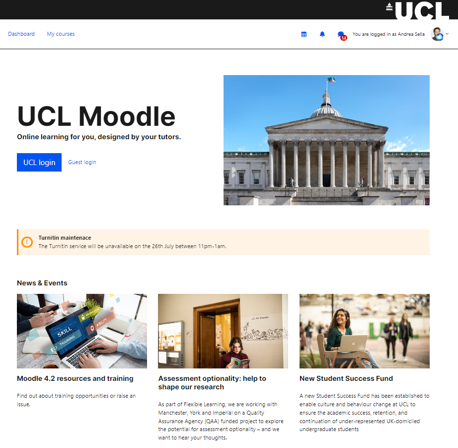

# Moodle 4.x Theme updates (pre-upgrade)

This document outlines the changes required to update the theme in a Moodle environment  e.g. demo, training, UAT.

**1) Switch to Titus theme **

Got to <https://4-demo-prep.preview-moodle.ucl.ac.uk/theme/index.php> and for Norse - click on "Use Theme"

**2) Upload config file **

Go to <https://4-demo-prep.preview-moodle.ucl.ac.uk/theme/norse/customise.php?tab=advanced> click import and upload the below zip

theme\_norse\_settings (25-07-23).zip

This config is minimalist. It is only required to pull UCL icon images and the images on the login page.

**3) Site admin changes**

Component

Setting name

Before

After

Reason

core

<https://4-demo.preview-moodle.ucl.ac.uk/admin/settings.php?section=themesettings>

custommenuitems

Staff Help
-Moodle Staff Guides|<https://wiki.ucl.ac.uk/x/-xliAQ>   "target=\\"\_blank
-Lecturecast Staff Guides|<https://wiki.ucl.ac.uk/x/ZBhiAQ>
-Request a Moodle Course|<https://wiki.ucl.ac.uk/x/URUVAw>   "target=\\"\_blank
-Exam Notification Form|<https://ucl--bmcservicedesk.eu28.visual.force.com/apex/BMCServiceDesk__SelfServiceNew?fromSiteUrl=#/support/problem-requests/all?id=a3S0J0000026LLoUAM> "target=\\"\_blank
-Digital Skills|<https://www.ucl.ac.uk/isd/services/learning-teaching/learning-teaching-services/digital-skills-development>   "target=\\"\_blank
-Quickscan Dyslexia Screening|<https://wiki.ucl.ac.uk/x/TL8sC>
-UCL Moodle User Group|<https://moodle.ucl.ac.uk/course/view.php?id=12159>   "target=\\"\_blank
-About Moodle at UCL|<https://www.ucl.ac.uk/isd/services/learning-teaching/moodle> "target=\\"\_blank
Student Help
-Login issues?|<https://wiki.ucl.ac.uk/x/-AKmAQ>  "target=\\"\_blank
-Moodle Student guides|<https://wiki.ucl.ac.uk/x/RQKmAQ>  "target=\\"\_blank
-Digital Education at UCL|<https://moodle.ucl.ac.uk/course/view.php?id=9119>  "target=\\"\_blank
-Plagiarism & Academic Writing|<https://moodle.ucl.ac.uk/course/view.php?id=34>  "target=\\"\_blank
-LibrarySkills@UCL|<https://www.ucl.ac.uk/library/training>  "target=\\"\_blank
-Digital Skills|<https://www.ucl.ac.uk/isd/services/learning-teaching/learning-teaching-services/digital-skills-development>   "target=\\"\_blank
-Quickscan Dyslexia Screening|<https://wiki.ucl.ac.uk/x/TL8sC>
Services
-Moodle Snapshot|<https://moodle-snapshot.ucl.ac.uk/> "target=\\"\_blank
-LinkedIn Learning| <https://www.ucl.ac.uk/isd/linkedin-learning> "target=\\"\_blank
-Portico|<http://www.ucl.ac.uk/portico> "target=\\"\_blank
-Common Timetable|<http://www.ucl.ac.uk/timetable> "target=\\"\_blank
-Library|<http://www.ucl.ac.uk/library> "target=\\"\_blank
-MyAccount|<https://myaccount.ucl.ac.uk/> "target=\\"\_blank
-Live@UCL Email|<http://outlook.com/live.ucl.ac.uk> "target=\\"\_blank
-MyPortfolio|<https://myportfolio.ucl.ac.uk> "target=\\"\_blank

Remove any dropdowns, course library link etc.

multiple columns... e.g. staff 


Becomes

Dashboard, My courses


core

customusermenuitems

profile,moodle|/user/profile.php
accessibilitytool,local\_accessibilitytool|/local/accessibilitytool/manage.php
calendar,core\_calendar|/calendar/view.php?view=month
privatefiles,moodle|/user/files.php
reports,core\_reportbuilder|/reportbuilder/index.php

profile,moodle|/user/profile.php
calendar,core\_calendar|/calendar/view.php?view=month
privatefiles,moodle|/user/files.php
reports,core\_reportbuilder|/reportbuilder/index.php

~~core~~

~~<https://42-training.preview-moodle.ucl.ac.uk/admin/settings.php?section=manageeditors>~~

~~n/a~~

~~No change~~
~~No change~~

~~Ensure Atto appears first so that it is the default editor~~

~~Atto is the standard text editor used at UCL.~~

~~Atto is already the first one, this entry should be removed~~

atto\_collapse

<https://4-demo.preview-moodle.ucl.ac.uk/admin/settings.php?section=atto_collapse_settings>

showgroups

5
6

New default for Moodle.
editor\_atto

<https://4-demo.preview-moodle.ucl.ac.uk/admin/settings.php?section=editorsettingsatto>

toolbar

style1 = fullscreen, title, fontfamily, fontsize, morefontcolors
list = unorderedlist, orderedlist
links = link
files = echo360attoplugin, image, media
undo = undo
style2 = bold, italic, underline, strike, subscript, superscript
align = align
indent = indent
insert = equation, charmap, table, clear, embedquestion
pastespecial = pastespecial
accessibility = accessibilitychecker, accessibilityhelper
other = htmlplus
primary = title, bold, italic
list = unorderedlist, orderedlist
links = link
files = echo360attoplugin, image, media, embedquestion
pastespecial = clear, pastespecial
collapse = collapse

style = underline, strike, subscript, superscript

align = align
insert = equation, charmap, table
fullscreen = fullscreen
other = htmlplus

Trial a simplified version of the Atto editor.
~~theme\_norse (non-standard settings)~~

~~<https://4-demo.preview-moodle.ucl.ac.uk/theme/norse/customise.php?tab=footer>~~

~~footer~~
~~https://moodle.ucl.ac.uk/\*~~

~~https://\*.preview-moodle.ucl.ac.uk/\*~~

~~https://{{preview\_link}}.preview-moodle.ucl.ac.uk/\*~~

~~Change any URLs to the current Moodle environment~~

~~Footer links are hardcoded to Moodle environment.~~
block\_alerts

<https://4-demo-prep.preview-moodle.ucl.ac.uk/admin/settings.php?section=blocksettingalerts>

date1

29/05/2023

block\_alerts

title1

Moodle Demo

block\_alerts

description1

This is a preview of Moodle 4.2 and the new UCL Moodle theme. Every fortnight this site will be refreshed. Any work here will be lost. 

block\_news

<https://4-demo-prep.preview-moodle.ucl.ac.uk/admin/settings.php?section=blocksettingnews>

date1

29/05/2023

block\_news

title1

Moodle 4.2 resources and training

block\_news

image1

https://www.ucl.ac.uk/isd/sites/isd/files/study-skills-e-learning-resized-istock-889968488.jpg

block\_news

description1

Find out about training opportunities or raise an issue.

block\_news

link1

https://wiki.ucl.ac.uk/x/2wDfDw

block\_news

<https://4-demo-prep.preview-moodle.ucl.ac.uk/admin/settings.php?section=blocksettingnews>

date2

03/05/2023

block\_news

title2

Moodle 4.2 resources and training

block\_news

image2

<https://www.ucl.ac.uk/teaching-learning/sites/teaching_learning/files/styles/large_image/public/s_uk_ucl_173_web_ready_800x500.jpg?itok=316imK0u>

block\_news

description2

Find out about training opportunities or raise an issue.

block\_news

link2

https://wiki.ucl.ac.uk/x/2wDfDw

block\_news

<https://4-demo-prep.preview-moodle.ucl.ac.uk/admin/settings.php?section=blocksettingnews>

date3

26/04/2023

block\_news

title3

Moodle 4.2 resources and training

block\_news

image3

<https://www.ucl.ac.uk/teaching-learning/sites/teaching_learning/files/styles/large_image/public/s_uk_ucl_443web_ready800x500.jpg?itok=DNs3Y12X>

block\_news

description3

Find out about training opportunities or raise an issue.

block\_news

link3

https://wiki.ucl.ac.uk/x/2wDfDw

~~turnitintooltwo~~

~~<https://4-demo-prep.preview-moodle.ucl.ac.uk/admin/settings.php?section=modsettingturnitintooltwo>~~

~~accountid~~
~~2702~~

~~33333~~

~~prevent connection to prod turnitin~~

~~**not needed as hardcoded in config.php**~~

~~turnitintooltwo~~

~~apiurl~~

~~https://sandbox.turnitin.com~~

~~**not needed as hardcoded in config.php**~~
~~plagiarism\_turnitin~~

~~<https://4-demo-prep.preview-moodle.ucl.ac.uk/plagiarism/turnitin/settings.php>~~

~~account id~~
~~2702~~

~~33333~~

~~**not needed as hardcoded in config.php**~~
~~plagiarism\_turnitin~~

~~Turnitin API URL~~

~~https://sandbox.turnitin.com~~

~~**not needed as hardcoded in config.php**~~
Lecturecast LTI config

<https://4-demo-prep.preview-moodle.ucl.ac.uk/admin/settings.php?section=modsettinglti&tab=lti_configured>

tool url

key

secret

https://echo360.org.uk/lti/no

no

no

Messaging

Use enter to send enabled by default

https://4-demo-prep1.preview-moodle.ucl.ac.uk/admin/settings.php?section=messages

messagingdefaultpressenter
Undefined

yes

Easier messaging for users.
~~Indentation~~

~~<https://4-demo-prep1.preview-moodle.ucl.ac.uk/admin/settings.php?section=formatsettingtopics>~~

~~format\_topics | indentation~~

~~Undefined~~

~~yes~~

~~Ensures indentation is possible in topics format.~~

~~*Enabled by default so no need for changes.*~~

Manage course formats

<https://4-demo.preview-moodle.ucl.ac.uk/admin/settings.php?section=manageformats>

manageformats

Single activity format

Social format

Enabled

Disabled

Removes Single activity format and Social format from use.
Enable timed assignments

<https://4-demo-prep1.preview-moodle.ucl.ac.uk/admin/settings.php?section=modsettingassign>

assign | enabletimelimit

Yes

New Moodle 4 feature
~~Check Course content change notifications is enabled for web~~

~~<https://4-demo-prep1.preview-moodle.ucl.ac.uk/admin/message.php>~~

~~Course content changes~~

~~Enabled~~

~~This is a new setting for Moodle 4. Need to check its set when upgrading from 3.11.~~

~~*Already enabled.*~~

Format Onetopic tabs

[https://4-demo-prep1.preview-moodle.ucl.ac.uk/admin/settings.php?section=formatsettingonetopic\#\#tabs-tree-start](https://4-demo-prep1.preview-moodle.ucl.ac.uk/admin/settings.php?section=formatsettingonetopic##tabs-tree-start)

Set default

Set Active

Set disabled

Set Hover

Other styles

Background

Font

Font

Other styles

Other styles

border-radius: 0px;

\#0055f0

\#fff Bold

\#1a1a1a

opacity: 0.8

border-bottom: 2px solid \#0055f0;

Improve Tabs formatting out the box given Theme colour changes.

**4) Language pack changes**

<https://4-demo-prep.preview-moodle.ucl.ac.uk/admin/tool/customlang/index.php?lng=en>

Select Import and use this zip (prod language strings) and save.

customlang\_en (1).zip

**5) Database queries to run**

a) Change all collapsed topics courses to topics format.

``` java
SET SQL_SAFE_UPDATES=0;
UPDATE mdl_course SET format='topics' WHERE format='topcoll';
```

b) Update Lecturecast LTI icon

``` java
UPDATE mdl_lti SET icon='https://4-demo.preview-moodle.ucl.ac.uk/pix/lecturecast.svg' WHERE typeid='3';
UPDATE mdl_lti SET secureicon='https://4-demo.preview-moodle.ucl.ac.uk/pix/lecturecast.svg' WHERE typeid='3';
UPDATE mdl_lti_types SET secureicon='https://4-demo.preview-moodle.ucl.ac.uk/pix/lecturecast.svg' WHERE id='3';
UPDATE mdl_lti_types SET icon='https://4-demo.preview-moodle.ucl.ac.uk/pix/lecturecast.svg' WHERE id='3';

UPDATE mdl_lti SET icon='https://4-demo.preview-moodle.ucl.ac.uk/pix_plugins/mod/readinglist/monologo.svg' WHERE typeid='503';
UPDATE mdl_lti SET secureicon='https://4-demo.preview-moodle.ucl.ac.uk/pix_plugins/mod/readinglist/monologo.svg' WHERE typeid='503';
UPDATE mdl_lti_types SET secureicon='https://4-demo.preview-moodle.ucl.ac.uk/pix_plugins/mod/readinglist/monologo.svg' WHERE id='503';
UPDATE mdl_lti_types SET icon='https://4-demo.preview-moodle.ucl.ac.uk/pix_plugins/mod/readinglist/monologo.svg' WHERE id='503';
```

c) Change all user preferences for course overview block to card.

``` java
UPDATE mdl_user_preferences SET value='card' where name='block_myoverview_user_view_preference';
```

d) Purge Caches for this to apply

<https://4-demo-prep.preview-moodle.ucl.ac.uk/admin/purgecaches.php>

**6) Blocks prep**

[https://4-demo-prep.preview-moodle.ucl.ac.uk/admin/blocks.php](https://4-demo-prep.preview-moodle.ucl.ac.uk/admin/block.php) (MDL-78313 fix now applied so this works)

-   Unprotect Mentees and Course Overview blocks

<!-- -->

-   Enable timeline block
-   Enable activities block

**7) Site home**

<https://4-demo-prep.preview-moodle.ucl.ac.uk/?redirect=0>

In the upper region:

-   Delete the "**Admin Presets"** block
-   Delete the "**My Tutees**" block.

**Check/set front page name and description:**

<https://42-theme.preview-moodle.ucl.ac.uk/admin/settings.php?section=frontpagesettings>

Full site name: UCL Moodle

Short name: UCL Moodle

Site home summary: None.

**Add Alerts block**

**Add News block**

Should look like this while editing


should appear as below, once saved:



**8) Dashboard**

<https://4-demo-prep.preview-moodle.ucl.ac.uk/my/indexsys.php>

Top of the page (spans full width of dashboard):

-   Alerts block 
-   Pick up where you left off (new recently accessed courses block)

Left hand column:

-   Timeline

Right hand column:

-   My feedback block
-   My tutees → is already there but move it in the right position
-   Search courses -&gt; delete the old and use the new html code here: <https://github.com/ucl-isd/moodle-UCL_config/blob/main/search_courses.html>). Update Course search block with the correct URL for the form and link element. It is hardcoded.

Bottom of page:

-   News block

Once configured, **reset Dashboard for all users**.

Configure dashboard - should appear as below


**9) Amend student role permission to "read-only"**

``` java
CREATE TABLE mdl_role_capabilities_backup LIKE mdl_role_capabilities;

INSERT INTO mdl_role_capabilities_backup
(SELECT * FROM mdl_role_capabilities);

UPDATE mdl_role_capabilities
SET permission='-1000'
WHERE roleid=14
AND capability NOT LIKE '%:view%' 
```

in <https://4-demo.preview-moodle.ucl.ac.uk/admin/roles/define.php?action=view&roleid=14> set to Prohibit:

-   mod/forum:addnews
-   mod/forum:addquestion

-   mod/hsuforum:addnews

-   mod/hsuforum:addquestion

Set to Allow:

-   moodle/course:isincompletionreports 

For reference use settings and config here: https://42-theme.preview-moodle.ucl.ac.uk/

## Attachments:

 [theme\_norse\_settings.zip](attachments/255952399/255952411.zip) (application/zip)
 [image-2023-4-5\_13-38-54.png](attachments/255952399/255952415.png) (image/png)
 [theme\_norse\_settings (5).zip](attachments/255952399/262440006.zip) (application/zip)
 [theme\_norse\_settings (6).zip](attachments/255952399/263750132.zip) (application/zip)
 [theme\_norse\_settings (110523).zip](attachments/255952399/263750451.zip) (application/zip)
 [theme\_norse\_settings (120523).zip](attachments/255952399/263750573.zip) (application/zip)
 [theme\_norse\_settings (30).zip](attachments/255952399/264897801.zip) (application/zip)
 [theme\_norse\_settings (18052023).zip](attachments/255952399/264897803.zip) (application/zip)
 [image-2023-5-26\_12-0-35.png](attachments/255952399/266274602.png) (image/png)
 [image-2023-5-26\_12-2-12.png](attachments/255952399/266274606.png) (image/png)
 [theme config 260523.zip](attachments/255952399/266274765.zip) (application/zip)
 [image-2023-5-26\_16-25-46.png](attachments/255952399/266274767.png) (image/png)
 [image-2023-5-26\_16-27-54.png](attachments/255952399/266274768.png) (image/png)
 [image-2023-5-26\_17-3-4.png](attachments/255952399/266274779.png) (image/png)
 [image-2023-5-26\_17-43-33.png](attachments/255952399/266274838.png) (image/png)
 [Screenshot 2023-05-29 at 21.57.24.png](attachments/255952399/266275065.png) (image/png)
 [Screenshot 2023-05-29 at 22.03.27.png](attachments/255952399/266275067.png) (image/png)
 [customlang\_en (2).zip](attachments/255952399/267649404.zip) (application/zip)
 [customlang\_en (1).zip](attachments/255952399/267649405.zip) (application/zip)
 [image-2023-6-9\_12-58-50.png](attachments/255952399/268702490.png) (image/png)
 [theme\_norse\_settings (14-07-23).zip](attachments/255952399/278137226.zip) (application/zip)
 [theme\_norse\_settings (19-07-23).zip](attachments/255952399/279511591.zip) (application/zip)
 [theme\_norse\_settings (25-07-23).zip](attachments/255952399/279513813.zip) (application/zip)

