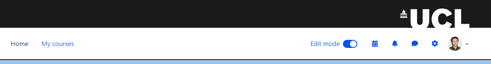
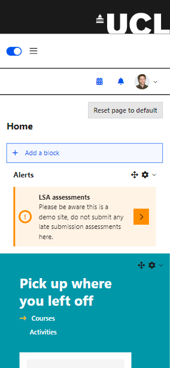
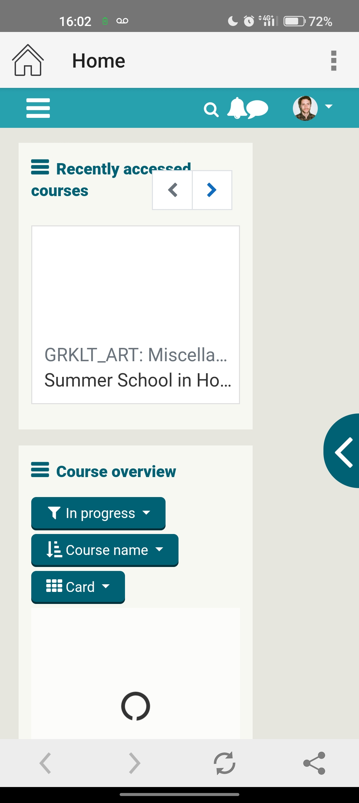
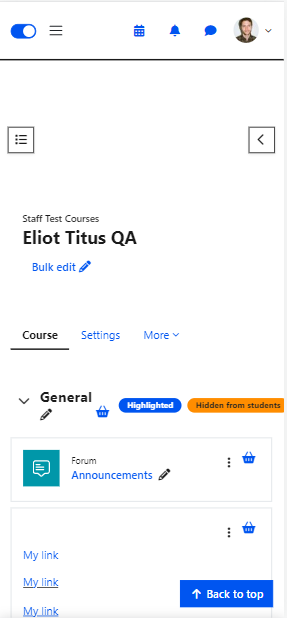

# Moodle 4x Navbar

User stories:

**As a student or staff on my mobile device, I'd like optimal screen space, in order to view my courses and course content.**

**As a student or staff zooming in 400%, I need optimal screen space, in order to view my courses and course content.**

**As a student or staff on my mobile device, I'd like an easy way to access the most relevant content to me (e.g. courses, notifications, forum posts) in the fewest clicks,** **in order to quickly navigate to my learning.  **

**As a student or staff on my mobile device, I'd like to use UCL Moodle seamlessly with UCLGo, in order to navigate between the two.** 

**Problem:**

UCL Norse theme introduces a header banner image that in combination with the navbar takes up 160px of vertical space.

On mobile devices, it goes up to 220px due to how the Norse theme splits the navbar into two for screen sizes lower than medium (768px breakpoint).

Similarly as flagged by accessibility review, if UCL Moodle is zoomed in by 400%. The header takes up significant space.

Only the logo bar is fixed, the navbar disappears with scroll, but this still leaves the logo bar taking up space (approx 1/3 vh)

UCL GO adds its own navbar and home icon. So would compound the issue

**Temporary fix:**

**CTP-2376 - Investigate vertical space issue in M4 theme Done**

**Long term solutions**

**a.** Make the Logobar and navbar disappear on scroll, i.e. remove fixed positioning. And only re-appear as fixed when the user starts to scroll upwards.

**b. ** Remove UCL logo bar on small screen devices:

c. Re-format Navbar

-   Show home icon, to get back to dashboard.
-   Show My courses icon, to get back to My courses page.
-   Remove Hamburger menu.

d. Alternatively align navbar display with Moodle app. More extensive changes required. Entirely new mobile menu.

## Attachments:

 [image-2023-7-17\_11-21-49.png](attachments/278137574/278137559.png) (image/png)
 [image-2023-7-17\_11-22-9.png](attachments/278137574/278137561.png) (image/png)
 [image-2023-7-17\_11-22-9-1.png](attachments/278137574/278137562.png) (image/png)
 [image-2023-7-17\_11-22-9-2.png](attachments/278137574/278137563.png) (image/png)
 [image-2023-7-17\_11-22-9-3.png](attachments/278137574/278137564.png) (image/png)
 [image-2023-7-17\_11-25-12.png](attachments/278137574/278137569.png) (image/png)
 [image-2023-7-17\_11-28-13.png](attachments/278137574/278137571.png) (image/png)

