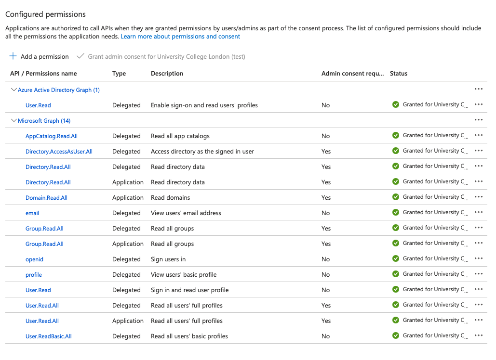
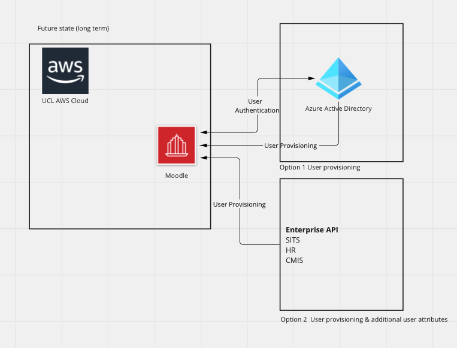

# Moodle AAD Integration Work

# Current State

LDAP sync to on-prem AD (once a day overnight)

Selected user profile fields updated on every login to on-prem AD

Additional user attributes coming from SITS (once a day overnight)

Issues:

-   security - no MFA
-   resilience - relies on VPN from AWS to on-prem AD

# Future State

# Options

Exploring two options for integrating Moodle with AAD - OpenIDConnect with OAuth2 and SAML. 3 flavours are presented below.

## 1) Open ID connect option (phase 1)

This option requires the Micorsoft OpenIDConnect (OIDC) plugin set for new installations and provide the core functionality of the integration:

-   [moodle-auth\_oidc](https://github.com/Microsoft/moodle-auth_oidc) - provides the authentication. Needs [moodle-local\_o365](https://github.com/Microsoft/moodle-local_o365) to function fully.
-   [moodle-local\_o365](https://github.com/Microsoft/moodle-local_o365) - the core plugin for integrating with Azure Active Directory and O365 apps.

Other plugins part of the Microsoft OIDC plugin set but not currently needed:

-   [moodle-block\_microsoft](https://github.com/Microsoft/moodle-block_microsoft) - needed for allowing user to link current ldap Moodle user accounts to Azure user accounts. 
-   [moodle-repository\_office365](https://github.com/Microsoft/moodle-repository_office365) - needed for OneDrive integration

The OIDC plugin set has been installed & configured in a separate preview instance <https://311-oidc.preview-moodle.ucl.ac.uk/>

a) Benefits

-   -   Best suited if further Moodle integration with other Microsoft O365 products is required e.g. MS Teams
    -   MFA
    -   able to sync users with ADD (user provisioning) 
    -   allows UCL Moodle to retain guest and manual account login options

b) Downsides

-   -   currently requires LDAP sync to run to maintain username to userid. This is required to keep operational integrations Moodle have with other systems e.g. TurnitinUK, library, etc.
    -   still partially reliant on on-prem LDAP sync 
    -   the amount of open issues in the plugin repo -  <https://github.com/microsoft/o365-moodle/issues>

## Process

-   LDAP sync task runs at 1am once a day, adding new users.
    -   This creates users from our on-prem AD with the username format.
-   Azure AD sync task runs when required and matches LDAP users to AAD, converting accounts to OIDC auth. It also updates user attributes email, firstname and lastname. Azure AD sync task is incremental e.g. it only runs when there are changes in AAD unlike the LDAP sync job which get a full refresh every time it runs. This makes the impact on production systems negligible.
    -   *Match preexisting Moodle users with same-named accounts in Azure AD* set to true
    -   *Switch matched users to Microsoft 365 (OpenID Connect) authentication* set to true
    -   *Create accounts in Moodle for users in Azure AD* set to false. This prevents users being created with UPNs as usernames.
-   Users can log in via OIDC directly without needing to use the block to connect their AAD account.

## Risks

-   still dependant on on-prem AD which might not exist in future. Will be mitigated by proposing and developing (UCL devs) a feature to sync users with userid instead of email.
-   [moodle-local\_o365](https://github.com/Microsoft/moodle-local_o365) plugin requires significant write permission at the AAD side. Mitigated by changing permissions in AAD and removing write permissions. The integration is still functioning correctly.
    -   <https://github.com/microsoft/o365-moodle/issues/1171>

## Configuration of Permissions in Azure Active Directory

### Out of the box Permissions table description and actions

All permissions not required for Azure Authentication have been removed. Once Microsoft Teams integration method is decided extra permissions might need to added. Risk Assessment and DPIA will be conducted as and when required.

<table>
<thead>
<tr class="header">
<th><h2 id="MoodleAADIntegrationWork-Endpoint" class="fxs-blade-title-titleText msportalfx-tooltip-overflow">Endpoint</h2></th>
<th>Type</th>
<th>Description</th>
<th>Details</th>
<th>
Azure Admin Consent Required
</th>
<th>Concern</th>
<th>Change</th>
<th>Actioned</th>
</tr>
</thead>
<tbody>
<tr class="odd">
<td><h2 id="MoodleAADIntegrationWork-User.Read" class="fxs-blade-title-titleText msportalfx-tooltip-overflow">User.Read</h2></td>
<td>Delegated</td>
<td>Enable sign-on and read users' profiles</td>
<td>Allow users to sign in to the application with their organizational accounts and let the application read the profiles of signed-in users, such as their email address and contact information.</td>
<td>No</td>
<td>No</td>
<td>
n/a
</td>
<td> 
</td>
</tr>
<tr class="even">
<td><h2 id="MoodleAADIntegrationWork-AppCatalog.ReadWrite.All" class="fxs-blade-title-titleText msportalfx-tooltip-overflow" style="text-decoration: none;">AppCatalog.ReadWrite.All</h2></td>
<td>Delegated</td>
<td><a href="https://graph.microsoft.com/AppCatalog.ReadWrite.All">Read and write to all app catalogs</a></td>
<td>Allows the app to create, read, update, and delete apps in the app catalogs</td>
<td>Yes</td>
<td>
Yes

Write Permission
</td>
<td>Remove write permission</td>
<td>Only read added</td>
</tr>
<tr class="odd">
<td><h2 id="MoodleAADIntegrationWork-Calendars.ReadWrite" class="fxs-blade-title-titleText msportalfx-tooltip-overflow" style="text-decoration: none;">Calendars.ReadWrite</h2></td>
<td>Delegated</td>
<td>Have full access to user calendars</td>
<td>Allows the app to create, read, update, and delete events in user calendars.</td>
<td>No</td>
<td>
Yes

User's personal data
</td>
<td>Remove permission</td>
<td>
Removed
</td>
</tr>
<tr class="even">
<td><h2 id="MoodleAADIntegrationWork-Calendars.ReadWrite.1" class="fxs-blade-title-titleText msportalfx-tooltip-overflow" style="text-decoration: none;">Calendars.ReadWrite</h2></td>
<td>App</td>
<td>Read and write calendars in all mailboxes</td>
<td>Allows the app to create, read, update, and delete events of all calendars without a signed-in user.</td>
<td>Yes</td>
<td>
Yes

All users' personal data
</td>
<td>Remove permission</td>
<td>Removed</td>
</tr>
<tr class="odd">
<td><h2 id="MoodleAADIntegrationWork-Directory.AccessAsUser.All" class="fxs-blade-title-titleText msportalfx-tooltip-overflow" style="text-decoration: none;">Directory.AccessAsUser.All</h2></td>
<td>Delegated</td>
<td>Access directory as the signed in user</td>
<td>
Allows the app to have the same access to information in the directory as the signed-in user.
</td>
<td>Yes</td>
<td>No</td>
<td>n/a</td>
<td> 
</td>
</tr>
<tr class="even">
<td><h2 id="MoodleAADIntegrationWork-Directory.Read.All" class="fxs-blade-title-titleText msportalfx-tooltip-overflow" style="text-decoration: none;">Directory.Read.All</h2></td>
<td>App</td>
<td>Read directory data</td>
<td>Allows the app to read data in your organization's directory, such as users, groups and apps, without a signed-in user.</td>
<td>Yes</td>
<td>No</td>
<td>n/a</td>
<td> 
</td>
</tr>
<tr class="odd">
<td><h2 id="MoodleAADIntegrationWork-Directory.ReadWrite.All" class="fxs-blade-title-titleText msportalfx-tooltip-overflow" style="text-decoration: none;">Directory.ReadWrite.All</h2></td>
<td>Delegated</td>
<td>Read and write directory data</td>
<td>Allows the app to read and write data in your organization's directory, such as users, and groups. It does not allow the app to delete users or groups, or reset user passwords.</td>
<td>Yes</td>
<td>
Yes

Write Permission
</td>
<td>Remove write permission</td>
<td>Only read added</td>
</tr>
<tr class="even">
<td><h2 id="MoodleAADIntegrationWork-Domain.ReadWrite.All" class="fxs-blade-title-titleText msportalfx-tooltip-overflow" style="text-decoration: none;">Domain.ReadWrite.All</h2></td>
<td>App</td>
<td>
Read and write domains
</td>
<td>
Allows the app to read and write all domain properties without a signed in user.  Also allows the app to add,  verify and remove domains.
</td>
<td>Yes</td>
<td>
Yes

Write Permission
</td>
<td>Remove write permission</td>
<td>Only read added</td>
</tr>
<tr class="odd">
<td><h2 id="MoodleAADIntegrationWork-email" class="fxs-blade-title-titleText msportalfx-tooltip-overflow" style="text-decoration: none;">email</h2></td>
<td>Delegated</td>
<td>View users' email address</td>
<td>Allows the app to read your users' primary email address</td>
<td>No</td>
<td>No</td>
<td> 
</td>
<td> 
</td>
</tr>
<tr class="even">
<td><h2 id="MoodleAADIntegrationWork-Files.ReadWrite" class="fxs-blade-title-titleText msportalfx-tooltip-overflow" style="text-decoration: none;">Files.ReadWrite</h2></td>
<td>Delegated</td>
<td>
Have full access to user files
</td>
<td>
Allows the app to read, create, update and delete the signed-in user's files.
</td>
<td>No</td>
<td>
Yes

User's personal data
</td>
<td>Remove permission</td>
<td>Removed</td>
</tr>
<tr class="odd">
<td><h2 id="MoodleAADIntegrationWork-Files.ReadWrite.All" class="fxs-blade-title-titleText msportalfx-tooltip-overflow" style="text-decoration: none;">Files.ReadWrite.All</h2></td>
<td>App</td>
<td>
Read and write files in all site collections
</td>
<td>
Allows the app to read, create, update and delete all files in all site collections without a signed in user.
</td>
<td>Yes</td>
<td>
Yes 

All users' personal data
</td>
<td>Remove permission</td>
<td>Removed</td>
</tr>
<tr class="even">
<td><h2 id="MoodleAADIntegrationWork-Group.ReadWrite.All" class="fxs-blade-title-titleText msportalfx-tooltip-overflow" style="text-decoration: none;">Group.ReadWrite.All</h2></td>
<td>Delegated</td>
<td>
Read and write all groups
</td>
<td>
Allows the app to create groups and read all group properties and memberships on behalf of the signed-in user. Additionally allows group owners to manage their groups and allows group members to update group content.
</td>
<td>Yes</td>
<td>
Yes

Write Permission
</td>
<td>Remove write permission</td>
<td>Only read added</td>
</tr>
<tr class="odd">
<td><h2 id="MoodleAADIntegrationWork-Group.ReadWrite.All.1" class="fxs-blade-title-titleText msportalfx-tooltip-overflow" style="text-decoration: none;">Group.ReadWrite.All</h2></td>
<td>App</td>
<td>Read and write all groups</td>
<td>
Allows the app to create groups, read all group properties and memberships, update group properties and memberships, and delete groups. Also allows the app to read and write conversations. All of these operations can be performed by the app without a signed-in user.
</td>
<td>Yes</td>
<td>
Yes

Write Permission
</td>
<td>Remove write permission</td>
<td>Only read added</td>
</tr>
<tr class="even">
<td><h2 id="MoodleAADIntegrationWork-Notes.ReadWrite.All" class="fxs-blade-title-titleText msportalfx-tooltip-overflow" style="text-decoration: none;">Notes.ReadWrite.All</h2></td>
<td>Delegated</td>
<td>
Read and write all OneNote notebooks that user can access
</td>
<td>
Allows the app to read, share, and modify OneNote notebooks that the signed-in user has access to in the organization.
</td>
<td>No</td>
<td>
Yes

User's personal data
</td>
<td>Remove permission</td>
<td>Removed</td>
</tr>
<tr class="odd">
<td><h2 id="MoodleAADIntegrationWork-Notes.ReadWrite.All.1" class="fxs-blade-title-titleText msportalfx-tooltip-overflow" style="text-decoration: none;">Notes.ReadWrite.All</h2></td>
<td>App</td>
<td>
Read and write all OneNote notebooks
</td>
<td>
Allows the app to read all the OneNote notebooks in your organization, without a signed-in user.
</td>
<td>Yes </td>
<td>
Yes

All users' personal data
</td>
<td>Remove permission</td>
<td>Removed</td>
</tr>
<tr class="even">
<td><h2 id="MoodleAADIntegrationWork-openid" class="fxs-blade-title-titleText msportalfx-tooltip-overflow" style="text-decoration: none;">openid</h2></td>
<td>Delegated</td>
<td>
Sign users in
</td>
<td>Allows users to sign in to the app with their work or school accounts and allows the app to see basic user profile information.</td>
<td>No</td>
<td>No</td>
<td>n/a</td>
<td> 
</td>
</tr>
<tr class="odd">
<td><h2 id="MoodleAADIntegrationWork-profile" class="fxs-blade-title-titleText msportalfx-tooltip-overflow" style="text-decoration: none;">profile</h2></td>
<td>Delegated</td>
<td>
View users' basic profile
</td>
<td>
Allows the app to see your users' basic profile (name, picture, user name)
</td>
<td>No</td>
<td>No</td>
<td>
n/a
</td>
<td> 
</td>
</tr>
<tr class="even">
<td><h2 id="MoodleAADIntegrationWork-Sites.Read.All" class="fxs-blade-title-titleText msportalfx-tooltip-overflow" style="text-decoration: none;">Sites.Read.All</h2></td>
<td>Delegated</td>
<td>
Read items in all site collections
</td>
<td>
Allows the application to read documents and list items in all site collections on behalf of the signed-in user
</td>
<td>No</td>
<td>
Yes

User's personal data
</td>
<td>Remove permission</td>
<td>Removed</td>
</tr>
<tr class="odd">
<td><h2 id="MoodleAADIntegrationWork-User.Read.1" class="fxs-blade-title-titleText msportalfx-tooltip-overflow">User.Read</h2></td>
<td>Delegated</td>
<td>
Sign in and read user profile
</td>
<td>
Allows users to sign-in to the app, and allows the app to read the profile of signed-in users. It also allows the app to read basic company information of signed-in users.
</td>
<td>No</td>
<td>No</td>
<td>
n/a
</td>
<td> 
</td>
</tr>
<tr class="even">
<td><h2 id="MoodleAADIntegrationWork-User.ReadWrite.All" class="fxs-blade-title-titleText msportalfx-tooltip-overflow">User.ReadWrite.All</h2></td>
<td>Delegated</td>
<td>
Read and write all users' full profiles
</td>
<td>
Allows the app to read and write the full set of profile properties, reports, and managers of other users in your organization, on behalf of the signed-in user.
</td>
<td>Yes</td>
<td>
Yes

Write Permission
</td>
<td>Remove write permission</td>
<td>Only read added</td>
</tr>
<tr class="odd">
<td><h2 id="MoodleAADIntegrationWork-User.ReadWrite.All.1" class="fxs-blade-title-titleText msportalfx-tooltip-overflow">User.ReadWrite.All</h2></td>
<td>App</td>
<td>Read and write all users' full profiles</td>
<td>
Allows the app to read and update user profiles without a signed in user.
</td>
<td>Yes</td>
<td>
Yes

Write Permission
</td>
<td>Remove write permission</td>
<td>Only read added</td>
</tr>
</tbody>
</table>

## AAD before changes

## AAD after changes

## Plugin settings in Moodle

<https://311-aad.preview-moodle.ucl.ac.uk/admin/settings.php?section=manageauths>

### Common settings

Core

authpreventaccountcreation set to Yes

[moodle-auth\_oidc](https://github.com/Microsoft/moodle-auth_oidc)

Configured in moodlesite/admin/settings.php?section=authsettingoidc

<table>
<thead>
<tr class="header">
<th>setting</th>
<th>value</th>
<th>description</th>
</tr>
</thead>
<tbody>
<tr class="odd">
<td>opname</td>
<td>UCL Login</td>
<td>this is the name of the button users will see to login to Moodle via AAD</td>
</tr>
<tr class="even">
<td>clientid</td>
<td>from AAD</td>
<td>configured in AAD</td>
</tr>
<tr class="odd">
<td>clientsecret</td>
<td>from AAD</td>
<td>configured in AAD</td>
</tr>
<tr class="even">
<td>authendpoint</td>
<td>
<a href="https://login.microsoftonline.com/eisd-test.ucl.ac.uk/oauth2/authorize" class="uri">https://login.microsoftonline.com/eisd-test.ucl.ac.uk/oauth2/authorize</a> for AAD UAT

<a href="https://login.microsoftonline.com/eisd-test.ucl.ac.uk/oauth2/authorize">https://login.microsoftonline.com/live.ucl.ac.uk/oauth2/authorize</a> for AAD Prod
</td>
<td> 
</td>
</tr>
<tr class="odd">
<td>tokenendpoint</td>
<td><a href="https://login.microsoftonline.com/common/oauth2/token" class="uri">https://login.microsoftonline.com/common/oauth2/token</a></td>
<td>default</td>
</tr>
<tr class="even">
<td>oidcresource</td>
<td><a href="https://graph.microsoft.com" class="uri">https://graph.microsoft.com</a></td>
<td>default</td>
</tr>
<tr class="odd">
<td>loginflow</td>
<td>Authorization Code Flow</td>
<td> 
</td>
</tr>
<tr class="even">
<td>logouturi</td>
<td><a href="https://login.microsoftonline.com/common/oauth2/logout" class="uri">https://login.microsoftonline.com/common/oauth2/logout</a></td>
<td>default</td>
</tr>
<tr class="odd">
<td>icon</td>
<td>key ???</td>
<td> 
</td>
</tr>
<tr class="even">
<td>field_map_firstname</td>
<td>Given Name</td>
<td> 
</td>
</tr>
<tr class="odd">
<td>field_updatelocal_firstname</td>
<td>On every login and every user sync task run</td>
<td> 
</td>
</tr>
<tr class="even">
<td>field_map_lastname</td>
<td>Surname</td>
<td> 
</td>
</tr>
<tr class="odd">
<td>field_updatelocal_lastname</td>
<td>On every login and every user sync task run</td>
<td> 
</td>
</tr>
<tr class="even">
<td>field_map_email</td>
<td>Email</td>
<td> 
</td>
</tr>
<tr class="odd">
<td>field_updatelocal_email</td>
<td>On every login and every user sync task run</td>
<td> 
</td>
</tr>
</tbody>
</table>

[moodle-local\_o365](https://github.com/Microsoft/moodle-local_o365)

Configured in moodlesite/admin/settings.php?section=local\_o365

<table>
<thead>
<tr class="header">
<th>tab</th>
<th>setting</th>
<th>value</th>
<th>description</th>
</tr>
</thead>
<tbody>
<tr class="odd">
<td>setup</td>
<td>clientid</td>
<td>from AAD</td>
<td>taken from oidc plugin settings if they are configured first</td>
</tr>
<tr class="even">
<td>setup</td>
<td>clientsecret</td>
<td>from AAD</td>
<td>taken from oidc plugin settings if they are configured first</td>
</tr>
<tr class="odd">
<td>setup</td>
<td>
aadtenant
</td>
<td>
<a href="http://eisd-test.ucl.ac.uk">eisd-test.ucl.ac.uk</a> for AAD UAT

live<a href="http://aad.ucl.ac.uk">.ucl.ac.uk</a> for AAD Prod
</td>
<td> 
</td>
</tr>
<tr class="even">
<td>setup</td>
<td>enableapponlyaccess</td>
<td>Yes</td>
<td> 
</td>
</tr>
<tr class="odd">
<td>setup</td>
<td>odburl</td>
<td> 
</td>
<td>not currently set</td>
</tr>
<tr class="even">
<td>Sync Settings</td>
<td>aadsync</td>
<td><ul>
<li>Match preexisting Moodle users with same-named accounts in Azure AD</li>
<li>Switch matched users to Microsoft 365 (OpenID Connect) authentication</li>
</ul></td>
<td> 
</td>
</tr>
<tr class="odd">
<td>Sync Settings</td>
<td>coursesync</td>
<td>Disabled</td>
<td> 
</td>
</tr>
<tr class="even">
<td>advanced</td>
<td>switchauthminupnsplit0</td>
<td>6</td>
<td>Sets the minimum length for usernames which will be switched e.g. admin</td>
</tr>
</tbody>
</table>

Theme settings

Configured in moodlesite/[admin/settings.php?section=themesettingadaptable\#theme\_adaptable\_header](https://311-oidc.preview-moodle.ucl.ac.uk/admin/settings.php?section=themesettingadaptable#theme_adaptable_header)

<table>
<thead>
<tr class="header">
<th>tab</th>
<th>setting</th>
<th>old value</th>
<th>new value</th>
<th>description</th>
</tr>
</thead>
<tbody>
<tr class="odd">
<td>header</td>
<td>displaylogin</td>
<td>loginbox</td>
<td>Button</td>
<td>Makes UCL Login and Guest Login buttons appear in the main page header. Also need OIDC plugin installed</td>
</tr>
<tr class="even">
<td>buttons</td>
<td>buttonlogincolor</td>
<td> 
</td>
<td>#51666c</td>
<td>TBC</td>
</tr>
<tr class="odd">
<td>buttons</td>
<td>buttonloginhovercolor</td>
<td> 
</td>
<td>#009688</td>
<td>TBC</td>
</tr>
<tr class="even">
<td>buttons</td>
<td>buttonlogintextcolor</td>
<td>#FFFFFF</td>
<td>#FFFFFF</td>
<td>TBC</td>
</tr>
<tr class="odd">
<td>buttons</td>
<td>buttonloginpadding</td>
<td>1px</td>
<td>1px</td>
<td> 
</td>
</tr>
</tbody>
</table>

Language string settings

Configured in [moodlesite/admin/tool/customlang/index.php](https://311-clc.preview-moodle.ucl.ac.uk/admin/tool/customlang/index.php)

| Component        | String                  | Standard Text                 | Local customisation           |
|------------------|-------------------------|-------------------------------|-------------------------------|
| theme\_adaptable | logintextbuttonwhenoidc | Guest/Manual Login            | Guest Login                   |
| core\_auth       | potentialidps           | Log in using your account on: | Log in using your UCL account |

People added to AAD UAT for testing

ucyijan - Jason

cceaags - Aurlie

utnvgle- George

ucsajre - Jill

cceaull - Kolil

cceapha - Pauline

ccaardi - Rod

zcrawal - Tom

ccaazwo - Zaman

utnvdkw - David Kwaw

cceaean - Ehsan Anwar

## 2) Open ID connect option (phase 2)

Same as option 1) but removes dependancy on on-prem AD

3) SAML2 option 

Requires SAML2 Moodle plugin. The one choosen is developed by Catalyst and they also support UCL Moodle in AWS.

<https://github.com/catalyst/moodle-auth_saml2>. More information for this plugin <https://moodle.org/plugins/auth_saml2>

The plugin has been installed & to be configured in separate preview instance <https://311-saml.preview-moodle.ucl.ac.uk/>

a) Benefits

-   -   easy to add to UCL Moodle environments with minimal effort
    -   no changes to user attributes in Moodle - e.g. userid (cceanbo) remains the unique identifier
    -   MFA

b) Downsides

-   -   difficult to work with O365 applications e.g. MS Teams
    -   cannot sync users with AAD (provides only authentication & JIT user provisioning)
    -   more complex to keep manual and quest login options

## Configuration

Claim attributes shared from AAD

# Theme changes 

Changing the way users login to Moodle with lead to changes in the theme. User experence changes will be kept to minimum or even improved (SSO). Both options above will require similar changes to Moodle adaptable theme.

Working is currently tracked here - <https://gitlab.com/jezhops/moodle-theme_adaptable/-/issues/281>

Login on desktop (Safari v15.5)

 

Login on Mobile (Chrome v102.0.5005.125)

modlesite/login/index.php

UCL standard Azure login page

# Target go live date - 09 Sep 2022 - most feasible option is 1) due to the UCL desire to integrate MS Teams with Moodle in very near future. This option does not interfere with MS Teams LTI integration path if chosen in future.

<https://311-oidc.preview-moodle.ucl.ac.uk> - configured to authenticate & sync users against AAD Prod.

Plugins to be added:

git submodule add --branch MOODLE\_311\_STABLE https://github.com/Microsoft/moodle-local\_o365.git local/o365/

git submodule add --branch MOODLE\_311\_STABLE https://github.com/Microsoft/moodle-auth\_oidc.git auth/oidc/

Repositories where AAD plugins added:

-   [PREVIEW\_311\_REBASE ](https://git.automation.ucl.ac.uk/moodle/moodle-1819/-/tree/PREVIEW_311_REBASE)
-   [MOODLE\_CLC\_311 ](https://git.automation.ucl.ac.uk/moodle/moodle-1819/-/tree/MOODLE_CLC_311)
-   [MOODLE\_311\_STABLE ](https://git.automation.ucl.ac.uk/moodle/moodle-1819/-/tree/MOODLE_311_STABLE) MR submitted
-   [PREVIEW\_311\_OIDC](https://git.automation.ucl.ac.uk/moodle/moodle-1819/-/tree/PREVIEW_311_OIDC)
-   [MOODLE\_CLC\_DEMO](https://git.automation.ucl.ac.uk/-/ide/project/moodle/moodle-1819/edit/MOODLE_CLC_DEMO)
-   [PREVIEW\_400](https://git.automation.ucl.ac.uk/-/ide/project/moodle/moodle-1819/edit/PREVIEW_400)

Future development:

-   <https://github.com/microsoft/o365-moodle/issues/2157>
-   <https://github.com/microsoft/o365-moodle/issues/2156>

## Attachments:

 [image2022-6-10\_16-10-55.png](attachments/205623920/209521358.png) (image/png)
 [image2022-6-13\_16-8-2.png](attachments/205623920/209521793.png) (image/png)
 [image2022-6-21\_9-13-50.png](attachments/205623920/209524974.png) (image/png)
 [image2022-6-22\_10-34-9.png](attachments/205623920/209525712.png) (image/png)
 [image2022-6-22\_10-36-45.png](attachments/205623920/209525714.png) (image/png)
 [image2022-6-22\_10-38-11.png](attachments/205623920/209525716.png) (image/png)
 [image2022-6-22\_10-38-45.png](attachments/205623920/209525718.png) (image/png)
 [image2022-6-22\_10-43-49.png](attachments/205623920/209525724.png) (image/png)
 [MicrosoftTeams-image.png](attachments/205623920/209525729.png) (image/png)
 [image2022-6-27\_16-9-32.png](attachments/205623920/209528295.png) (image/png)
 [image2022-6-29\_13-49-56.png](attachments/205623920/212173652.png) (image/png)
 [image2022-6-29\_13-50-40.png](attachments/205623920/212173656.png) (image/png)
 [image2022-6-29\_13-51-46.png](attachments/205623920/212173657.png) (image/png)
 [image2022-6-29\_13-59-44.png](attachments/205623920/212173662.png) (image/png)
 [image2022-6-29\_14-3-4.png](attachments/205623920/212173668.png) (image/png)
 [image2022-7-1\_14-10-57.png](attachments/205623920/212174947.png) (image/png)

