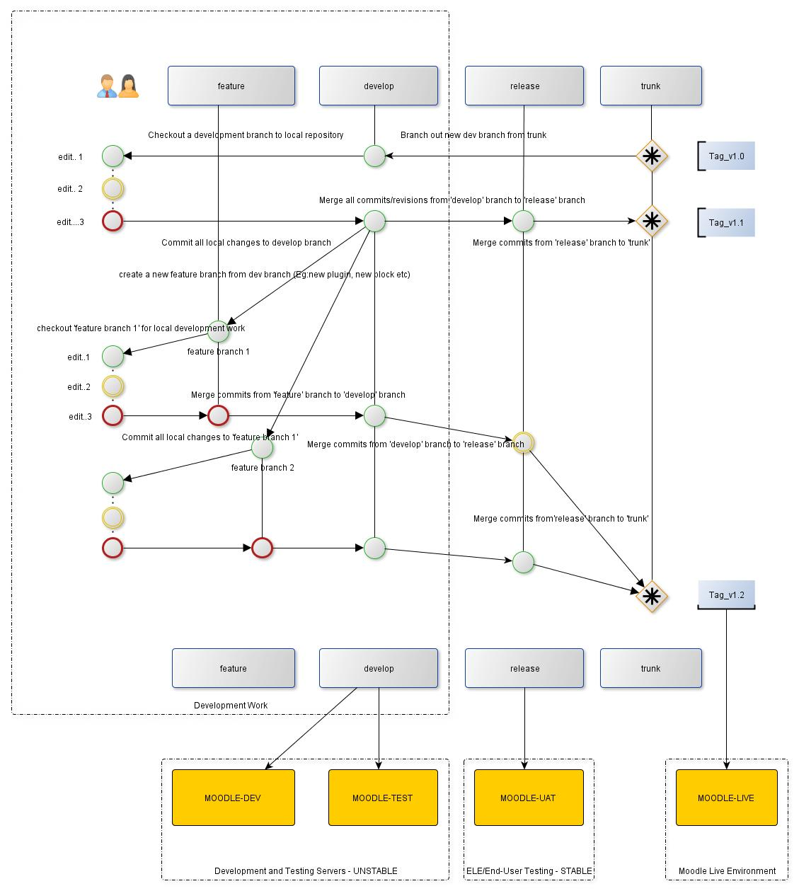

# Moodle Development Workflow

# Guide to Moodle Development Workflow

## Purpose:

The document explains Moodle Development Lifecycle followed at UCL. Developers could refer to following steps to maintain Moodle code on VCS (Version Control System) and deployment to moodle servers

Current VCS - SVN (Sub Version)

 

 

## Version Control System Explained

### Branching :

Branching here is very much similar to Git-Flow (but with lot fewer complexities) 

**Feature branch** - **When a developer is assigned a new feature development, its required a create a new branch off the 'develop' branch**

**Develop branch - This branch is highly *unstable *and should be used only by developers on development environment**

**Release branch - As 'develop' branch is highly unstable, we need a branch that is *stable*. 'Release' branch is stable and the code from this branch could be used to deploy on more stable environments.**

**Trunk - This branch is only used while deploying code on live environment. All version tags must be created from 'trunk'. Developers should never ever merge untested/unstable code to trunk.**

### Feature Development :

Feature branches are created to do a new feature development and should be branched off the 'develop'. A feature could be development of new plugin, new blocks, enhancement to current plugin. A developer could merge 'feature' branch back to 'develop' branch once they are happy with their local code testing and would like code to be deployment on development environment.

### Bug-fixes and small code changes :

Any small Bug-fixes, single file changes could be done straight on 'develop' branch. The code from develop branch is then deployed on 'moodle-dev' servers for testing y developers.

### Release Development :

Once developers/system testers are happy with their development, we need a stable code-base. At this point we could branch off a release branch from develop branch. The code from this branch must be deployed to UAT environment. Once testing is done on UAT environment this code-base must be merged to trunk.

### Live Release:

The code-base from Trunk branch is used to deploy on Live environment. Developers should create Tags from this branch prior to Live deployment. The convention for tagging -

Tag name convention: ucl\_v&lt;MOOODLE\_VERSION&gt;\_scp&lt;SCP\_NO&gt;\_&lt;YYYYMMDD&gt;
The production code is the one with the latest SCP\_NO and YYYYMMDD

The latest tag related to SCP must be deployed on Live environment

 

## Code Deployment Explained

### moodle-dev.ucl.ac.uk 

This will be mainly used by developers to develop and test new features. This is highly **unstable**.

SVN branch - develop

url - <https://ele.moodle-dev.ucl.ac.uk/>

### moodle-test.ucl.ac.uk

Ele team or developers can use this for any immediate testing of bug-fixes or new features. This is **unstable**.

SVN branch - develop

url - <https://ele.moodle-test.ucl.ac.uk/>

### moodle-uat.ucl.ac.uk

Used for testing by ELE team or others. No development work will be carried out in this environment. This is **stable.**

SVN branch - release

url - <https://ele.moodle-uat.ucl.ac.uk/>

 

 

 

 

 

 

 

## Attachments:

 [Moodle development workflow.jpg](attachments/50923015/51085452.jpg) (image/jpeg)

